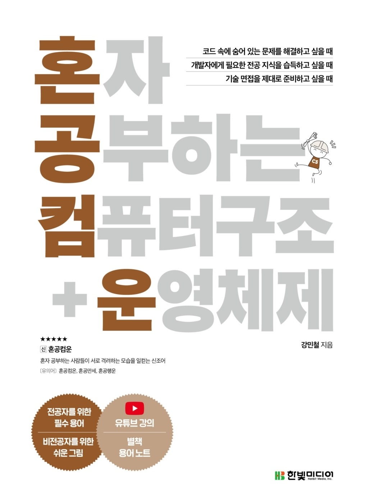

# ✨CS 뿌셔뿌셔!✨ (CS-Scattered)
## 1. 활용한 도서
  
   

- [혼자 공부하는 컴퓨터 구조 운영체제](https://hongong.hanbit.co.kr/%EC%BB%B4%ED%93%A8%ED%84%B0-%EA%B5%AC%EC%A1%B0-%EC%9A%B4%EC%98%81%EC%B2%B4%EC%A0%9C/)
- 진행 목차
  1. 컴퓨터 구조 시작하기
  2. 데이터
  3. 명령어
  4. CPU의 작동 원리
  5. CPU 성능 향상 기법
  6. 메모리와 캐시 메모리
  7. 보조기억장치
  8. 입출력장치
  9. 운영체제 시작하기
  10. 프로세스와 스레드

## 2. 진행 방식
- 매주 1장씩 읽으면서 공부하기 
  - 현재 rep fork 하여 자신이 공부한 흔적 작성
- 주차별 내용에 맞는 문제와 그 답을 3개씩 만들어오기
- 서로 문제를 내고 답을 맞추고 설명해주면서 익히기

## 3. Contributors

  
    <h3>doohong</h3>
    
  
  
    <h3>minyeong</h3>
    
  
  
    <h3>seongeun</h3>
    
  
  
    <h3>yeji</h3>
    
  

