# 1.1 컴퓨터 구조를 알아야 하는 이유

- 컴퓨터 구조를 이해하면 문제 해결 능력이 향상됨
- 문법만으로는 알기 어려운 성능, 용량, 비용을 고려하며 개발할 수 있음

# 1.2 컴퓨터 구조의 큰 그림

## 컴퓨터가 이해하는 정보

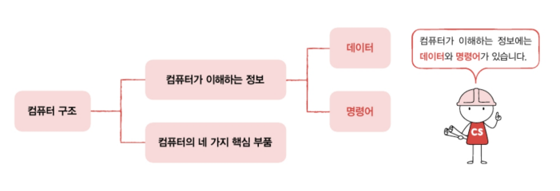

- **데이터**(data)\_ex) 숫자, 문자, 이미지, 동영상과 같은 정적인 정보
- **명령어**(instruction)\_ex) "더하라. 1과 2를", "화면에 출력하라. 안녕하세요를"

**명령어**는 컴퓨터를 작동시키는 정보이고, **데이터**는 명령어를 위해 존재하는 일종의 재료이다.

## 컴퓨터의 4가지 핵심 부품

- CPU(Central Processing Unit, 중앙처리장치)
- 메모리(main memory 주기억장치)
- 보조기억장치(secondary storage)
- 입출력장치(input/output(I/O) device)

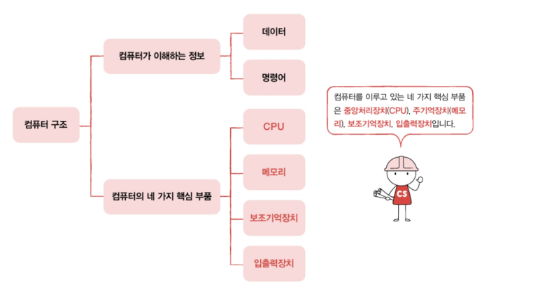

> 참고) 주기억장치에는 RAM(Random Access Memory)와 ROM(Read Only Memory) 두 가지가 있지만, 메모리라는 용어는 보통 RAM을 지칭한다. 특별한 언급이 없다면 '메모리 == RAM'

### 메모리

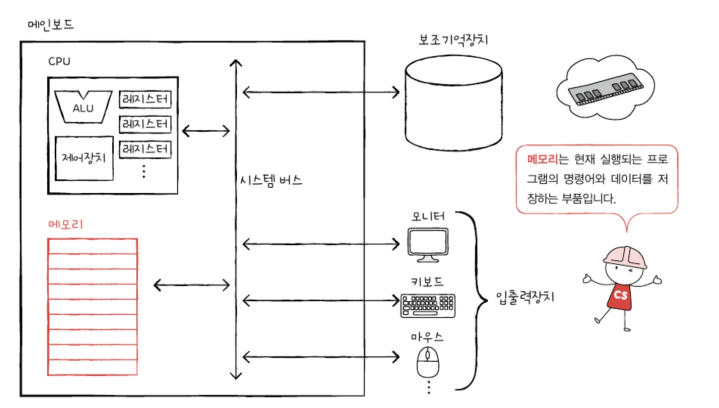

- 프로그램이 실행되기 위해서는 반드시 메모리에 저장되어 있어야 한다.
- 메모리는 현재 실행되는 프로그램의 명령어와 데이터를 저장한다.
- 메모리에 저장된 값의 위치는 주소로 알 수 있다.

### CPU

**<CPU의 내부 구성요소>**

- ALU(Arithmetic Logic, 산술논리연산장치)
  : 계산기. 컴퓨터 내부에서 수행되는 대부분의 계산을 맡음
- 레지스터(register)
  : CPU 내부의 작은 임시 저장 장치
- 제어장치(Control Unit, CU)
  : 제어 신호(control signal)라는 전기 신호를 내보내고 명령어를 해석하는 장치
  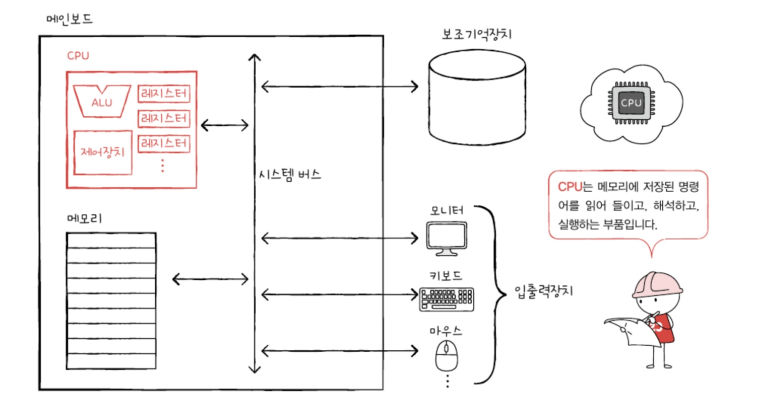

> _제어신호_
> 메모리 읽기: CPU가 메모리에 저장된 값을 읽을 때 보내는 신호
> 메모리 쓰기: CPU가 메모리에 어떤 값을 저장하고 싶을 때 쓰는 신호

#### 명령어 실행 예시

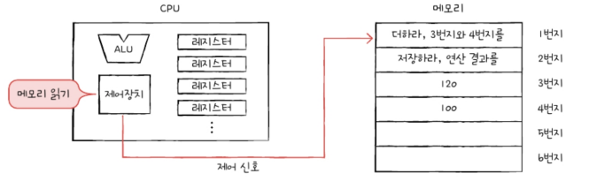
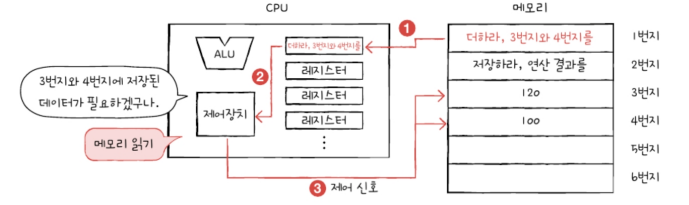
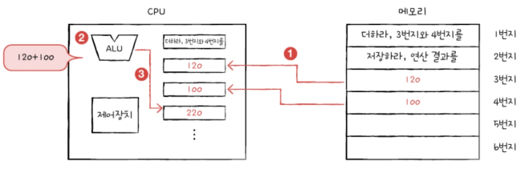
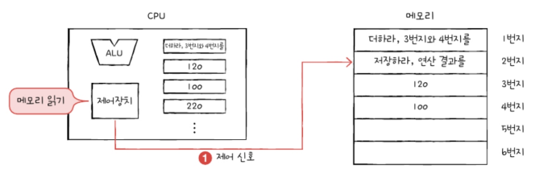
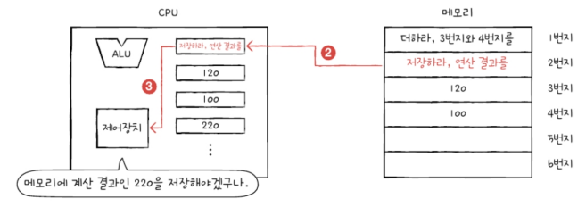
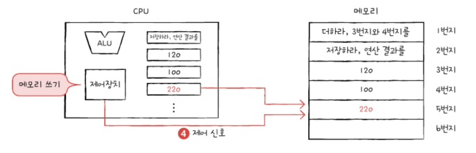

### 보조기억장치

전원이 꺼져도 저장된 내용을 잃지 않는 메모리를 보조할 저장 장치
ex) 하드디스크, SSD, USB 메모리, DVD, CD-ROM

| 메모리 | 보조저장장치 |
|:---: | :---: |
|현재 실행되는 프로그램 저장 | 보관할 프로그램 저장 |

### 입출력장치

컴퓨터 외부에 연결되어 컴퓨터 내부와 정보를 교환하는 장치
ex) 마이크, 스피커, 프린터, 마우스, 키보드
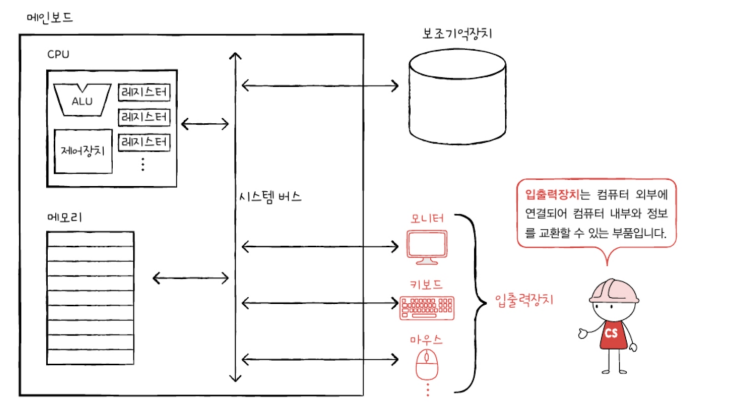

> 참고) _보조기억장치인 하드 디스크, USB, CD-ROM도 컴퓨터 외부에 연결되어 컴퓨터 내부와 정보를 교환하는 장치로 볼 수 있으니 입출력 장치에 해당하는 것이 아닌가?_
> => 큰 틀에서 봤을 땐 맞긴하다. 하지만 보조기억장치는 모티커, 마우스 같은 일반적인 입출력장치에 비해 메모리를 보조한다는 특별한 기능을 수행하는 입출력장치이므로 대부분의 전공 서적이 둘을 구분하여 서술한다.

### 메인보드와 시스템 버스

메인보드에는 여러 컴퓨터 부품을 부착할 수 있는 슬롯과 연결단자가 있음. (컴퓨터의 핵심 부품 4가지 모두 메인보드와 연결되어 있다.)

버스(bus) : 메인보드에 연결된 부품들이 서로 정보를 주고받을 수 있게 하는 통로
시스템 버스(system bus) : 컴퓨터의 네 가지 핵심 부품을 연결하는 가장 중요한 버스

- 주소 버스(address bus) : 주소를 주고받는 통로
- 데이터 버스 : 명령어와 데이터를 주고받는 통로
- 제어 버스 : 제어 신호를 주고받는 통로

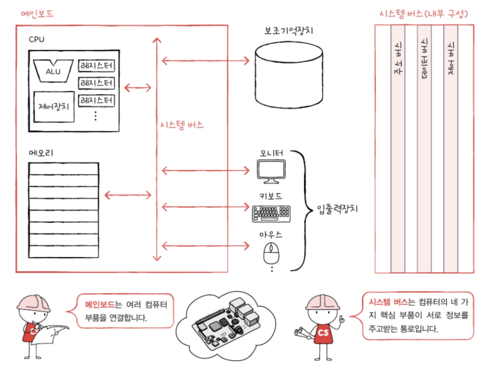

#### 시스템 버스 - CPU 작동 예시

- 메모리 읽기(CPU의 제어장치에서 메모리로 '메모리 읽기')
  | 순번 | CPU | 시스템버스, 방향 | 메모리 |
  | :---: | :---: | :-----: | :---: |
  | 1 | '메모리 읽기' | 제어 버스 => | |
  | 2 | 1번지 | 주소 버스 => | |
  | 3 | (레지스터에 저장) | <= 데이터 버스 | 1번지(요청한 주소)에 있는 데이터 |

  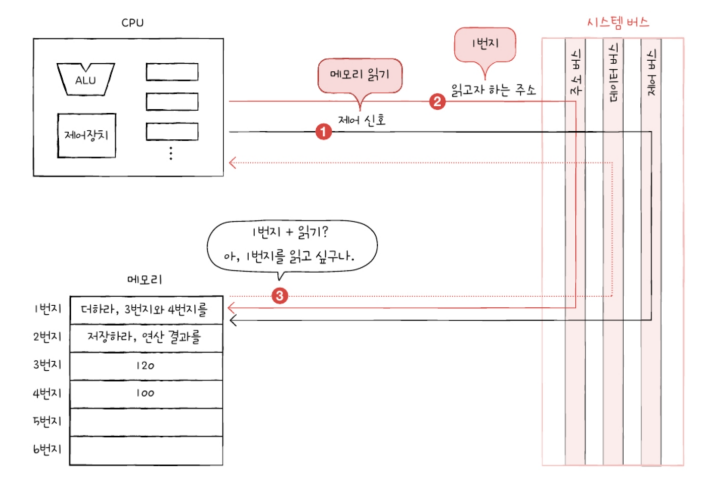

- 메모리 쓰기(CPU의 제어장치에서 메모리로 '메모리 쓰기')
  | 순번 | CPU | 시스템버스, 방향 | 메모리 |
  | :---: | :---: | :-----: | :---: |
  | 1 | 220 | 데이터 버스 => | |
  | 2 | 5번지 | 주소 버스 => | |
  | 3 | '메모리 쓰기' | 제어 버스 => | 5번지에 데이터 저장 |

  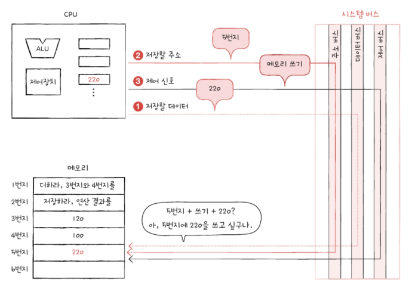

---

# 📖

Q1. CPU의 내부 구성요소인 ALU와 레지스터, 제어장치에 대해 설명하시오.
A1. **ALU**는 일종의 계산기로 **컴퓨터 내부에서 수행되는 계산을 수행**하고, **레지스터**는 프로그램을 실행하는 데 필요한 값들을 **임시로 저장하는 저장장치**이며, **제어장치**는 '**제어 신호**'를 내보내고 **명령어를 해석**하는 장치이다.

Q2. 메모리와 보조기억장치의 차이점에 대해 설명하시오.
A2. **메모리는 전원이 꺼지면 저장한 내용이 날아가**는 반면 **보조기억장치는 전원이 꺼져도 저장된 내용이 그대로 유지**된다는 특징이 있어 실행중인 프로그램은 메모리에, 보관할 프로그램이나 데이터는 보조기억장치에 저장한다.

Q3. (O, X 문제)제어장치에서 메모리의 1번지로 메모리 읽기 신호를 한 번 보낼 때, 시스템 버스 동작은 한 번 일어난다.
A3. X, 주소 버스를 통해 메모리 주소(1번지)전송, 제어 버스를 통해 '메모리 읽기'신호 전송, 데이터 버스를 통해 데이터가 메모리로부터 CPU로 전송되므로 시스템버스는 최소 3번 이상의 동작이 일어난다.(정확히는 5번의 동작을 수행한다.\_데이터 전송 준비단계, 종료 단계에서도 각각 1번씩 동작)
