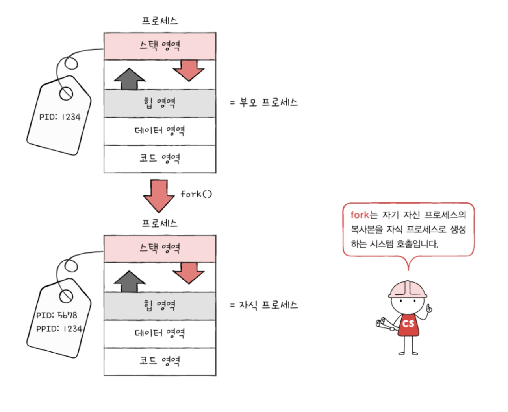
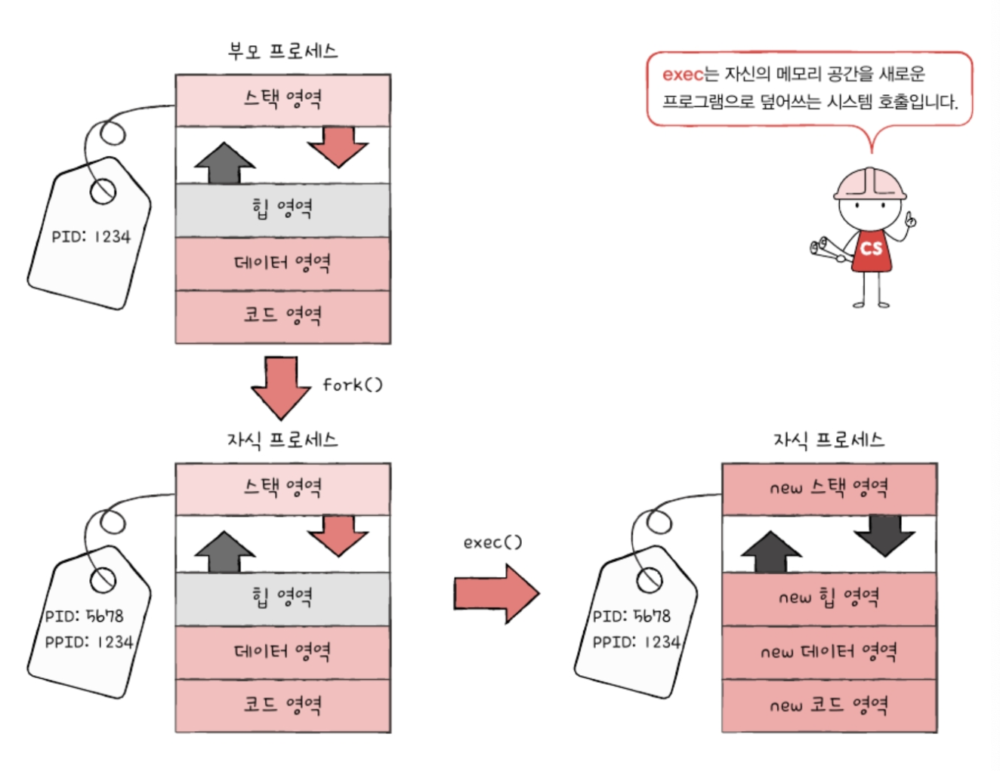
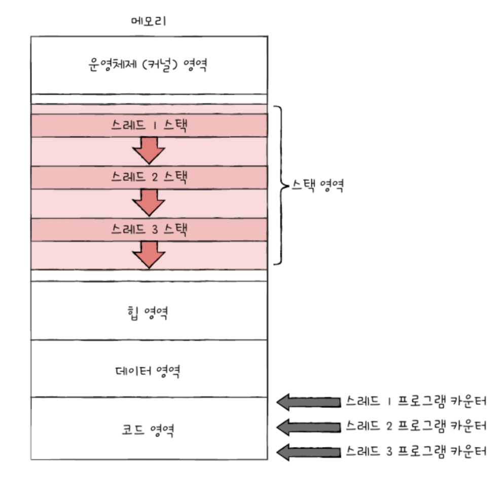
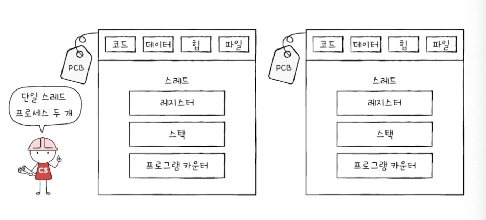

# 10. 프로세스와 스레드
- [10. 프로세스와 스레드](#10-프로세스와-스레드)
  - [10-1. 프로세스 개요](#10-1-프로세스-개요)
    - [1) 프로세스 직접 확인하기](#1-프로세스-직접-확인하기)
    - [2) 프로세스 제어 블록](#2-프로세스-제어-블록)
      - [1. 프로세스 ID (PID)](#1-프로세스-id-pid)
      - [2. 레지스터 값](#2-레지스터-값)
      - [3. 프로세스 상태](#3-프로세스-상태)
      - [4. CPU 스케줄링 정보](#4-cpu-스케줄링-정보)
      - [5. 메모리 관리 정보](#5-메모리-관리-정보)
      - [6. 사용한 파일과 입출력장치 목록](#6-사용한-파일과-입출력장치-목록)
    - [3) 문맥 교환](#3-문맥-교환)
    - [4) 프로세스의 메모리 영역](#4-프로세스의-메모리-영역)
      - [1. 코드 영역](#1-코드-영역)
      - [2. 데이터 영역](#2-데이터-영역)
      - [3. 힙 영역](#3-힙-영역)
      - [4. 스택 영역](#4-스택-영역)
  - [10-2. 프로세스 상태와 계층 구조](#10-2-프로세스-상태와-계층-구조)
    - [1) 프로세스 상태](#1-프로세스-상태)
      - [1. 생성 상태](#1-생성-상태)
      - [2. 준비 상태](#2-준비-상태)
      - [3. 실행 상태](#3-실행-상태)
      - [4. 대기 상태](#4-대기-상태)
      - [5. 종료 상태](#5-종료-상태)
      - [6. 프로세스 상태 다이어그램](#6-프로세스-상태-다이어그램)
    - [2) 프로세스 계층 구조](#2-프로세스-계층-구조)
    - [3) 프로세스 생성 기법](#3-프로세스-생성-기법)
  - [10-3. 스레드](#10-3-스레드)
    - [1) 프로세스와 스레드](#1-프로세스와-스레드)
    - [2) 멀티 프로세스와 멀티 스레드](#2-멀티-프로세스와-멀티-스레드)
  - [Q\&A](#qa)
    - [Q1. 프로세스가 무엇인지 설명하고 프로세스 타입들을 설명한 후 프로세스가 어떻게 동작되는지 설명하세요.](#q1-프로세스가-무엇인지-설명하고-프로세스-타입들을-설명한-후-프로세스가-어떻게-동작되는지-설명하세요)
    - [Q2. 스레드의 의미와 멀티 프로세스와 멀티 스레드의 장단점을 설명하세요.](#q2-스레드의-의미와-멀티-프로세스와-멀티-스레드의-장단점을-설명하세요)
    - [Q3. 프로세스의 메모리 영역은 어떻게 구성되나요?](#q3-프로세스의-메모리-영역은-어떻게-구성되나요)

## 10-1. 프로세스 개요
- 프로세스 : 실행 전까지는 그저 데이터 덩어리지만 보조기억 장치에 저장된 프로그램을 메모리에 적재하고 실행하는 순간 그 프로그램은 프로세스가 됨

### 1) 프로세스 직접 확인하기
- 포그라운드 프로세스 : 사용자가 보는 앞에서 실행되는 프로세스
- 백그라운드 프로세스 : 사용자가 보지 못하는 뒤편에서 실행되는 프로세스
  - 데몬(유닉스), 서비스(윈도우) : 사용자와 상호작용하지 않고 정해진 일만 수행하는 백그라운드

### 2) 프로세스 제어 블록
- 모든 프로세스는 실행을 위해 CPU를 필요로 하지만 CPU 자원은 한정되어 차례대로 정해진 시간만큼만 사용하고 시간이 끝나는 타이머 인터럽트가 발생하면 차례를 양보하고 다음 차례가 올 때까지 기다림
  - 타이머 인터럽트 (타임아웃 인터럽트) : 클럭 신호를 발생시키는 장치에 의해 주기적으로 발생하는 하드웨어 인터럽트
    ](<프로세스 제어 블록.png>)
- 운영체제는 빠르게 번갈아 수행되는 프로세스의 실행 순서를 관리, 프로세스에 CPU를 비롯한 자원을 배분하고 이를 위해 프로세스 제어 블록을 사용
  - 프로세스 제어 블록 (PCB) : 프로세서와 관련된 정보를 저장하는 자료 구조이며 해당 프로세스를 식별하기 위해 꼭 필요한 정보들을 저장
    - 커널 영역에 생성되고 프로세스 생성 시 만들어지고 실행이 끝나면 폐기됨
    - 새로운 프로세스가 생성되었다 = 운영체제가 PCB를 생성했다
    - 프로세스가 종료되었다 = 운영체제가 해당 PCB를 폐기했다

#### 1. 프로세스 ID (PID)
- 특정 프로세스를 식별하기 위해 부여하는 고유한 번호
- 같은 일을 수행하는 프로그램이라 할지라도 두번 실행하면 PID가 다른 두개의 프로세스 생성됨

#### 2. 레지스터 값
- 프로세스는 자신의 실행 차례가 돌아오면 이전까지 사용했던 레지스터의 중간값들을 모두 복원함
- 이전까지 진행했던 작업들을 그래도 이어 실행 가능
- PCB 안에는 해당 프로세스가 실행하며 사용했던 프로그램 카운터를 비롯한 레지스터 값이 담김

#### 3. 프로세스 상태
- 현재 프로세스가 어떤 상태인지도 PCB에 기록됨

#### 4. CPU 스케줄링 정보
- 프로세스가 언제, 어떤 순서로 CPU를 할당받을지에 대한 정보

#### 5. 메모리 관리 정보
- 프로세스마다 메모리에 저장된 위치가 다름
- PCB에는 프로세스가 어느 주소에 저장되어 있는지에 대한 정보가 있어야 함
- PCB에는 베이스 레지스터, 한계 레지스터 값과 같은 정보들이 담김
- 프로세스의 주소를 알기 위한 또 다른 중요 정보 중 하나인 페이지 테이블 정보도 담김

#### 6. 사용한 파일과 입출력장치 목록 
- 프로세스가 실행 과정에서 특정 입출력장치나 파일을 사용하면 PCB에 해당 내용 명시
- 어떤 입출력장치가 이 프로세스에 할당되었는지, 어떤 파일들이 열렸는지도 PCB에 기록
](<PCB를 통한 프로세스 관리.png>)

### 3) 문맥 교환
- 하나의 프로세스에서 다른 프로세스로 실행 순서가 넘어가는 방식
  - 프로세스 A가 운영체제로부터 CPU를 할당받아 실행되다가 시간이 다 되어 프로세스 B에 CPU 사용을 양보함
  - 직전까지 실행되던 프로세스 A는 프로그램 카운터를 비롯한 각종 레지스터 값, 메모리 정보, 실행을 위해 열었던 파일이나 사용한 입출력장치 등 지금까지의 중간 정보를 백업해야 함 => 다음 차례에 왔을 때 실행했던 내용에 이어 다시 재개할 수 있음 
 
- 문맥 : 하나의 프로세스 수행을 재개하기 위해 기억해야할 중간 정보
  - 하나의 문맥은 해당 프로세스의 PCB에 표현됨
  - CPU 사용 시간이 다 되거나 예기치 못한 상황이 발생하여 인터럽트가 발생하면 운영체제는 해당 프로세스의 PCB에 문맥을 백업하고 실행할 프로세스의 문맥을 복구

- 문맥 교환 : 기본 프로세스의 문맥을 PCB에 백업, 새로운 프로세스를 실행하기 위해 문맥을 PCB로 복구하여 새로운 프로세스를 실행하는 것
  - 여러 프로세스가 끊임없이 빠르게 번갈아 가며 실행
  - 자주 일어나면 빨리 번갈아 가며 수행되기 때문에 프로세스들이 동시에 실행되는 것처럼 보임
](<문맥 교환.png>)
](<문맥 교환 예시.png>)

### 4) 프로세스의 메모리 영역
- 프로세스가 생성되면 커널 영역에 PCB가 생성되는데 사용자 영역에는 프로세스가 어떻게 배치될까?
- 프로세스의 사용자 영역에는 ***코드 영역, 데이터 영역, 힙 영역, 스택 영역*** 으로 나뉘어 저장됨

#### 1. 코드 영역
- 코드 영역 (텍스트 영역) : 실행할 수 있는 기계어로 이루어진 명령어인 코드가 저장됨
- 데이터가 아닌 CPU가 실행할 명령어가 담겨 있기 때문에 쓰기가 금지되어있음
- 읽기 전용 공간
- 정적 할당 영역 : 크기가 변하지 않음

#### 2. 데이터 영역
- 데이터 영역 : 프로그램이 실행되는 동안 유지할 데이터가 저장되는 공간이며 전역 변수가 저장됨
  - 전역 변수 : 프로그램이 실행되는 동안 유지되며 프로그램 전체에서 접근할 수 있는 변수
- 정적 할당 영역 : 크기가 변하지 않음

#### 3. 힙 영역
- 힙 영역 : 프로그램을 만드는 사용자(프로그래머)가 직접 할당할 수 있는 저장 공간
- 프로그래밍 과정에서 힙 영역에 메모리 공간을 할당했다면 언젠가는 해당 공간을 반환해야 함 
  - 더 이상 해당 메모리 공간을 사용하지 않겠다는 것을 운영체제에 말해주는 것과 같음
- 메모리 누수 : 메모리 공간을 반환하지 않으면 메모리 내 계속 남아 메모리 낭비를 초래함
- 동적 할당 영역 : 실시간으로 크기가 변할 수 있음
- 메모리의 낮은 주소에서 높은 주소로 할당

#### 4. 스택 영역
- 스택 영역 : 데이터를 일시적으로 저장하는 공간
- 데이터 영역에 담기는 값과는 달리 잠깐 쓰다가 말 값들이 저장되는 공간
  - 함수 실행이 끝나면 사라지는 매개 변수, 지역 변수
- 동적 할당 영역 : 실시간으로 크기가 변할 수 있음
- 메모리의 높은 주소에서 낮은 주소로 할당

](동적할당영역.png)

## 10-2. 프로세스 상태와 계층 구조
### 1) 프로세스 상태
- 하나의 프로세스는 여러 상태를 거치며 실행됨
- 운영체제는 프로세스의 상태를 PCB를 통해 인식하고 관리함
- 프로세스의 상태를 표현하는 방식은 운영체제마다 차이가 있지만 대표적으로 프로세스가 가지는 상태는 아래와 같음

#### 1. 생성 상태
- 프로세스를 생성 중인 상태
- 이제 막 메모리에 적재되어 PCB를 할당 받은 상태
- 실행할 준비가 완료된 프로세스는 준비 상태로 CPU의 할당을 기다림

#### 2. 준비 상태
- 당장이라도 CPU를 할당받아 실행할 수 있지만 아직 자신의 차례가 아니기에 기다리는 상태
- 준비 상태 프로세스는 차례가 되면 CPU를 할당받아 실행 상태가 됨

#### 3. 실행 상태
- CPU를 할당받아 실행 중인 상태
- 할당된 일정 시간 동안만 CPU를 사용할 수 있음
- 프로세스가 할당된 시간을 모두 사용한다면 타이머 인터럽트가 발생하고 다시 준비 상태가 됨
- 실행 도중 입출력장치를 사용하여 입출력 장치의 작업이 끝날 때까지 기다려야 한다면 대기 상태가 됨

#### 4. 대기 상태
- 프로세스는 실행 도중 입출력장치를 사용하는 경우가 있음
- 입출력 작업은 CPU에 비해 처리 속도가 느리기에 입출력 작업을 요청한 프로세스는 입출력 장치가 입출력을 끝낼 때까지 (입출력 완료 인터럽트를 받을 때까지) 기다려야 함
- 입출력장치의 작업을 기다리는 상태를 대기 상태라고 함
- 입출력 작업이 완료되면 해당 프로세스는 다시 준비 상태로 CPU 할당을 기다림

#### 5. 종료 상태
- 종료 상태는 프로세스가 종료된 상태로 운영체제는 PCB와 프로세스가 사용한 메모리를 정리함

#### 6. 프로세스 상태 다이어그램
](<프로세스 상태.png>)

### 2) 프로세스 계층 구조
- 프로세스는 실행 도중 시스템 호출을 통해 다른 프로세스를 생성할 수 있음
  - 부모 프로세스 : 새 프로세스를 생성한 프로세스
  - 자식 프로세스 : 부모 프로세스에 의해 생성된 프로세스
- 부모 프로세스와 자식 프로세스는 다른 프로세스로 각각 다른 PID를 가짐, 일부 운영체제에서는 자식 프로세스의 PCB에 부모 프로세스의 PID인 PPID(Parent PID)가 기록되기도 함
- 자식 프로세스 또한 또 다른 자식 프로세스를 생성할 수 있음
- 많은 운영체제는 이처럼 프로세스가 프로세스를 낳는 계층적인 구조로 프로세스를 관리함
- 컴퓨터가 부팅될 때 실행되는 최초의 자식 프로세스들을 생성하고 생성된 자식들이 새로운 프로세스들을 낳는 형식으로 여러 프로세스가 동시에 실행됨
](<프로세스 계층 구조.png>)
](<프로세스 계층 구조 예시.png>)

### 3) 프로세스 생성 기법
- 부모 프로세스가 자식 프로세스를 어떻게 만들어 내고, 자식 프로세스는 어떻게 자신만의 코드를 실행할까?
  - 시스템 호출
  - fork : 부모 프로세스는 fork 시스템 호출을 통해 자신의 복사본을 자식 프로세스로 생성
    - 부모 프로세스의 자원들, 메모리 내의 내용, 열린 파일의 목록 등이 자식 프로세스에 상속됨
    - PID 값이나 저장된 메모리 위치는 다름
  
  - exec : 자식 프로세스는 exec 시스템 호출을 통해 자신의 메모리 공간을 새로운 프로그램으로 덮어씀
    - 새로운 프로그램 내용으로 전환하여 실행하는 시스템 호출
    - 코드 영역과 데이터 영역의 내용이 실행할 프로그램의 내용으로 바뀌고 나머지 영역은 초기화됨
  

- 부모가 자식 프로세스를 실행하여 프로세스 계층 구조를 이루는 과정은 fork와 exec가 반복되는 과정
- 부모 프로세스가 자식 프로세스를 fork한 뒤에 부모 프로세스, 자식 프로세스 누구도 exec를 호출하지 않는 경우도 있음 
  - 부모 프로세스와 자식 프로세스는 같은 코드를 병행하여 실행

## 10-3. 스레드
- 스레드 : 프로세스를 구성하는 실행의 흐름 단위

### 1) 프로세스와 스레드
- 전통적인 관점에서는 하나의 프로세스는 한번에 하나의 일만 처리함
  - 단일 스레드 프로세스 : 모든 프로세스가 하나의 실행 흐름을 가지고 한번에 하나의 부분만 실행되는 프로세스를 가정, 실행의 흐름 단위가 하나
  - ](<단일 스레드 프로세스.png>)
- 스레드라는 개념이 도입되면서 하나의 프로세스가 한번에 여러 일을 동시에 처리할 수 있게 됨
  - 멀티 스레드 프로세스
  - ](<멀티 스레드 프로세스.png>)

- 스레드 : 프로세스를 구성하는 실행 단위
- 스레드의 구성 요소 : 프로세스 내에서 각기 다른 스레드 ID, 프로그램 카운터 값을 비롯한 레지스터 값, 스택
  - 각자 프로그램 카운터 값을 비롯한 레지스터 값, 스택을 가지고 있기에 스레드마다 각기 다른 코드를 실행할 수 있음

- 프로세스의 스레드들은 실행에 필요한 최소한의 정보만을 유지한 채 프로세스 자원을 공유하며 실행됨
  - 

- 프로세스가 실행되는 프로그램이라면 스레드는 프로세스를 구성하는 실행의 흐름 단위
- CPU에 처리할 작업을 전달할 때 프로세스가 아닌 스레드 단위로 전달함
- 스레드는 프로세스 자원을 공유한 채 실행에 필요한 최소한의 정보만으로 실행됨

### 2) 멀티 프로세스와 멀티 스레드
- 하나의 프로세스에 여러 스레드가 있을 수 있음
- 컴퓨터는 실행과정에서 여러 프로세스가 동시에 실행될 수 있고 그 프로세스를 이루는 스레드는 여러 개 있을 수 있음
  - 멀티 프로세스 : 여러 프로세스를 동시에 실행하는 것
  - 멀티 스레드 : 여러 스레드로 프로세스를 동시에 실행하는 것

- 단일 스레드 프로세스 여러 개를 실행하는 것과 하나의 프로세스를 여러 스레드로 실행하는 것은 무엇이 다른가?
](<멀티 프로세스와 멀티 스레드.png>)
    - 프로세스끼리는 자원을 공유하지 않지만 스레드끼리는 같은 프로세스 내의 자원을 공유함
    
- 멀티 프로세스
  
  - 멀티 프로세스의 경우 같은 프로그램을 실행하기 위해 메모리에 동일한 내용이 중복됨

- 멀티 스레드
  - ](<멀티 스레드.png>)
  - 자원을 공유하기 때문에 서로 협력과 통신에 유리
  - 멀티 스레드 환경에서는 하나의 스레드에 문제가 생기면 프로세스 전체에 문제가 생길 수 있음

## Q&A
### Q1. 프로세스가 무엇인지 설명하고 프로세스 타입들을 설명한 후 프로세스가 어떻게 동작되는지 설명하세요.
A1. 프로세스는 프로그램을 메모리에 적제하고 실행하는 순간 실행되는 프로그램의 의미를 가집니다. 프로세스에는 사용자가 보는 앞에서 실행되는 프로세스인 포그라운드 프로세스, 사용자가 보지 못하는 뒤편에서 실행되는 프로세스인 백그라운드 프로세스가 있습니다. 또한 사용자와 상호작용하지 않고 정해진 일만 수행하는 백그라운드 프로세스를 데몬 또는 서비스라고 부릅니다.

메모리에 적재되어 프로세스 제어 블록을 할당 받고 CPU의 할당을 기다리며 할당 후 실행되고 입출력 장치의 작업이 있다면 끝날 때까지 대기를 하게 됩니다. 대기 완료가 되면 다시 준비 상태로 CPU 할당을 기다리고 할당된 시간을 모두 사용했다면 타이머 인터럽트가 발생하여 준비 상태가 되며 종료된 경우 PCB와 프로세스가 사용한 메모리를 정리합니다.

### Q2. 스레드의 의미와 멀티 프로세스와 멀티 스레드의 장단점을 설명하세요.
A2. 스레드는 프로세스를 구성하는 실행 단위로 프로세스 내에서 각기 다른 스레드 ID, 프로그램 카운터 값, 레지스터 값, 스택 값을 가지지만 다른 정보들은 공유하게 됩니다. 멀티 프로세스는 여러 프로세스를 동시에 실행하는 것으로 하나의 프로세스에 문제가 생겨도 다른 프로세스는 동작한다는 장점이 있지만 스레드와 달리 정보들을 서로 공유하지 않아서 메모리가 낭비됩니다. 이와 반대로 스레드는 메모리는 낭비되지 않지만 한 스레드가 문제되면 프로세스 전체가 문제 생길 수 있습니다.

### Q3. 프로세스의 메모리 영역은 어떻게 구성되나요?
A3. 프로세스의 커널 영역에는 프로그램 제어 블록이 생성되며 사용자 영역에는 코드 영역, 데이터 영역, 힙 영역, 스택 영역으로 나뉘어 저장되게 됩니다.
코드 영역과 데이터 영역은 크기가 변하지 않는 정적 할당 영역이며 힙, 스택 영역은 실시간으로 크기가 변할 수 있는 동적 할당 영역입니다.