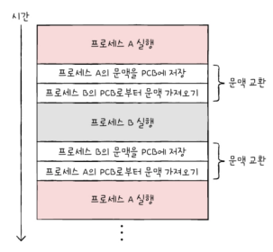

# Chapter 10. 프로세스와 스레드
- [Chapter 10. 프로세스와 스레드](#chapter-10-프로세스와-스레드)
- [10-1. 프로세스 개요](#10-1-프로세스-개요)
  - [직접 확인하기](#직접-확인하기)
  - [프로세스 제어 블록(PCB)](#프로세스-제어-블록pcb)
    - [PCB에 담기는 정보들](#pcb에-담기는-정보들)
  - [문맥 교환](#문맥-교환)
  - [프로세스의 메모리 영역](#프로세스의-메모리-영역)
- [10-2. 프로세스 상태와 계층 구조](#10-2-프로세스-상태와-계층-구조)
  - [프로세스 상태](#프로세스-상태)
  - [프로세스 계층 구조](#프로세스-계층-구조)
  - [프로세스 생성 기법](#프로세스-생성-기법)
- [10-3. 스레드](#10-3-스레드)
  - [프로세스와 스레드](#프로세스와-스레드)
  - [단일 스레드 프로세스 여러 개 실행 vs 하나의 프로세스를 여러 스레드로 실행](#단일-스레드-프로세스-여러-개-실행-vs-하나의-프로세스를-여러-스레드로-실행)
    - [단일 스레드 프로세스 여러 개 실행](#단일-스레드-프로세스-여러-개-실행)
    - [하나의 프로세스를 여러 스레드로 실행](#하나의-프로세스를-여러-스레드로-실행)
- [Q\&A](#qa)

---

# 10-1. 프로세스 개요

**프로세스  : 실행 중인 프로그램**

## 직접 확인하기

- 컴퓨터 부팅되는 순간부터 많은 프로세스 실행
    - 윈도우 - 작업관리자 [프로세스]
    - 유닉스
        
        ```tsx
        ps -ef
        ```
        
- 프로세스의 종류
    - 포그라운드 프로세스
        - 사용자가 보는 **앞에서** 실행되는 프로세스
    - 백그라운드 프로세스
        - 사용자가 보지 못하는 **뒤에서** 실행되는 프로세스
        - 윈도우 - `서비스`
        - 유닉스 - `데몬`

## 프로세스 제어 블록(PCB)

: 프로세스와 관련된 정보를 저장하는 자료구조

- 해당 프로세스를 식별하기 위한 정보들 저장
- 커널 영역에 생성
- 프로세스 생성 시 만들어짐 → 실행 끝나면 폐기

### PCB에 담기는 정보들

`프로세스 ID (PID)`

- 특정 프로세스를 식별하기 위해 부여하는 고유한 번호
    - 같은 일을 하는 프로그램일지라도 두 번 실행하면 PID 다른 두 개의 프로세스 생성

`레지스터 값`

- 해당 프로세스가 실행하며 사용했던 레지스터 값들
    - 이전까지 진행했던 작업을 이어할 수 있도록 자신의 차례가 오면 레지스터의 중간값 모두 복원

`프로세스 상태`

- 현재 프로세스의 상태

`CPU 스케줄링 정보`

- 프로세스가 언제, 어떤 순서로 CPU를 할당 받을 지

`메모리 관리 정보`

- 프로세스가 저장된 주소
    - 프로세스마다 메모리에 저장된 위치가 다르기 때문에 페이지 테이블 정보, 베이스 레지스터 등의 정보 담김

`사용한 파일과 입출력장치 목록`

- 할당된 입출력 장치, 파일
    - 프로세스가 실행 과정에서 특정 입출력 장치나 파일 사용하면 해당 내용 명시 됨

## 문맥 교환

<aside>
🧐
 하나의 프로세스에서 다른 프로세스로 실행 순서 넘어가게 된다면?

- 직전까지 실행되던 프로세스는 지금까지의 중간 정보 백업
- 다음에 실행할 프로세스의 문맥 복구
</aside>

- 문맥
    - 하나의 프로세스 수행을 재개하기 위해 기억해야 할 정보
    - PCB에 기록되는 정보들
    - 언제든 해당 프로세스의 실행을 재개할 수 있음
        - 프로세스가 CPU를 사용할 수 있는 시간 끝나거나 인터럽트 발생하면 운영체제는 해당 프로세스의 PCB에 문맥 백업
- 문맥 교환
    
    
    
    - 프로세스 간 실행 전환
        - 기존 프로세스의 문맥을 PCB에 백업하고, 새로운 프로세스를 실행하기 위해 문맥을 PCB로 복구하여 새로 프로세스 실행
    - 여러 프로세스가 끊임없이 번갈아 가며 실행되는 원리
    - 너무 자주 하면 오버헤드 발생할 수 있음

## 프로세스의 메모리 영역

<aside>
🧐
프로세스가 생성되면 커널 영역에 PCB 생성되는데, 그렇다면 사용자 영역은?


</aside>

`코드 영역`(텍스트 영역) 

- 기계어로 이루어진 명령어 저장
    - 읽기 전용 공간
    - CPU가 실행할 명령어가 담겨 있기 때문에 쓰기 금지

`데이터 영역` 

- 프로그램이 실행되는 동안 유지할 데이터가 저장되는 공간
    - EX) 전역 변수
- 정적 할당 영역 : 코드 영역, 데이터 영역
- 동적 할당 영역 : 힙 영역, 스택 영역
    - 실시간으로 크기 변할 수 있음
    - `힙 영역`
        - 프로그래머가 직접 할당할 수 있는 저장 공간
        - 메모리 낮은 주소 → 높은 주소로 할당
        - 메모리 공간 반환 필수 → 더 이상 사용하지 않음
            - 반환하지 않는다면 메모리 누수 발생
    - `스택 영역`
        - 일시적으로 데이터 저장하는 공간
            - EX) 매개 변수, 지역 변수
        - 메모리 높은 주소 → 낮은 주소로 할당
        - 저장 → PUSH, 안 쓰는 데이터 → POP

# 10-2. 프로세스 상태와 계층 구조

## 프로세스 상태


프로세스 상태 다이어그램

`생성 상태`

- 프로세스 생성 중인 상태
- 메모리에 적재되어 PCB에 할당 받은 상태

`준비 상태` 

- CPU의 할당 차례가 오지 않아 기다리고 있는 상태

`실행 상태`

- CPU 할당 받아 실행 중인 상태
- 할당된 일정 시간 동안만 CPU 사용 가능
    - 할당된 시간 모두 사용 → 준비 상태
    - 실행 도중 입출력 장치 사용해 입출력 장치 작업 끝날 때까지 기다려야 함 → 대기 상태
- 디스패치 : 준비 상태 → 실행 상태로 전환

`대기 상태`

- 입출력장치의 작업 기다리는 상태
    - 입출력 작업은 CPU에 비해 처리 속도 느림 → 입출력장치 끝낼 때까지 대기
    - 입출력 작업 완료 → 준비 상태

`종료 상태`

- 프로세스 종료 상태
- 운영체제는 PCB와 프로세스가 사용한 메모리 정리

## 프로세스 계층 구조


- 프로세스는 실행 도중 시스템 호출을 통해 다른 프로세스 생성 가능
- 각기 다른 PID 가짐
- `최초의 프로세스`
    - 컴퓨터 부팅될 때 실행되는 최초의 프로세스
    - PID 항상 1번
    - 모든 프로세스 최상단에 있는 부모 프로세스
        - 유닉스 - `init`
        - 리눅스 - `systemd`
        - macOS - `launchd`
            
            ```tsx
            // 최초의 프로세스 확인
            pstree
            ```
            
- `부모 프로세스`
    - 새 프로세스를 생성한 프로세스
- `자식 프로세스`
    - 부모 프로세스에 의해 생성된 프로세스
    - 일부 운영체제에서 PPID(부모 프로세스의 PID) 기록됨

## 프로세스 생성 기법


- 부모 프로세스 → **fork**
    - 자기 자신 프로세스의 복사본을 자식 프로세스로 생성하는 시스템 호출
    - 부모 프로세스의 자원들을 자식 프로세스에 상속(PID나 저장된 메모리 위치 다름)
- 자식 프로세스 → **exec**
    - 자신의 메모리 공간을 새로운 프로그램으로 덮어쓰는 시스템 호출
    - 코드 영역, 데이터 영역의 내용이 실행할 프로그램의 내용으로 바뀜, 나머지 영역은 초기화

# 10-3. 스레드

<aside>
🧐
개념 정리

- 프로세스 : 실행되는 프로그램
- 스레드 : 프로세스를 구성하는 실행의 흐름 단위
</aside>

## 프로세스와 스레드

- 전통적인 관점 - 단일 스레드 프로세스
    - 하나의 프로세스는 한 번에 하나의 일만 처리
- 스레드 개념 도입 - 멀티 스레드 프로세스
    - 하나의 프로세스가 한 번에 여러 일 동시에 처리 가능
    - `스레드` : 실행에 필요한 최소한의 정보만 유지한 채 **프로세스 자원 공유** 및 실행
    - 멀티 프로세스 : 여러 프로세스를 동시에 실행
    - 멀티 스레드 : 여러 스레드로 프로세스를 동시에 실행

## 단일 스레드 프로세스 여러 개 실행 vs 하나의 프로세스를 여러 스레드로 실행


- 프로세스끼리는 자원을 공유하지 않으나, 스레드끼리는 같은 프로세스 내의 자원 공유

### 단일 스레드 프로세스 여러 개 실행


- PID, 저장된 메모리 주소 제외한 모든 자원이 동일한 프로세스가 통째로 메모리에 적재
- 장점
    - 각 프로세스는 독립적으로 실행
    - 하나의 프로세스에 문제 생겨도 다른 프로세스에 지장 적거나 문제 없음
- 단점
    - 같은 프로그램 실행하기 위해 메모리에 동일한 내용 중복 존재
- 참고 - [프로세스 간 통신(IPC)]
    - 프로세스 간 자원 공유 및 데이터 주고 받음
        - 파일을 통한 프로세스 간 통신
        - 공유 메모리 : 서로 공유하는 메모리 영역 두어 데이터 주고 받음
        - 이외 소켓, 파이프 등

### 하나의 프로세스를 여러 스레드로 실행


- 같은 프로세스 내의 모든 스레드는 PID, 레지스터 값, 스택, 프로그램 카운터 제외 모든 자원 공유
- 장점
    - 효율적인 메모리 사용
    - 협력과 통신에 유리
- 단점
    - 하나의 스레드에 문제 생기면 프로세스 전체에 문제 생길 수 있음

# Q&A

1. **프로세스 제어 블록이 무엇인지 설명하고, 왜 이용하는지 설명하시오.**
2. **fork 시스템 호출이란 무엇이며, fork 시스템 호출과 새로운 폴더의 생성의 연관성에 대해 설명하시오.**
3. **멀티 스레드와 멀티 프로세스의 차이점을 설명하시오.**

- **1번 답**
    
    프로세스 제어 블록은 프로세스와 관련된 정보를 저장하는 자료구조입니다.
    
    모든 프로세스는 실행을 위해 CPU가 필요하지만, CPU는 한정되어 있기 때문에 프로세스는 차례대로 돌아가면서 타이머 인터럽트에 의해  한정된 시간만큼만 이용하게 되는데요,  운영 체제는 이러한 프로세스의 실행 순서를 관리하고, CPU를 비롯한 자원을 배분하기 위해 프로세스 제어 블록을 이용합니다.
    
    (타이머 인터럽트 :클럭 신호를 발생시키는 장치에 의해 주기적으로 발생하는 하드웨어 인터럽트)
    
- **2번 답**
    
    fork 시스템 호출이란 자기 자신 프로세스의 복사본을 자식 프로세스로 생성하는 것을 말하며, fork 시스템 호출과 폴더 생성은 관련이 없으므로 둘의 연관성은 없습니다.
    
- **3번 답**
    
    멀티 스레드는 여러 스레드로 프로세스를 동시에 실행하는 것을 의미하며, 멀티 프로세스는 여러 프로세스를 동시에 실행하는 것을 의미합니다.
    
    프로세스 내의 스레드끼리는 같은 프로세서 내의 자원을 공유하지만, 프로세스끼리는 기본적으로 자원을 공유하지 않는다는 차이점이 있습니다.