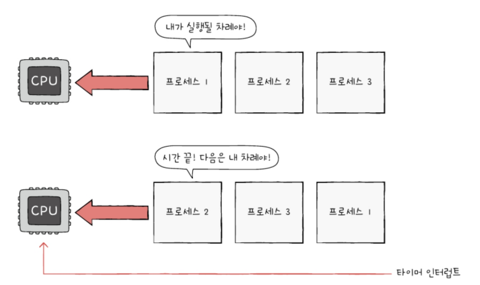

- [10-1 프로세스 개요](#10-1-프로세스-개요)
  - [프로세스 직접 확인하기](#프로세스-직접-확인하기)
  - [프로세스 제어 블록](#프로세스-제어-블록)
    - [PCB에 담기는 정보](#pcb에-담기는-정보)
  - [문맥 교환](#문맥-교환)
  - [프로세스의 메모리 영역](#프로세스의-메모리-영역)
    - [코드 영역(텍스트 영역)](#코드-영역텍스트-영역)
    - [데이터 영역](#데이터-영역)
    - [힙 영역](#힙-영역)
    - [스택 영역](#스택-영역)
- [10-2 프로세스 상태와 계층 구조](#10-2-프로세스-상태와-계층-구조)
  - [프로세스 상태](#프로세스-상태)
    - [생성 상태](#생성-상태)
    - [준비 상태](#준비-상태)
    - [실행 상태](#실행-상태)
    - [대기 상태](#대기-상태)
    - [종료 상태](#종료-상태)
  - [프로세스 계층 구조](#프로세스-계층-구조)
  - [프로세스 생성 기법](#프로세스-생성-기법)
- [10-3 스레드](#10-3-스레드)
  - [프로세스와 스레드](#프로세스와-스레드)
  - [멀티프로세스와 멀티스레드](#멀티프로세스와-멀티스레드)
  - [📖](#)

# 10-1 프로세스 개요

`프로세스(process)`: 실행중인 프로그램\
프로그램은 실행되기 전까지는 보조기억장치에 있는 데이터 덩어리.\
보조 기억 장치에 저장된 프로그램을 메모리에 적재하고 실행하는 순간 그 프로그램은 프로세스가 됨=>이 과정을 '프로세스를 생성한다'고 함

## 프로세스 직접 확인하기
컴퓨터가 부팅되는 순간부터 수많은 프로세스들이 실행됨\
\
\

`포그라운드 프로세스`: 사용자가 볼 수 있는 공간에서 실행되는 프로세스
`백그라운드 프로세스`: 사용자에게 보이지 않는 공간에서 실행되는 프로세스

백그라운드 프로세스 중 사용자와 직접 상호작용 할 수 있는 프로세스도 있지만, 사용자와 상호작용하지 않고 그저 묵묵히 정해진 일만 수행하는 백그라운드 프로세스도 있음. 이러한 프로세스를 유닉스에서는 `데몬`, 윈도우에서는 `서비스`라고 부름\

## 프로세스 제어 블록
모든 프로세스들은 실행을 위해 CPU가 필요로 하지만 CPU자원이 한정되어 있기 때문에 차례로 돌아가며 한정된 시간만큼(타이머 인터럽트가 발생할 때까지) CPU를 사용. 그 후 다음 차례가 올 때까지 기다림\

운영체제는 프로세스의 실행순서를 관리하고 프로세스에 CPU를 비롯한 자원을 `프로세스 제어 블록(PCB)`를 이용하여 배분함

`프로세스 제어 블록(PCB)`: 프로세스와 관련된 정보를 저장하는 자료 구조. 
- 커널 영역에 생성됨
- 프로세스 생성시에 만들어지고, 실행이 끝나면 폐기됨
  ('새로운 프로세스가 생성되었다.' === '운영체제가 PCB를 생성했다.', 
  '프로세스가 종료되었다.' === '운영체제가 해당 PCB를 폐기했다.')

### PCB에 담기는 정보
- **프로세스 ID(PID)**\
  특정 프로세스를 식별하기 위해 부여하는 고유 번호
- **레지스터 값**\
  프로세스는 자신의 실행차례가 돌아오면 이전까지 사용했던 레지스터 중간값들을 모두 복원해야 함.
- **프로세스 상태**\
  현재 프로세스가 입출력장치를 사용하기 위해 기다리고 있는 상태인지, CPU를 사용하기 위해 기다리고 있는 상태인지, CPU를 이용하고 있는 상태인지 등의 상태정보
- **CPU 스케줄링 정보**\
  언제 어떤 순서로 CPU를 할당받을지에 대한 정보
- **메모리 관리 정보**\
  프로세스는 메모리에 저당된 위치가 다름. ∴ 어느 주소에 저장되어 있는지에 대한 정보 필요. 베이스 레지스터, 한계 레지스터 값과 같은 정보들이 담김. 또 페이지 테이블 정보(프로세스 주소를 알기 위한 또 다른 중요 정보-14장에서 학습)도 담김
- **사용한 파일과 입출력장치 목록**\
  어떤 입출력 장치가 이 프로세스에 할당되었는지, 어떤 파일을 열었는지에 대한 정보

## 문맥 교환
실행중인 프로세스를 중단하고 다음 프로세스를 진행하기 전, 실행되고 있던 프로세스의 프로그램 카운터를 비롯한 각종 정보들을 백업해야함. 이때, 하나의 프로세스 수행을 재개하기 위해 기억해야할 정보를 `문맥`이라고 함

\

`문맥 교환`: 기본 프로세스 문백을 PCB에 백업하고 새로운 프로세스를 실행하기 위해 문백을 PCB로부터 복구하여 새로운 프로세스를 실행하는 것\

문맥 교환이 자주 일어날 수록 우리의 눈에는 프로세스들이 동시에 실행되는 것처럼 보임

## 프로세스의 메모리 영역
프로세스는 사용자 영역에 크게 `코드 영역`, `데이터 영역`, `힙 영역`, `스택 영역`으로 나뉘에 저장 됨\

### 코드 영역(텍스트 영역)
실행할 수 있는 코드, 즉 기계어로 이루어진 명령어가 저장됨. CPU가 실행할 명령어가 담겨있기 때문에 '쓰기'가 금지되어 있음. 다시말해 읽기 전용 공간임

### 데이터 영역
프로그램이 실행될 동안 유지할 데이터. 대표적으로는 `전역 변수`가 있음.\

코드 영역과 데이터 영역은 그 크기가 변하지 않음\
`정적 할당 영역`: 크기가 고정된 영역.(ex: 코드 영역, 데이터 영역)\
`동적 할당 영역`: 크기가 변할 수 있는 영역 (ex: 힙 영역, 스택 영역)

### 힙 영역
프로그램을 만든 사용자가 직접 할당할 수 있는 저장공간.\
프로그래밍 과정에서 힙 영역에 메모리 공간을 할당했다면 언젠가는 해당 공간을 반환(==='더 이상 해당 메모리 공간을 사용하지 않겠다'라고 운영체제에 말해주는 것)해야 함.\
만약 반환하지 않는다면 할당한 공간은 메모리 낭비를 초래함 === `메모리 누수`\

### 스택 영역
데이터를 일시적으로 저장하는 공간. 데이터 영역에 담기는 값과는 달리 잠깐 쓰다가 말 값들이 저장됨. 대표적으로 함수 실행이 끝나면 사라지는 매개변수, 지역변수 등이 있음

일시적으로 저장할 데이터는 스택 영역에 PUSH되고, 더이상 필요하지 않은 데이터는 POP 됨으로써 스택 영역에서 사라짐

일반적으로 힙 영역은 메모리의 낮은 주소에서 높은 주소로 할당되고, 스택 영역은 높은 주소에서 낮은 주소로 할당 됨.

# 10-2 프로세스 상태와 계층 구조
## 프로세스 상태
프로세스들이 번갈아 가며 실행되는 과정에서 하나의 프로세스는 여러 상태를 거치며 실행되며, 운영체제는 프로세스의 상태를 PCB를 통해 인식하고 관리함.

### 생성 상태
: 프로세스를 생성 중인 상태. 이제 막 메모리에 적재되어 PCB를 할당 받은 상태

### 준비 상태
당장 CPU를 할당 받아 실행할 수 있지만 차례가 아니라서 기다리는 상태.

> 디스패치: 준비 상태인 프로세스가 실행 상태로 전환되는 것

### 실행 상태
CPU를 할당 받아 실행 중인 상태. 프로세스가 할당된 시간을 모두 사용하면(타이머 인터럽트가 발생하면) 다시 준비상태가 되고, 실행 도중 입출력장치를 사용하여 입출력 장치의 작업이 끝날 때까지 기다려야한다면 대기 상태가 됨

### 대기 상태
입출력장치의 작업을 기다리는 상태. 입출력 작업이 완료되면 해당 프로세스는 다시 준비 상태로 CPU 할당을 기다림

### 종료 상태
프로세스가 종료된 상태. 프로세스가 종료되면 운영체제는 PCB와 프로세스가 사용한 메모리를 정리함

\
`프로세스 상태 다이어그램`

## 프로세스 계층 구조
프로세스는 실행 도중 시스템 호출을 통해 다른 프로세스를 생성할 수 있음\
새 프로세스를 생성한 프로세스: `부모 프로세스`\
부모 프로세스에 의해 생성된 프로세스: `자식 프로세스`

일부 운영체제에서는 자식 프로세스의 PCB에 부모 프로세스의 PID가 PPIC(Parent PID)로 기록되기도 함

`프로세스 계층 구조`\

ex) 사용자가 컴퓨터를 켜고 로그인 창을 통해 성공적으로 로그인 해서 bash 셸(사용자 인터페이스)로 Vim이라는 문서 편집기 프로그램을 실행했다고 가정

1. 사용자가 컴퓨터를 켠 순간에 생성된 최초 프로세스는 로그인을 담당하는 프로세스를 자식 프로세스로 생성한 것
2. 로그인 프로세스는 사용자 인터페이스(bash 셸) 프로세스를 자식 프로세스로 생성한 것
3. 사용자 인터페이스 프로세스는 Vim 프로세스를 생성한 셈

## 프로세스 생성 기법
부모 프로세스가 어떻게 자식 프로세스를 만들어 내고, 자식 프로세스는 어떻게 자신만의 코드를 실행할까?\
=> 복제와 옷 갈아입기를 통해 실행됨(fork와 exec)

`fork`: 자기 자신 프로세스의 복사본을 만드는 시스템 호출(자식 프로세스를 생성할 때 이용)\
\

`exec`: 자신의 메모리 공간을 새로운 프로그램으로 덮어쓰는 시스템 호출. 다시말해 새로운 프로그램 내용으로 전환하여 실행하는 시스템 호출\

부모 프로세스가 자식 프로세스를 fork한 뒤에 부모 프로세스, 자식 프로세스 누구도 exec를 호출하지 않는 경우도 있음. 이 경우 부모 프로세스와 자식 프로세스는 같은 코드를 병행하여 실행하는 프로세스가 됨.

# 10-3 스레드
`스레드`: 프로세스를 구성하는 실행의 흐름 단위. 하나의 프로세스는 여러 개의 스레드를 가질 수 있으며 스레드를 통해 하나의 프로세스에서 여러 부분을 동시에 실행할 수 있음\

## 프로세스와 스레드
`단일 스레드 프로세스`: 하나의 프로세스가 한 번에 하나의 일만 처리하는 것.\

스레드라는 개념이 도입되면서 하나의 프로세스가 한 번에 여러 일을 동시에 처리할 수 있게 됨. 즉, 프로세스를 구성하는 여러 명령어를 동시에 실행할 수 있게 됨\

스레드는 프로세스 내에서 각기 다른 스레드 ID, 프로그램 카운터 값을 비롯한 레지스터 값, 스택으로 구성됨. => 스레드마다 각기 다른 코드를 실행할 수 있음\

프로세스의 스레드들은 실행에 필요한 최소한의 정보(프로그램 카운터를 포함한 레지스터, 스택)만을 유지한 채 프로세스 자원을 공유하며 실행됨.
위의 그림의 예를 보면 스레드 1과 스레드 2 각각의 코드/데이터/힙 영역 있는 게 아님을 확인할 수 있음

최근 많은 운영체제는 CPU에 처리할 작업을 전달할 때 프로세스가 아닌 스레드 단위로 전달함. 그리고 스레드는 프로세스 자원을 공유한 채 실행에 필요한 최소한의 정보만으로 실행 됨

## 멀티프로세스와 멀티스레드
`멀티 프로세스`: 여러 프로세스를 동시에 실행하는 것\
`멀티 스레드`: 여러 스레드로 프로세스를 동시에 실행하는 것

동일한 작업을 수행하는 단일 스레드 프로세스 여러 개를 실행하는 것과 하나의 프로세스를 여러 스레드로 실행하는 것의 차이가 뭘까?\
ex) 'hello.os'를 화면에 출력하는 프로그램을 세 번 fork하여 실행한 화면과, 같은 프로그램에 "hello.os"를 출력하는 스레드를 세 개 만들어서 실행했을 경우 두 화면 모두 "hello.os" 가 세 번 출력 됨\
\
차이: 프로세스끼리는 기본적으로 자원을 공유하지 않지만, 스레드끼리는 같은 프로세스 내의 자원을 공유함=> 메모리 낭비를 막을 수 있음

프로세스를 fork하여 같은 작업을 하는 동일한 프로세스 두 개를 동시에 실행할 경우 코드 영역, 데이터 영역, 힙 영역 등을 비롯한 모든 자원이 복제되어 메모리에 적재됨

이에 반해 스레드들은 각기 다른 스레드 ID, 프로그램 카운터 값을 포함한 레지스터 값, 스택을 가질 뿐 프로세스가 가지고 있는 자원을 공유함.\ 

프로세스 자원을 공유하기 때문에 서로 협력과 통신에 유리하지만, 멀티스레드 환경에서는 하나의 스레드에 문제가 생기면 프로세스 전체에 문제가 생길 수 있다는 단점이 있음\

---

## 📖

Q1. 힙 영역과 스택 영역의 메모리 주소 할당 방식에 대해 설명하시오.

A1. 힙 영역은 메모리의  낮은 주소에서 높은 주소로 할당되고, 스택 영역은 높은 주소에서 낮은 주소로 할당 된다.

Q2. 프로세스 상태의 종류와 각각에 대해 간략하게 설명하시오.

A2. 프로세스 상태 종류로는 생성 상태, 준비 상태, 실행 상태, 대기 상태, 종료 상태가 있으며,\ 
생성 상태는 프로세스를 생성 중인 상태이고 \
준비 상태는 당장 CPU를 할당 받아 실행할 수 있지만 차례가 아니라서 기다리는 상태\
실행 상태는 CPU를 할당 받아 실행 중인 상태\
대기 상태는 입출력장치의 작업을 기다리는 상태\
종료 상태는 프로세스가 종료된 상태이다.

Q3. 멀티 프로세스와 멀티 스레드의 장단점에 대해 간단히 설명하시오.

A3. 프로세스끼리는 기본적으로 자원을 공유하지 않지만, 스레드끼리는 같은 프로세스 내의 자원을 공유하기 때문에 멀티 프로세스는 메모리를 차지한다는 단점이 있고, 그에 반해 멀티 스레드는 메모리 낭비를 막을 수 있다는 장점이 있다. 하지만 스레드의 경우 프로세스 자원의 공유하기 때문에 하나의 스레드에 문제가 생기면 프로세스 전체에 문제가 생길 수 있다는 단점이 있지만 멀티 프로세스의 경우 독립적인 환경을 유지 하기 때문에 이러한 면에서는 장점으로 작용한다.