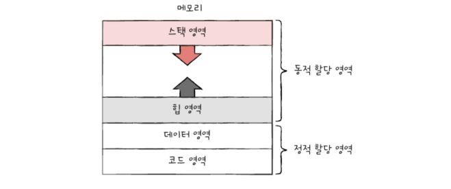

# 10-1 프로세스 개요

`프로세스(process)`: 실행중인 프로그램\
프로그램은 실행되기 전까지는 보조기억장치에 있는 데이터 덩어리.\
보조 기억 장치에 저장된 프로그램을 메모리에 적재하고 실행하는 순간 그 프로그램은 프로세스가 됨=>이 과정을 '프로세스를 생성한다'고 함

## 프로세스 직접 확인하기
컴퓨터가 부팅되는 순간부터 수많은 프로세스들이 실행됨\
\
\

`포그라운드 프로세스`: 사용자가 볼 수 있는 공간에서 실행되는 프로세스
`백그라운드 프로세스`: 사용자에게 보이지 않는 공간에서 실행되는 프로세스

백그라운드 프로세스 중 사용자와 직접 상호작용 할 수 있는 프로세스도 있지만, 사용자와 상호작용하지 않고 그저 묵묵히 정해진 일만 수행하는 백그라운드 프로세스도 있음. 이러한 프로세스를 유닉스에서는 `데몬`, 윈도우에서는 `서비스`라고 부름\

## 프로세스 제어 블록
모든 프로세스들은 실행을 위해 CPU가 필요로 하지만 CPU자원이 한정되어 있기 때문에 차례로 돌아가며 한정된 시간만큼(타이머 인터럽트가 발생할 때까지) CPU를 사용. 그 후 다음 차례가 올 때까지 기다림\

운영체제는 프로세스의 실행순서를 관리하고 프로세스에 CPU를 비롯한 자원을 `프로세스 제어 블록(PCB)`를 이용하여 배분함

`프로세스 제어 블록(PCB)`: 프로세스와 관련된 정보를 저장하는 자료 구조. 
- 커널 영역에 생성됨
- 프로세스 생성시에 만들어지고, 실행이 끝나면 폐기됨
  ('새로운 프로세스가 생성되었다.' === '운영체제가 PCB를 생성했다.', 
  '프로세스가 종료되었다.' === '운영체제가 해당 PCB를 폐기했다.')

### PCB에 담기는 정보
- **프로세스 ID(PID)**\
  특정 프로세스를 식별하기 위해 부여하는 고유 번호
- **레지스터 값**\
  프로세스는 자신의 실행차례가 돌아오면 이전까지 사용했던 레지스터 중간값들을 모두 복원해야 함.
- **프로세스 상태**\
  현재 프로세스가 입출력장치를 사용하기 위해 기다리고 있는 상태인지, CPU를 사용하기 위해 기다리고 있는 상태인지, CPU를 이용하고 있는 상태인지 등의 상태정보
- **CPU 스케줄링 정보**\
  언제 어떤 순서로 CPU를 할당받을지에 대한 정보
- **메모리 관리 정보**\
  프로세스는 메모리에 저당된 위치가 다름. ∴ 어느 주소에 저장되어 있는지에 대한 정보 필요. 베이스 레지스터, 한계 레지스터 값과 같은 정보들이 담김. 또 페이지 테이블 정보(프로세스 주소를 알기 위한 또 다른 중요 정보-14장에서 학습)도 담김
- **사용한 파일과 입출력장치 목록**\
  어떤 입출력 장치가 이 프로세스에 할당되었는지, 어떤 파일을 열었는지에 대한 정보

## 문맥 교환
실행중인 프로세스를 중단하고 다음 프로세스를 진행하기 전, 실행되고 있던 프로세스의 프로그램 카운터를 비롯한 각종 정보들을 백업해야함. 이때, 하나의 프로세스 수행을 재개하기 위해 기억해야할 정보를 `문맥`이라고 함

\

`문맥 교환`: 기본 프로세스 문백을 PCB에 백업하고 새로운 프로세스를 실행하기 위해 문백을 PCB로부터 복구하여 새로운 프로세스를 실행하는 것\

문맥 교환이 자주 일어날 수록 우리의 눈에는 프로세스들이 동시에 실행되는 것처럼 보임

## 프로세스의 메모리 영역
프로세스는 사용자 영역에 크게 `코드 영역`, `데이터 영역`, `힙 영역`, `스택 영역`으로 나뉘에 저장 됨\

### 코드 영역(텍스트 영역)
실행할 수 있는 코드, 즉 기계어로 이루어진 명령어가 저장됨. CPU가 실행할 명령어가 담겨있기 때문에 '쓰기'가 금지되어 있음. 다시말해 읽기 전용 공간임

### 데이터 영역
프로그램이 실행될 동안 유지할 데이터. 대표적으로는 `전역 변수`가 있음.\

코드 영역과 데이터 영역은 그 크기가 변하지 않음\
`정적 할당 영역`: 크기가 고정된 영역.(ex: 코드 영역, 데이터 영역)\
`동적 할당 영역`: 크기가 변할 수 있는 영역 (ex: 힙 영역, 스택 영역)

### 힙 영역
프로그램을 만든 사용자가 직접 할당할 수 있는 저장공간.\
프로그래밍 과정에서 힙 영역에 메모리 공간을 할당했다면 언젠가는 해당 공간을 반환(==='더 이상 해당 메모리 공간을 사용하지 않겠다'라고 운영체제에 말해주는 것)해야 함.\
만약 반환하지 않는다면 할당한 공간은 메모리 낭비를 초래함 === `메모리 누수`\

### 스택 영역
데이터를 일시적으로 저장하는 공간. 데이터 영역에 담기는 값과는 달리 잠깐 쓰다가 말 값들이 저장됨. 대표적으로 함수 실행이 끝나면 사라지는 매개변수, 지역변수 등이 있음

일시적으로 저장할 데이터는 스택 영역에 PUSH되고, 더이상 필요하지 않은 데이터는 POP 됨으로써 스택 영역에서 사라짐

일반적으로 힙 영역은 메모리의 낮은 주소에서 높은 주소로 할당되고, 스택 영역은 높은 주소에서 낮은 주소로 할당 됨.

Q1. 힙 영역과 스택 영역의 메모리 주소 할당에 대해 설명하시오.

A1. 힙 영역은 메모리의  낮은 주소에서 높은 주소로 할당되고, 스택 영역은 높은 주소에서 낮은 주소로 할당 된다.