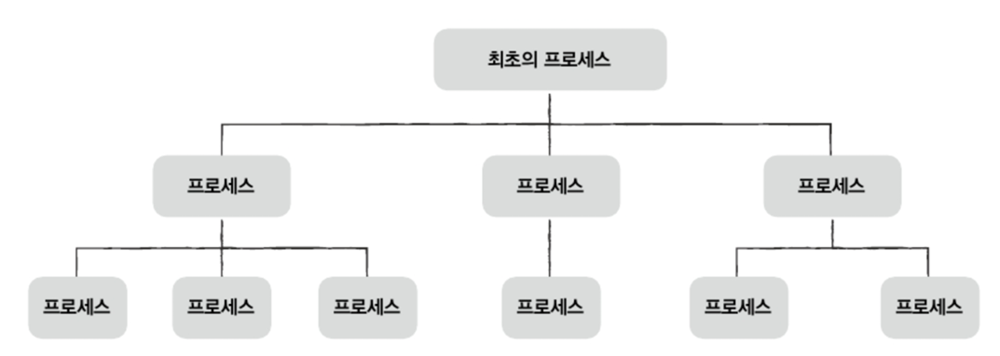

# Ch10. 프로세스와 스레드

# 10-1. 프로세스 개요

- 프로세스: 보조기억장치의 프로그램이 메모리에 적재되어 실행 중인 상태
- 프로세스 종류
  - 포그라운드 프로세스: 사용자가 보는 앞에서 실행되는 프로세스
  - 백그라운드 프로세스: 사용자가 보지 못하는 뒤에서 실행되는 프로세스
    - 유닉스- 데몬, 윈도우: 서비스

## 프로세스 제어 블록(PCB ; Process Control Block)
- 프로세스 관련 정보를 저장하는 자료구조
  
- 커널 영역에 생성되고 프로세스 종료 시 폐기
- 타이머 인터럽트(=타임아웃 인터럽트): 클럭 신호 발생시키는 장치에 의해 주기적으로 발생하는 HW 인터럽트
  
- 저장 정보
  - 프로세스ID(PID ; Process ID): 프로세스 고유 식별 번호
  - 레지스터 값: 프로그램 카운터 등 실행 상태 유지를 위한 값들
  - 프로세스 상태: 현재 프로세스의 상태 정보
  - CPU 스케줄링 정보: CPU 할당 순서와 시기
  - 메모리 관리 정보: 베이스 레지스터, 페이지 테이블 등
  - 입출력 정보: 할당된 입출력장치와 열린 파일 목록
  

## 문맥 교환
- 한 프로세스에서 다른 프로세스로 실행 전환되는 것
  
- 문맥: 프로세스 재개에 필요한 정보들
- 과정
  - 실행 중인 프로세스의 상태를 PCB에 백업
  - 다음 프로세스의 상태를 PCB에서 복구
  - 빠른 전환으로 동시 실행처럼 보임
  

## 프로세스 메모리 영역
1. 코드 영역 (텍스트 영역)
   - 실행할 기계어 명령어 저장
   - 읽기 전용, 크기 고정
2. 데이터 영역
   - 전역 변수 등 프로그램 전체에서 접근 가능한 데이터
   - 크기 고정
3. 힙 영역
   - 프로그래머가 직접 할당/해제하는 메모리
   - 낮은 주소에서 높은 주소로 할당
   - `메모리 누수` 주의
4. 스택 영역
   - 함수 호출 시 임시 데이터(매개변수, 지역변수) 저장
   - 높은 주소에서 낮은 주소로 할당

# 10-2. 프로세스 상태와 계층 구조

## 프로세스 상태

1. 생성 상태
   - 프로세스 생성 중
   - PCB 할당 받은 상태
2. 준비 상태
   - CPU 할당 대기 중
   - 즉시 실행 가능한 상태
3. 실행 상태
   - CPU 할당받아 실행 중
   - 할당 시간 종료/입출력 발생 시 상태 전환
4. 대기 상태
   - 입출력 작업 완료 대기
   - 완료 시 준비 상태로 전환
5. 종료 상태
   - 프로세스 실행 완료
   - PCB와 자원 정리

## 프로세스 계층구조

- 부모-자식 관계로 구성
- 최초 프로세스(PID 1)에서 시작
- 프로세스 생성 방법
  - fork: 자신의 복사본을 자식으로 생성
    
    - 자원과 메모리 내용 상속
    - PID와 메모리 위치는 새로 할당
  - exec: 새로운 프로그램으로 메모리 덮어쓰기
    
    - 코드/데이터 영역 교체, 나머지 초기화

# 10-3. 스레드

## 프로세스와 스레드
- 스레드: 프로세스 내 실행 흐름의 단위
- 구성 요소
  - 스레드 ID
  - 프로그램 카운터
  - 레지스터 값
  - 스택

## 멀티프로세스 vs 멀티스레드
- 멀티프로세스
  - 여러 프로세스 동시 실행
  - 장점: 독립적 실행으로 안정성 높음
  - 단점: 자원 중복으로 메모리 낭비
  - 프로세스 간 통신(IPC) 필요

- 멀티스레드
  - 하나의 프로세스 내 여러 실행 흐름
  - 장점
    
    - 자원 공유로 효율적 메모리 사용(스레드끼리는 프로세스 내의 자원 공유)
    - 스레드 간 협력과 통신 용이
  - 단점
    
    - 하나의 스레드 문제가 전체 프로세스에 영향
    - 동기화 문제 발생 가능

### <추가> 프로세스 간 동신(IPC; Inter-Process Communication)
- 통신 : 네트워크 통해 데이터 주고받는 것 뿐만 아니라, 같은 컴퓨터 내의 서로 다른 프로세스나 스레드끼리 데이터 주고받는 것도 포함.
- 프로세스들은 서로 공유하는 메모리 영역을 두어 데이터 주고 받을 수 있음 -> `공유 메모리`

---
# Q&A
** Q1. 프로세스의 문맥 교환(Context Switching)이 무엇이고, 이 과정에서 PCB는 어떤 역할을 하나요? **

A1. 문맥 교환은 하나의 프로세스에서 다른 프로세스로 실행이 전환되는 것을 말합니다. 이 과정에서 PCB는 현재 실행 중인 프로세스의 상태 정보를 백업하고 다음 실행할 프로세스의 상태 정보를 복구하는 데 사용됩니다. PCB를 통해 프로세스는 다음 실행 시 이전 작업을 이어서 진행할 수 있게 됩니다.

** Q2. 멀티프로세스와 멀티스레드 방식의 주요 차이점과 각각의 장단점은 무엇인가요? **

A2. 멀티프로세스는 여러 개의 독립된 프로세스를 실행하는 방식으로, 각 프로세스가 독립적인 자원을 가지고 실행됩니다. 안정성이 높지만 자원이 중복되어 메모리 낭비가 발생할 수 있습니다.
반면 멀티스레드는 하나의 프로세스 내에서 여러 실행 흐름을 갖는 방식으로, 스레드들이 프로세스의 자원을 공유합니다. 효율적인 자원 사용과 쉬운 통신이 장점이지만, 하나의 스레드 문제가 전체 프로세스에 영향을 줄 수 있다는 단점이 있습니다.

** Q3. 프로세스의 메모리 영역은 어떻게 구성되어 있으며, 각 영역의 특징은 무엇인가요? **

A3. 프로세스의 메모리는 크게 4개 영역으로 구성됩니다.
1. 코드 영역: 실행할 기계어 명령어가 저장되는 읽기 전용 영역
2. 데이터 영역: 전역 변수가 저장되는 영역으로 크기가 고정됨
3. 힙 영역: 프로그래머가 직접 관리하는 동적 할당 영역으로, 낮은 주소에서 높은 주소로 할당됨
4. 스택 영역: 함수 호출 시 생성되는 지역 변수, 매개변수가 저장되는 영역으로, 높은 주소에서 낮은 주소로 할당됨
이 중 코드와 데이터 영역은 정적 할당 영역이고, 힙과 스택은 동적 할당 영역입니다.