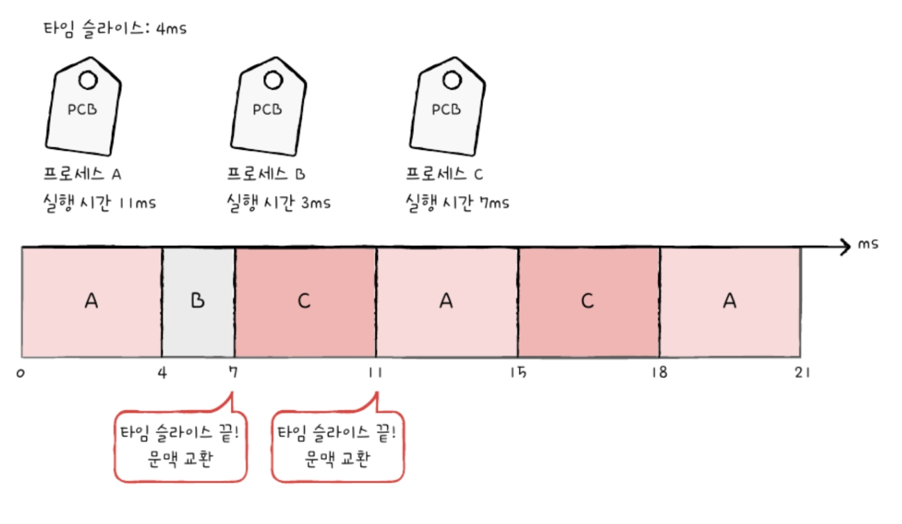

# 11. CPU 스케쥴링
- [11. CPU 스케쥴링](#11-cpu-스케쥴링)
  - [11-1. CPU 스케쥴링 개요](#11-1-cpu-스케쥴링-개요)
    - [(1) 프로세스 우선 순위](#1-프로세스-우선-순위)
      - [프로세스 실행 과정](#프로세스-실행-과정)
      - [프로세스의 종류마다 입출력장치를 이용하는 시간과 CPU를 이용하는 시간의 양에는 차이가 있음](#프로세스의-종류마다-입출력장치를-이용하는-시간과-cpu를-이용하는-시간의-양에는-차이가-있음)
      - [CPU 버스트와 입출력 버스트](#cpu-버스트와-입출력-버스트)
      - [CPU 집중 프로세스와 입출력 집중 프로세스가 동시에 CPU 자원을 요구한 경우](#cpu-집중-프로세스와-입출력-집중-프로세스가-동시에-cpu-자원을-요구한-경우)
      - [우선순위](#우선순위)
    - [(2) 스케줄링 큐](#2-스케줄링-큐)
      - [스케줄링 큐](#스케줄링-큐)
      - [큐의 종류](#큐의-종류)
      - [준비 큐, 대기 큐 실행 순서](#준비-큐-대기-큐-실행-순서)
      - [프로세스 상태 다이어그램](#프로세스-상태-다이어그램)
    - [(3) 선점형과 비선점형 스케줄링](#3-선점형과-비선점형-스케줄링)
      - [선점형 스케줄링](#선점형-스케줄링)
      - [비선점형 스케줄링](#비선점형-스케줄링)
  - [11-2. CPU 스케줄링 알고리즘](#11-2-cpu-스케줄링-알고리즘)
    - [(1) 스케줄링 알고리즘의 종류](#1-스케줄링-알고리즘의-종류)
      - [선입 선처리 스케줄링](#선입-선처리-스케줄링)
      - [최단 작업 우선 스케줄링](#최단-작업-우선-스케줄링)
      - [라운드 로빈 스케줄링](#라운드-로빈-스케줄링)
      - [최소 잔여 시간 우선 스케줄링](#최소-잔여-시간-우선-스케줄링)
      - [우선 순위 스케줄링](#우선-순위-스케줄링)
      - [다단계 큐 스케줄링](#다단계-큐-스케줄링)
      - [다단계 피드백 큐 스케줄링](#다단계-피드백-큐-스케줄링)
  - [Q\&A](#qa)
    - [Q1.준비 큐와 대기 큐에 대해 설명하세요.](#q1준비-큐와-대기-큐에-대해-설명하세요)
    - [Q2. 최소 잔여 시간 우선 스케줄링에 대해 설명하세요.](#q2-최소-잔여-시간-우선-스케줄링에-대해-설명하세요)
    - [Q3. 다단계 큐 스케줄링과 다단계 피드백 큐 스케줄링을 설명하세요.](#q3-다단계-큐-스케줄링과-다단계-피드백-큐-스케줄링을-설명하세요)

## 11-1. CPU 스케쥴링 개요
- 운영체제가 프로세스들을 공정하고 합리적으로 CPU 자원을 배분하는 것
- 성능과 직결됨

### (1) 프로세스 우선 순위
#### 프로세스 실행 과정
- CPU와 입출력장치를 모두 사용함
- 실행과 대기 상태를 반복
](<프로세스 실행과정.png>)

#### 프로세스의 종류마다 입출력장치를 이용하는 시간과 CPU를 이용하는 시간의 양에는 차이가 있음
- 입출력 집중 프로세스 : 입출력 작업이 많은 프로세스 
  - 입출력 집중 프로세스는 실행 상태보다 입출력을 위한 대기 상태에 더 많이 머무름
  - 비디오 재생, 디스크 백업 작업 등
- CPU 집중 프로세스 : CPU 작업이 많은 프로세스
  - CPU 집중 프로세스는 대기 상태보다 실행 상태에 더 많이 머무름
  - 복잡한 수학 연산, 컴파일, 그래픽 처리 작업 등

#### CPU 버스트와 입출력 버스트
- CPU 버스트 : CPU를 이용하는 작업
- 입출력 버스트 : 입출력장치를 기다리는 작업
- 프로세스는 CPU 버스트와 입출력 버스트를 반복하며 실행됨
](<CPU 버스트, 입출력 버스트.png>)

#### CPU 집중 프로세스와 입출력 집중 프로세스가 동시에 CPU 자원을 요구한 경우
- 입출력 집중 프로세스를 빨리 실행시켜 입출력 장치를 가동하고 CPU 집중 프로세스를 집중적으로 CPU를 할당하는 것이 효율적
- 입출력장치가 작업을 완료하기 전까지는 어차피 대기 상태가 되기 때문에 입출력 집중 프로세스를 먼저 처리해버리면 다른 프로세스가 CPU를 사용할 수 있기 때문

#### 우선순위
- 운영체제는 프로세스마다 우선순위를 부여
- 운영체제는 각 PCB(프로세스 제어 블록)에 우순순위를 명시하고 그 기준으로 먼저 처리할 프로세스를 결정함
- 우선순위가 높은 프로세스는 더 빨리, 더 자주 실행됨

### (2) 스케줄링 큐
#### 스케줄링 큐
- 스케쥴링 큐 : 모든 PCB를 뒤져서 메모리, 하드 디스크, CPU 등을 사용하는지를 볼 수 없기 때문에 각 요소별로 줄을 세워 관리함
  - 스케쥴링에서 이야기하는 큐는 선입선출 방식일 필요는 없음
- 운영체제는 메모리로 적재되고 싶은 프로세스들을 큐에 삽입하여 줄을 세움, CPU를 이용하고 싶어 하는 프로세스 또한 동일하게 큐에 삽입하여 줄을 세우고, 특정 입출력장치를 이용하고 싶은 프로세스도 동일함
](<스케줄링 큐.png>)

#### 큐의 종류
- 운영체제가 관리하는 대부분의 자원은 큐로 관리됨
- 준비 큐(ready queue) : CPU를 이용하고 싶은 프로세스들이 서는 줄
- 대기 큐(waiting queue) : 입출력장치를 이용하기 위해 대기 상태에 접어든 프로세스들이 서는 줄
](<준비큐, 대기큐.png>)

#### 준비 큐, 대기 큐 실행 순서
- 준비 큐
  - 준비 상태에 있는 프로세스들의 PCB는 준비 큐의 마지막에 삽입되어 CPU를 사용할 차례를 기다림
  - 큐에 삽입된 순서대로 프로세스를 하나씩 꺼내어 실행하되, 우선순위가 높은 프로세스를 먼저 실행
  - 우선순위가 낮은 프로세스들이 먼저 큐에 삽입되었어도 우선순위가 높은 프로세스가 먼저 처리됨

- 대기 큐
  - 같은 장치를 요구한 프로세스들은 같은 대기 큐에서 기다림
  - 입출력이 완료되어 입터럽트가 발생하면 운영체제는 대기 큐에서 작업이 완료된 PCB를 찾고 준비 상태로 변경한 뒤 대기 큐에서 제거함
  - PCB는 준비 큐로 이동

#### 프로세스 상태 다이어그램

### (3) 선점형과 비선점형 스케줄링
#### 선점형 스케줄링
- 프로세스가 CPU를 비롯한 자원을 사용하고 있더라도 운영체제가 프로세스로부터 자원을 강제로 빼앗아 다른 프로세스에 할당할 수 있는 스케줄링 방식을 의미
- 어느 하나의 프로세스가 자원 사용을 독점할 수 없는 스케줄링 방식

#### 비선점형 스케줄링
- 하나의 프로세스가 자원을 사용하고 있다면 그 프로세스가 종료되거나 스스로 대기 상태에 접어들기 전까진 다른 프로세스가 끼어들 수 없는 스케줄링
- 비선점형 스케줄링 방식으로 자원을 이용하는 프로세스가 있다면 다른 프로세스들은 그 프로세스의 사용이 모두 끝날 때까지 기다려야함

- 문맥 교환의 횟수가 적기 때문에 오버헤드는 선점형 스케줄링보다 적지만 하나의 프로세스가 자원을 사용 중이라면 당장 지원을 사용해야 하는 상황에서도 무작정 기다려야 함

## 11-2. CPU 스케줄링 알고리즘
### (1) 스케줄링 알고리즘의 종류
#### 선입 선처리 스케줄링
- FCFS(First Come First Scheduling) 스케줄링이라고도 부름
- 단순히 큐에 삽입된 순서대로 프로세스들을 처리하는 비선점형 스케줄링
- 선입 선처리 스케줄링은 CPU를 먼저 요청한 프로세스부터 CPU를 할당하는 스케줄링 방식
- 프로세스들이 기다리는 시간이 매우 길어질 수 있다는 점에서 부작용이 있음
  - 호위 효과(convoy effect) : 뒤에 큐에 들어온 짧은 실행 시간의 프로세스가 앞의 긴 처리 시간을 기다려야 하는 현상

#### 최단 작업 우선 스케줄링
- SJF(Shortest Job First Scheduling) 스케줄링 
- 준비 큐에 삽입된 프로세스들 중 CPU 이용 시간의 길이가 가장 짧은 프로세스부터 실행하는 스케줄링 방식
- 비선점형 스케줄링 알고리즘으로 분류되지만 선점형으로 구현될 수 있음 (선점형 최단 작업 우선 스케줄링)

#### 라운드 로빈 스케줄링
- 라운드 로빈 스케줄링(round robin scheduling)은 선입 선처리 스케줄링에 타임 슬라이스라는 개념이 더해진 스케줄링 방식
- 타임 슬라이스 : 각 프로세스가 CPU를 사용할 수 있는 정해진 시간을 의미함
- 정해진 타임 슬라이스만큼의 시간 동안 돌아가며 CPU를 이용하는 선점형 스케줄링
- 큐에 삽입된 프로세스들은 삽입된 순서대로 CPU를 이용하되 정해진 시간만큼만 CPU를 이용함
  - 만약 프로세스가 완료되지 않았다면 다시 큐의 맨 뒤에 삽입되고 문맥 교환이 발생함

- 타임 슬라이스의 크기가 중요함
  - 지나치게 크면 선입 선처리 스케줄링과 동일하게 호위 효과가 생김
  - 지나치게 작으면 문맥 교환에 발생하는 비용이 큼

#### 최소 잔여 시간 우선 스케줄링
- SRT(Shortest Remaining Time) 스케줄링
- 최단 작업 우선 스케줄링과 라운드 로빈 알고리즘을 합친 스케줄링 방식
- 최소 잔여 시간 우선 스케줄링 하에서 프로세스들은 정해진 타임 슬라이스만큼 CPU를 사용하되, CPU를 사용할 다음 프로세스로는 남아있는 작업 시간이 가장 적은 프로세스가 선택됨

#### 우선 순위 스케줄링
- 우선 순위 스케줄링(Priority scheduling) :  프로세스들에 우선순위를 부여하고 가장 높은 우선 순위를 가진 프로세스부터 실행하는 스케줄링 알고리즘
- 최단 작업 우선 스케줄링, 최소 잔여 시간 우선 스케줄링 알고리즘은 넓은 의미에서 우선 순위 스케줄링의 일종
- 우선 순위가 낮은 프로세스는 우선순위가 높은 프로세스들에 의해 실행이 계속해서 연기될 수 있음 => 기아 현상
- 에이징 : 기아 현상을 방지하기 위한 대표적인 기법
  - 오랫동안 대기한 프로세스의 우선순위를 점차 높이는 방식
  - 에이징 기법을 적용하면 우선순위가 낮아 마냥 기다리는 프로세스가 없어짐

#### 다단계 큐 스케줄링
- 우선순위 스케줄링의 발전된 형태
- 우선순위 별로 준비 큐를 여러 개 사용하는 스케줄링 방식
- 우선순위가 가장 높은 큐에 있는 프로세스들을 먼저 처리, 우선순위가 가장 높은 큐가 비어있으면 다음 우선순위 큐에 있는 프로세스들을 처리함

- 프로세스 유형별로 우선순위를 구분하여 실행하는 것이 편리함
- 큐마다 다른 스케줄링 알고리즘을 사용할 수 있음
- 프로세스의 타입을 큐마다 다르게 넣을 수 있음

#### 다단계 피드백 큐 스케줄링
- 다단계 큐 스케줄링의 발전된 형태
- 다단계 큐 스케줄링의 경우 큐끼리 프로세스가 이동할 수 없어 기아 현상이 발생할 수 있음
  - 언제 높은 우선 순위의 프로세스가 들어올지 모르기 때문에 우선순위가 낮은 프로세스 입장에서는 매우 불리
  - 이를 보완한 게 다단계 피드백 큐 스케줄링

- 다단계 피드백 큐 스케줄링의 동작 방식
  - 다단계 피드백 큐 스케줄링에서 새로 준비 상태가 된 프로세스가 있다면 우선 순위가 가장 높은 우선순위 큐에 삽입되고 타임 슬라이스 동안 실행됨
  - 프로세스가 해당 큐에서 실행이 끝나지 않으면 다음 우선순위 큐에 삽입되어 실행됨
  - 프로세스들이 큐 사이를 이동할 수 있기 때문에 낮은 우선순위 큐에서 너무 오래 기다리고 있는 프로세스가 있다면 점차 우선 순위가 높은 큐로 이동시키는 **에이징 기법**을 적용하여 **기아 현상 예방**

- 다단계 피드백 큐 스케줄링 알고리즘은 프로세스의 CPU 이용 시간이 길면 낮은 우선순위 큐로 이동하고, 낮은 우선순위 큐에서 너무 오래 기다리면 높은 우선순위 큐로 이동시킴

## Q&A
### Q1.준비 큐와 대기 큐에 대해 설명하세요.
A1. 운영체제가 관리하는 대부분의 자원은 스케줄링 큐로 관리가 됩니다. 준비 큐는 CPU를 이용하고 싶은 프로세스들의 큐이며 대기 큐는 입출력장치를 이용하기 위해 대기 상태에 접어든 프로세스들의 큐를 말합니다.

### Q2. 최소 잔여 시간 우선 스케줄링에 대해 설명하세요.
A2. SRT 스케줄링이라고도 하며 최단 작업 우선 스케줄링과 라운드 로빈 알고리즘을 합친 스케줄링 방식입니다. 최소 잔여 시간 우선 스케줄링 하에서 프로세스들이 정해진 타임 슬라이스만큼 CPU를 사용하되, CPU를 사용할 다음 프로세스로는 남아있는 작업 시간이 가장 적은 프로세스가 선택되게 됩니다.

### Q3. 다단계 큐 스케줄링과 다단계 피드백 큐 스케줄링을 설명하세요.
A3. 다단계 큐 스케줄링은 우선순위 스케줄링의 발전된 형태로 우선순위 별로 준비 큐를 여러 개 사용하는 스케줄링 방식입니다. 우선순위가 가장 높은 큐에 있는 프로세스들을 먼저 처리하고 우선순위가 가장 높은 큐가 비어있으면 다음 우선순위 큐에 있는 프로세스들을 처리합니다.

다단계 피드백 큐 스케줄링은 다단계 큐 스케줄링의 발전된 형태로 다단계 큐 스케줄링의 기아 현상을 방지할 수 있습니다. 다단계 피드백 큐 스케줄링은 다단계 큐 스케줄링과 달리 프로세스가 큐를 이동할 수 있고 오랜 시간동안 낮은 우선순위 큐에서 기다리는 프로세스가 있다면 우선 순위 높은 큐로 이동시키는 에이징 기법을 적용합니다.