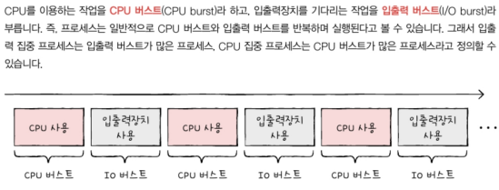
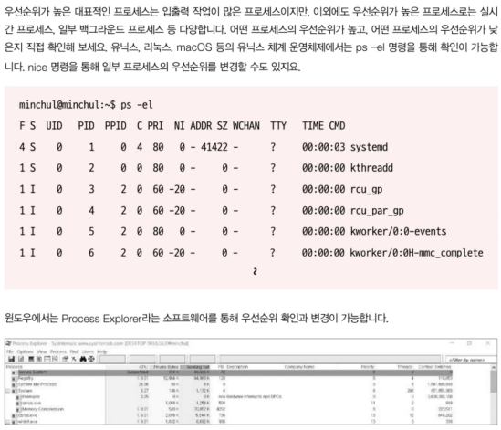
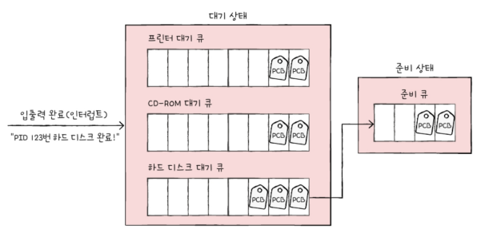

# Chapter 11. CPU 스케줄링
- [Chapter 11. CPU 스케줄링](#chapter-11-cpu-스케줄링)
- [11-1. CPU 스케줄링 개요](#11-1-cpu-스케줄링-개요)
  - [프로세스 우선순위](#프로세스-우선순위)
  - [스케줄링 큐](#스케줄링-큐)
  - [선점형과 비선점형 스케줄링](#선점형과-비선점형-스케줄링)
- [11-2. CPU 스케줄링 알고리즘](#11-2-cpu-스케줄링-알고리즘)
  - [선점형 스케줄링](#선점형-스케줄링)
    - [라운드 로빈 스케줄링](#라운드-로빈-스케줄링)
    - [최소 잔여 시간 우선 스케줄링(SRT 스케줄링)](#최소-잔여-시간-우선-스케줄링srt-스케줄링)
    - [우선순위 스케줄링](#우선순위-스케줄링)
    - [다단계 큐 스케줄링](#다단계-큐-스케줄링)
    - [**다단계 피드백 큐 스케줄링**](#다단계-피드백-큐-스케줄링)
  - [비선점형 스케줄링](#비선점형-스케줄링)
    - [선입 선처리 스케줄링(FCFS 스케줄링)](#선입-선처리-스케줄링fcfs-스케줄링)
    - [최단 작업 우선 스케줄링(SJF링)](#최단-작업-우선-스케줄링sjf링)
- [Q\&A](#qa)

---

# 11-1. CPU 스케줄링 개요

**CPU 스케줄링** : 운영체제가 프로세스들에게 공정하고 합리적으로 **CPU 자원을 배분**하는 방법

- 모든 프로세스는 CPU 필요, 먼저 사용하고 싶어함!
- 컴퓨터 성능과도 직결

## 프로세스 우선순위

- 우선순위가 높은 프로세스 먼저 처리!
    - 프로세스마다 우선 순위 다름
        
        
        
        프로세스는 CPU와 입출력장치를 사용 즉, 실행 상태와 대기 상태 반복하며 실행
        
    - 입출력 집중 프로세스 : 실행 상태 < 입출력 위한 대기 상태에 더 많이 머무름
    - CPU 집중 프로세스 : 대기 상태 < 실행 상태에 더 많이 머무름
        - 참고 - CPU 버스트와 입출력 버스트
            
            
            
    - 입출력 집중 프로세스와 CPU 집중 프로세스가 **동시에 CPU 자원을 요구**했다면?
        - **입출력 집중 프로세스** 먼저!
        - 입출력 작업 완료하기 전까지 계속 대기하기 때문
        - 먼처 처리하면 다른 프로세스가 CPU 사용 가능
- 운영체제 → 각 프로세스의 **PCB에 우선순위 명시**, 먼저 처리할 프로세스 결정
    - 참고 - 프로세스 우선순위 직접 확인하기
        
        
        

## 스케줄링 큐

**스케줄링 큐** : 프로세스를 줄 세움

- 운영체제가 매번, 모든 PCB를 검사해 먼저 자원 이용할 프로세스 결정하기란 번거롭고 시간 오래 걸림
- 큐 : 자료 구조 관점(선입선출), 반드시 선입선출 방식일 필요는 없음
    - **준비 큐** : CPU를 이용하기 위해 기다리는 줄
    - **대기 큐** : 입출력장치를 이용하기 위해 기다리는 줄

- 준비 상태에 있는 프로세스들의 PCB → 준비 큐의 마지막에 삽입되어 CPU 사용할 차례 기다림
- 운영체제는 PCB들이 큐에 삽입된 순서대로 프로세스 하나씩 꺼내어 실행 + 우선순위 높은 순위로

- 같은 장치를 요구한 프로세스 → 같은 대기 큐에서 기다림
- 입출력 완료되어 완료 인터럽트 발생 → 운영체제는 대기 큐에서 작업 완료된 PCB 찾고 준비 상태로 변경한 뒤 대기 큐에서 제거 → 해당 PCB는 준비 큐로 이동

프로세스 상태 다이어그램

## 선점형과 비선점형 스케줄링

- 이미 프로세스가 CPU를 실행 중인데 다른 프로세스가 급하게 당장 CPU를 사용하길 원한다면?
1. **선점형 스케줄링**
    - 운영체제가 이미 자원을 사용하고 있는 프로세스로부터 **강제로 빼앗아** 다른 프로세스에 할당할 수 있는 스케줄 방식(자원 사용 독점 불가)
    - 장점 : 한 프로세스의 자원 독점을 막고 골고루 배분
    - 단점 : 문맥 교환 과정에서 오버헤드 발생 가능
2. **비선점형 스케줄링**
    - 하나의 프로세스가 자원을 사용하고 있다면 종료되거나 스스로 대기 상태에 접어들기 전까지 다른 프로세스가 끼어들 수 없는 스케줄링 방식(자원 독점 가능)
    - 장점 : 문맥 교환 횟수가 적어 문맥 교환 과정에서 오버헤드 적음
    - 단점 : 모든 프로세스가 골고루 자원을 사용할 수 없음

# 11-2. CPU 스케줄링 알고리즘

## 선점형 스케줄링

### 라운드 로빈 스케줄링

: **정해진 시간만큼만** 돌아가며 CPU 할당

- 정해진 시간이 지났는데 프로세스가 완료되지 않았다면 다시 큐의 맨 뒤에 삽입 ⇒ 문맥 교환 발생
- **타임 슬라이스** : 각 프로세스가 CPU를 사용할 수 있는 정해진 시간
    - 타임 슬라이스 지나치게 크면? 호위 효과 생길 수 있음
    - 타임 슬라이스 지나치게 작으면? 문맥 교환에 발생하는 비용이 큼

### 최소 잔여 시간 우선 스케줄링(SRT 스케줄링)

: 정해진 **타임 슬라이스**만큼 CPU 사용하되, CPU 사용할 다음 프로세스는 **남아있는 작업 시간이 가장 적은** 프로세스

- 최단 작업 우선 스케줄링 + 라운드 로빈 스케줄링

### 우선순위 스케줄링

: **가장 높은 우선순위**를 가진 프로세스를 CPU에 할당

- **기아 현상** : 우선순위가 높은 프로세스가 먼저 실행되어 우선순위가 낮은 프로세스의 실행이 밀리는 현상
- **에이징** : 오래 대기한 프로세스의 우선순위를 점차 높이는 방식, 기아 현상 방지 기법

### 다단계 큐 스케줄링

: **우선순위별로 준비 큐를 여러 개 사용**하는 스케줄링 방식

- 우선순위가 높은 큐에 있는 프로세스 먼저 처리
    - 프로세스 유형별 우선순위 구분
    - 큐별로 타임 슬라이스 여러 개 지정 가능
    - 다른 스케줄링 알고리즘 사용 가능
- 프로세스가 큐 사이 이동 불가 → 기아 현상 발생 가능성

### **다단계 피드백 큐 스케줄링**

: 프로세스들이 **큐 사이를 이동**할 수 있는 다단계 큐 스케줄링

- 새로 준비 상태가 된 프로세스 있다면? 우선순위 높은 큐에 삽입되어 일정 시간 동안 실행, 끝나지 않으면 다음 우선순위 큐에 삽입되어 실행
    - CPU 오래 사용해야하는 CPU 집중 프로세스들은 점차 우선순위 낮아짐 ⇒ 에이징 기법 사용
    

## 비선점형 스케줄링

### 선입 선처리 스케줄링(FCFS 스케줄링)

: 준비 큐에 **삽입된 순서대로** CPU를 할당

- **호위 효과** : CPU 사용 시간이 긴 프로세스에 의해 사용 시간이 짧은 프로세스들이 오래 기다리는 현상

### 최단 작업 우선 스케줄링(SJF링)

: 준비 큐에 **삽입된 프로세스들** 중 CPU **사용 시간의 길이가 가장 짧은** 프로세스부터 CPU 할당

# Q&A

1. **CPU 스케줄링이란 무엇인가요?**
2. **선점형 스케줄링과 비선점형 스케줄링을 비교해보시오.**
3. **호위 효과란 무엇인가요?**

- **1번 답**
    
    CPU 스케줄링이란 공정하고 합리적으로 CPU 자원을 배분하는 방법입니다. 
    
- **2번 답**
    
    하나의 프로세스가 **자원을 사용하고 있을 때** 다른 프로세스가 **해당 자원을 빼앗을 수 있는** 스케줄링을 선점형 스케줄링, **빼앗을 수 없는** 스케줄링을 비선점형 스케줄링이라고 합니다.
    
    선점형 스케줄링은 한 프로세스의 자원 독점을 막고 골고루 배분한다는 장점이 있지만 문맥 교환 과정에서 오버헤드가 발생할 수 있는 단점이 있습니다.
    
    비선점형 스케줄링은 문맥 교환 횟수가 적어 문맥 교환 과정에서 오버헤드가 적다는 장점이 있지만 모든 프로세스가 골고루 자원을 사용할 수 없다는 단점이 있습니다.
    
- **3번 답**
    
    호위 효과란 CPU 사용시간이 긴 프로세스에 의해 사용시간이 짧은 프로세스들이 오래 기다리게 되는 현상을 말하며, 비선점형 스케줄링 방식에서 주로 나타나는 현상입니다.