- [11-1. CPU 스케줄링 개요](#11-1-cpu-스케줄링-개요)
  - [프로세스 우선순위](#프로세스-우선순위)
  - [스케줄링 큐](#스케줄링-큐)
  - [선점형과 비선점형 스케줄링](#선점형과-비선점형-스케줄링)
- [11-2. CPU 스케줄링 알고리즘](#11-2-cpu-스케줄링-알고리즘)
  - [스케줄링 알고리즘의 종류](#스케줄링-알고리즘의-종류)
    - [선입 선처리 스케줄링(FCFS 스케줄링)](#선입-선처리-스케줄링fcfs-스케줄링)
    - [최단 작업 우선 스케줄링(SJF 스케줄링)](#최단-작업-우선-스케줄링sjf-스케줄링)
    - [라운드 로빈 스케줄링](#라운드-로빈-스케줄링)
    - [최소 잔여 시간 우선 스케줄링(SRT 스케줄링)](#최소-잔여-시간-우선-스케줄링srt-스케줄링)
    - [우선순위 스케줄링](#우선순위-스케줄링)
    - [다단계 큐 스케줄링](#다단계-큐-스케줄링)
    - [다단계 피드백 큐 스케줄링](#다단계-피드백-큐-스케줄링)
  - [📖](#)

# 11-1. CPU 스케줄링 개요

CPU 스케줄링: 운영체제가 프로세스들에게 공정하고 합리적으로 CPU 자원을 배분하는 것.\
> CPU를 적절하게 배분하지 못하면 반드시 실행되어야 할 프로세스들이 실행되지 못하거나, 당장 급하지 않은 프로세스들만 주로 실행되는 등의 무질서한 상태가 발생할 수 있기 때문에 CPU 스케줄링은 중요한 문제임
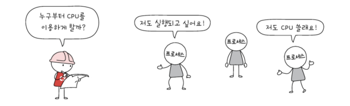

## 프로세스 우선순위
CPU를 사용하고 싶어하는 프로세스들이 차례로 돌아가며 CPU를 이용하는 방법도 있지만 좋은 방법이 아님 => 프로세스마다 우선순위가 있기 때문

우선순위가 높은 프로세스 ex: 입출력 작업이 많은 프로세스

대부분의 프로세스들은 CPU와 입출력장치를 모두 사용하며 실행 됨. 즉 프로세스는 실행 상태와 대기 상태를 반복하며 실행됨.\
ex) 워드 프로세서는 CPU를 사용하여 명령어를 실행하고, 사용자로부터 입력받은 내용을 보조기억장치에 저장하고, CPU를 사용하여 명령어를 실행하고, 사용자가 입력한 내용을 화면에 출력하는 과정을 반복하며 실행됨\
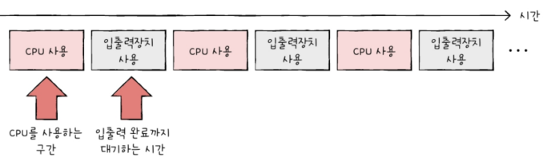

프로세스 종류마다 입출력 장치를 이용하는 시간과 CPU를 이용하는 시간의 양에 차이가 있음\
**입출력 집중 프로세스**: 비디오 재생이나 디스크 백업 작업을 담당하는 프로세스와 같이 입출력 작업이 많은 프로세스. 실행 상태 < (입출력을 위한)대기 상태\
**CPU 집중 프로세스**: 복잡한 수학 연산, 컴파일, 그래픽 처리 작업을 담당하는 프로세스와 같이 CPU 작업이 많은 프로세스. 실행 상태 > (입출력을 위한)대기 상태\

CPU 집중 프로세스와 입출력 집중 프로세스가 동시에 CPU 자원을 요구했을 경우 입출력 집중 프로세스를 가능한 한 빨리 실행시켜 입출력장치를 끊임없이 작동시키고, 그 다음 CPU 집중 프로세스에 집중적으로 CPU를 할당하는 것이 더 효율적임.(입출력 장치가 작업을 완료하기 전까지 입출력 집중 프로세스는 대기 상태가 될 예정이기 때문에)

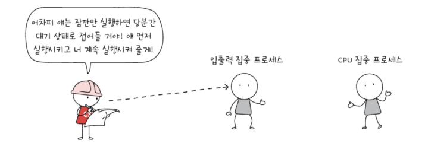

운영체제는 각 프로세스의 PCB에 우선순위를 명시하고 PCB에 적힌 우선순위를 기준으로 먼저 처리할 프로세스를 결정함.\
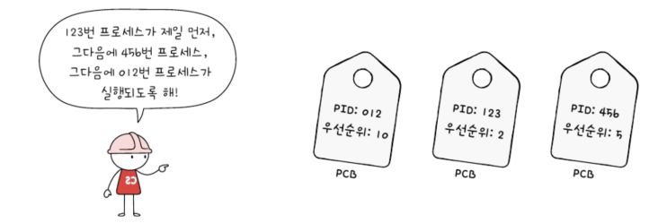

## 스케줄링 큐
운영체제가 우선순위를 확인하기 위해 일일이 모든 프로세스의 PCB를 뒤적거리는 것은 비효율적. CPU 이외의 자원을 이용할 경우에도 마찬가지.\
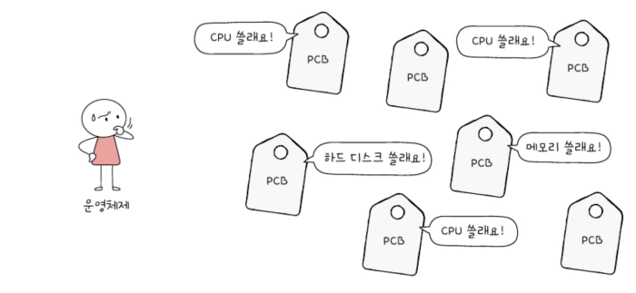

=> 운영체제는 프로세스들에 '줄을 서서 기다릴 것'을 요구함. 이 줄을 `스케줄링 큐`로 구형하고 관리
> 스케줄링 큐는 반드시 선입선출 방식일 필요는 없음

운영체제는 메모리로 적재되고 싶은(새로 생성되는) 프로세스들을 큐에 삽입하여 줄을 세우고, CPU를 이용하고 싶은 프로세스와 특정 입출력 장치를 이용하고 싶은 프로세스들 역시 큐에 삽입하여 줄을 세움\
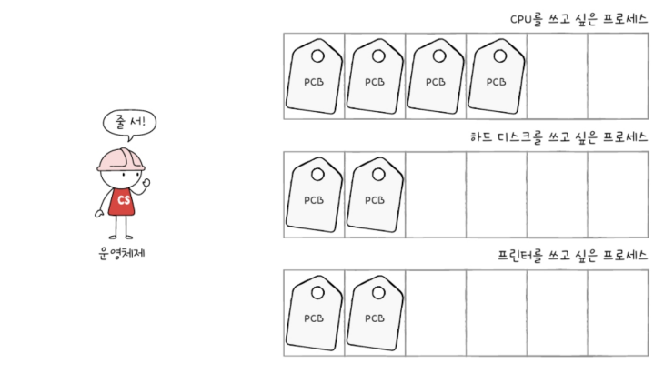

준비 큐: CPU를 이용하고 싶은 프로세스들이 서는 줄\
대기 큐: 입출력장치를 이용하기 위해 대기 상태에 접어든 프로세스들이 서는 줄을 의미

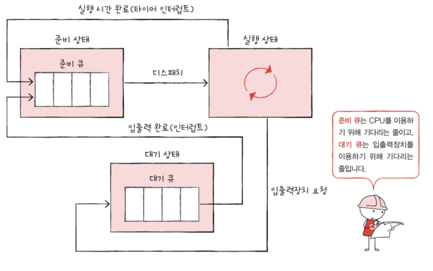

준비 상태에 있는 프로세스들의 PCB는 준비 큐의 마지막에 삽입되어 CPU를 사용할 차례를 기다림. 운영체제는 큐에 삽입된 순서대로 프로세스를 하나씩 꺼내어 실행하되 우선순위가 높은 프로세스를 먼저 실행함\

대기 상태에 있는 프로세스도 마찬가지. 입출력이 완료되어 완료 인터럽트가 발생하면 운영체제는 대기 큐에서 작업이 완료된 PCB를 찾고, 이 PCB를 준비 상태로 변경한 뒤 대기 큐에서 제거함. 그 후 해당 PCB는 준비 큐로 이동\
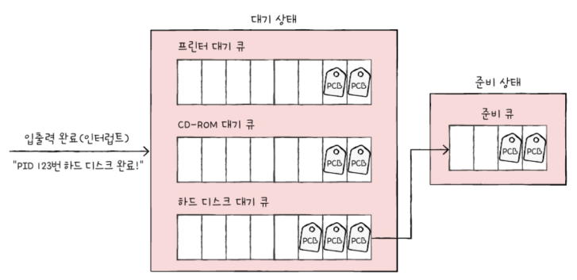

전체 구조\
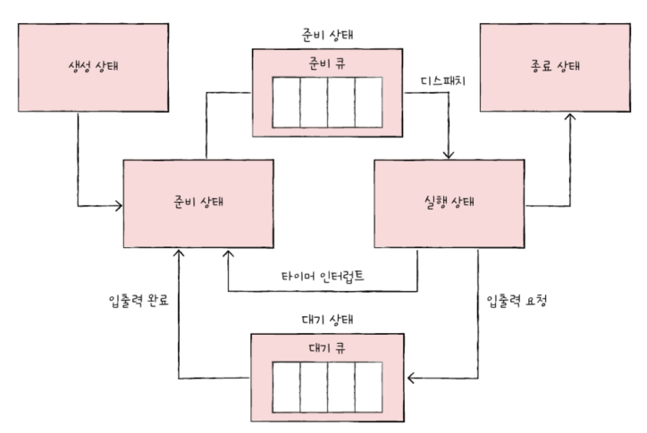

## 선점형과 비선점형 스케줄링
어떤 프로세스가 CPU를 이용하는 도중 갑자기 다른 급한 프로세스가 CPU를 지금 당장 사용하길 요청할 경우\
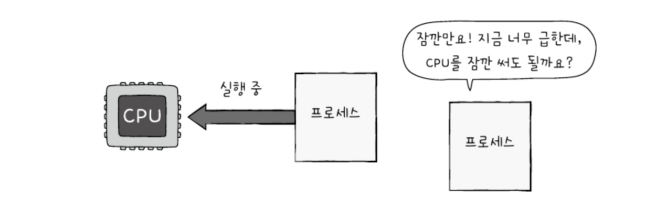\

방법1: 선점형 스케줄링_CPU를 사용중인 프로세스로부터 CPU 자원을 빼앗아 다른 프로세스에 할당\
방법2: 비선점형 스케줄링_CPU를 사용중인 프로세스의 작업이 끝날 때까지 다른 급한 프로세스를 기다리게 하는 방법

선점형 스케줄링은 운영체제가 프로세스로부터 자원을 강제로 빼앗아 다른 프로세스에 할당할 수 있는 스케줄링 방식이므로 어느 하나의 프로세스가 자원 사용을 독점할 수 없는 스케줄링 방식임.(지금까지 설명한 스케줄링 방식은 선점형 방식)\
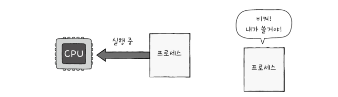

그렇기에 선점형과 반대인 비선점형 스케줄링은 하나의 프로세스가 자원 사용을 독점할 수 있는 스케줄링 방식임.\
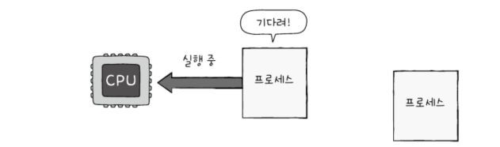

대부분의 운영체제는 선점형 스케줄링 방식을 차용하고 있음.\

| | 선점형 스케줄링 | 비선점형 스케줄링 |
| :-: | :--: | :--: |
|장점| 어느 한 프로세스의 자원 독점을 막고 프로세스들에 골고루 자원 배분이 가능 | 문맥 교환에서 발생하는 오버헤드가 선점형보다 적음 |
|단점| 문맥 교환 과정에서 오버헤드가 발생할 수 있음 | 모든 프로세스가 골고루 자원을 사용할 수 없음 |

# 11-2. CPU 스케줄링 알고리즘
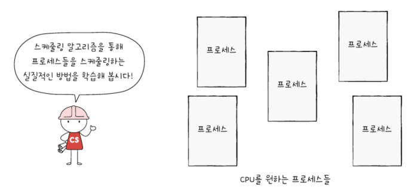
## 스케줄링 알고리즘의 종류
### 선입 선처리 스케줄링(FCFS 스케줄링)
준비 큐에 삽입된 순서대로 프로세스들을 처리하는 비선점형 스케줄링 방식\
즉 CPU를 먼저 요청한 프로세스부터 CPU를 할당하는 스케줄링 방식.

때때로 프로세스들이 기다리는 시간이 매우 길어질 수 있다는 점에서 부작용이 있는 방식.\
가령 17ms 동안 CPU를 이용하는 프로세스 A, 5ms 동안 CPU를 이용하는 프로세스 B, 2ms 동안 CPU를 이용하는 프로세스 C가 차례로 준비 큐에 삽입된다면 프로세스는 2ms를 실행하기 위해 22ms(17ms + 5ms)라는 시간을 기다려야 함 => 이러한 형상을 `호위 효과`라고 함\
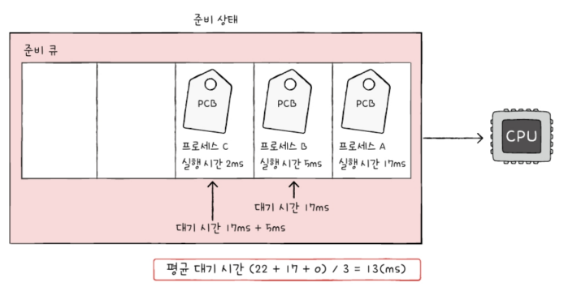

### 최단 작업 우선 스케줄링(SJF 스케줄링)
호위 효과를 막기 위해 준비 큐에 삽입된 프로세스들 중 CPU 이용 시간의 길이가 가장 짧은 프로세스부터 실행하는 스케줄링 방식.\
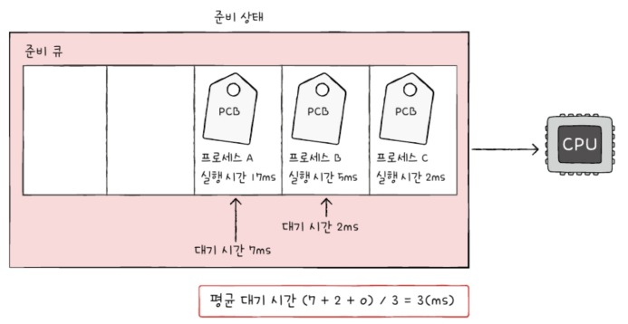

기본적으로 비선점형 스케줄링 알고리즘으로 분류되지만, 선점형으로 구현될 수도 있음(최소 잔여 시간 우선 스케줄링)

### 라운드 로빈 스케줄링
선입 선처리 스케줄링에 타임 슬라이스라는 개념이 더해진 스케줄링 방식.\
`타임 슬라이스`: 각 프로세스가 CPU를 사용할 수 있는 정해진 시간을 의미

즉 라운드 로빈 스케줄링은 정해진 타임 슬라이스만큼의 시간 동안 돌아가며 CPU를 이용하는 선점형 스케줄링\

큐에 삽입된 프로세스들은 순서대로 CPU를 이용하되 정해진 시간만큼만 이용하고, 정해진 시간 안에 프로세스가 완료되지 않을 경우 다시 큐의 맨 뒤에 삽입됨(이때 문맥 교환 발생)

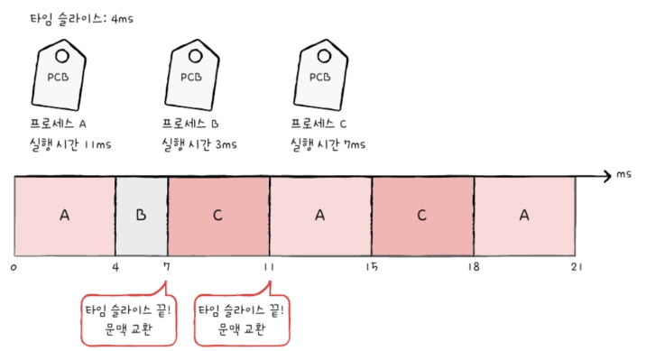

타임 슬라이스 크기가 중요함\
↳ 타임 슬라이스가 지나치게 크면 사실상 선처리 스케줄링과 다를 바 없어 호위 효과가 생길 여지가 있고, 지나치게 작으면 문맥 교환이 발생하는 비용이 커 CPU는 프로세스를 처리하는 일보다 프로세스 전환하는 데에 힘을 쓰게 되기 때문에

### 최소 잔여 시간 우선 스케줄링(SRT 스케줄링)
최단 작업 우선 스케줄링 알고리즘 + 라운드 로빈 알고리즘

최소 잔여 시간 우선 스케줄링 하에서 프로세스들은 정해진 타임 슬라이스만큼 CPU를 사용하되, CPU를 사용할 다음 프로세스는 남아있는 작업 시간이 가장 적은 프로세스가 선택 됨

### 우선순위 스케줄링
프로세스들에 우선순위를 부여하고, 가장 높은 우선순위를 가진 프로세스부터 실행하는 스케줄링 알고리즘\
> 우선순위가 같은 프로세스들은 선입 선처리로 스케줄링 됨

최단 작업 우선 스케줄링, 최소 잔여 시간 우선 스케줄링 알고리즘은 넓은 의미에서 우선순위 스케줄링의 일종으로 볼 수 있음. (전자는 작업 시간이 짧은 프로세스에 높은 우선순위 부여, 후자는 남은 시간이 짧은 프로세스에 높은 우선순위 부여)

다만 우선순위가 낮은 프로세스는 준비 큐에 먼저 삽입되었음에도 불구하고 우선순위가 높은 프로세스들에 의해 실행이 계속 연기될 수 있음 => 이를 `기아`현상 이라고 함\
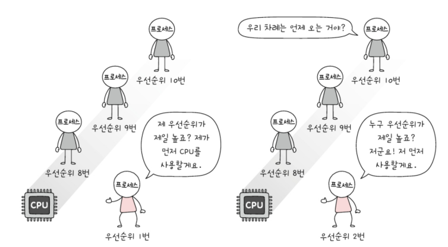

`에이징`: 오랫동안 대기한 프로세스의 우선순위를 점차 높이는 방식(기아현상을 방지하기 위한 기법)\
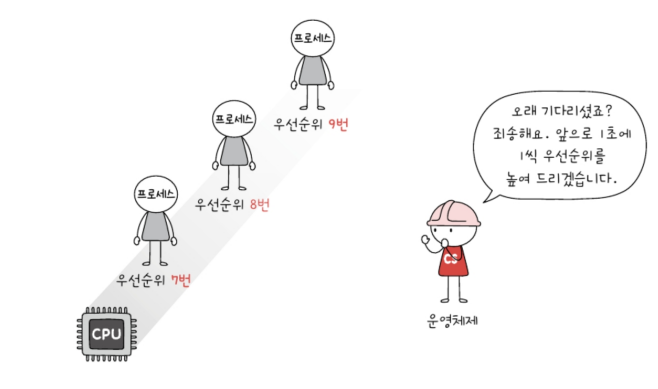

### 다단계 큐 스케줄링
우선순위 스케줄링의 발전된 형태\
우선순위별로 준비 큐를 여러 개 사용하는 스케줄링 방식. 다단계 큐 스케줄링 하에서는 우선순위가 가장 높은 큐에 있는 프로세스들을 먼저 처리하고, 우선순위가 가장 높은 큐가 비어있으면 그 다음 우선순위 큐에 있는 프로세스들을 처리함

아래 그림으로 보면 우선순위 0, 1, 2에 삽입된 프로세스들 순서대로 CPU를 할당받아 실행됨\
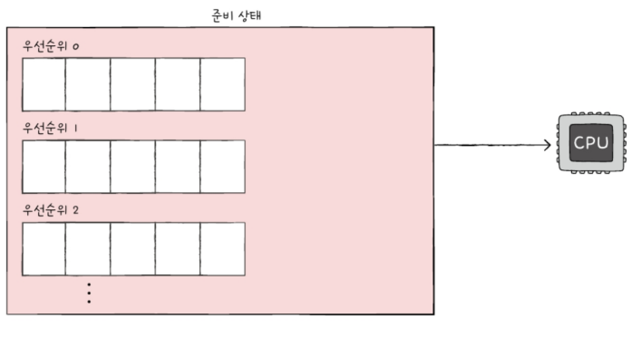

큐를 여러 개 두면 프로세스 유형별로 우선순위를 구분하여 실행하는 것이 편리해짐. 또 큐별로 타임 슬라이스를 여러 개 지정할 수도 있고, 큐마다 다른 스케줄링 알고리즘을 사용할 수도 있음.

### 다단계 피드백 큐 스케줄링
다단계 큐 스케줄링의 발전된 형태\
다단계 큐 스케줄링에서는 프로세스들이 큐 사이를 이동할 수 없음 => 우선순위가 낮은 프로세스는 계속 연기될 수 있음(즉, 기아 현상이 발생할 수 있음)

이를 보완한 스케줄링 알고리즘: `다단계 피드백 큐 스케줄링`

다단계 피드백 큐 스케줄링에서 새로 준비 상태가 된 프로세스가 있다면 우선 우선순위가 가장 높은 우선순위 큐에 삽입되고 일정 시간(타임 슬라이스) 동안 실행됨\
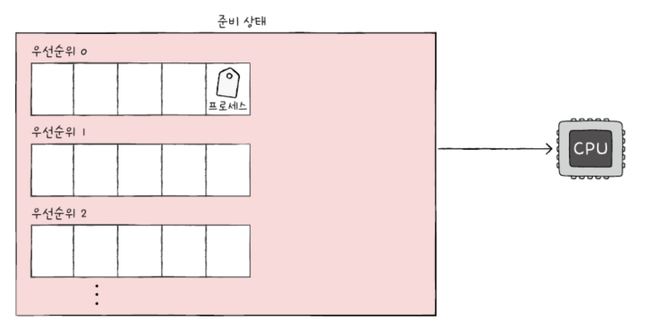

만약 프로세스가 해당 큐에서 실행이 끝나지 않는다면 다음 우선순위 큐에 삽입되어 실행됨. 이 과정을 반복하다보면 결국 CPU를 오래 사용해야 하는 프로세스는 점차 우선순위가 낮아짐\
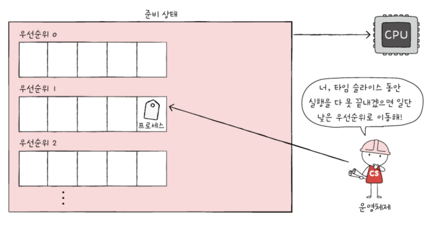

즉, CPU를 비교적 오래 사용해야 하는 CPU 집중 프로세스들은 자연스레 우선순위가 낮아지고, 입출력 집중 프로세스들은 우선순위가 높은 큐에서 실행이 끝남

다단계 피드백 큐 스케줄링은 낮은 우선순위 큐에서 너무 오래 기다리고 있는 프로세스가 있다면 점차 우선순위가 높은 큐로 이동시키는 에이징 기법을 적용하여 기아 현상을 예방할 수 있음\
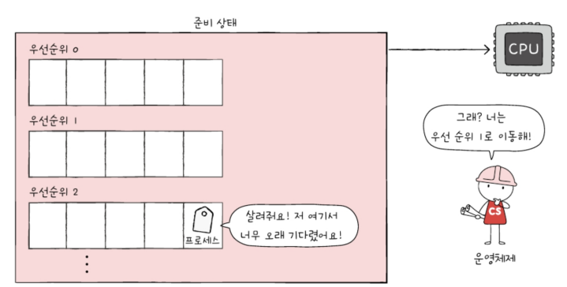

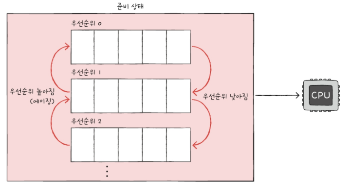

---

## 📖

Q1. 입출력 집중 프로세스와 CPU 집중 프로세스에 대해 간략하게 설명하고 두 프로세스 중 어떤 프로세스의 우선순위가 높은지 말하시오.

A1. 입출력 집중 프로세스는 비디오 재생이나 디스크 백업 작업을 담당하는 프로세스와 같이 입출력 작업이 많은 프로세스이고, CPU 집중 프로세스는 복잡한 수학 연산, 컴파일, 그래픽 처리 작업을 담당하는 프로세스와 같이 CPU 작업이 많은 프로세스이다. 입출력 집중 프로세스는 실행 상태보다 입출력을 위한 대기 상태에 더 많이 머무르게 되고 이와 반대로 CPU 집중 프로세스는 대기 상태보다는 실행상태에 더 많이 머무르게 되어 일반적으로 실행상태가 짧은 입출력 집중 프로세스가 CPU 집중 프로세스보다 우선순위가 높다.

Q2. 어떤 프로세스가 CPU를 이용하는 도중 갑자기 다른 급한 프로세스가 CPU를 지금 당장 사용하길 요청할 경우 해결 방법 2가지와 각각의 장단점에 대해 설명하시오.

A2. 문제 상황의 경우 CPU를 이용중인 프로세스에게서 CPU 자원을 빼앗아 급한 프로세스에게 할당할 수 있는 선점형 스케줄링 방식이 있고, CPU를 사용중인 프로세스의 CPU 사용이 전부 끝날 때까지 기다리는 비선점형 스케줄링 방식이 있다. 선점형 스케줄링의 경우 더 급한 프로세스가 언제든 끼어들어 사용할 수 있는 스케줄링 방식이기 때문에 어느 한 프로세스의 자원 독점을 막고 프로세스들에 골고루 자원을 배분할 수 있다는 장점이 있지만 문맥 교환 과정에서 오버헤드가 발생할 수 있다는 단점이 있다. 반대로 비선점형 프로세스의 경우 문맥 교환에 의해 발생하는 오버헤드는 선점형 스케줄링보다 적다는 장점이 있지만 모든 프로세스가 골고루 자원을 사용할 수 없다는 점에서 단점이 있다.

Q3. 우선순위 스케줄링에 의해 발생할 수 있는 현상에 대해 설명하고 이러한 현상을 방지하기 위한 기법에 대해 설명하시오.

A3. 우선순위 스케줄링은 우선순위가 높은 프로세스들을 우선적으로 처리하다보니 우선순위가 낮은 프로세스들은 계속해서 실행이 연기되는 기아 현상이 발생할 수 있다. 이러한 현상을 방지하기 위한 대표적인 기법으로는 오랫동안 대기한 프로세스의 수선순위를 점차 증가시키는 에이징 기법이 있다.