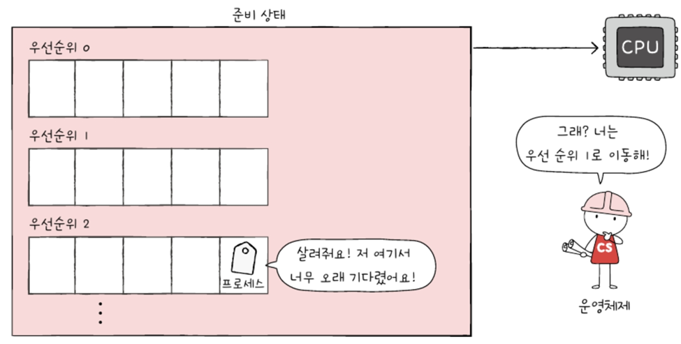

# Ch.11 CPU 스케줄링
- `CPU 스케줄링(CPU Scheduling)` : OS가 프로세스들에게 공정하고 합리적으로 CPU 자원 배분

# 11-1. CPU 스케줄링 개요
## 프로세스 우선순위
순서대로? NO!
Why? 프로세스마다 `우선순위`가 다르기 때문

- 대부분의 프로세스들은 CPU와 IO장치 모두 사용하며 실행 -> 프로세스는 실행 상태와 대기상태 반복하며 실행
    

**프로세스 종류마다 IO장치 이용하는 시간과 CPU 이용하는 시간의 양에는 차이 有**
### 1. 입출력 중심 프로세스(I/O bound process)
   입출력 작업 많은 프로세스(= 입출력 버스트가 많은 프로세스)
   ex) 비디오 재생, 디스크 백업 작업 담당하는 프로세스
   - 실행상태 < 대기상태 더 많이 머무름
   
### 2. CPU 집중 프로세스(CPU bound process)
   CPU 작업 많은 프로세스(= CPU 버스트가 많은 프로세스)
   ex) 복잡한 수학 연산, 컴파일, 그래픽 처리 작업 담당하는 프로세스
    - 실행상태 > 대기상태 더 많이 머무름

- CPU 버스트(CPU burst) : CPU 이용하는 작업
    

=> 모든 프로세스가 CPU 차례대로 돌아가며 사용하는 것보다 각각의 상황에 맞게 CPU를 배분하는 것이 더 효율적

=> `우선순위(priority)` 부여 
    프로세스의 중요도에 맞게 프로세스가 CPU 이용할 수 있도록 하기 위해서 프로세스마다 우선순위 부여
    - OS는 각 프로세스의 PCB에 우선순위 명시
    - PCB에 적힌 우선순위 기준으로 먼저 처리할 프로세스 결정
    - 자연스레 우선순위 높은 프로세스는 더 빨리, 더 자주 실행
  
- PCB(Process Control Block) : OS가 프로세스 제어하기 위해 정보 저장하는 공간(프로세스의 상태 정보 저장)
  
## 스케줄링 큐(scheduling queue)
- OS는 프로세스들에게 줄 서게
  - CPU 사용하고 싶은 프로세스들 / 메모리 적재되고 싶은 프로세스들 / 특정 IO장치 사용하고 싶은 프로세스들
- PCB에 우선순위 적혀 있어도, CPU를 사용할 다음 프로세스 찾으려고 OS가 일일이 모든 프로세스의 PCB 뒤적거리는 것은 `비효율적`

<참고>
- 큐는 자료구조 관점 - FIFO
- 스케줄링에서의 큐 - 반드시 FIFO X
  
### 준비 큐(ready queue)
CPU 이용하고 싶은 프로세스들이 서는 줄

### 대기 큐(waiting queue)
입출력장치 이용하기 위해 대기 상태 접어든 프로세스들이 서는 줄

### 선점형 스케줄링(preemptive scheduling)
프로세스가 CPU 비롯한 자원 사용하고 있더라도 OS가 프로세스로부터 자원 강제로 빼앗아 다른 프로세스에 할당할 수 있는 스케줄링 방식
-> 어느 하나의 프로세스가 자원 사용 독점X

- 대부분 OS는 선점형 스케줄링 방식 차용
- 어느 한 프로세스의 자원 독점 막고 골고루 자원 배분
- 그만큼 문맥 교환 과정에서 오버 헤드 발생할수도

### 비선점형 스케줄링(non-preemptive scheduling)
하나의 프로세스가 자원 사용하고 있다면 그 프로세스가 종료되거나 스스로 대기 상태 접어들기 전까진 다른 프로세스가 끼어들 수 없는 스케줄링 방식
-> 하나의 프로세스가 자원 사용 독점 가능

- 문맥 교환에서 발생하는 오버헤드는 선점형 보다 적음
- 모든 프로세스가 골고루 자원 사용X

# 11-2. CPU 스케줄링 알고리즘
각 스케줄링 알고리즘의 `아이디어`에 집중!(용어X)

## 1. 선입 선처리 스케줄링(FCFS scheduling; First Come First Served Scheduling)
- 준비 큐에 삽입된 순서대로 프로세스 처리
- 비선점형 스케줄링 방식
- 단점) 가장 공정해 보이지만, 때때로 프로세스들이 기다리는 시간이 매우 길어질 수 있음
- **호위 효과(convoy effect)** : 무작정 기다릴수밖에😭

## 2. 최단 작업 우선 스케줄링(SJF scheduling; Shortest Job First Scheduling)
- CPU 사용 시간이 긴 프로세스는 나중에, CPU 사용 시간이 짧은 프로세스 먼저 실행
- 비선점형

## 3. 라운드 로빈 스케줄링(Round Robin scheduling)
- 선입 선처리 + 타임 슬라이스
- **타임 슬라이스** : 각 프로세스가 CPU 사용할 수 있는 정해진 기간
- 정해진 타임 슬라이스만큼 시간 동안 돌아가며 CPU 이용
- 선점형

  삽입된 순서대로 CPU 이용하되, 정해진 시간만큼 CPU 이용
  정해진 시간 모두 사용했는데도 아직 프로세스 완료X -> 큐의 맨 뒤에 삽입(이 때 `문맥 교환` 발생!)
- 타임 슬라이스 크기 매우 중요
  - 지나치게 크면 FCFS랑 다를 바가 없어 호위 효과 생길 수도
  - 지나치게 작으면 문맥 교환 발생 비용이 더 커 CPU는 프로세스 처리하는 일보다 프로세스 전환에 더 힘 쓸 수도

## 4. 최소 잔여 시간 우선 스케줄링(SRT scheduling; Shortest Remaining Time)
- SJF + Round Robin
- 선점형 최단 작업 우선 스케줄링
- 정해진 타임 슬라이스만큼 CPu 사용하되, CPU 사용할 다음 프로세스는 남아있는 작업 시간 가장 적은 프로세스가 선택

## 5. 우선순위 스케줄링(priority scheduling)
- 프로세스들에 우선순위 부여, 가장 높은 우선순위 가진 프로세스부터 실행
- 우선순위 같을 때는 FCFS로 처리
- **기아(starvation) 현상** : 우선순위가 낮은 프로세스는 준비 큐에 먼저 삽입되었어도 더 높은 프로세스들에 의해 실행 계속 연기
    
- 이를 방지 -> **에이징(aging)** : 오랫동안 대기한 프로세스의 우선순위 점차 높이기
    
## 6. 다단계 큐 스케줄링(multilevel queue scheduling)
- 우선순위별로 준비 큐 여러 개 사용하는 스케줄링 방식
- 큐를 여러 개 두면 프로세스 유형별로 우선순위 구분하여 실행하는 것이 편리해짐
- 큐별로 타임 슬라이스 여러 개 지정할 수도
- 큐별로 다른 스케줄링 아로리즘 사용할 수도
- 단, 프로세스들이 큐 사이 이동X -> 기아 현상

## 7. 다단계 피드백 큐 스케줄링(multilevel feedback queue scheduling)
- 다단계 큐 스케줄링과 비슷
- 하지만! `프로세스들이 큐 사이 이동 가능`
- 새로 준비 상태가 된 프로세스가 있다면 우선 순위가 가장 높은 우선순위 큐에 삽입, 일정 시간(타임 슬라이스) 동안 실행
- 프로세스가 해당 큐에서 실행 끝나지 않으면, 다음 우선순위 큐에 삽입되어 실행되는 식으로 -> `CPU 오래 사용해야 하는 프로세스는 점차 우선순위 낮아짐`
- **CPU 비교적 오래 사용해야 하는 CPU 집중 프로세스들은 자연스레 우선순위 낮아지고, CPu 비교적 적게 사용하는 입출력 집중 프로세스들은 자연스레 우선순위 높은 큐에서 실행이 끝남**
    
- 에이징 기법을 통해 기아 현상 예방
    
- 요약) 어떤 프로세스의 CPU 이용 시간 길면 낮은 우선순위 큐로 이동, 어떤 프로세스가 낮은 우선순위 큐에서 너무 오래 기다리면 높은 우선순위 큐로 이동시킬 수 있는 알고리즘 -> 가장 일반적인 CPU 스케줄링 알고리즘
    

---
# Question
## 1. 선점형 스케줄링과 비선점형 스케줄링의 차이점을 설명하고, 각각의 장단점?
선점형 스케줄링과 비선점형 스케줄링의 가장 큰 차이는 운영체제가 실행 중인 프로세스의 자원을 강제로 회수할 수 있는가의 차이가 있습니다.
선점형 스케줄링에서는 운영체제가 필요에 따라 프로세스로부터 CPU를 강제로 빼앗아 다른 프로세스에 할당할 수 있습니다. 이는 자원의 독점을 막고 골고루 배분할 수 있다는 장점이 있지만, 잦은 문맥 교환으로 인한 오버헤드가 발생할 수 있죠. 반면 비선점형 스케줄링에서는 프로세스가 자발적으로 CPU를 반납하기 전까지는 계속 사용할 수 있습니다. 이는 문맥 교환 오버헤드는 적지만, 한 프로세스가 CPU를 독점하면서 다른 프로세스들의 대기 시간이 길어질 수 있다는 단점이 있습니다.

## 2. 라운드 로빈 스케줄링에서 타임 슬라이스의 크기가 왜 중요한가요? 너무 크거나 작을 때의 문제점은?
라운드 로빈 스케줄링에서 타임 슬라이스의 크기는 전체 시스템의 성능에 직접적인 영향을 미치기 때문에 매우 중요합니다. 타임 슬라이스가 너무 크면 FCFS처럼 동작하면서 호위 효과가 발생할 수 있고 반대로 너무 작으면 잦은 문맥 교환으로 인한 오버헤드가 커져서 CPU가 실제 프로세스 처리보다 문맥 교환에 더 많은 시간을 쓰게 됩니다.
따라서 적절한 크기의 타임 슬라이스가 중요합니다.

## 3. 다단계 피드백 큐 스케줄링에서 기아 현상을 어떻게 해결하는지 설명
다단계 피드백 큐 스케줄링에서는 에이징이라는 기법을 통해 기아 현상을 해결합니다. 기아 현상이란 우선순위가 낮은 프로세스들이 계속해서 실행이 미뤄지는 현상을 말하는데요. 이를 해결하기 위해 특정 프로세스가 낮은 우선순위 큐에서 오래 대기하고 있다면, 점진적으로 우선순위를 높여 상위 큐로 이동시킵니다. 이렇게 하면 결과적으로 모든 프로세스들이 언젠가는 반드시 실행될 수 있게 됩니다.