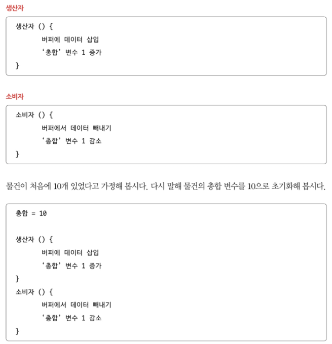
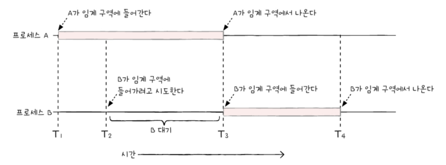
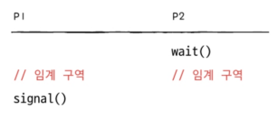
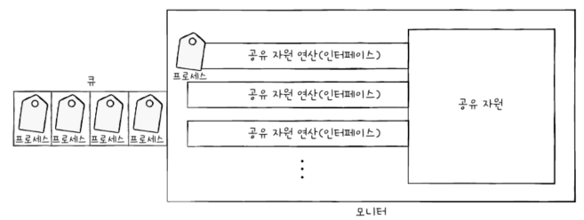
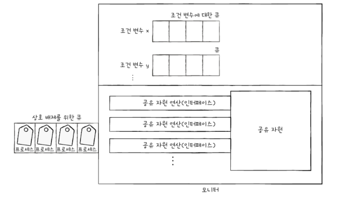
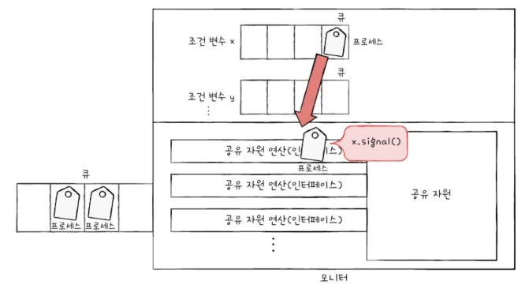

# Chapter 12. 프로세스 동기화
- [Chapter 12. 프로세스 동기화](#chapter-12-프로세스-동기화)
- [12-1. 동기화란](#12-1-동기화란)
  - [동기화의 의미](#동기화의-의미)
  - [상호 배제를 위한 동기화](#상호-배제를-위한-동기화)
    - [생산자와 소비자 문제](#생산자와-소비자-문제)
    - [공유 자원과 임계 구역](#공유-자원과-임계-구역)
    - [해결 방법/원칙(3)](#해결-방법원칙3)
- [12-2. 동기화 기법](#12-2-동기화-기법)
  - [뮤텍스 락](#뮤텍스-락)
  - [세마포](#세마포)
  - [모니터](#모니터)
- [Q\&A](#qa)

---

# 12-1. 동기화란

- 각기 다른 독립적인 프로세스지만 공동의 목표를 위해 서로 데이터를 주고받으며 협력

## 동기화의 의미

- 특정 자원에 접근할 때 한 개의 프로세스만 접근하게 하거나, 프로세스를 올바른 순서대로 실행하게 하는 것 ⇒ 수행 시기 맞추기
    - 실행 순서 제어 : 올바른 순서대로 실행
    - 상호 배제 : 동시에 접근하면 안 되는 자원에 하나만 접근하게 하기
    - **실행의 흐름**을 갖는 모든 것은 **동기화 대상**!

## 상호 배제를 위한 동기화

### 생산자와 소비자 문제

- 생산자 : 물건 계속 생산
- 소비자 : 물건 계속 소비



‘총합’이라는 데이터 공유 ⇒ 총합 변수가 10일 거라 예측하지만 실제로는 다른 수 또는 오류 발생

- 생산자와 소비자가 제대로 동기화 되지 않음
    - 소비자가 생산자의 작업 끝나기 전에 총합 수정
    - 생산자가 소비자의 작업 끝나기 전에 총합 수정

### 공유 자원과 임계 구역

- **공유 자원** : 공동으로 이용하는 자원(변수, 파일, 장치 등)
- **임계 구역** : 공유 자원에 접근하는 코드 중 동시에 실행하면 문제가 발생하는 코드 영역



두 개 이상의 프로세스/스레드가 임계 구역에 진입하려고 하면 둘 중 하나는 대기

- **레이스 컨디션(race condition)** : 잘못된 실행으로 인해 여러 프로세스/스레드가 **동시 다발적으로 임계 구역의 코드 실행**해 문제 발생 ⇒ 데이터 일관성 깨짐
    - **저급 언어 실행**하는 과정에서 **문맥 교환** 일어나면 발생
        - 컴퓨터는 고급 언어가 저급 언어로 변환되어 실행
        - 여러 줄의 저급 언어로 변환된 고급 언어 한 줄을 실행하는 과정에서 문맥 교환 일어날 수 있음

### 해결 방법/원칙(3)

1. 상호 배제 
    - 한 프로세스가 임계 구역에 진입했다면 다른 프로세스는 들어올 수 없음
2. 진행
    - 임계 구역에 어떤 프로세스도 진입하지 않았다면 임계 구역에 진입하고자 하는 프로세스는 들어갈 수 있어야 함
3. 유한 대기
    - 한 프로세스가 임계 구역에 진입하고 싶다면 언젠가는 들어올 수 있어야 함(무한정 대기 안 됨)

# 12-2. 동기화 기법

## 뮤텍스 락

- 상호 배제를 위한 동기화 도구 (공유 자원이 하나일 )
- 구현 형태
    - lock 함수 : 자물쇠 역할
        - 전역 변수
    - acquire 함수 : 임계 구역 잠그는 역할
        - 프로세스가 임계 구역에 진입하기 전까지 호출하는 함수
        - 잠겨 있다면 열릴 때까지 반복적으로 확인, 열려 있다면 잠금
    - release 함수 : 임계 구역 잠금 해제하는 역할
        - 임계 구역에서 작업 끝나고 호출하는 함수
        - 현재 잠긴 임계 구역을 열어주는 함수
    
    ```tsx
    acquire() {
    	while (lock == true) /* 만약 임계 구역이 잠겨 있다면*/
    		;                  /* 임계 구역 잠겨 있는지 반복적으로 확인 => 바쁜 대기 */
    	lock = true;         /* 만약 임계 구역이 잠겨 있지 않다면 임계 구역 잠금 */
    }
    
    release() {
    	lock = false;        /* 임계 구역 작업 끝났으니 잠금 해제 */
    }
    ```
    

<aside>
📢

임계 구역 진입할 수 **없**다면? 무작정 기다리기

임계 구역 진입할 수 **있**다면? 임계 구역 **잠그기** → 임계 구역에서 작업 **진행** → 끝나면 임계 구역 잠금 **해제**

```tsx
acquire(); // 자물쇠 잠겨 있는지 확인, 잠겨 있지 않으면 잠그고 들어가기
// 임계 구역에서의 작업 진행
release(); // 자물쇠 반환
```

</aside>

- 단점
    
    사용할 수 있는 공유 자원 없을 땐? 임계 구역이 잠겨있는지 무한히 반복하며 확인 ⇒ CPU 주기 낭비 
    

## 세마포

- 구현 형태
    - 전역 변수 S : 사용 가능한 공유 자원 개수
    - wait 함수 : 임계 구역에 들어가도 되는지, 기다려야 하는지 알려주는 함수
    - signal 함수 : 임계 구역 앞에서 기다릴 때 들어가도 된다고 신호 주는 함수
    - 상호 배제를 위한 동기화
        
        ```tsx
        wait () {
        	if (S < 0) {
        		add this process to Queue; /* 해당 프로세스 PCB를 대기 큐에 삽입 */
        		sleep();                   /* 대기 상태로 접어*/ 
        		}
        }
        
        signal() {
        	S++
        	if (S <= 0) {
        		remove a process p from Queue /* 대기 큐에 있는 프로세스 p 제거*/
        		wakeup(p)                     /* 프로세스 p를 대기 상태에서 준비 상태로 만듦 */ 
        ```
        
    - 실행 순서 제어를 위한 동기화
        
        
        
- 단점
    
    매번 wait, signal 함수 명시 번거로움, 순서 헷갈리거나 중복해 사용할 수 있음
    

## 모니터

- 공유 자원과 접근 위한 통로(인터페이스) 묶어 관리
- 프로세스는 반드시 통로 통해서 접근
- 상호 배제를 위한 동기화
    - 큐 : 모니터에 한 번에 하나의 프로세스만 진입하도록 하기 위해 만듦



모니터를 통해 공유 자원에 접근하려는 프로세스를 큐에 삽입하고, 삽입 순서대로 공유 자원 이동

- 실행 순서 제어를 위한 동기화
    - 조건 변수 사용 : wait, signal
        - wait : 호출한 프로세스 상태를 대기 상태로 전환, 일시적으로 조건 변수에 대한 대기 큐에 삽입하는 연산
        - signal : wait 호출해 큐에 삽입된 프로세스 실행을 재개하는 연산
            - 큐 : 모니터에 이미 진입한 프로세스의 실행 조건이 만족할 때까지 잠시 실행이 중단되어 기다리기 위해 만듦
        
        
        
        - 모니터에 진입한 프로세스가 조건 변수 x에 대해 wait 호출했다고 가정
            - 해당 프로세스는 조건 변수 x에 대한 큐에 삽입
            - 비워진 모니터에 다른 프로세스 들어옴
            - wait 연산으로 일시 중지된 프로세스는 다른 프로세스의 signal 연산 통해 모니터 안으로 들어옴
            - wait를 호출했던 프로세스는 signal을 호출한 프로세스가 모니터를 떠난 뒤에 실행되거나 signal을 호출한 프로세스의 실행을 일시 중단하고 자신이 실행된 뒤 다시 수행 재개
            
            
            
    
    <aside>
    📢
    
    특정 프로세스가 아직 **실행될 조건이 되지 않았을 땐**? **wait** 통해 실행 중단
    
    특정 프로세스가 **실행될 조건이 충족**되었을 땐?  **signal** 통해 실행 재개 
    
    </aside>
    

# Q&A

1. **동기화란 무엇인가요?**
2. **상호 배제를 위한 동기화를 해결하기 위한 방법은 무엇인가요?**
3. **동기화 기법 세 가지를 간략히 말해보시오.**

- **1번 답**
    
    동기화란 실행 순서를 제어하거나 상호 배제하는 것을 말합니다. 여기서 실행 순서 제어란 프로세스 또는 스레드가 올바른 순서대로 실행하게 하는 것을 의미하며, 상호 배제란 동시에 접근하면 안 되는 자원에 하나만 접근할 수 있게 하는 것을 의미합니다. 이 때 실행의 흐름을 갖는 모든 것이 동기화 대상입니다.
    
- **2번 답**
    
    상호 배제, 진행, 유한 대기가 있습니다. 한 프로세스가 임계 구역에 진입했다면 다른 프로세스는 들어올 수 없고, 임계 구역에 어떤 프로세스도 진입하지 않았다면 임계 구역에 진입하고자 하는 프로세스는 들어갈 수 있어야 합니다. 또 한 프로세스가 임계 구역에 진입하고 싶다면 언젠가는 들어올 수 있어야 합니다.
    
- **3번 답**
    
    동기화 기법은 뮤텍스 락, 세마포, 모니터가 있습니다. 뮤텍스 락은 임계 구역을 잠금으로써 프로세스 간의 상호 배제를 이룹니다. 세마포는 공유 자원이 여러 개 있는 임계 구역 문제도 해결할 수 있는 동기화 도구입니다. 모니터는 세마포에 비해 사용자가 사용하기 편리한 도구로 조건 변수를 사용하는 동기화 기법입니다.