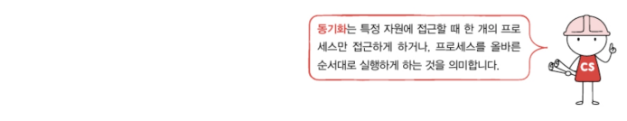

- [12-1. 동기화란](#12-1-동기화란)
    - [실행 순서 제어를 위한 동기화](#실행-순서-제어를-위한-동기화)
    - [상호 배제를 위한 동기화](#상호-배제를-위한-동기화)
  - [생산자와 소비자 문제](#생산자와-소비자-문제)
  - [공유 자원과 임계 구역](#공유-자원과-임계-구역)
- [12-2. 동기화 기법](#12-2-동기화-기법)
  - [뮤텍스 락](#뮤텍스-락)
  - [세마포](#세마포)
  - [모니터](#모니터)

# 12-1. 동기화란

동시다발적으로 실행되는 많은 프로세스는 서로 데이터를 주고 받으며 협력하며 실행될 수 있음.\
ex) 워드 프로세서에서 사용자로부터 입력을 받는 프로세스, 입력한 내용의 맞춤법을 검사하는 프로세스, 입력한 내용을 화면에 출력해 주는 프로세스 등

위와 같이 협력적으로 실행된는 프로세스들은 아무렇게나 마구 동시에 실행해서는 안 됨 => 동기화가 필수적

`프로세스 동기화`: 프로세스들 사이의 수행 시기를 맞추는 것\
즉,\
- 실행 순서 제어: 프로세스를 올바른 순서대로 실행하기
- 상호 배제: 동시에 접근해서는 안 되는 자원에 하나의 프로세스만 접근하게 하기
> 참고) 프로세스뿐만 아니라 스레드도 동기화 대상임

### 실행 순서 제어를 위한 동기화
ex) Writer 프로세스: Book.txt 파일에 값을 저장하는 프로세스\
Reader 프로세스: Book.txt 파일에 저장된 값을 읽어 들이는 프로세스

위의 프로세스가 동시에 실행중이라 가정\
\
두 프로세스는 무작정 아무 순서대로 실행되어서는 안됨. Writer 프로세스가 Book.txt에 값을 저장하기 전에 Reader 프로세스가 Book.txt를 읽는 것은 올바른 실행 순서가 아니기 때문. 즉, Reder 프로세스는 'Book.txt 안에 값이 존재한다'는 특정 조건이 만족되어야만 실행을 이어나갈 수 있음.

### 상호 배제를 위한 동기화
`상호 배제`: 공유가 불가능한 자원의 동시 사용을 피하기 위해 사용하는 알고리즘

ex) A: 현재 저축된 금액에 2만원을 넣는 프로세스, B: 현재 저축된 금액에 5만원을 넣는 프로세스\
계좌에 10만원이 저축된 상태.

프로세스 A, B 가 동시에 실행될 경우 아래처럼 엉뚱한 결과가 나올 수 있음(∵ A가 끝나기도 전에 B가 잔액을 읽어버렸기 때문)\

A와 B를 올바르게 실행하기 위해서는 한 프로세스가 잔액에 접근했을 때 다른 프로세스는 아래처럼 기다려야 함\

다시말해 동시에 접근해서 안 되는 자원에 동시에 접근하지 못하게 하는 것이 `상호 배제를 위한 동기화`이다.

## 생산자와 소비자 문제
물건을 계속해서 생산하는 프로세스인 생산자와 물건을 계속해서 소비하는 프로세스인 소비자로 이루어진 문제

생산자와 소비자는 '총합'이라는 데이터를 공유.

물건이 처음에 10개 있었다고 가정 후 생산자를 100,000번, 소비자를 100,000번 동시에 실행시키면 총합이 10이 아닌 다른 수가 되거나 오류를 마주할 수 있음. \
↳ 생산자 프로세스와 소비자 프로세스가 제대로 동기화되지 않았기 때문

생산자와 소비자는 '총합'이라는 데이터를 동시에 사용하는데, 소비자가 생산자의 작업이 끝나기도 전에 총합을 수정했고 생산자도 마찬가지로 소비자의 작업이 끝나기도 전에 총합을 수정했기 때문에 엉뚱한 결과 발생 => 동시에 접근해서는 안 되는 자원에 동시에 접근했기 때문에 발생한 문제

## 공유 자원과 임계 구역
`공유 자원`: 동시에 실행되는 프로세스들이 공동으로 사용하는 자원. (공유 자원이 될 수 있는 것들: 전역 변수, 파일, 입출력 장치, 보조기억 장치 등)

위의 예제에서는 '잔액'과 '총합'이라는 전역 변수가 공유 자원인 셈

이렇게 동시에 실행하면 문제가 발생하는 자원에 접근하는 코드 영역을 `임계 구역`이라 함

두 개 이상의 프로세스가 임계 구역에 진입하려하면 둘 중 하나는 대기해야 함\

`레이스 컨디션` : 잘못된 실행으로 인해 여러 프로세스가 동시 다발적으로 임계 구역의 코드를 실행하여 문제가 발생하는 경우

레이스 컨디션이 발생하면 계좌 잔액 문제나 생산자와 소비자 문제처럼 데이터의 일관성이 깨지는 문제가 발생

레이스 컨디션이 발생하는 근본적인 이유:\
고급언여를 저급 언어로 변환하면 여러 줄의 저급 언어로 변환 됨. 컴퓨터는 고급 언어가 아닌 저급 언어를 실행하기 때문에 여러 줄의 저급 언어로 변환된 고급 언어 한 줄을 실행하는 과정에서 문맥 교환이 일어날 수 있음.\

저급 언어를 실행하는 과정에서 문맥교환이 일어난다면 아래와 같은 문제가 발생\

상호 배제를 위한 동기화는 이와 같은 일이 발생하지 않도록 두 개 이상의 프로세스가 임계 구역에 동시에 접근하지 못하도록 관리하는 것을 의미.

임계 구역 문제를 위한 운영체제의 세 가지 원칙(=== 상호 배제를 위한 동기화를 위한 원칙)
- 상호 배제: 한 프로세스가 임계 구역에 진입했다면 다른 프로세스는 임계 구역에 들어올 수 없다.
- 진행: 임계 구역에 어떤 프로세스도 진입하지 않았다면 임계 구역에 진입하고자 하는 프로세스는 들어갈 수 있어야 함
- 유한 대기: 한 프로세스가 임계 구역에 진입하고 싶다면 그 프로세스는 언젠가는 임계 구역에 들어올 수 있어야 한다.(임계 구역에 들어오기 위해 무한정 대기해서는 안 된다.)

# 12-2. 동기화 기법
동기화를 위한 대표적인 도구: `뮤텍스 락`, `세마포`, `모니터`\

## 뮤텍스 락
임계 구역 문제와 이를 해결하기 위한 동기화를 옷 가게에서 탈의실을 이용하는 것에 비유해서 생각할 수 있음. 손님들은 탈의실이라는 자원을 이용하고 탈의실 안에는 손님 한 명씩만 들어올 수 있으니, 손님은 '프로세스', 탈의실은 '임계 구역'인 셈

이때 탈의실의 자물쇠가 걸려있냐 걸려있지 않냐에 따라 탈의실 이용 가능 유무를 알 수 있음

이러한 자물쇠 기능을 코드로 구현한 것 => `뮤텍스 락`\
뮤텍스 락은 동시에 접근해서는 안 되는 자원에 동시에 접근하지 않도록 만드는 도구, 즉 상호 배제를 위한 동기화 도구임

뮤텍스 락의 매우 단순한 형태는 하나의 전역 변수와 두 개의 함수로 구현 가능
- 자물쇠 역할: 프로세스들이 고유하는 전역 변수 lock
- 임계 구역을 잠그는 역할: acquire 함수
- 임계 구역의 잠금을 해제하는 역할: release 함수

`acquire 함수`: 프로세스가 임계 구역에 진입하기 전에 호출하는 함수.\
임계 구역이 잠겨있다면 => 열릴 때까지(lock이 false가 될 때까지) 임계 구역을 반복적으로 확인. \
임계 구역이 열려있다면 => 임계 구역을 잠금(lock을 true로 바꿈)

`release 함수`: 임계 구역에서의 작업이 끝나고 호출하는 함수. 현재 잠긴 임계 구역을 열어주는 (lock을 false로 바꾸는) 함수

acquire와 release 함수를 아래와 같이 임계 구역 전후로 호출함으로써 하나의 프로세스만 임계 구역에 진입할 수 있음\

이렇게 되면 프로세스는
- 락을 획득할 수 없다면(임계 구역에 진입할 수 없다면) 무작정 기다리고
- 락을 획득할 수 있다면 임계 구역을 잠근 뒤 임계 구역에서의 작업을 진행하고
- 임계 구역에서 빠져나올 땐 다시 임계 구역의 잠금을 해제함으로써
임계 구역을 보호할 수 있음 

이때 임계 구역이 닫혀있는지 계속 반복하며 확인해 보는 대기방식을 `바쁜 대기`라고 함\

(acquire 함수 일부)

## 세마포
뮤텍스 락과 비슷하지만, 조금 더 일반화 된 방식의 동기화 도구.\
공유 자원이 여러 개 있는 상황에서도 적용이 가능한 동기화 도구

가령 옷가게에 탈의실이 세 개가 있다고 가정. 여전히 하나의 탈의실에는 한 사람만 들어갈 수 있지만 이 경우에는 세 명이 동시에 탈의실을 이용할 수 있음. 또 한 번에 하나의 프로세스만 이용할 수 있는 프린터 세 대가 있는 상황에도 각각의 프린터를 사용할 수 있는 프로세스는 하나이지만 총 세 개의 프로세스가 공유 자원(세 대의 프린터)를 이용할 수 있음\

세마포는 '멈춤' 신호와 '가도 좋다'는 신호로 임계 구역을 관리. 즉 임계 구역 앞에서 멈춤 신호를 받으면 잠시 기다리고, 가도 좋다는 신호를 받으면 그제서야 임계 구역에 들어가게 됨

세마포도 뮤텍스 락과 비슷하게 하나의 변수와 두 개의 함수로 단순하게 구현 가능
- `전역 변수 S` : 임계 구역에 진입할 수 있는 프로세스의 개수(사용 가능한 공유 자원의 개수)를 나타내는 변수
- `wait 함수` : 임계 구역에 들어가도 좋은지, 기다려야 할지를 알려주는 함수
- `signal 함수` : 임계 구역 앞에서 기다리는 프로세스에 '이제 가도 좋다'고 신호를 주는 함수

세마포도 뮤텍스 락처럼 임계 구역 진입 전 후로 wait()와 signal()을 호출\

- wait 함수

- signal 함수

가령 세 개의 프로세스 P1, P2, P3가 두 개의 공유 자원에 P1, P2, P3 순서로 접근한다고 가정(공유자원이 두 개니 S === 2)\

이때, 뮤텍스 락처럼 탈의실 문이 잠겨있는지 아닌지 계속 반복하는 것과 같은 작업을 계속하게 됨 => CPU 주기 낭비

이를 위해 세마포는 대기 큐를 이용\
wait 함수는 만일 사용할 수 있는 자원이 없을 경우 해당 프로세스 상태를 대기 상태로 만듬 => 그 프로세스의 PCB를 세마포를 위한 대기 큐에 집어 넣음 => 다른 프로세스가 임계 구역에서의 작업이 끝나고 signal 함수를 호출하면 signal 함수는 대기 중인 프로세스를 대기 큐에서 제거한 후 프로세스 상태를 준비상태로 변경한 뒤 준비 큐로 옮겨 줌

공유 자원 두 개, 접근하려는 프로세스는 P1, P2, P3 세 개이고 P1, P2, P3 순서로 임계 구역에 접근한다고 가정\

세마포를 이용해 프로세스의 순서를 제어하는 방법(실행 순서 제어를 위한 동기화)\
↳ 세마포의 변수 S를 0으로 두고 먼저 실행할 프로세스 뒤에 signal 함수, 다음에 실행할 프로세스 앞에 wait 함수를 붙이면 됨\

## 모니터
세마포 사용 시 매번 임계 구역 앞뒤로 일일이 wait와 signal 함수를 명시하는 것도 번거롭지만 세마포의 잘못된 사용 때문에 예상 밖의 결과를 얻을 수도 있음\

=> 새로운 동기화 도구인 `모니터` 등장

모니터는 공유 자원과 공유 자원에 접근하기 위한 인터페이스(통로)를 묶어 관리함. 또 프로세스는 반드시 인터페이스를 통해서만 공유 자원에 접근하도록 함

모니터를 통해 공유 자원에 접근하고자 하는 프로세스를 큐에 삽입하고, 큐에 삽입된 순서대로 하나씩 공유 자원을 이용하도록 함\

또 모니터는 세마포와 마찬가지로 실행 순서 제어를 위한 동기화도 제공함\
특정 조건을 바탕으로 프로세스를 실행하고 일시 중단하기 위해 모니터는 `조건 변수`를 사용\
`조건 변수`: 프로세스나 스레드의 실행 순서를 제어하기 위해 사용하는 특별한 변수. wait와 signal 연산 수행 가능

wait는 호출한 프로세스의 상태를 대기 상태로 전환하고 일시적으로 조건 변수에 대한 대기 큐에 삽입하는 연산임\
이때 모니터에 진입하기 위해 삽입되는 큐(상호 배제를 위한 큐)와 wait가 호출되어 실행이 중단된 프로세스들이 삽입되는 큐(조건 변수에 대한 큐)는 다름

모니터에 진입한 어떤 프로세스가 x.wait()를 통해 조건 변수 x에 대한 wait를 호출했다고 가정.
아래 그림 처럼 그 프로세스는 조건 변수 x에 대한 큐에 삽입되므로 모니터는 다시 비게 됨 => 다른 프로세서가 모니터 안에 들어올 수 있음 

signal은 wait를 호출하여 큐에 삽입된 프로세스의 실행을 재개하는 연산\
가령 어떤 프로세스가 x.signal()을 통해 조건 변수 x에 대한 signal을 호출했다고 가정. => 조건 변수 x에 대해 대기 상태에 있던 프로세스가 깨어나 모니터 않으로 다시 들어올 수 있게 됨\

모니터 안에는 하나의 프로세스만 있을 수 있음 ∴ wait를 호출했던 프로세스는 signal을 호출한 프로세스가 모니터를 떠난 뒤에 실행되거나. signal을 호출한 프로세스의 실행을 일시 중단하고 자신이 실행된 뒤 다시 signal을 호출한 프로세스의 수행을 재개함

Q1. 레이스 컨디션이 무엇인지 설명하시오.

A1. 레이스 컨디션이란 잘못된 실행으로 인해 여러 프로세스가 동시 다발적으로 임계 구역의 코드를 실행하여 문제가 발생하는 것을 말한다.

Q2. 뮤텍스 락이 무엇인지 설명하시오.

A2. 뮤텍스 락은 동시에 접근해서는 안 되는 자원에 동시에 접근하지 않도록 만드는 도구이다.(즉 상호 배제를 위한 동기화 도구이다.)

Q3. 뮤텍스 락에서 사용할 수 있는 공유 자원이 없는 경우 프로세스는 무작정 반복하며 확인하게 되는데, 이렇게 바쁜 대기를 반복하며 확인하는 것을 방지하기 위해 세마포에서 사용하는 방법이 무엇인지 간단히 설명하시오.

A3. 세마포에서는 wait 함수는 사용할 수 있는 자원이 없을 경우 해당 프로세스 상태를 대기 상태로 만들고, 그 프로세스의 PCB를 세마포를 위한 대기 큐에 집어 넣고 임계 구역에서 작업중인 프로세스의 작업이 끝날 때까지 기다립니다. 그 후 임계 구역에서 작업이 끝나면 signal 함수를 호출하는데 signal 함수는 대기 중인 프로세스를 대기 큐에서 제거하고, 프로세스 상태를 준비 상태로 변경한 뒤 준비 큐로 옮겨줍니다. 