# Ch12. 프로세스 동기화
# 12-1. 동기화란
### 동기화(synchronization)
동시다발적으로 실행되는 프로세스들이 공동의 목적 올바르게 수행하고자 서로 협력하며 영향 주고 받는데, 이 때 프로세스들은 실행 순서와 자원의 일관성 보장해야 하기에 반드시 `동기화` 되어야 함

## 12-1-1. 동기화의 의미
### 프로세스 동기화
    : 프로세스들 사이의 수행 시기를 맞추는 것
- 프로세스 뿐만 아니라 스레드도 동기화의 대상
- **실행의 흐름을 가지는 모든 것은 동기화의 대상**
1. 실행 순서 제어: 프로세스를 올바른 순서대로 실행
   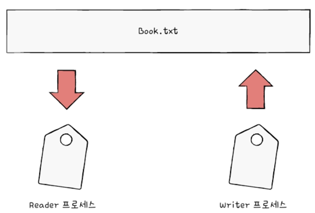
   - 아무 순서대로 실행되는 것이 아니라 Reader 프로세스가 Writer 프로세스 실행 끝나야 실행 가능
2. 상호 배제: 동시에 접근해서는 안 되는 자원에 하나의 프로세스만 접근하게 하기
   - 공유가 불가능한 자원의 동시 사용 피하기 위해 사용하는 알고리즘
   - 계좌 프로세스 A, 프로세스 B 예시 --> 동시에 접근해서는 안 되는 자원에 동시 접근해서 생기는 문제 ==> 이를 해결하기 위한 것이 상호 배제를 위한 동기화
    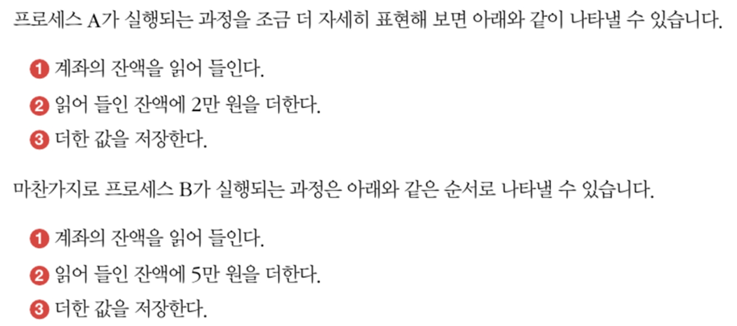
        - 동기화가 이뤄지지 않은 경우
            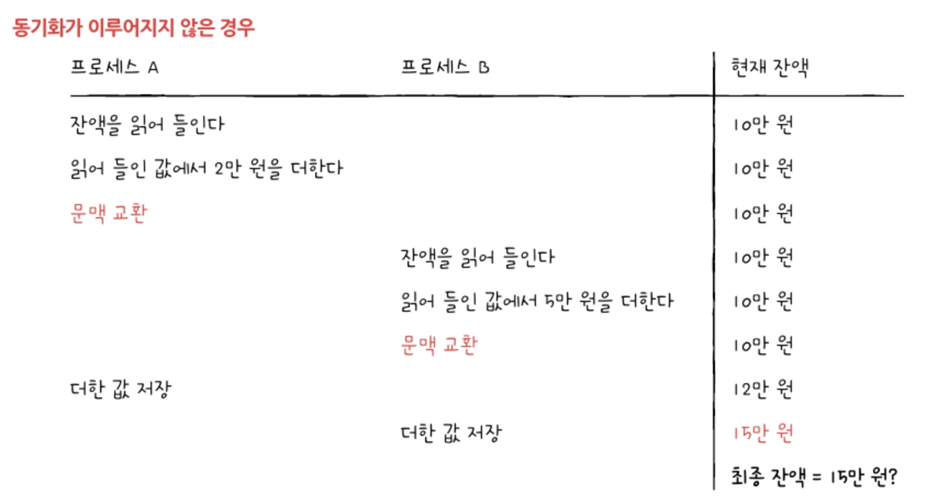
        - 동기화가 이뤄진 경우
            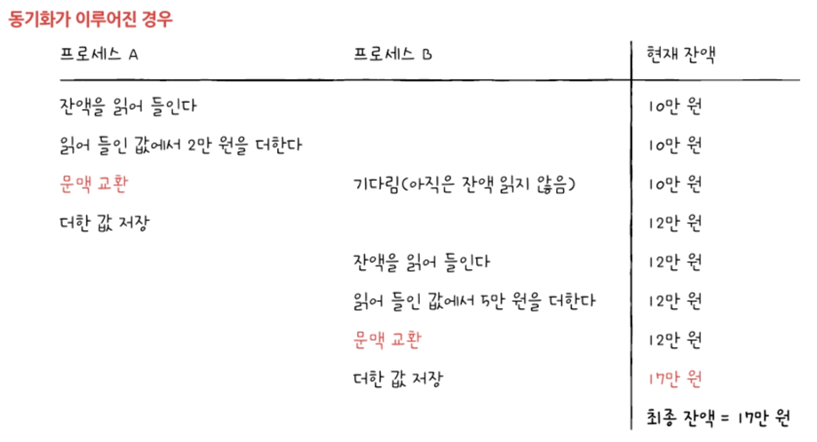

## 12-1-2. 생산자와 소비자 문제
- 생산자: 물건을 계속해서 생산하는 프로세스
- 소비자: 물건을 계속해서 소비하는 프로세스
- 버퍼: 생산자와 소비자 사이에서 데이터를 임시 저장하는 공유 메모리 공간
- 생산자와 소비자는 동시에 실행되는 스레드가 될 수도 있음
- 동시에 접근해서는 안 되는 자원에 동시에 접근해서 발생한 문제
### 예시에 대한 클로드 파이썬 코드
- 발생 가능한 문제
  - Race Condition: 여러 프로세스가 동시에 공유 데이터에 접근할 때 발생
  - Buffer Overflow: 생산자가 가득 찬 버퍼에 데이터를 추가하려 할 때
  - Buffer Underflow: 소비자가 빈 버퍼에서 데이터를 가져오려 할 때
```python
from threading import Semaphore, Thread
import queue
import time

# 버퍼 크기 설정
BUFFER_SIZE = 5
buffer = queue.Queue(BUFFER_SIZE)

# 세마포어 초기화
empty = Semaphore(BUFFER_SIZE)  # 버퍼의 빈 공간 수
full = Semaphore(0)            # 버퍼의 채워진 공간 수

def producer():
    count = 0
    while True:
        # 빈 공간이 있을 때까지 대기
        empty.acquire()
        
        # 아이템 생성 및 버퍼에 추가
        item = f"item-{count}"
        buffer.put(item)
        print(f"생산: {item}")
        count += 1
        
        # 채워진 공간 수 증가
        full.release()
        time.sleep(1)

def consumer():
    while True:
        # 채워진 공간이 있을 때까지 대기
        full.acquire()
        
        # 버퍼에서 아이템 가져오기
        item = buffer.get()
        print(f"소비: {item}")
        
        # 빈 공간 수 증가
        empty.release()
        time.sleep(1.5)
```
- 동기화 매커니즘
  - Semaphore: 공유 자원에 대한 접근을 제어
  - Queue: 스레드 안전한 버퍼 구현 제공
- 중요한 특징
  - 상호 배제(Mutual Exclusion): 한 번에 하나의 프로세스만 버퍼에 접근 가능
  - 동기화(Synchronization): 생산자와 소비자가 올바른 순서로 작업 수행
  - 데드락 방지: 세마포어를 통한 적절한 리소스 관리

## 12-1-3. 공유 자원과 임계 구역
- **공유 자원**: 동시에 실행되는 프로세스들은 전역 변수 '잔액', '총합'같은 공동 자원두고 작업 --> 이런 자원이 `공유 자원`
  - 전역 변수가 될 수도
  - 파일이 될 수도
  - 입출력장치, 보조기억장치가 될 수도
- **임계 구역(cricical section)**: 동시에 실행하면 문제가 발생하는 자원에 접근하는 코드 영역
  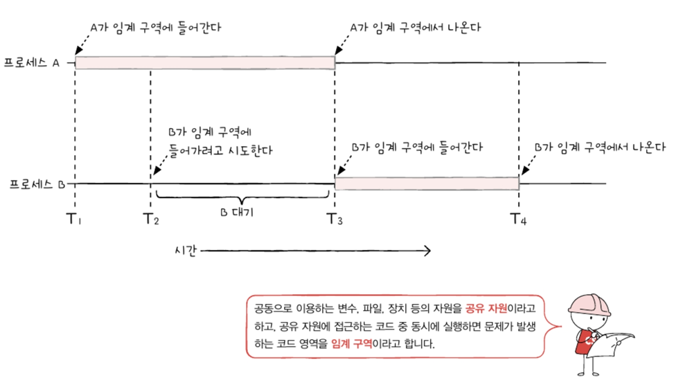
- **레이스 컨디션(race condition)**: 임계 구역은 2개 이상의 프로세스가 동시에 실행되면 안 되는 영역이지만, 잘못된 실행으로 여러 프로세스가 동시 다발적으로 임계 구역 코드 실행해 문제 발생하는 경우
  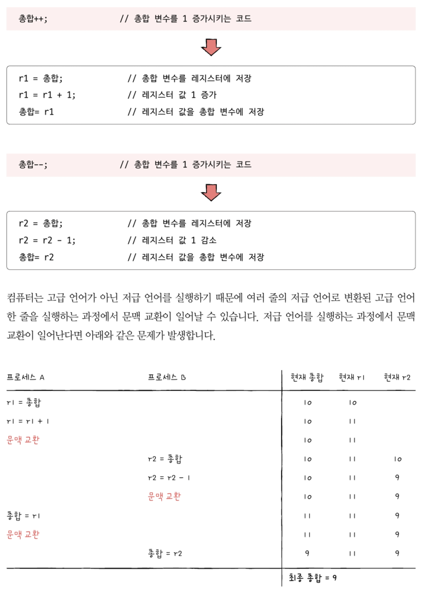
### 임계 구역 문제 해결 원칙
1. **상호 배제(mutual exclusion)**: 한 프로세스가 임계 구역에 진입했다면 다른 프로세스는 임계 구역에 들어올 수 없음
2. **진행(progress)**: 임계 구역에 어떤 프로세스도 진입하지 않았다면 임계 구역에 진입하고자 하는 프로세스는 들어갈 수 있어야 
3. **유한 대기(bounded waiting)**: 한 프로세스가 임계 구역에 진입하고 싶다면 그 프로세스는 언젠가는 임계 구역에 들어올 수 있어야(임계 구역에 들어오기 위해 무한정 대기해서는X).

---
# 12-2. 동기화 기법
## 12-2-1. 뮤텍스 락(Mutex Lock)
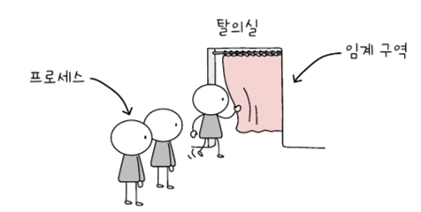
- 개념: 동시에 접근해서는 안 되는 자원에 대한 접근을 제어하는 도구
- 비유: 탈의실(임계 구역)에 사람(프로세스)이 있음을 알리는 자물쇠와 같은 역할
- 구현 요소
    - lock: 프로세스들이 공유하는 전역 변수로 자물쇠 역할
    - acquire()
        - 임계 구역 진입 전 호출하는 함수
        - 임계 구역이 잠겨있다면 반복 확인(바쁜 대기)
        - 열려있다면 잠금 설정
    - release()
        - 임계 구역 작업 완료 후 호출
        - 현재 잠긴 임계 구역을 해제
        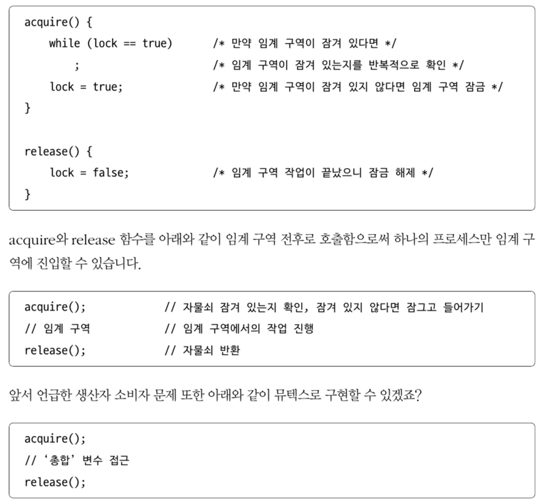
        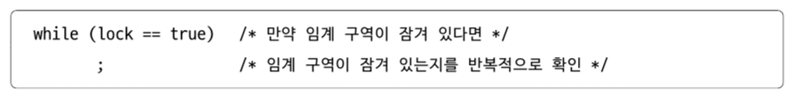
- 실행 순서
    - 락 획득 불가 시 → 대기
    - 락 획득 가능 시 → 잠금 설정 → 작업 수행 → 잠금 해제
- 단점: 바쁜 대기로 인한 CPU 주기 낭비

## 12-2-2. 세마포(Semaphore)

- 개념: 뮤텍스 락을 일반화한 동기화 도구로, 여러 공유 자원 관리 가능
- 비유: 여러 개의 탈의실을 관리하는 것과 유사
- 구현 요소
    - 전역 변수 S: 사용 가능한 공유 자원의 개수
    - wait()
        - 임계 구역 진입 가능 여부 확인
        - 자원 없을 시 프로세스를 대기 상태로 전환
        - PCB를 세마포 대기 큐에 삽입
    - signal()
        - 대기 중인 프로세스에게 진입 허가
        - 대기 큐에서 프로세스 제거
        - 프로세스를 준비 상태로 변경
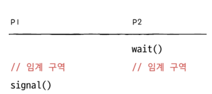
- 개선사항: 바쁜 대기 대신 대기 큐 사용으로 CPU 효율성 향상

## 12-2-3. 모니터(Monitor)
- 개념: 공유 자원과 접근 인터페이스를 묶어서 관리하는 도구
- 특징
    - 프로세스는 반드시 인터페이스를 통해서만 공유 자원 접근
    - 한 번에 하나의 프로세스만 모니터 내 접근 가능
- 조건 변수를 통한 실행 순서 제어
    - wait 연산
        - 프로세스를 대기 상태로 전환
        - 조건 변수에 대한 대기 큐에 삽입
        - 다른 프로세스가 모니터 진입 가능
    - signal 연산
        - 대기 큐의 프로세스 실행 재개
        - signal 호출 프로세스는 모니터 떠난 후 대기 프로세스 실행
- 사용 방식
    - 실행 조건 미충족 시 → wait로 실행 중단
    - 실행 조건 충족 시 → signal로 실행 재개
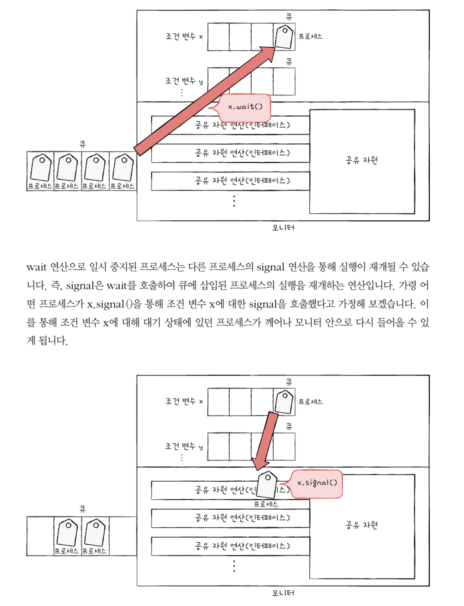
---
### 다 요약
각 메커니즘은 프로세스 동기화라는 같은 목적을 달성하지만, 구현 방식과 적용 상황에 따라 서로 다른 특징을 가진다. 세마포는 뮤텍스 락의 바쁜 대기 문제를 해결했고 모니터는 더 높은 수준의 추상화를 통해 프로그래머가 보다 쉽게 동기화를 구현하도록 해준다.
### 다 요약한 코드
```python
# 1. 뮤텍스 락 구현
class MutexLock:
    def __init__(self):
        self.lock = False  # False = 잠금 해제 상태

    def acquire(self):
        while self.lock:   # 바쁜 대기: 임계 구역이 잠겨있다면 반복 확인
            pass          
        self.lock = True   # 임계 구역 잠금

    def release(self):
        self.lock = False  # 임계 구역 잠금 해제

# 뮤텍스 락 사용 예시
def process_with_mutex():
    mutex = MutexLock()
    
    mutex.acquire()    # 임계 구역 진입 전 잠금
    # 임계 구역 시작
    print("임계 구역 작업 수행 중...")
    # 임계 구역 종료
    mutex.release()    # 임계 구역 작업 완료 후 잠금 해제

# 2. 세마포 구현
from threading import Thread
from collections import deque

class Semaphore:
    def __init__(self, initial=1):
        self.count = initial     # 사용 가능한 자원 수
        self.waiting = deque()   # 대기 중인 프로세스 큐
        
    def wait(self, process):
        self.count -= 1
        if self.count < 0:
            # 자원이 없으면 프로세스를 대기 큐에 넣음
            self.waiting.append(process)
            process.sleep()      # 프로세스를 대기 상태로 전환
            
    def signal(self):
        self.count += 1
        if self.count <= 0:
            # 대기 중인 프로세스가 있으면 깨움
            if self.waiting:
                process = self.waiting.popleft()
                process.wakeup() # 프로세스를 준비 상태로 전환

# 3. 모니터 구현
class Condition:
    def __init__(self):
        self.waiting = deque()   # 조건 변수에 대한 대기 큐

    def wait(self, process):
        self.waiting.append(process)
        process.sleep()          # 프로세스를 대기 상태로 전환

    def signal(self):
        if self.waiting:
            process = self.waiting.popleft()
            process.wakeup()     # 대기 중인 프로세스를 깨움

class Monitor:
    def __init__(self):
        self.mutex = MutexLock()
        self.condition = Condition()

    def enter(self):
        self.mutex.acquire()     # 모니터 진입

    def exit(self):
        self.mutex.release()     # 모니터 퇴출

    # 예시: 생산자-소비자 문제를 위한 모니터 메서드
    def produce(self, item):
        self.enter()
        if buffer_is_full():     # 버퍼가 가득 찼다면
            self.condition.wait(current_process)  # 대기
        add_to_buffer(item)      # 버퍼에 아이템 추가
        self.condition.signal()  # 대기 중인 소비자에게 신호
        self.exit()

    def consume(self):
        self.enter()
        if buffer_is_empty():    # 버퍼가 비었다면
            self.condition.wait(current_process)  # 대기
        item = remove_from_buffer()  # 버퍼에서 아이템 제거
        self.condition.signal()   # 대기 중인 생산자에게 신호
        self.exit()
        return item
```
---
# Question
1. **프로세스 동기화가 필요한 이유와 동기화를 하지 않았을 때 발생할 수 있는 문제점에 대해 설명해주세요.**
A: 프로세스 동기화는 두 가지 주요한 이유로 필요합니다.
    첫째, 실행 순서 제어를 위해서입니다. 예를 들어 파일을 읽는 프로세스는 파일을 쓰는 프로세스가 완료된 후에 실행되어야 합니다.
    둘째, 공유 자원에 대한 상호 배제를 보장하기 위해서입니다. 

    동기화가 이루어지지 않으면 다음과 같은 문제가 발생할 수 있습니다
    레이스 컨디션: 여러 프로세스가 동시에 공유 데이터에 접근하여 데이터 일관성이 깨지는 문제
    예를 들어, 은행 계좌에 동시에 여러 프로세스가 접근하여 잔액을 변경하면 잘못된 결과가 발생할 수 있습니다.

2. **뮤텍스 락과 세마포어의 차이점을 설명해주세요.**
A: 뮤텍스 락과 세마포어는 다음과 같은 차이점이 있습니다.
    뮤텍스 락은 하나의 공유 자원을 상호 배제 방식으로 관리하는 도구입니다. 자물쇠처럼 잠금/해제 두 가지 상태만 있으며 바쁜 대기 방식을 사용합니다.
    세마포어는 여러 개의 공유 자원을 관리할 수 있는 더 일반화된 도구입니다. 사용 가능한 자원의 개수를 카운팅하며, 대기 큐를 사용하여 CPU 효율성을 높입니다.
    그리고 세마포어는 wait()와 signal() 연산을 통해 프로세스의 실행 순서도 제어할 수 있습니다.

3. **모니터의 개념과 다른 동기화 도구들과 비교했을 때의 장점은 무엇인가요?**
A: 모니터는 공유 자원과 그 자원에 접근하기 위한 인터페이스를 하나로 묶어 관리하는 높은 수준의 동기화 도구입니다.
    장점으로는
    프로그래머가 명시적으로 동기화를 구현할 필요가 없어 사용이 편리합니다.
    인터페이스를 통해서만 자원에 접근할 수 있어 보안성이 높습니다.
    조건 변수를 통해 프로세스의 실행 순서를 더 유연하게 제어할 수 있습니다.
    세마포어처럼 wait/signal 연산의 순서를 고려할 필요가 없어 오류 발생 가능성이 낮습니다.
    이러한 특징 때문에 모니터는 현대 프로그래밍 언어에서 많이 채택되어 사용되고 있습니다.