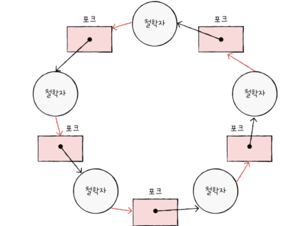
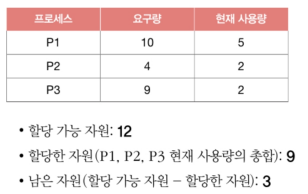
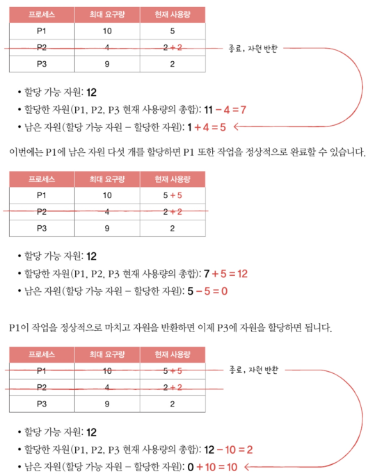
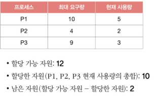
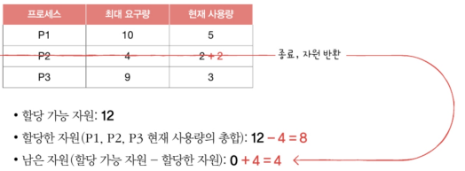

# Chapter. 13 교착 상태
- [Chapter. 13 교착 상태](#chapter-13-교착-상태)
- [13-1. 교착 상태란](#13-1-교착-상태란)
  - [교착 상태](#교착-상태)
  - [교착 상태 발생 조건](#교착-상태-발생-조건)
- [13-2. 교착 상태 해결 방법](#13-2-교착-상태-해결-방법)
  - [교착 상태 예방](#교착-상태-예방)
  - [교착 상태 회피](#교착-상태-회피)
    - [예시](#예시)
  - [교착 상태 검출 후 회복](#교착-상태-검출-후-회복)
- [Q\&A](#qa)

---

# 13-1. 교착 상태란

<aside>
❓

**식사하는 철학자 문제**

- 동그란 원탁에  다섯 명의 철학자가 앉아
1. 계속 생각하다 왼쪽 포크 사용 가능하면 집기
2. 계속 생각하다 오른쪽 포크 사용 가능하면 집기
3. 왼쪽, 오른쪽 포크를 모두 잡으면 정해진 시간 동안 식사
4. 식사 시간 끝나면 오른쪽 포크 내려놓기
5. 오른쪽 포기 내려놓은 뒤 왼쪽 포크 내려놓기
6. 다시 1번부터 반복
- 모든 철학자가 동시에 식사를 하면 어떤 철학자도 식사 불가, 영원히 생각만!
- 모든 철학자는 다른 철학자가 포크 내려놓을 때까지 기다림
</aside>

## 교착 상태

- 일어나지 않을 사건 기다리며 진행이 멈춰 버리는 현상
- 식사하는 철학자 문제
    - 철학자 = 프로세스/스레드
    - 포크 = 자원
    - 생각하는 행위 = 자원 기다리는 것
- **자원 할당 그래프**를 통해 상태 표현
    - 어떤 프로세스가 어떤 자원을 사용하고 있고, 또 어떤 프로세스가 어떤 자원을 기다리고 있는지 표현
    
    
    
    1. 프로세스 : 원, 자원 종류 : 사각형
    2. 자원 사각형 내에 점 : 사용할 수 있는 자원의 개수
    3. 화살표
        1. 자원 → 프로세스 : 프로세스가 어떤 자원 할당 받아 **사용 중**일 때
        2. 프로세스 → 자원 : 프로세스가 어떤 자원 **기다리고** 있을 때
        3. 프로세스가 자원 이용을 끝내고 운영체제에 자원 반납하면 화살표 삭제
    - 교착 상태가 발생했다면? 원의 형태
    

## 교착 상태 발생 조건

- **상호 배제**
    - 한 프로세스가 사용하는 자원을 **다른 프로세스가 사용할 수 없**을 때
    - 포크를 여러 명이 동시에 사용할 수 없음
- **점유와 대기**
    - 자원을 **할당 받은 상태**에서 다른 자원을 할당 받기를 **기다리는** 상태
    - 왼쪽 포크 들고 다른 철학자의 포크 기다림
- **비선점**
    - 어떤 프로세스도 다른 프로세스의 자원을 강제로 빼앗지 못함
    - 포크를 강제로 뺏지 않음
- **원형 대기**
    - 프로세스들이 원의 형태로 자원을 대기 하는 것
    - 원의 형태를 띄지 않는다면 교착 상태는 발생하지 않으나, 원의 형태를 띈다고 해서 반드시 교착 상태가 발생하는 것은 아님

# 13-2. 교착 상태 해결 방법

## 교착 상태 예방

- 교착 상태의 발생 조건 중 하나를 충족하지 못하게 하는 방법
- **상호 배제**
    - **모든 자원 공유** 가능하게 만들기
    - 현실에서 사용하기 어려움
- **점유와 대기**
    - 특정 프로세스에 자원 **모두 할당** 또는 **아예 할당하지 않는 방식**으로 배분
    - 자원의 활용률 낮아질 우려
    - 많은 자원 사용하는 프로세스 불리 → 동시에 자원 사용할 타이밍 확보 어려움, 기아현상 우려
- **비선점 조건**
    - **자원 이용 중**인 프로세스로부터 **해당 자원 빼앗기** 가능
    - CPU와 같이 선점하여 사용할 수 있는 일부 자원에 대해 효과적
    - 모든 자원이 선점 가능하지 않아 범용성 떨어짐
- **원형 대기**
    - 모든 자원에 **번호 붙이고 오름차순**으로 자원 할당 ⇒ 일렬로!
    - 비교적 현실적, 실용적
    - 수많은 자원에 번호 붙이기 어려움
    - 어떤 번호를 붙이느냐에 따라 특정 자원의 활용률 떨어질 수 있음

## 교착 상태 회피

- 안전 상태를 유지할 수 있는 경우에만 자원을 할당하는 방법
- 교착 상태의 원인 ⇒ 한정된 자원의 무분별한 할당

<aside>
👌🏻

**알아야 할 용어**

- **안전 상태** : 교착 상태가 발생하지 않고 모든 프로세스가 정상적으로 자원을 할당 받고 종료될 수 있는 상태
    - 안전 순서열 있는 상태
- **불안전 상태** : 교착 상태가 발생할 수도 있는 상황
    - 안전 순서열 없는 상태
- **안전 순서열** : 교착 상태 없이 안전하게 프로세스들에 자원을 할당할 수 있는 순서
</aside>

### 예시

- 가정
    - 컴퓨터 시스템에 총 12개의 자원이 있고, p1, p2, p3 프로세스 실행 중, 각각 5개, 2개, 2개의 자원 할당 받아 사용중
    - 배분할 수 있는 자원 : 3개 남음
    - p1, p2, p3 요구할 수 있는 자원 : 최대 10개, 4개, 9개
    - **참고 - 프로세스/스레드의 자원 사용**
        1. 자원을 운영체제에 요청
        2. 운영체제로부터 자원 할당 받아 사용
        3. 자원 사용이 끝났다면 반환
- 현재 상황
    
    
    
    - **안전 순서열! (p2 → p1 → p3)**
        - 만약 p1, p2, p3이 각각 5개, 2개, 7개 자원을 요구했다면?
            
            
            
- 운영체제가 p3에 먼저 자원을 하나 주었을 때
    
    
    
    - 불안전 상태
        - 만약 p1, p2, p3이 각각 5개, 2개, 6개 자원을 요구했다면?
            
            
            

## 교착 상태 검출 후 회복

- 교착 상태 발생 여부를 주기적으로 검사하고, 교착 상태가 발생하면 그때 그때 회복하는 방식
- **선점을 통한 회복**
    - 교착 상태가 해결 될 때까지 **한 프로세스씩 자원을 몰아주는** 방식
    - 다른 프로세스로부터 자원을 강제로 빼앗고 한 프로세스에 할당
- **프로세스 강제 종료를 통한 회복**
    - 교착 상태에 놓인 프로세스 모두 강제 종료
        - 한 방에 해결할 수 있지만 많은 프로세스들이 작업 내역 잃게 될 가능성 있음
    - 교착 상태 없어질 때까지 한 프로세스씩 강제 종료
        - 작업 내역을 잃는 프로세스 최대한 줄일 수 있지만 교착 상태 없어졌는지 여부 확인하는 과정에서 오버헤드 야기

- **참고 - 교착 상태 무시하는 방법**
    - 타조 알고리즘 : 드물게 발생하는 잠재적 문제를 무시로 대처

# Q&A

1. **멀티 프로세스에서 나타나는 문제점을 말하고, 문제점의 발생 조건이 무엇인지 설명하시오.**
2. **교차 상태 발생의 사전, 사후 조치에 대해 말해보시오.**
3. **교착 상태 예방 중 점유와 대기에 대해 설명하시오.**

- **1번 답**
    
    멀티 프로세스에서 나타나는 문제점은 교착 상태입니다. 교착 상태란 일어나지 않을 사건을 기다리며 무한히 대기하는 현상인데요, 상호 배제, 점유와 대기, 비선점, 원형 대기가 동시에 만족될 때 교착 상태가 발생할 수 있습니다.
    
- **2번 답**
    
    교착 상태 발생의 사전 조치로는 예방과 회피가 있고, 사후 조치로는 검출 후 회복하는 방식이 있습니다. 교착 상태 예방은 교착 상태의 발생 조건 4가지 중 하나를 충족하지 못하게 하는 것이며, 회피는 교착 상태가 나타나지 않을 정도로만 자원을 배분하는 방식입니다. 교착 상태 검출 후 회복은 교착 상태 발생 여부를 주기적으로 검사하고, 발생하면 그때그때 회복하는 방식입니다.
    
- **3번 답**
    
    교착 상태는 4가지 조건이 모두 충족되어야 발생하는데, 점유와 대기는 자원을 할당 받은 상태에서 다른 자원을 할당 받기를 기다리는 상태입니다. 교착 상태 예방에서는 특정 프로세스에 자원을 모두 할당하거나 아예 할당하지 않는 방식으로 배분하게 됩니다.