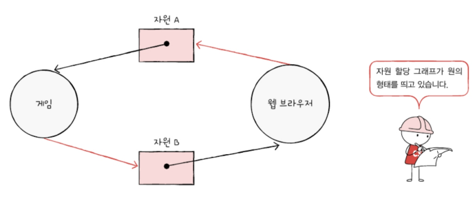

# 13-1. 교착 상태
## 식사하는 철학자 문제

철학자 앞에 있는 식사는 두 개의 포크로 먹을 수 있는 음식이라 가정\

모든 철학자가 왼쪽 포크를 집어들면 모두가 오른쪽 포크를 들 수 없음 => 모든 철학자는 다른 철학자가 포크를 내려놓을 때까지 기다림

이와같이 일어나지 않을 사건을 기다리며 진행이 멈춰 버리는 현상을 `교착 상태`라 함

위의 문제에서\
철학자 === 프로세스 or 스레드\
포크 === 자원(한 번에 하나의 프로세스 or 스레드만 접근할 수 있으니 임계구역이라 볼 수 있음)\
생각하는 행위 === 자원을 기다리는 것

으로 빗대어 볼 수 있음

교착 상태 예_서로가 가진 자원을 기다리기만 하다 결국 실행을 못 하는 상황\

뮤텍스 락에서의 교착상태 예시\
프로세스 A는 임계 구역 진입 전 lock1을 잠그고(lock1 = true;), 프로세스 B는 임계구역 진입 전 lock2를 잠갔다고(lock2 = true;)가정

만약 프로세스 A는 lock2가 false가 되길 기다리고 프로세스 B는 lock1이 false가 되길 기다리면 교착 상태가 발생함\
\
=> 해결방법
1. 교착 상태가 발생했을 때의 상황을 정확히 표현해보기
2. 교착 상태가 일어나는 근본적인 이유에 대해 알아야 함

## 자원 할당 그래프
: 어떤 프로세스가 어떤 자원을 사용하고 있고, 또 어떤 프로세스가 어떤 자원을 기다리고 있는지를 표현하는 간단한 그래프

1. 프로세스는 원으로, 자원의 종류는 사각형으로 표현
   

2. 사용할 수 있는 자원의 개수는 자원 사각형 내에 점으로 표현
   \
   같은 자원이라 할 지라도 사용 가능한 자원의 개수는 여러 개 있을 수 있음.
   예를 들어, 하드 디스크가 세 개 있는 경우 자원의 종류는 하드 디스크 하나이지만, 사요 가능한 하드 디스크 개수는 세 개 => 하드 디스크는 사각형 안에 세 개의 점으로 표현

3. 프로세스가 어떤 자원을 할당받아 사용 중이라면 자원에서 프로세스를 향해 화살표를 표시
   \
   하드 디스크 자원 하나는 프로세스 A에 할당되었고, CPU는 프로세스 B, C에 할당되었음을 표현한 자원 할당 그래프\
   프로세스가 자원 이용을 끝내고 운영체제에 자원을 반납하면 화살표는 삭제됨
   

4. 프로세스가 어떤 자원을 기다리고 있다면 프로세스에서 자원으로 화살표를 표시
   
   프로세스 D가 CPU의 할당을 기다리고 있음을 나타낸 그래프

현재 사용 가능한 SSD 자원: 3개, CPU 자원: 2개, 프린터: 1개\
프로세스 A: SSD 할당받아 사용 중
...
프로세스 F: CPU의 할당을 기다리고 있음

▼ 식사하는 철학자 문제를 자원 할당 그래프로 표현한 것\

## 교착 상태 발생 조건
교착 상태가 발생할 조건: 상호 배제, 점유와 대기, 비선점, 원형 대기

### 상호 배제
한 프로세스가 사용하는 자원을 다른 프로세스가 사용할 수 없을 때\
(식사하는 철학자 문제에서 하나의 포크를 여러 명이 동시에 사용할 수 있었다면 교착 상태는 발생하지 않았을 것)

### 점유와 대기
어떠한 자원을 할당받은 상태에서 다른 자원을 할당받기 기다리는 상태

### 비선점
비선점 자원은 그 자원을 이용하는 프로세스의 작업이 끝나야만 비로소 이용 할 수 있음. 즉, 어떤 프로세스도 다른 프로세스의 자원을 강제로 빼앗지 못했기 때문에 교착 상태가 발생했다 볼 수 있음

### 원형 대기
프로세스들과 프로세스가 요청 및 할당 받은 자원이 원의 형태를 이룰 때, 즉 프로세스가 원의 형태로 자원을 대기하는 것
> 자원 할당 그래프가 원의 혇ㅇ태를 띄지 않는다면 교착 상태는 발생하지 않으나, 원의 형태를 띈다고 해서 반드시 교착 상태가 발생하는 것은 아님

# 13-2 교착 상태 해결 방법
예방, 회피, 검출 후 회복\

## 교착 상태 예방
13-1 절에서 설명한 교착 상태 발생 필요 조건 네 가지(상호 배제, 점유와 대기, 비선점, 원형 대기) 중 하나를 충족하지 못하게 하는 방법과 같음.

**자원의 상호 배제 없애기**
모든 자원을 공유 가능하게 만든다는 말과 같음 => 교착 상태를 없앨 수는 있지만 현실적으로 모든 자원의 상호 배제를 없애기는 어려움\

**점유와 대기 없애기**
식사하는 철학자 문제 속 철학자들로 하여금 한 손에 포크를 들고 다른 포크를 기다리지 못하게 금지하는 것과 같음\
점유와 대기를 없애면 운영체제는 특정 프로세스에 자원을 모두 할당하거나, 아예 할당하지 않는 방식으로 배분함 => 자원의 활용률이 낮아질 우려가 있음. \
또 많은 자원을 사용하는 프로세스가 불리해짐.(자원을 적게 사용하는 프로세스에 비해 동시에 자원을 사용할 타이밍을 확보하기가 어렵기 때문) => 무한정 기다리게 되는 기아 현상을 야기함

**비선점 조건 없애기**
자원을 이용중인 프로세스로부터 해당 자원을 빼앗을 수 있게 됨

선점하여 사용할 수 있는 일부 자원에 대해서는 효과적이나, 한 번에 하나의 프로세스만 이용 가능한 프린트 자원이 있다는 가정에선 한 프로세스가 이 프린터를 이용하는 도중에 다른 프로세스가 프린터 자원을 빼앗아 사용하긴 어려움 => 다소 범용성이 떨어지는 방안

**원형 대기 조건 없애기**
모든 자원에 번호를 붙이고, 오름차순으로 자원을 할당하는 방식 => 모든 컴퓨터 시스템 내에 존재하는 수많은 자원에 번호를 붙이는 일이 간단하지 않고, 각 자원에 어떤 번호를 붙이는지에 따라 특정 자원의 활용률이 떨어질 수 있다는 단점이 있음

식사하는 철학자 문제에서 모든 포크에 1번부터 5번까지 번호를 붙이고, 철학자들로 하여금 번호가 낮은 포크에서 높은 포크 순으로 집어들게 한다면 원형 대기는 발생하지 않음\
\
일렬로 앉아 식사하는 상황과 유사\

## 교착 상태 회피
교착 상태가 발생하지 않을 정도로만 조심 조심 자원을 할당하는 방식. 해당 방식에서는 교착 상태를 한정된 자원의 무분별한 할당으로 인해 발생하는 문제로 간주

프로세스들에 배분할 수 있는 자원의 양을 고려하여 교착 상태가 발생하지 않을 정도의 양만큼만 자원을 배분하는 방법

`안전 상태`: 교착 상태가 발생하지 않고 모든 프로세스가 정상적으로 자원을 할당받고 종료될 수 있는 상태\
`불안전 상태`: 교착 상태가 발생할 수도 있는 상황

`안전 순서열`: 교착 상태 없이 안전하게 프로세스들에 자원을 할당할 수 있는 순서를 의미\
ex) 웹 브라우저, 메모장, 게임 프로세스가 동시에 운영체제에 자원을 요청한 상황에서 웹 프라우저-메모장-게임 프로세스 순서대로 자원을 할당하면 교착상태가 발생하지 않는다고 가정\
=> 웹 프라우저→메모장→게임이 안전 순서열이 됨. 안전 순서열이 있는 상태를 안전 상태라 볼 수 있음

다시말해\
안전 순서열대로 프로세스들에 자원을 배분하고 교착 상태가 발생하지 않는 상태를 `안전 상태`라고 함

`불안전 상태`: 안전 순서열이 없는 상황

\
위의 상태는 안전 상태임 (P2 -> P1 -> P3 라는 안전 순서열이 있기 때문)

최악의 상황으로 P1, P2, P3가 각각 추가적으로 다섯 개, 두 개, 일곱 개의 자원을 요구한 상황을 가정해봤을 때\

P2의 작업이 끝난 후 가지고 있던 자원 반환\
\

만약 운영체제가 P3에 먼저 자원 하나를 내주었을 경우엔 불안전 상태가 됨. 즉 교착 상태가 발생할 위험이 있음\
\
\

## 교착 상태 검출 후 회복
교착 상태 발생을 인정하고 사후에 조치하는 방식

검출 후 회복 방식에서 운영체제는 프로세스들이 자원을 요구할 때마다 즉각적으로 모두 할당하며, 교착 상태 여부를 주기적으로 검사함. 그리고 교착 상태가 검출되면 아래 두 방식으로 회복함

### 선점을 통한 회복
교착 상태가 해결될 때까지 한 프로세스씩 자원을 몰아주는 방식. 교착 상태가 해결될 때까지 다른 프로세스로부터 자원을 강제로 빼앗고 한 프로세스에 할당하는 방식임

### 프로세스 강제 종료를 통한 회복
운영체제는 교착 상태에 놓인 프로세스를 모두 강제 종료할 수도 있고, 교착 상태가 없어질 때까지 한 프로세스씩 강제 종료할 수도 있음

전자는 한방에 교착 상태를 해결할 수 있는 방식 => 많은 프로세스들이 작업 내역을 잃게될 가능성 있음\
후자는 작업 내역을 잃는 프로세스는 최대한 줄임 => 교착 상태가 없어졌는지 여부를 확인하는 과정에서 오버헤드를 야기함

`타조 알고리즘`: 교착 상태를 아예 무시하는 방법

---

## 📖

Q1. 자원 할당 그래프에서 원, 사각형, 점이 각각 어떤 것을 의미하는지 설명하시오

A1. 원은 프로세스, 사각형은 자원, 점은 사용할 수 있는 자원의 개수이다.

Q2. 교착 상태 발생 조건으로 무엇이 있는지에 대해 간단히 말해보시오.

A2. 상호 배제와, 점유와 대기, 비선점, 원형 대기가 있다.

Q3. 안전 상태와 불안전 상태에 대해 설명해보시오.

A3.안전 상태는 교착 상태가 발생하지 않고 모든 프로세스가 정상적으로 자원을 할당받고 종료될 수 있는 상태를 말하고 불안전 상태는 교착 상태가 발생할 수도 있는 상황을 말한다.