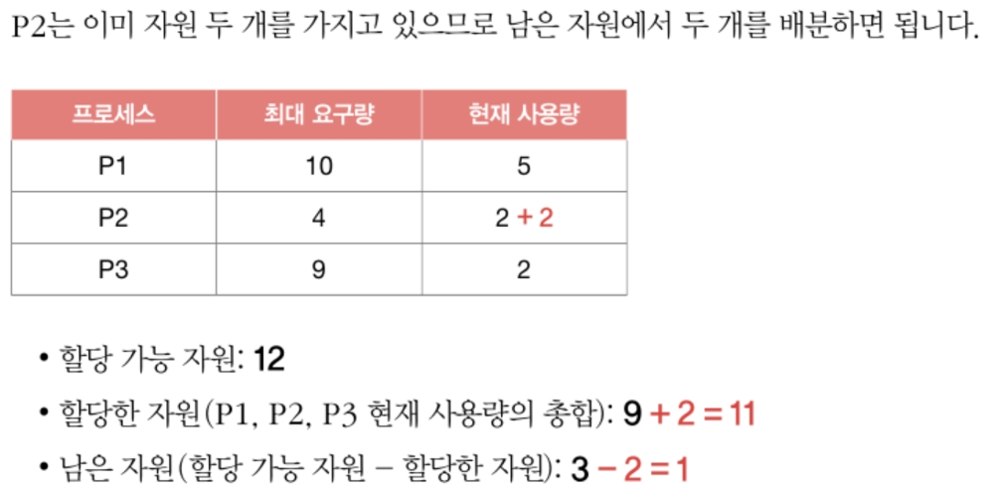

# Ch13. 교착 상태

2개 이상의 프로세스가 각자 가지고 있는 자원을 무작정 기다린다면 그 어떤 프로세스도 더 이상 진행할 수 없는 `교착 상태`

# 13-1. 교착 상태란
## 13-1-1. 식사하는 철학자 문제

- 이미지 상, 식사하는 데 아무 문제가 없을 것 같지만, 모든 철학자가 동시에 포크를 집어 식사 하려면 어떤 철학자도 식사를 할 수 없고 영원히 생각만 하는 상황 발생
- 왼쪽 포크를 들고 - 이게 문제
- **교착 상태(deadlock)**: 일어나지 않을 사건을 기다리며 진행이 멈춰버리는 현상
- 교착 상태는 다양한 상황에서 발생
  - 뮤텍스 락에서도 발생할 수도
    
- 교착 상태 해결 방법
  - 교착 상태가 발생했을 때 상황을 정확히 표현
  - 교착 상태가 일어나는 근본적인 이유에 대해 알아야

## 13-1-2. 자원 할당 그래프(resource-allocation graph)
- 교착 상태를 단순하게 표현
  - 어떤 프로세스가 어떤 자원 사용하는지
  - 어떤 프로세스가 어떤 자원 기다리는지 표현

### 자원 할당 그래프 그리는 규칙
**1. 프로세스는 원, 자원의 종류는 사각형**
    
     
**2. 사용할 수 있는 자원의 개수는 자원 사각형 내에 점으로 표현**
    
     
**3. 프로세스가 어떤 자원을 할당받아 사용 중이라면 자원에서 프로세스를 향해 화살표 표시**
    
     
**4. 프로세스가 어떤 자원 기다리고 있다면 프로세스에서 자원으로 화살표 표시**
    
- 식사하는 철학자 문제의 자원 할당 그래프
    

## 13-1-3. 교착 상태 발생 조건
### 1. 상호 배제(mutual exclusion)
- 교착 상태가 발생한 근본적인 원인 --> 해당 자원을 한 번에 하나의 프로세스만 이용 가능
- 한 프로세스가 사용하는 자원을 다른 프로세스가 사용할 수 없을 때, `상호 배제` 상황에서 교착 상태 발생
### 2. 점유와 대기(hold and wait)
- 식사하는 철학자 문제 원인 - `왼쪽 포크를 들고` 다른 철학자 포크를 기다려서
- **점유와 대기**: 자원을 할당받은 상태에서 다른 자원을 할당받기를 기다리는 상태
### 3. 비선점(nonpreemptive)
- 철학자들 중 누군가가 다른 철학자 포크 빼앗았다면 교착 상태 발생X
- 프로세스가 자원을 비선점 해서 교착 상태 발생한 것
- **비선점 자원**: 그 자원 이용하려는 프로세스의 작업이 끝나야만 비로소 이용 가능
### 4. 원형 대기(circular wait)
- 프로세스들과 프로세스가 요청 및 할당받은 자원이 원의 형태를 이뤘기 때문
- 자원 할당 그래프가 `원의 형태`로 그려지면 교착 상태 발생할 수 있음
  - 자원 할당 그래프가 원의 형태 X --> 교착 상태X
  - 원의 형태 띈다고 반드시 교착 상태 발생한다고 할 수는 없음

# 13-2. 교착 상태 해결 방법
## 13-2-1. 교착 상태 예방
**교착 상태 발생 필요 조건 4가지 중 하나를 충족하지 못하게 하는 방법**
### 상호 배제 없애기
- 모든 사원 공유 가능하게
- 현실적으로 모든 자원의 상호 배제 없애기 어려움
  
### 점유와 대기 없애기
- 식사하는 철학자 문제 속, 철학자들 한 손에 포크 들고 다른 포크 기다리지 못하게 금지(2개 동시에 들게 하거나, 아예 들지 못하게 하거나)
- 이론적으로 교착 상태 해결 가능
- 자원 활용률 낮아질 우려
  - 한 프로세스에 필요한 자원 몰아주고 그 다음에 다른 프로세스에 필요한 자원 몰아줘야 함
  - 당장 자원 필요해도 기다려야 하니까 자원 활용률 낮아져
- 기아 현상 우려
  - 자원 많이 사용하는 프로세스는 자원 적게 사용하는 프로세스에 비해 동시에 자원 사용할 타이밍 확보하기가 어려움
### 비선점 조건 없애기
- 비선점 조건 없애면 자원 이용 중인 프로세스로부터 해당 자원 빼앗을 수 있음
- 선점하여 사용할 수 있는 일부 자원에 대해서는 효과적
  - CPU 프로세스들이 선점할 수 있는 대표적인 자원
  - 한 프로세스가 CPU 이용하다가 일정 시간 지나면 아직 작업 모두 끝나지 않았다고 할지라도 다른 프로세스가 CPU 할당받아 사용할 수 있기 때문
- BUT 모든 자원이 이렇게 선점 가능한 것X
  - 한 프로세스 작업 끝날 때까지 다른 프로세스가 기다려야 하는 자원도 존재
  - ex) 한 번에 하나의 프로세스만 이용 가능한 프린터 자원 있다면, 프린터 이용하는 도중에 다른 프로세스가 자원 빼앗아 사용 불가
- 다소 범용성 떨어지는 방안
### 원형 대기 조건 없애기
- 모든 자원에 번호 붙이고, 오름차순으로 자원 할당 --> 원형 대기 발생X
- ex) 식사하는 철학자 문제
    
  - 포크에 1~5번까지 붙이고 철학자들로 하여금 번호가 낮은 포크에서 높은 포크 순으로 집어들게 한다면 원형 대기 발생 X
  - 5번 포크 들고 1번 포크 못드니까
- 원형 대기 없앰으로 교착 상태 해결하는 것은 다른 방식들보다 비교적 `현실적`, `실용적`
- 모든 컴퓨터 시스템 내 존재하는 수많은 자원에 번호 붙이는 일은 간단X
- 각 자원에 어떤 번호를 붙이는지에 따라 특정 자원의 활용률이 떨어질 수 있음

## 13-2-2. 교착 상태 회피
- **교착 상태 회피**: 교착 상태 발생하지 않을 정도로만 자원 할당
  - 회피 방식에서는 교착 상태를 한정된 자원의 무분별한 할당으로 인해 발생하는 문제로 간주
  - ex) 식사하는 철학자 문제
    - 포크 100개, 1000개 있는 상태에 철학자들이 한 두개의 포크를 요구하면 교착상태 발생 X
    - 포크 양 충분하지 않은 상태에서 철학자들이 모두 자신이 요구할 수 있는 최대의 포크(2개) 요구하면 교착 상태 발생
- **안전 상태(safe state)**
  - 교착 상태 발생하지 않고 모든 프로세스가 정상적으로 자원 할당받고 종료될 수 있는 상태
  - 안전 순서열대로 프로세스들에 자원 배분해서 교착 상태 발생하지 않는 상태
- **불안전 상태(unsafe state)**
  - 교착 상태가 발생할 수도 있는 상황
  - 안전 순서열 없는 상황
- **안전 순서열(safe sequence)**: 교착 상태 없이 안전하게 프로세스들에 자원 할당할 수 있는 순서
  - ex) 웹 브라우저, 메모장, 게임 프로세스가 동시에 OS에 자원 요청한 상황에서 웹 브라우저-메모장-게임 프로세스 순서대로 자원 할당하면 교착상태 발생 안 한다고 가정 ; 이 순서가 안전 순서열이 있는 상태

### 프로세스와 스레드는 자원 활용 위해
1. 우선 자원을 운영체제에 요청
2. 운영체제로부터 자원 할당 받아 사용
3. 자원 사용 끝났으면 자원 반환
 

- 현재 상황
    
- 프로세스 P1~P3 모두 최대로 자원 요구한 최악의 상황
    
- 요구한 4개의 자원 할당받은 P2는 정상적으로 작업 끝내고 자원 반환
    
- P1에 남은 자원 5개 할당하면 P1도 작업 정상 완료
    
- P1 작업 완료 후 자원 반환, P3에 자원 할당
    
- P1 -> P2 -> P3  안전 순서열대로 자원 배분하면 모두 자원 할당 받고 교착 상태 없이 작업 완료 가능
 

- 다른 상황(OS가 P3에 자원 하나 내어 줬을 때)
    
- P1~P3 모두 최대로 자원 요구한 최악의 상황
    
    
- **OS가 교착 상태 회피하기 위해서는 시스템 상태가 안전 상태에서 안전 상태로 움직이는 경우에만 자원 할당!**
- 항시 안전 상태를 유지하도록 자원 할당하는 방식 == 교착 상태 회피 방식

## 13-2-3. 교착 상태 검출 후 회복
- 교착 상태 발생 인정하고 사후에 조치
- OS는 프로세스들이 자원 요구할 때마다 그때그때 모두 할당, 교착 상태 발생 여부를 주기적으로 검사
- 교착 상태 검출 시, 다음과 같은 방식으로 회복
### 선점을 통한 회복
- 교착 상태 해결될 때까지 한 프로세스씩 자원 몰아주기
- 교착 상태 해결될 때까지 다른 프로세스로부터 자원 강제로 빼앗고 한 프로세스에 할당
### 프로세스 강제 종료를 통한 회복
- 가장 단순하면서 확실
1. 교착 상태 놓인 프로세스 모두 강제 종료
    - 가장 확실
    - 많은 프로세스들이 작업 내역 잃게 될 가능성
2. 교착 상태 없어질 때까지 한 프로세스씩 강제 종료
    - 작업 내역 잃는 프로세스 최대한 줄일 수 있음
    - 교착 상태가 없어졌는지 여부 확인하는 과정에서 오버헤드 야기
- `타조 알고리즘`: 교착 상태 아예 무시(그냥 드물게 발생하는 잠재적 문제로 무시)

---
# Question
## Q1. 교착 상태(데드락)가 무엇인지 간단히 설명해주세요.
교착 상태는 2개 이상의 프로세스가 서로 가지고 있는 자원을 무한정 기다리면서 더 이상 진행되지 못하는 상태를 의미합니다. 

## Q2. 교착 상태를 해결하는 가장 단순한 방법은 무엇인가요?
교착 상태를 해결하는 가장 단순하고 확실한 방법은 교착 상태에 빠진 프로세스들을 강제로 종료하는 것입니다. 이는 모든 프로세스를 한번에 종료하거나, 교착 상태가 해결될 때까지 한 프로세스씩 종료하는 방식으로 진행할 수 있습니다. 

## Q3. 교착 상태가 발생하기 위한 4가지 조건은?
- 상호 배제: 자원은 한 번에 하나의 프로세스만 사용할 수 있는 조건입니다.
- 점유와 대기: 프로세스가 어떤 자원을 보유한 상태에서 다른 자원을 기다리는 상태를 의미합니다.
- 비선점: 다른 프로세스가 사용 중인 자원을 강제로 빼앗을 수 없는 상태를 의미합니다.
- 원형 대기: 프로세스들이 원의 형태로 자원을 대기하는 것입니다.