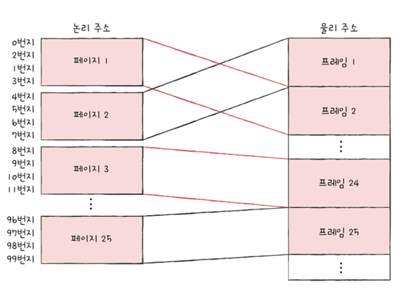
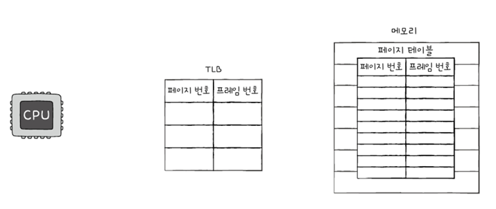

# 14. 가상 메모리
- [14. 가상 메모리](#14-가상-메모리)
  - [14-1. 연속 메모리 할당](#14-1-연속-메모리-할당)
    - [(1) 스와핑](#1-스와핑)
      - [1. 스와핑](#1-스와핑-1)
      - [2. 스왑영역, 스왑아웃, 스왑 인](#2-스왑영역-스왑아웃-스왑-인)
      - [3. 스와핑 장점](#3-스와핑-장점)
    - [(2) 메모리 할당](#2-메모리-할당)
      - [1. 최초 적합](#1-최초-적합)
      - [2. 최적 적합](#2-최적-적합)
      - [3. 최악 적합](#3-최악-적합)
    - [(3) 외부 단편화](#3-외부-단편화)
      - [1. 외부 단편화란](#1-외부-단편화란)
      - [2. 외부 단편화를 해결하는 방안 : 메모리 압축](#2-외부-단편화를-해결하는-방안--메모리-압축)
  - [14-2. 페이징을 통한 가상 메모리 관리](#14-2-페이징을-통한-가상-메모리-관리)
    - [(1) 페이징이란](#1-페이징이란)
    - [(2) 페이지 테이블](#2-페이지-테이블)
      - [참고](#참고)
    - [(3) 페이징에서의 주소 변환](#3-페이징에서의-주소-변환)
    - [(4) 페이지 테이블 엔트리](#4-페이지-테이블-엔트리)
      - [1. 유효 비트](#1-유효-비트)
      - [2. 보호 비트](#2-보호-비트)
      - [3. 참조 비트](#3-참조-비트)
      - [4. 수정 비트](#4-수정-비트)
    - [(5) 페이징의 이점 - 쓰기 시 복사](#5-페이징의-이점---쓰기-시-복사)
    - [(6) 계층적 페이징](#6-계층적-페이징)
  - [14-3. 페이지 교체와 프레임 할당](#14-3-페이지-교체와-프레임-할당)
    - [(1) 요구 페이징](#1-요구-페이징)
    - [(2) 페이지 교체 알고리즘](#2-페이지-교체-알고리즘)
      - [1. 좋은 페이지 교체 알고리즘이란?](#1-좋은-페이지-교체-알고리즘이란)
      - [2. 페이지 교체 알고리즘을 이해하기 위해 : 페이지 폴트 횟수, 페이지 참조열](#2-페이지-교체-알고리즘을-이해하기-위해--페이지-폴트-횟수-페이지-참조열)
      - [3. FIFO 페이지 교체 알고리즘](#3-fifo-페이지-교체-알고리즘)
      - [4. 2차 기회 페이지 교체 알고리즘](#4-2차-기회-페이지-교체-알고리즘)
      - [5. 최적 페이지 교체 알고리즘](#5-최적-페이지-교체-알고리즘)
      - [6. LRU 페이지 교체 알고리즘](#6-lru-페이지-교체-알고리즘)
      - [7. 스래싱과 프레임 할당](#7-스래싱과-프레임-할당)
  - [Q\&A](#qa)
    - [Q1. 연속 메모리 할당 기법과 메모리 할당 방법에 대해 설명하세요.](#q1-연속-메모리-할당-기법과-메모리-할당-방법에-대해-설명하세요)
    - [Q2. 페이징 기법에 대해 설명하세요.](#q2-페이징-기법에-대해-설명하세요)
    - [Q3. 페이지 교체 알고리즘 종류와 좋은 페이지 교체 알고리즘은 어떤 것인지 설명하세요.](#q3-페이지-교체-알고리즘-종류와-좋은-페이지-교체-알고리즘은-어떤-것인지-설명하세요)

## 14-1. 연속 메모리 할당
- 연속 메모리 할당 : 프로세스에 연속적인 메모리 공간을 할당하는 방식

### (1) 스와핑
#### 1. 스와핑
- 스와핑 : 메모리에 적재된 프로세스 중 현재 실행되지 않은 프로세스를 임시로 보조기억장치 일부 영역으로 쫓아내고 메모리상의 빈 공간에 또 다른 실행해야 할 프로세스를 적재하여 실행하는 방식
  - 현재 실행되지 않은 프로세스의 예 : 입출력 작업의 요구로 대기 상태가 된 프로세스
  - 메모리 관리 기법

#### 2. 스왑영역, 스왑아웃, 스왑 인
- 스왑 영역 : 프로세스들이 쫓겨나는 보조기억장치의 일부 영역
- 스왑 아웃 : 현재 실행되지 않는 프로세스가 메모리에서 스왑 영역으로 옮겨지는 것
- 스왑 인 : 스왑 영역에 있던 프로세스가 다시 메모리로 옮겨오는 것
  - 스왑 아웃되었던 프로세스가 다시 스왑 인 될때는 물리 주소가 다른 주소로 적재될 수 있음

#### 3. 스와핑 장점
- 프로세스들이 요구하는 메모리 주소 공간의 크기가 실제 메모리 크기보다 큰 경우에도 동시에 실행할 수 있음

### (2) 메모리 할당
- 비어있는 메모리 공간에 프로세스를 연속적으로 배치(할당)하는 대표적 방식
  1. 최초 적합
  2. 최적 적합
  3. 최악 적합

- 예시 상황

#### 1. 최초 적합
- 최초 적합(first fit) : 운영체제가 메모리 내의 빈 공간을 순서대로 검색하다가 적재할 수 있는 공간을 발견하면 그 공간에 프로세스를 배치
  - 빈공간 A -> 빈공간 B -> 빈공간 C 순서대로 발견했다면 **빈공간 A**에 적재됨
  - 프로세스가 적재될 수 있는 공간을 발견하는 즉시 메모리를 할당하기 때문에 <u>**검색을 최소화**</u>할 수 있고 결과적으로 <u>**빠른 할당**</u>이 가능함

#### 2. 최적 적합
- 최적 적합(best fit) : 운영체제가 빈 공간을 모두 검색해본 후, 프로세스가 적재될 수 있는 공간 중 가장 작은 공간에 프로세스를 배치
  - 위의 예시 상황에서 프로세스가 적재될 수 있는 빈 공간 중 가장 작은 공간인 <u>**빈 공간 C**</u>에 할당됨

#### 3. 최악 적합
- 최악 적합(worst fit) : 운영체제가 빈 공간을 모두 검색해본 후 프로세스가 적재될 수 있는 공간 중 가장 큰 공간에 프로세스를 배치하는 방식
  - 위의 예시 상황 중 가장 큰 빈 공간인 <u>**빈 공간B**</u>에 할당됨

### (3) 외부 단편화
- 프로세스를 메모리에 연속적으로 배치하는 연속 메모리 할당은 <u>**외부 단편화**</u> 문제를 내포하여 메모리를 효율적으로 사용하는 방법이 아님

#### 1. 외부 단편화란
- 프로세스들이 메모리에 연속해서 할당되는 환경에서는 프로세스 실행, 종료를 반복하며 메모리 사이 사이에 빈 공간들이 생김
- 프로세스 바깥에 생기는 이러한 빈 공간들은 빈 공간이지만 그 공간보다 큰 프로세스를 적재하기 어려워 메모리 낭비로 이어짐
- 이런 현상을 외부 단편화라고 함

- 외부 단편화 : 프로세스를 할당하기 어려울 만큼 작은 메모리 공간들로 인해 메모리가 낭비되는 현상

#### 2. 외부 단편화를 해결하는 방안 : 메모리 압축
- 메모리 압축 : 여기저기 흩어져 있는 빈공간들을 하나로 모으는 방식으로 메모리 내에 저장된 프로세스를 적당히 재배치시켜 흩어져 있는 작은 빈 공간들을 하나의 큰 빈 공간으로 만드는 방법

- 메모리 압축의 단점
  1. 작은 빈 공간들을 하나로 모으는 동안 시스템은 하던 일을 중지해야함
  2. 메모리에 있는 내용을 옮기는 작업이 많은 오버헤드를 야기함
  3. 어떤 프로세스를 어떻게 움직여야 오버헤드를 최소화하며 압축할 수 있는지에 대한 명확한 방법을 결정하기 어려움
  => 이를 위한 외부 단편화를 없애는 대안으로 <u>**가상 메모리 기법 중 페이징 기법**</u>이 등장함

## 14-2. 페이징을 통한 가상 메모리 관리
- 프로세스 연속 할당의 문제점
  1. 외부 단편화
  2. 물리 메모리보다 큰 프로세스를 실행할 수 없음

- 가상 메모리 : 실행하고자 하는 프로그램을 일부만 메모리에 적재하여 실제 물리 메모리 크기보다 더 큰 프로세스를 실행할 수 있게 하는 기술
  1. 페이징
  2. 세그멘테이션

### (1) 페이징이란
- 페이징 : 메모리의 물리 주소 공간을 <u>**프레임**</u> 단위로 자르고 프로세스의 논리 주소 공간을 <u>**페이지**</u> 단위로 자른 뒤 각 페이지를 프레임에 할당하는 가상 메모리 관리 기법
  - 연속 메모리 할당 방식에서 **외부 단편화**가 생긴 이유 : 각기 다른 크기의 프로세스가 메모리에 연속적으로 할당되었기 때문  
  => 메모리와 프로세스를 일정한 단위로 자르고 불연속적으로 할당할 수 있다면 외부 단편화가 생기지 않음

- 페이징 스와핑 : 페이징을 사용하는 시스템에서 페이지 단위로 보조기억장치로 스왑 아웃, 실행에 필요한 페이지들은 스왑 인되는 것을 의미함
  - 페이지 아웃 : 페이징 시스템에서 스왑 아웃
  - 페이지 인 : 페이징 시스템에서 스왑 인

- 한 프로세스를 실행하기 위해 프로세스 전체가 메모리에 적재될 필요가 없음
  - 프로세스를 이루는 페이지 중 실행에 필요한 일부 페이지만을 메모리에 적재, 당장 필요하지 않은 페이지들은 보조기억장치에 남겨둘 수 있음  
  => 이를 통해 물리 메모리보다 더 큰 프로세스를 실행할 수 있음  
    

### (2) 페이지 테이블
- 페이지 테이블 : 프로세스가 비록 실제 메모리 내의 주소인 물리 주소에 불연속적으로 배치되더라도 CPU가 바라보는 주소인 논리 주소에는 연속적으로 배치되도록 페이지 테이블을 사용하여 페이지 번호와 프로임 번호를 짝지어 기록함
  - 프로세스가 메모리에 불연속적으로 배치되어 어느 프레임에 적재되어있는지 CPU가 찾을 수 있도록 기록함
  - CPU는 페이지 번호를 보고 해당 페이지가 적재된 프레임을 찾을 수 있게 함
  - 즉, 어떤 페이지가 어떤 프레임에 할당되었는지를 알려줌
  

- 물리 주소상에서는 프로세스들이 분산되어 저장되더라도 CPU 입장에서 논리 주소는 연속적으로 보일 수 있음
  - CPU는 논리 주소를 그저 순차적으로 실행하면 됨
  - 

- 페이지 테이블 베이스 레지스터 (Page Table Base Register : PTBR) : CPU 내의 PTBR은 각 프로세스 페이지 테이블이 적재된 주소를 가르킴
  - 프로세스마다 각자 프로세스 테이블을 가지고 있고 각 프로세스의 페이지 테이블들은 메모리에 적재되어 있음
  - 
  - 이렇게 페이지 테이블을 메모리에 두면 메모리 접근 시간이 늘어남
    - 페이지 테이블을 보기 위한 접근 + 알게 된 프레임에 접근 = 2번의 메모리 접근  
    => 이걸 해결하기 위해 <u>**TLB(Translation Lookaside Buffer)**</u>를 사용함

- TLB(Translation Lookaside Buffer) : 페이지 테이블의 캐시 메모리
  - CPU 곁에 TLB를 두고 페이지 테이블의 일부를 캐시로 저장함
  - 참조 지역성에 근거해 최근에 사용된 페이지 위주로 저장
  - 
  - TLB 히트 : CPU가 발생한 논리 주소에 대한 페이지 번호가 TLB에 있을 경우
    - 이 경우에는 페이지가 적재된 프레임을 알기 위해 메모리에 접근할 필요가 없어서 메모리 접근을 한번만 하면 됨
  - TLB 미스 : 만약 TLB에 페이지 번호가 없는 경우 페이지가 적재된 프레임을 알기 위해 메모리 내 페이지 테이블에 접근해야만 함

#### 참고
- 페이징은 외부 단편화를 페이지 단위로 잘라서 해결하지만 페이지 단위 내 <u>**내부 단편화**</u>를 발생시킬 수 있음
- 페이지 크기가 너무 작으면 페이지 테이블의 크기가 차지하는 공간이 낭비되고, 페이지 크기가 너무 크면 내부 단편화가 발생하니 적당한 크기로 페이지를 조정하는게 중요함

### (3) 페이징에서의 주소 변환
- 하나의 페이지 혹은 프레임은 여러 주소를 포괄하고 있음
- 특정 주소에 접근하려면 두가지 정보가 필요함
  1. 어떤 페이지 혹은 프레임에 접근하고 싶은지
  2. 접근하려는 주소가 그 페이지 혹은 프레임으로부터 얼마나 떨어져 있는지
- 페이징 시스템에서 모든 논리 주소는 기본적으로 **페이지 번호**와 **변위**로 이어루어져 있음
- 논리 주소 페이지 번호, 변위는 페이지 테이블을 통해 물리 주소 프레임 번호, 변위로 변환됨

- 5번 페이지, 변위 2 => 1번 프레임, 변위 2 => 물리 주소  8+2 = CPU는 10번지에 접근

### (4) 페이지 테이블 엔트리
- 페이지 테이블 엔트리 : 페이지 테이블의 각 엔트리 즉 각각의 행들을 의미함
- 

#### 1. 유효 비트
- 유효 비트 : 해당 페이지에 접근 가능한지 여부를 알려줌
  - 프레임 번호 다음으로 중요한 정보
  - 일부 페이지는 스와핑으로 인해 보조기억장치(스왑 영역)에 있는 경우가 많음
  - 유효 비트는 현재 페이지가 메모리에 적재되어있는지, 보조기억 장치에 있는지를 알려주는 비트
  - 페이지가 메모리에 있으면 1, 보조기억 장치에 있으면 0

- 페이지 폴트 (Page fault) : 유효비트가 0인 메모리에 적재되어 있지 않은 페이지로 접근하는 경우 예외가 발생함
- 페이지 폴트를 처리하는 과정
  1. CPU는 기존 작업 내역을 백업
  2. 페이지 폴트 처리 루틴을 실행
  3. 페이지 처리 루틴은 원하는 페이지를 메모리로 가져온 뒤 유효 비트를 1로 변경
  4. 페이지 폴트를 처리하면 CPU는 해당 페이지에 접근 가능

#### 2. 보호 비트
- 보호 비트 : 페이지 보호 기능을 위해 존재하는 비트
  - 읽기, 쓰기가 모두 가능한지 읽기만 가능한지 확인 가능
  - 읽기만 가능한 경우 0, 읽고 쓰기 모두 가능한 경우 1
  - 프로세스의 코드 영역은 읽기 전용으로 이런 부분에 쓰기를 시도하면 운영체제가 막아줌

- 보호 비트는 세개의 비트로 좀 더 복잡하게 구현할 수 있음
  - Read,Write,eXecute => R,W,X의 조합으로 나타낼 수 있음
  - 읽기만 가능한 곳 : 100
  - 읽고 쓰기가 가능한 곳 : 110
  - 읽기, 쓰기, 실행이 가능한 곳 : 111
  - 위와 같은 방식으로 표현 가능

#### 3. 참조 비트
- 참조 비트 : CPU가 페이지에 접근한 적이 있는지 여부를 나타냄
  - 적재 이후 CPU가 읽거나 쓴 페이지는 1, 한번도 참조한 적 없는 페이지는 0

#### 4. 수정 비트
- 수정 비트 : 해당 페이지에 데이터를 쓴 적이 있는지 없는지 수정 여부를 알려줌
  - 더티 비트라고도 함
  - 1이면 변경된 적이 있는 페이지, 0이면 변경된 적 없고 접근을 한 적 없거나 읽기만한 페이지를 나타냄  
- 페이지가 메모리에서 사라질 때 보조기억장치에 쓰기 작업을 해야 하는지, 할 필요가 없는지를 판단하기 위한 존재
- 수정된 적 있는 페이지가 스왑아웃되는 경우 변경된 값을 보조기억장치에 기록하는 작업이 추가되어야 함

### (5) 페이징의 이점 - 쓰기 시 복사
- 대표적인 페이징의 장점
  - 프로세스 간 페이지를 공유할 수 있음 => 쓰기 시 복사 가능
  - 쓰기 시 복사 : 부모 프로세스와 동일한 자식 프로세스가 생성되면 부모 프로세스와 동일한 프레임을 가르키기 때문에 메모리 공간을 복사하지 않고도 동일한 코드 및 데이터 영역을 가르킬 수 있음
    - 읽기만 하면 계속 이렇게 진행되고 쓰기를 하는 순간 프로세스는 자원을 공유하지 않아 별도의 공간으로 복제됨 => 쓰기 시 복사

### (6) 계층적 페이징
- 계층적 페이징, 다단계 페이지 테이블 : 페이지 테이블을 페이징하여 여러 단계의 페이지를 두는 방식
  - 페이지 테이블을 여러 개로 자르고, 바깥쪽 테이블을 하나 더 두어 잘린 페이지 테이블의 페이지를 가르키게 함
  

- 계층적 페이징의 논리 주소
  - 기존 : 페이지 번호, 변위
  - 계층적 페이징의 논리 주소 : 바깥 페이지 번호, 안쪽 페이지번호, 변위
  - 계층적 페이징의 주소 변환
    1. 바깥 페이지 번호를 통해 페이지 테이블의 페이지를 찾기
    2. 페이지 테이블의 페이지를 통해 프레임 번호를 찾고 변위를 더하여 물리 주소 얻기

## 14-3. 페이지 교체와 프레임 할당
- 운영체제는 프로세스들이 한정된 메모리를 효율적으로 이용할 수 있도록 기존에 메모리에 적재된 불필요한 페이지를 선별하여 보조기억장치로 내보낼 수 있어야 함
- 프로세스들에 적절한 수의 프레임을 할당하여 페이지를 할당할 수 있어야 함

### (1) 요구 페이징
- 요구 페이징 : 프로세스를 메모리에 적재할 때 처음부터 모든 페이지를 적재하지 않고 **필요한 페이지만을 메모리에 적재하는 기법**
- 요구 페이지의 기본적 양상
  1. CPU가 특정 페이지에 접근하는 명령어를 실행
  2. 해당 페이지가 현재 메모리에 있을 경우 (유효 비트가 1일 경우) CPU는 페이지가 적재된 프레임에 접근
  3. 해당 페이지가 현재 메모리에 없을 경우 (유효 비트가 0일 경우) 페이지 폴트가 발생
  4. 페이지 폴트 처리 루틴은 해당 페이지를 메모리로 적재하고 유효 비트를 1로 설정
  5. 다시 1을 실행

- 순수 요구 페이징 기법 : 아무런 페이지도 메모리에 적재하지 않은 상태로 실행하여 프로세스의 첫 명령어를 실행하는 순간부터 페이지 폴트가 계속 발생하고 실행에 필요한 페이지가 어느 정도 적재된 이후부터 페이지 폴트 발생빈도가 떨어지는 기법

- 페이지 교체 알고리즘 : 요구 페이징 기법으로 페이지들을 적재하다 보면 메모리가 가득차게 되고 스와핑이 발생함, 페이지를 스왑 아웃하는 페이지 아웃 시 쫓아낼 페이지를 결정하는 방법

### (2) 페이지 교체 알고리즘
#### 1. 좋은 페이지 교체 알고리즘이란?
- 페이지 폴트를 적게 일으키는 알고리즘
  - 페이지 폴트가 일어난 경우 보조기억장치로부터 필요한 페이지를 가져와야 하기 때문에 메모리에 적재된 페이지를 가져오는 것보다 느려지기 때문
  - 페이지 폴트가 자주 일어나는 것은 보조기억장치로 쫓아낼 페이지를 잘못 골랐다는 것

#### 2. 페이지 교체 알고리즘을 이해하기 위해 : 페이지 폴트 횟수, 페이지 참조열
- 페이지 참조열 : CPU가 참조하는 페이지들 중 연속된 페이지를 생략한 페이지열
  - CPU 페이지 접근 순서 : 2 2 2 3 5 5 5 3 3 3 7
  - 페이지 참조열 : 2 3 5 3 7
  - 연속된 페이지를 생략하는 이유 : 중복된 페이지를 참조하는 행위는 페이지 폴트를 발생시키지 않기 때문에 페이지 폴트가 일어나지 않을 연속된 페이지의 참조는 고려하지 않음

#### 3. FIFO 페이지 교체 알고리즘
- FIFO 페이지 교체 알고리즘 (First In First Out Replacement Algorithm) : 가장 단순한 방법으로 가장 먼저 올라온 페이지부터 내쫓는 방식
- 예 : 페이지 참조열 2 3 1 3 5 2 3 4 2 3인 경우
  - ](<FIFO 페이지 교체 알고리즘.png>)
  - 4번 페이지 폴트가 발생하고 가장 오래된 페이지를 교체함
- 단점 : 실행 초기에 적재된 페이지 속에는 프로그램 실행 내내 사용될 내용을 포함하고 있을 수도 있음, 이런 페이지를 메모리에 먼저 적재되었다고 내쫓아서는 안됨

#### 4. 2차 기회 페이지 교체 알고리즘
- FIFO 페이지 교체 알고리즘을 발전시킴
- 참조 비트가 1일 경우 당장 내쫓지 않고 -으로 만든 뒤 현재 시간을 적재 시간으로 설정함
- 메모리에 가장 오래 머물렀다 해도 참조 비트가 1이라면 CPU가 접근한 적이 있었다는 의미라 한번의 기회를 더 주는 셈

#### 5. 최적 페이지 교체 알고리즘
- 최적 페이지 교체 알고리즘 : CPU에 의해 참조되는 횟수를 고려하여 참조가 가장 적은 페이지를 교체하는 알고리즘
  - 자주 사용될 페이지는 오랫동안 메모리에 남아야 하고 자주 사용되지 않는 것은 보조기억장치로 보내야함 => 사용 빈도가 가장 낮은 페이지를 교체하는 알고리즘
- 예 : 페이지 참조열 2 3 1 3 5 2 3 4 2 3인 경우
  - 
  - 페이지 폴트의 빈도가 낮아짐
- 가장 낮은 페이지 폴트율을 보장하지만 실제 구현이 어려움
- 운영체제에서 사용하기보다는 다른 페이지 교체 알고리즘의 이론상 성능을 평가하기 위한 수단
  - 최적 페이지 교체 알고리즘을 실행했을 때 발생하는 페이지 폴트 횟수 = 하한선
  - 얼마나 페이지 폴트 횟수가 발생하느냐에 따라 페이지 교체 알고리즘을 평가

#### 6. LRU 페이지 교체 알고리즘
-  LRU (Least Recently Used Page Replacement Algorithm) 페이지 교체 알고리즘 : 가장 오랫동안 사용되지 않은 페이지를 교체하는 알고리즘
   -  페이지마다 마지막으로 사용한 시간을 토대로 최근에 가장 사용이 적었던 페이지를 교체함
   -  ](<LRU 페이지 교체 알고리즘.png>)
      -  페이지 폴트 횟수 : 3회
      -  가장 오랫동안 사용하지 않은 페이지를 보조 기억 장치로 내쫓음

#### 7. 스래싱과 프레임 할당
- 프로세스가 사용할 수 있는 프레임 수가 적어도 페이지 폴트가 자주 발생함
- 프레임이 부족하면 CPU는 페이지 폴트가 자주 발생하고 실행의 맥이 끊겨 CPU의 이용률도 떨어짐
- 스래싱 (thrashing) : 프로세스가 실제 실행되는 시간보다 페이징에 더 많은 시간을 소요하여 선능이 저해되는 문제, 빈번한 페이지 교체로 인해 CPU 이용률이 낮아지는 문제
  - ](스래싱.png)

- 멀티프로그래밍 정도 : 메모리에서 동시 실행되는 프로세스의 수
  - CPU 이용률과 멀티 프로그래밍 정도를 통해 메모리에 올라와 있는 프로세스의 수를 확인할 수 있음
  - ](<멀티프로그래밍의 정도.png>)
    - 동시에 실행되는 프로세스 수가 어느 정도 증가하면 CPU 이용률이 높아지지만 필요 이상으로 늘리면 프레임 수가 적어지기 때문에 페이지 폴트가 지나치게 빈번히 발생하여 CPU 이용률이 떨어지고 전체적인 선능 저해

- 스래싱이 발생하는 근본적인 원인 : 프로세스가 필요한 최소한의 프레임 수가 보장되지 않음   
  => 운영체제는 각 프로세스들이 무리 없이 실행하기 위한 최소한의 프레임 수를 파악하고 적절한 수만큼 프레임을 할당해줄 수 있어야 함

- 프레임 할당 방식
1. 정적할당 방식 : 프로세스의 크기와 물리 메모리 크기만 고려한 방식
   2-1. 균등할당 : 모든 프로세스에게 균등하게 프레임을 할당하는 것
      - 권장되지 않음
      - 프로세스들의 크기가 다 다르기 때문에 동일한 프레임의 개수를 할당하는 것은 비합리적
   2-2. 비례할당 : 프로세스의 크기가 크면 프레임을 많이 할당하고 프로세스 크기가 작으면 프레임을 적게 나눠주는 방식
      - 프로세스의 크기가 크더라도 많은 프레임을 필요로 하지 않는 경우도 있음
      - 하나의 프로세스가 실제로 얼마나 많은 프레임이 필요하는지는 실행해봐야 알 수 있음
2. 동적할당 방식 : 프로세스의 실행을 보고 할당할 프레임 수를 결정  
   2-1. 작업 집합 모델 : 프로세스가 일정 기간 동안 참조한 페이지 집합을 기억하여 빈번한 페이지 교체를 방지  
      - 참조 지역성의 원리에 따라 주로 비슷한 구역을 집중적으로 참조하며 특정 시간 동안 몇몇 개의 페이지만을 집중적으로 참조하게 됨
      - 특정 시간 동안 CPU가 주로 참조한 페이지 개수만큼만 프레임을 할당하면 프레임 교체는 빈번하게 발생하지 않을 것으로 예상
      - 작업 집합 : 프로세스가 일정시간 동안 참조한 페이지의 집합
      - 작업 집합의 크기만큼 프레임 할당
   2-2. 페이지 폴트 빈도 : 아래 두가지 가정을 기반으로 한 아이디어
      1. 페이지 폴트율이 너무 높으면 프로세스는 너무 적은 프레임을 가지고 있음
      2. 페이지 폴트율이 너무 낮으면 그 프로세스가 너무 많은 프레임을 가지고 있음  
      ](<페이지 폴트 빈도 기반 프레임 할당.png>)
      - 상한선과 하한선을 임의로 정하고 페이지 폴트율이 상한선보다 높으면 너무 적은 프레임을 가지고 있다고 여겨 프레임을 회수
      - 상한선과 하한선을 정하여 이 범위 안에서만 프레임을 할당하는 방식

## Q&A
### Q1. 연속 메모리 할당 기법과 메모리 할당 방법에 대해 설명하세요.
A1. 연속 메모리 할당이란 프로세스에 연속적인 메모리 공간을 할당하는 방식으로 현재 실행되지 않은 프로세스를 보조기억 장치로 쫓아내고 메모리에 프로세스를 적재하는 스와핑 방법이 있습니다. 메모리를 할당하는 방법에는 최초 적합, 최적 적합, 최악 적합 방법이 있습니다.

### Q2. 페이징 기법에 대해 설명하세요.
A2. 프로세스 연속 할당의 문제점인 외부 단편화를 막기 위해 메모리의 물리 주소 공간을 프레임 단위로 자르고 프로세스의 논리 주소 공간을 페이지 단위로 자른 뒤 각 페이지를 프레임에 할당하는 가상 메모리 관리 기법입니다.

### Q3. 페이지 교체 알고리즘 종류와 좋은 페이지 교체 알고리즘은 어떤 것인지 설명하세요.
A3. 페이지 폴트가 가장 적게 일으키는 알고리즘이 좋은 페이지 교체 알고리즘이며 FIFO, 2차 기회 페이지 교체 알고리즘, 최적 페이지 교체 알고리즘, LRU 페이지 교체 알고리즘이 있습니다.

FIFO의 경우 가장 오래된 페이지를 먼저 내보내는 것이며 2차 기회 페이지 교체 알고리즘은 가장 오래된 걸 보내지만 이미 사용된 경우 1회 더 기회를 줍니다. 최적 페이지 교체 알고리즘은 CPU에 참조되는 횟수를 고려하여 참조가 가장 적은 페이지를 교체하는 알고리즘입니다. LRU는 가장 오랫동안 사용하지 않은 페이지를 교체하는 알고리즘입니다.
