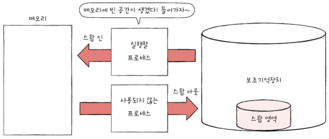

# Chapter 14. 가상 메모리

- [Chapter 14. 가상 메모리](#chapter-14-가상-메모리)
- [14-1. 연속 메모리 할당](#14-1-연속-메모리-할당)
  - [스와핑](#스와핑)
  - [메모리 할당](#메모리-할당)
    - [외부 단편화](#외부-단편화)
- [14-2. 페이징을 통한 가상 메모리 관리](#14-2-페이징을-통한-가상-메모리-관리)
  - [페이징](#페이징)
    - [장점](#장점)
    - [단점 - 내부 단편화](#단점---내부-단편화)
  - [페이지 테이블](#페이지-테이블)
    - [페이지 테이블 엔트리](#페이지-테이블-엔트리)
    - [TLB](#tlb)
    - [계층적 페이징(다단계 페이지 테이블)](#계층적-페이징다단계-페이지-테이블)
  - [페이징에서의 주소 변환](#페이징에서의-주소-변환)
- [14-3. 페이지 교체와 프레임 할당](#14-3-페이지-교체와-프레임-할당)
  - [요구 페이징](#요구-페이징)
  - [페이지 교체 알고리즘](#페이지-교체-알고리즘)
    - [FIFO 페이지 교체 알고리즘](#fifo-페이지-교체-알고리즘)
    - [최적 페이지 교체 알고리즘](#최적-페이지-교체-알고리즘)
    - [LRU 페이지 교체 알고리즘](#lru-페이지-교체-알고리즘)
  - [스래싱과 프레임 할당](#스래싱과-프레임-할당)
    - [스래싱](#스래싱)
    - [프레임 할당 방식](#프레임-할당-방식)
- [Q\&A](#qa)

---

# 14-1. 연속 메모리 할당

- 프로세스에 연속적인 메모리 공간 할당하는 방식

## 스와핑

- 메모리에서 사용되지 **않는** 일부 프로세스를 **보조기억장치**로 내보내고 **실행**할 프로세스를 **메모리**로 들여보내는 메모리 관리 기법
    
    
    
    - **스왑 영역** : 프로세스들이 쫓겨나는 보조기억장치의 일부 영역
    - **스왑 아웃** : 현재 실행되지 않는 프로세스가 메모리 → **스왑 영역**
    - **스왑 인** : 스왑 영역에 있던 프로세스 → **다시 메모리**로 옮겨오는 것
        - 스압 아웃되었던 프로세스가 다시 스왑 인 될 때, 전의 물리 주소와는 다른 주소에 적재될 수 있음
- 프로세스들이 요구하는 메모리 주소 공간의 크기가 실제 메모리 크기보다 큰 경우에도 동시 실행 가능

## 메모리 할당

- 메모리 내의 빈 공간에 프로세스 적재
    
    **최초 적합**
    
    - **최초로 발견**한 적재 가능한 빈 공간에 프로세스를 배치하는 방식
    - 장점
        - 검색 최소화 → 결과적으로 빠른 할당
    
    **최적 적합**
    
    - 프로세스가 적재될 수 있는 **가장 작은 공간**에 프로세스를 배치하는 방식
    
    **최악 적합**
    
    - 프로세스가 적재될 수 있는 **가장 큰 공간**에 프로세스를 배치하는 방식

### 외부 단편화

- 프로세스를 할당하기 어려울 만큼 작은 메모리 공간들로 인해 **메모리가 낭비**되는 현상
    - 각기 다른 크기의 프로세스가 메모리에 연속적으로 할당되었기 때문

빈 공간의 총합은 50MB이지만 50MB 프로세스가 적재될 수 없음

<aside>
👌🏻

**해결 방법은?**

- 압축 : 메모리 조각 모음(흩어져 있는 빈 공간들을 하나로 모으는 방식)
    - 하나로 모으는 동안 시스템은 하던 일 중지
    - 메모리에 있는 내용 이동은 많은 오버헤드 야기
    - 오버헤드 최소화하며 압축할 명확한 방법 결정하기 어려움
- 페이징
</aside>

# 14-2. 페이징을 통한 가상 메모리 관리

- **가상 메모리** : 실행하고자 하는 프로그램을 **일부만 메모리에 적재**하여 실제 물리 메모리 크기보다 더 큰 프로세스를 실행할 수 있게 하는 기술
    - 페이징
    - 세그멘테이션

## 페이징

- **메모리**의 **물리 주소 공간**을 **프레임 단위**로 자르고, **프로세스**의 **논리 주소 공간**을 **페이지 단위**로 자른 뒤 각 페이지를 프레임에 할당하는 가상 메모리 관리 기법

스와핑 사용하여 페이지 단위로 스압 아웃/스압 인

- 프로세스 이루는 페이지 중 실행에 필요한 일부 페이지만 메모리에 적재

### 장점

1. 외부 단편화 문제 해결
2. 프로세스 간 페이지 공유 - 쓰기 시 복사
    - fork 시스템을 호출하면 부모 프로세스의 복사본이 **다른 영역에** 자식 프로세스로서 만들어지고, 각 프로세스의 페이지 테이블은 자신의 고유한 페이지가 할당된 프레임을 가리키는데, 프로세스 생성 시간을 늦추며 불필요한 메모리 낭비를 야기함
    - **쓰기 시 복사**에서는 부모 프로세스와 자식 프로세스가 **동일한 프레임** 가리킴
        - 부모 프로세스의 메모리 공간을 복사하지 않아도 됨
        - 프로세스 간 자원을 공유하지 않아 만일 페이지에 쓰기 작업이 된다면 그 순간 해당 페이지가 별도의 공간으로 복제 됨 ⇒ 프로세스 생성 시간 단축, 메모리 공간 절약
    - 비교 이미지
        
        
        
        
        
        
        
        

### 단점 - 내부 단편화

- 페이지 테이블이 차지하는 공간이 낭비되는 현상
    - 모든 프로세스가 페이지 크기에 딱 맞게 잘리는 것은 아님!
    - 하나의 페이지 크기를 너무 작게 설정하면 그만큼 페이지 테이블도 커짐
    - 즉, 하나의 페이지 크기보다 작은 크기로 발생
    
    
    

## 페이지 테이블

- 페이지 번호와 프레임 번호를 짝지어주는 일종의 이정표
- **페이지 번호**를 이용해 페이지가 **적재된 프레임** 찾을 수 있음
    
    <aside>
    ❓
    
    **왜 필요할까?**
    
    - 프로세스가 메모리에 불연속적으로 배치되어 있다면 CPU 입장에서 순차적으로 실행 불가
        - 프로세스를 이루는 페이지가 어느 프레임에 적재되어 있는지 CPU가 모두 알고 있기란 어렵기 때문
        - 즉, CPU는 다음에 실행할 명령어 위치를 찾기 어려움
    - 프로세스가 물리 주소에 불연속 배치되더라도 **논리 주소**(CPU가 바라보는 주소)에 **연속적으로 배치**되도록 함!
    </aside>
    
- 예시 및 부가 설명

페이지번호 0 = 프레임번호 3, 프로세스마다 각자의 프로세스 테이블 존재

프로세스마다 각자의 프로세스 테이블을 가지고, 각 프로세스의 페이지 테이블은 메모리에 적재됨

⇒ 프로세스들이 메모리에 분산되어 저장되어 있더라도 CPU는 논리 주소를 순차적으로 실행할 수 있음

프로세스 A가 실행될 때 PTBR은 프로세스 A의 페이지 테이블 가리킴, CPU는 프로세스 A의 페이지 테이블을 통해 프로세스 A의 페이지가 적재된 프레임을 알 수 있음

- **페이지 테이블 베이스 레지스터(PTBR)** : 각 프로세스의 페이지 테이블이 적재된 주소
    - 이러한 각 프로세스들의 페이지 테이블 정보들은 각 프로세스의 PCB에 기록 됨
    - 프로세스의 문맥 교환이 일어날 때 다른 레지스터와 마찬가지로 함께 변경됨

### 페이지 테이블 엔트리

- 페이지 테이블의 각각의 행들

페이지 번호, 프레임 번호 외에도 많은 정보들 담김

**유효 비트**

- 해당 페이지가 **메모리에 적재**되어 있는지 여부 알려주는 비트
    - 페이지가 메모리에 적재 ⇒ 1
    - 아니라면(보조기억장치에 있다면) ⇒ 0
        - 페이지 폴트(예외) 발생
            - CPU는 기존의 작업 내역 백업 → 페이지 폴트 처리 루틴(원하는 페이지를 메모리로 가져온 뒤 유효 비트를 1로 변경) 실행 → 해당 페이지에 접근 가능

**보호 비트**

- 페이지에 **접근할 권한을 제한**하여 페이지를 보호하는 비트
    - 읽기/쓰기 가능 ⇒ 1
    - 읽기만 가능 ⇒ 0
    - r(read, 읽기), w(write, 쓰기), x(excute, 실행)으로 구현 가능

**참조 비트**

- 페이지에 **접근한 적이 있는지** 나타내는 비트
    - 적재 이후 CPU가 읽거나 쓴 페이지 ⇒ 1
    - 적재 이후 한 번도 읽거나 쓴 적 없는 페이지 ⇒ 0

**수정 비트(더티 비트)**

- 해당 페이지가 **수정된 적이 있는지** 나타내는 비트
    - 변경된 적 있는 페이지 ⇒ 1
    - 변경된 적 없는 페이지(접근한 적 없거나 읽기만) ⇒ 0
- 페이지가 메모리에서 사라질 때 보조기억장치에 쓰기 작업 해야하는 지, 할 필요 없는지 판단하기 위해 존재
    - CPU는 메모리에 값을 쓰기도 하는데 **수정 비트가 0일 경우** 보조기억장치에 저장된 해당 페이지의 내용과 메모리에 저장된 페이지 내용은 **서로 같은 값 가짐**
        - 스압 아웃될 때 추가 작업 없이 **덮어쓰기만**
    - **수정 비트가 1이라면** 서로 다른 값 갖게 되기 때문에 수정된 적 있는 페이지가 스압 아웃될 경우 **변경된 값을 보조장치에 기록하는 작업 추가**되어야 함

### TLB

<aside>
📢

**페이지 테이블을 메모리에 두면?**

- 메모리 접근 시간 두 배로 늘어남
- 페이지 테이블 보기 위해!, 프레임에 접근하기 위해!
- 해결책 : CPU 옆에 TLB 두기!
</aside>

- **TLB** : **페이지 테이블의 캐시** 메모리 역할 수행
    - 페이지 테이블의 일부 내용 저장
    - 참조 지역성에 근거해 주로 최근에 사용된 페이지 위주로 가져와 저장

- **TLB 히트** : CPU가 발생한 논리 주소에 대한 **페이지 번호가 TLB에 있을 경우**
    - 페이지가 적재된 프레임을 알기 위해 메모리에 접근할 필요 없음
- **TLB 미스** : **페이지 번호가 TLB에 없을 경우**
    - 페이지가 적재된 프레임을 알기 위해 메모리 내의 페이지 테이블에 접근

### 계층적 페이징(다단계 페이지 테이블)

- 페이지 테이블을 페이징하여 여러 단계의 페이지를 두는 방식
    - 페이지 테이블의 크기가 작지 않기 때문에 모든 페이지 테이블 엔트리를 메모리에 두는 것은 메모리 낭비!
    
    
    
    CPU와 가장 가까이 위치한 페이지 테이블은 항상 메모리에 유지해야 함
    
    - 페이지 테이블을 여러 개의 페이지로 쪼개고, 이 페이지를 가리키는 페이지 테이블을 두는 방식
    - 논리 주소
        
        
        
        - 바깥 페이지 번호 : CPU와 근접한 곳에 위치한 페이지 테이블 엔트리
        - 안쪽 페이지 번호 : 첫 번째 페이지 테이블 바깥에 위치한 두 번째 페이지 테이블(페이지 테이블)의 페이지 번호
    - 주소 변환
        
        
        
        - 바깥 페이지 번호를 통해 페이지 테이블의 페이지를 찾기
        - 페이지 테이블의 페이지를 통해 프레임 번호를 찾고 변위를 더함으로서 물리 주소 얻기
    

## 페이징에서의 주소 변환

- 하나의 페이지/프레임은 여러 주소를 포괄 → 특정 주소에 접근하려면 정보 필요
    - **어떤** 페이지/프레임에 **접근하고 싶은지** ⇒ **페이지 번호**
    - 접근하려는 주소가 그 페이지 혹은 프레임으로부터 **얼마나 떨어져있는지** ⇒ **변위**
    - 논리 주소 <페이지 번호, 변위> **-페이지 테이블→** 물리 주소 <페이지 번호, 변위>
    
    
    
    하나의 페이지/프레임이 네 개의 주소로 구성
    
    - CPU가 논리 주소 <5, 2>에 접근하고 싶다면?
        - 페이지 테이블에서 5번 페이지는 1번 프레임에 있음
        - CPU는 1번 프레임, 변위 2에 접근 ⇒ 10번지에 접근!
            - 1번 프레임은 8번지부터 시작

# 14-3. 페이지 교체와 프레임 할당

## 요구 페이징

- **페이지가 필요할 때에만** 메모리에 적재하는 기법
- 과정
    - CPU가 **특정 페이지에 접근**하는 **명령어** 실행 → 해당 페이지의 **유효 비트가 1**일 때 CPU는 페이지가 **적재된 프레임에 접근** / **유효 비트 0**일 땐 **페이지 폴트** 발생 → 페이지 폴트 처리 루틴은 해당 페이지를 메모리로 적재하고 **유효 비트를 1**로 설정 → 다시 처음부터 수행
- 순수 요구 페이징
    - 아무런 페이지도 메모리에 적재하지 않은 채 실행하게 된다면 프로세스의 첫 명령어를 실행하는 순간부터 계속 페이지 폴트 발생
    - 실행에 필요한 페이지가 어느 정도 적재된 이후부터 페이지 폴트 발생 빈도 떨어짐
- 안정적인 요구 페이징을 위해선 페이지 교체, 프레임 할당 해결해야함

## 페이지 교체 알고리즘

- 메모리에 적재된 페이지들 중 **보조기억장치로 보낼 페이지를 결정**하는 방법
- **좋은 페이지 교체 알고리즘은?** **페이지 폴트 가장 적게 일으키는 알고리즘**
    - 페이지 폴트가 일어나면 보조기억장치로부터 필요한 페이지를 가져와야 하기 때문에 메모리에 적재된 페이지를 가져오는 것보다 느려짐
    - 페이지 폴트 횟수는 **페이지 참조열**을 통해 알 수 있음
        - 페이지 참조열은 CPU가 참조하는 페이지들 중 **연속된 페이지를 생략한 페이지열**
        - 2 2 2 2 3 5 5 5 3 7 7 ⇒ **2 3 5 3 7**
        - 중복된 페이지를 참조하는 행위는 페이지 폴트를 발생시키지 않기 때문

### FIFO 페이지 교체 알고리즘

- **적재된 페이지 순서대로** 교체하는 알고리즘

페이지 폴트 횟수 : 4

- 페이지 폴트 ⇒ 적재된 페이지를 교체하기 위해 발생한 페이지 폴트만을 고려
- 자주 참조되는 페이지가 먼저 적재되었다는 이유만으로 내쫓길 수 있음
    - **2차 기회 페이지 교체 알고리즘**
    - 공통점 : 메모리에서 가장 오래 머물렀던 페이지를 대상으로 내보낼 페이지 선별
    - 차이점 : 페이지의 참조 비트가 1일 경우 0으로 만든 뒤 현재 시간을 적재 시간으로 설정
        - 예시 설명
            
            
            

### 최적 페이지 교체 알고리즘

- **앞으로의 사용 빈도가 가장 낮은 페이지**를 교체하는 알고리즘

페이지 폴트 횟수 : 2

- 앞으로 오랫동안 사용되지 않을 페이지 예측하기 어려움
- 다른 페이지 교체 알고리즘의 이론상 성능 평가하기 위한 목적으로 사용
    - 페이지 폴트의 하한선 : 최적 페이지 교체 알고리즘을 실행했을 때 발생하는 페이지 폴트 횟수

### LRU 페이지 교체 알고리즘

- **가장 오랫동안 사용되지 않은 페이지**를 교체하는 알고리즘

페이지 폴트 횟수 : 3

## 스래싱과 프레임 할당

### 스래싱

- 지나치게 **빈번한 페이지 교체**로 인해 **CPU 이용률이 낮아지는 문제**
    
    
    
    프레임이 부족하면 페이지 폴트 자주 발생 → 페이지 교체에 더 많은 시간 소요하여 성능 저하 발생
    
- 그래프로 표현
    
    
    
    멀티프로그래밍 정도 = 메모리에서 동시에 실행되는 프로세스의 수
    
    - 멀티프로그래밍의 정도 높으면 : 현재 메모리에 많은 프로세스가 동시에 실행 중
    - 멀티프로그래밍의 정도 늘린다고 해서 CPU 이용률이 비례해서 증가하는 건 아님
        - 필요 이상으로 늘리면 각 프로세스들이 사용할 수 있는 프레임 수가 적어져 페이지 폴트 지나치게 빈번히 발생
- 스래싱 발생 원인
    - 각 프로세스가 필요로 하는 최소한의 프레임 수가 보장되지 않았기 때문
    - 적절히 프레임 할당해 줄 수 있어야 함

### 프레임 할당 방식

- 정적 할당 방식
    - 프로세스의 실행 과정을 고려하지 않고 단순히 **프로세스의 크기와 물리 메모리의 크기만 고려**한 방식
    - **균등 할당** : 모든 프로세스에 동일한 프레임 배분하는 방식
    - **비례 할당** : 프로세스 크기에 따라 프레임을 배분하는 방식
- 동적 할당 방식
    - **프로세스의 실행**을 보고 할당할 프레임 수 결정하는 방식
    - **작업 집합 모델 기반** : 작업 집합의 크기만큼만 프레임을 할당하는 방식
        - 작업 집합 : 실행 중인 프로세스가 일정 시간 동안 참조한 페이지의 집합
        - 설명 및 예시
            
            
            
    - **페이지 폴트 빈도 기반** : 페이지 폴트율에 상한선과 하한선을 정하고, 그 내부 범위 안에서만 프레임을 할당하는 방식
        
        
        

# Q&A

1. **메모리를 관리하기 위해 어떤 기법을 사용하며, 어떤 문제가 있을 수 있나요?**
2. **외부 단편화 문제를 해결하기 위해 어떻게 하나요?**
3. **프레임을 할당하는 방식에 대해 설명해보세요.**

- **1번 답**
    
    연속된 메모리를 관리하기 위해 스와핑을 사용합니다. 스와핑이란 메모리에서 사용되지 않는 일부 프로세스를 보조기억장치로 내보내고 실행할 프로세스를 메모리로 들여보내는 메모리 관리 기법인데요, 프로세스를 할당하기 어려울 만큼 작은 메모리 공간들로 인해 메모리가 낭비되는 외부 단편화 문제가 발생할 수 있습니다.
    
- **2번 답**
    
    페이징을 통해 가상 메모리를 관리합니다. 페이징은 물리 주소 공간을 프레임 단위로 자르고 프로세스의 논리 주소 공간을 페이지 단위로 자른 뒤 각 페이지를 프레임에 할당하는 기법입니다. 페이지 테이블을 통해 페이지가 적재된 프레임을 찾아 할당하게 됩니다. 
    
- **3번 답**
    
    프레임 할당 방식은 정적 할당 방식과 동적 할당 방식으로 나눌 수 있는데요, 정적 할당 방식은 모든 프로세스에 동일한 프레임을 배분하는 균등 할당과 프로세스의 크기에 따라 배분하는 비례 할당이 있고, 동적 할당에는 작업 집합의 크기 만큼만 할당하는 작업 집합 모델 기반 방식과 페이지 폴트율에 따라 상한선과 하한선을 정하고, 그 내부 범위 안에서만 프레임을 할당하는 페이지 폴트 기반 방식이 있습니다.