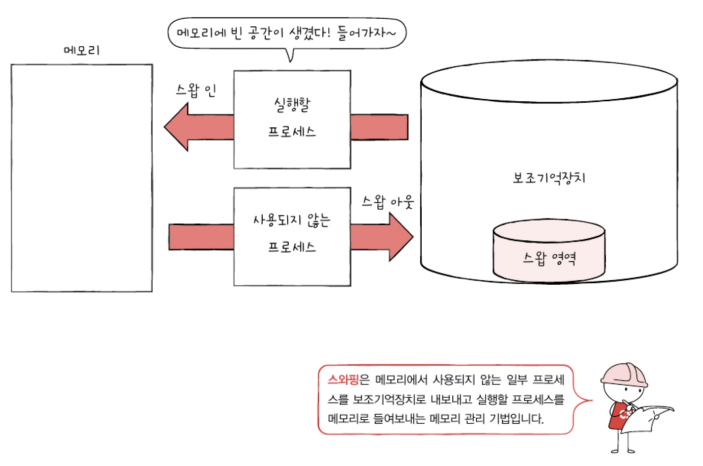
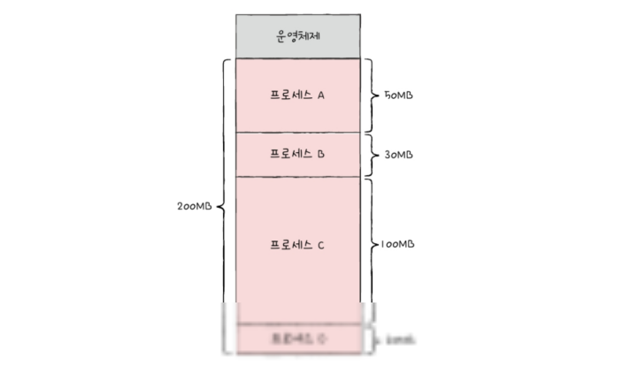

- [14-1. 연속 메모리 할당](#14-1-연속-메모리-할당)
  - [스와핑](#스와핑)
  - [메모리 할당](#메모리-할당)
    - [최초 적합](#최초-적합)
    - [최적 적합](#최적-적합)
    - [최악 적합](#최악-적합)
  - [외부 단편화](#외부-단편화)
- [14-2. 페이징을 통한 가상 메모리 관리](#14-2-페이징을-통한-가상-메모리-관리)
  - [페이징이란](#페이징이란)
  - [페이지 테이블](#페이지-테이블)
  - [페이징에서의 주소 변환](#페이징에서의-주소-변환)
  - [페이지 테이블 엔트리](#페이지-테이블-엔트리)
    - [유효 비트](#유효-비트)
    - [보호 비트](#보호-비트)
    - [참조 비트](#참조-비트)
    - [수정 비트(더티 비트)](#수정-비트더티-비트)
- [14-3. 페이지 교체와 프레임 할당](#14-3-페이지-교체와-프레임-할당)
  - [요구 페이징](#요구-페이징)
  - [페이지 교체 알고리즘](#페이지-교체-알고리즘)
    - [FIFO 페이지 교체 알고리즘](#fifo-페이지-교체-알고리즘)
    - [최적 페이지 교체 알고리즘](#최적-페이지-교체-알고리즘)
    - [LRU 페이지 교체 알고리즘](#lru-페이지-교체-알고리즘)
  - [스래싱과 프레임 할당](#스래싱과-프레임-할당)
  - [📖](#)

# 14-1. 연속 메모리 할당

프로세스 A를 A의 크기만큼 메모리 주소를 할당 받아 연속적으로 배치되고, 프로세스 B는 프로세스 A 이후에 또 B의 크기만큼 연속적인 메모리 주소를 할당받아 배치되는 것 처럼\

프로세스에 연속적인 메모리 공간을 할당하는 방식을 `연속 메모리 할당`방식 이라 함

↓ 연속 메모리 할당 방식에서 무엇을 고려해야 하는지, 어떤 잠재적인 문제가 있는지

## 스와핑
`스와핑`: 메모리에 적재된 프로세스들 중에 현재 실행되지 않는 프로세스를 임시로 보조 기억장치 일부 영역으로 쫓아내고, 그렇게 해서 생긴 메모리 상의 빈 공간에 또 다른 프로세스를 적재하여 실행하는 방식

`스왑 영역`: 프로세스들이 쫓겨나는 보조기억장치의 일부 영역\
`스왑 아웃`: 현재 실행되지 않는 프로세스가 메모리에서 스왑 영역으로 옮겨지는 것\
`스왑 인`: 스왑 영역에 있던 프로세스가 다시 메모리로 옮겨오는 것

이 때 스왑 아웃 되었던 프로세스가 다시 스왑 인될 때, 스왑 아웃되기 전의 물리주소와는 다른 주소에 적재될 수 있음\

스와핑을 이용하면 아래와 같이 프로세스들이 요구하는 메모리 주소 공간의 크기가 실제 메모리 크기보다 큰 경우에도 프로세스들을 동시 실행할 수 있음

## 메모리 할당
메모리 내에 빈 공간이 여러 개 있다면 프로세스를 어디에 배치해야할까?\
비어있는 메모리 공간에 프로세스를 연속적으로 할당하는 방식: `최초 적합`, `최적 적합`, `최악 적합`

ex) 적재하고 싶은 프로세스 크기: 20MB, 메모리의 사용자 영역: 200MB, 프로세스를 적재할 수 있는 빈 공간: 빈 공간A, 빈 공간 B, 빈 공간 C

### 최초 적합
운영체제가 메모리 내의 빈 공간을 순서대로 검색하다가 적재할 수 있는 공간을 발견하면 그 공간에 프로세스를 배치하는 방식\
프로세스가 적재될 수 있는 공간을 발견하는 즉시 메모리를 할당하는 방식이므로 검색을 최소화할 수 있고 결과적으로 빠른 할당이 가능함

### 최적 적합
운영체제가 빈 공간을 모두 검색해 본 후, 프로세스가 적개될 수 있는 공간 중 가장 작은 공간에 프로세스를 배치하는 방식\
위의 경우 빈 공간C에 할당됨

### 최악 적합
운영체제가 빈 공간을 모두 검색해 본 후, 프로세스가 적재될 수 있는 공간 중 가장 큰 공간에 프로세스를 배치하는 방식\
위의 경우 가장 큰 공간인 B에 프로세스가 할당 됨

## 외부 단편화
연속 메모리 할당은 메모리를 효율적으로 사용하는 방법은 아님(`외부 단편화`라는 문제를 내포하고 있기 때문)

▲ 아무런 프로세스도 적재되지 않은 상태의 메모리

위의 메모리의 사용자 여역에 프로세스들이 하나둘씩 적재되는 상황 가정.\
사용자 영역 크기: 200MB, 프로세스 A: 50MB, 프로세스 B: 30MB, 프로세스 C: 100MB, 프로세스 D: 20MB 

A, B, C, D를 차례대로 적재해야 할 경우 적재 예시\

프로세스 B, D의 실행이 끝났을 경우 B, D가 있던 자리에는 빈 공간이 생김\

이 경우 빈 공간의 총 합은 50MB이지만 위의 상황에서 50MB 크기의 프로세스를 적재하는 것은 불가능함 => 메모리 낭비로 이어짐\
위와 같은 현상을 `외부 단편화`라고 함

외부 단편화를 해결할 수 있는 대표적인 방안으로 메모리를 `압축`하는 방법이 있음\
`압축`: 메모리 조각 모음이라고도 부름. 여기저기 흩어져 있는 빈 공간들을 하나로 모으는 방식으로 메모리 내에 저장된 프로세스를 적당히 재배치시켜 여기저기 흩어져 있는 작은 빈 공간들을 하나의 큰 빈 공간으로 만드는 방법

압축의 단점
- 작은 빈 공간을 하나로 모으는 동안 시스템은 하던 일을 중지해야 함
- 메모리에 있는 내용을 옮기는 작업은 많은 오버헤드를 야기함
- 어떤 프로세스를 어떻게 움직여야 오버헤드를 최소화하며 압축할 수 있는지에 대한 명확한 방법을 결정하기 어려움

# 14-2. 페이징을 통한 가상 메모리 관리
페이징 기법: 외부 단편화를 없앨 수 있는 또 다른 해결 방안

프로세스를 메모리에 연속적으로 할당하는 방식의 문제점
- 외부 단편화
- 물리 메모리보다 큰 프로세스를 실행할 수 없음

`가상 메모리`: 실행하고자 하는 프로그램을 일부만 메모리에 적재하여 실제 물리 메모리 크기보다 더 큰 프로세스를 실행할 수 있게 하는 기술\
이를 가능하게 하는 가상 메로리 관리 기법: `페이징`, 세그멘테이션

## 페이징이란
외부 단편화가 생긴 근본적인 이유: 각기 다른 크기의 프로세스가 메모리에 연속적으로 할당되었기 때문\

| | |
| :-: | :-: |
|오른쪽 그림과 같이 프로세스를 일정한 단위로 자르고, 이를 메모리에 불연속적으로도 할당할 수만 있다면 외부 단편화는 발생하지 않음||

`페이징`: 프로세스의 논리 주소 공간을 페이지라는 일정한 단위로 자르고, 메모리 물리 주소 공간을 프레임이라는 페이지와 동일한 크기의 일정한 단위로 자른 뒤 페이지를 프레임에 할당하는 가상 메모리 관리 기법

페이징에서도 스와핑을 사용할 수 있음. 이때 페이징을 사용하는 시스템에서는 프로세스 전체가 스왑 아웃/스왑 인 되는 것이 아닌 페이지 단위로 스왑 아웃(=== 페이지 아웃)/스왑 인(=== 페이지 인) 됨

즉, 프로세스를 이루는 페이지 중 실행에 필요한 일부 페이지만을 메모리에 적재하고, 당장 실행에 필요하지 않은 페이지들은 보조기억장치에 남겨둘 수 있음 => 물리 메모리보다 더 큰 프로세스를 실행할 수 있음\

## 페이지 테이블
프로세스가 메모리에 불연속적으로 배치되면 CPU입장에서는 '다음에 실행할 명령어 위치'를 찾기가 어려워 짐

`페이지 테이블`: 페이징 시스템으로 프로세스가 비록 (실제 메모리 내의 주소인) 물리 주소에 불연속적으로 배치되더라도 (CPU가 바라보는 주소인) 논리 주소에는 연속적으로 배치되도록 하는 방법. 현재 어떤 페이지가 어떤 프레임에 할당되었는지를 알려줌(페이지 번호와 프레임 번호를 짝지어주는 일종의 이정표)

ex)  프로세스 A의 페이지 테이블\
CPU는 이를 보고 '0번 페이지는 3번 프레임에, 1번 페이지는 5번 프레임에, 2번 페이지는 2번 프레임에 할당되어 있다'라는 사실을 알 수 있음\

비록 물리 주소상에서는 프로세스들이 분산되어 저장되어 있더라도 CPU 입장에서 바라본 논리 주소는 연속적으로 보일 수 있음\

> 참고) 내부 단편화\
> 페이징은 외부 단편화 문제를 해결할 수 있지만, 내부 단편화라는 문제를 야기할 수 있음
> 모든 프로세스 크기가 페이지의 배수인 건 아니므로 마지막 페이지에는 잔여 크기가 남음 === 내부 단편화\
> 

프로세스마다 각자의 프로세스 테이블을 가지고 있고 각 프로세스의 페이지 테이블들은 메모리에 적재되어 있음. 그리고 CPU 내의 `페이지 테이블 베이스 레지스터(PTBR)`는 각 프로세스의 페이지 테이블이 적재된 주소를 가리키고 있음

ex) 프로세스 A가 실행될 때 PTBR은 프로세스 A의 페이지 테이블을 가리키고, CPU는 프로세스 A의 페이지 테이블을 통해 프로세스 A의 페이지가 적재된 프레임을 알 수 있음\

하지만 페이지 테이블을 메모리에 두면 메모리 접근 시간이 두 배로 늘어난다는 문제가 있음\

=> CPU 곁에(일반적으로 MMU 내에) `TLB`라는 페이지 테이블의 캐시 메모리를 둠\

CPU가 발생한 논리 주소에 대한 페이지 번호가 TLB에 있을 경우 이를 `TLB 히트`라고 함. 이 경우 페이지가 적재된 프레임을 알기 위해 메모리에 접근할 필요가 없음\
만일 페이지 번호가 TLB에 없을 경 페이지가 적재된 프레임을 알기 위해 메모리 내의 페이지 테이블에 접근하는 수밖에 없음(`TLB 미스`)\

## 페이징에서의 주소 변환
하나의 페이지 혹은 프레임은 여러 주소를 포괄하고 있음 => 특정 주소에 접근하려면 아래와 같은 정보 필요
- 어떤 페이지 혹은 프레임에 접근하고 싶은지
- 접근하려는 주소가 그 페이지 혹은 프레임으로부터 얼마나 떨어져 있는지

페이징 시스템에서는 모든 논리 주소가 기본적으로 `페이지 번호`와 `변위`로 이루어져 있음. 가령 CPU가 32비트 주소를 내보냈다면 이 중 N비트는 페이지 번호, 32-N비트는 변위\

`페이지 번호`: 접근하고자 하는 페이지 번호\
`변위`: 접근하려는 주소가 프레임의 시작 번지로부터 얼만큼 떨어져 있는지를 알기 위한 정보

즉 논리 주소 <페이지 번호, 변위>는 페이지 테이블을 통해 물리 주소 <프레임 번호, 변위>로 변환됨

ex) 페이지/프레임이 네 개의 주소로 구성되어 있느 상황을 가정\

CPU가 5번 페이지, 변위 2라는 논리 주소(<5, 2>)에 접근하고 싶어한다면...\
5번 페이지는 현재 1번 프레임에 있으므로 CPU는 1번 프레임, 변위 2에 접근하게 됨. 1번 프레임은 8번지부터 시작하므로 CPU는 10번지에 접근하게 됨

## 페이지 테이블 엔트리
`페이지 테이블 엔트리`: 페이지 테이블의 각각의 행동들\

페이지 테이블 엔트리에 담기는 정보로 페이지 번호, 프레임 번호만을 설명했지만 이외에도 다른 중요한 정보들이 있음(유효 비트, 보호 비트, 참조 비트, 수정 비트)

### 유효 비트
: 현재 해당 페이지에 접근 가능한지 여부를 알려줌. 현재 페이지가 메모리에 적재되어 있는지 아니면 보조기억장치에 있는지를 알려주는 비트. 즉, 페이지가 메모리에 적재되어 있다면 1, 적재되어 있지 않다면 0이 됨

CPU가 유효 비트가 0인 메모리에 적재되어 있지 않은 페이지로 접근하려고 하면 `페이지 폴트`라는 예외가 발생함

페이지 폴트 처리 과정
1. CPU는 기존 작업 내역을 백업한다
2. 페이지 폴트 처리 루틴을 실행한다
3. 페이지 처리 루틴은 원하는 페이지를 메모리로 가져온 뒤 유효 비트를 1로 변경해준다
4. 페이지 폴트를 처리했다면 이제 CPU는 해당 페이지에 접근할 수 있게 된다

### 보호 비트
: 페이지 보호 기능을 위해 존재하는 비트. 1일 경우 읽고 쓰기가 모두 가능한 페이지임을 나타내고 0일 경우 읽기만 가능한 페이지 임을 나타냄

보호 비트는 r(읽기), w(쓰기), x(실행)의 조합으로 나타낼 수 있음\
가령 보호 비트가 100으로 설정된 페이지의 경우 r은 1 w, x는 0이므로 읽기만 가능함\

### 참조 비트
: CPU가 이 페이지에 접근한 적이 있는지의 여부를 나타냄. 적재 이후 CPU가 읽거나 쓴 페이지는 1로 세팅되고, 적재 이후 한 번도 읽거나 쓴 적이 없는 페이지는 0으로 유지 됨\

### 수정 비트(더티 비트)
: 해당 페이지에 데이터를 쓴 적이 있는지 없는지 수정 여부를 알려줌. 1 일 경우 변경된 적이 있는 페이지, 0일 경우 변경된 적이 없는 페이지(한 번도 접근한 적 없거나 읽기만 했던 페이지)임을 나타냄

메모리에서 사라질 때 보조기억장치에 쓰기 작업을 해야하는지, 할 필요가 없는지를 판단하기 위해 존재.

CPU가 한 번도 접근하지 않았거나 읽기만 한 페이지의 경우 보조기억장치에 저장된 해당 페이지의 내용과 메모리에 저장된 페이지 내용이 같으므로 스왑 아웃될 경우 아무런 추가 작업 없이 새로 적재된 페이지로 덮어쓰기만 하면 됨

하지만 수정비트가 1인 경우 보조기억장치에 저장된 페이지의 내용과 메모리에 저장된 페이지의 내용은 서로 다른 값을 갖게 됨\
\
이렇게 수정된 적이 있는 페이지가 스왑 아웃될 경우 변경된 값을 보조기억장치에 기록하는 작업이 추가되어야 함. 이 작업이 필요한 페이지인지 아닌지를 판단하기 위해 페이지 테이블 엔트리에 수정비트를 두는 것

# 14-3. 페이지 교체와 프레임 할당

## 요구 페이징
: 프로세스를 메모리에 적재할 때 처음부터 모든 페이지를 적재하지 않고 필요한 페이지만을 메모리에 적재하는 기법

요구 페이징의 기본적인 양상\

> 참고) `순수 요구 페이징` 기법\
> 아무런 페이지도 메모리에 적재하지 않은 채 무작정 실행부터 하는 것. 이 경우 첫 명령어를 실행하는 순간부터 페이지 폴트가 계속 발생하게 되고, 실행에 필요한 페이지가 어느 정도 적재된 이후부터는 페이지 폴트 발생 빈도가 떨어짐

요구 페이징 시스템이 안정적으로 작동하기 위해 반드시 해결해야 하는 것
- 페이지 교체
- 프레임 할당

## 페이지 교체 알고리즘
: 페이징 기법으로 메모리가 가득 찼을 경우 메모리에 적재된 페이지 중 어떤 페이지를 보조기억장치로 내보내는 것이 최선인지 결정하는 알고리즘

좋은 페이지 교체 알고리즘 === 페이지 폴트를 가장 적게 일으키는 알고리즘\
페이지 교체 알고리즘을 이해하기 위해 `페이지 폴트 횟수`를 알 수 있어야하며, 페이지 폴트 횟수는 `페이지 참조열`을 통해 알 수 있음

`페이지 참조열`: CPU가 참조하는 페이지들 중 연속된 페이지를 생략한 페이지열

ex) CPU가 아래와 같은 순서로 접근했다고 가정

연속된 페이지 생략하는 이유: 중복된 페이지를 참조하는 행위는 페이지 폴트를 발생시키지 않기 때문

### FIFO 페이지 교체 알고리즘
메모리에 가장 먼저 올라온 페이지부터 내쫓는 방식

ex) 프로세스가 사용할 수 있는 프레임이 세 개 있다고 가정하고 페이지 참조열이 아래와 같다고 해보자\

FIFO 페이지 교체 알고리즘은 총 네 번의 페이지 폴트가 발생\

단점: 어떤 페이지는 프로그램 실행 내내 사용될 내용을 포함하고 있을 수도 있는데, 이런 페이지는 메모리에 먼저 적재되었다고 해서 내쫓는 건 비효율적

### 최적 페이지 교체 알고리즘
: CPU에 의해 참조되는 횟수를 고려하는 페이지 교체 알고리즘, 즉 사용 빈도가 가장 낮은 페이지를 교체하는 알고리즘

ex)
\
페이지 폴트 빈도가 더 낮아짐

단점: 구현이 어려움. 앞으로 오랫동안 사용되지 않을 페이지를 예측하긴 어렵기 때문

### LRU 페이지 교체 알고리즘
가장 오랫동안 사용되지 '않은' 페이지를 교체하는 알고리즘

페이지마다 마지막으로 사용한 시간을 토대로 최근에 가장 사용이 적었던 페이지를 교체함\

## 스래싱과 프레임 할당
프로세스가 사용할 수 있는 프레임 수가 적어도 페이지 폴트는 자주 발생함\

프레임이 부족하면 CPU는 페이지 폴트가 자주 발생 => 페이지 교체에 너무 많은 시간을 쏟으면 성능 저하 초래

이렇게 프로세스가 실제 실행되는 시간보다 페이징에 더 많은 시간을 소요하여 성능이 저해되는 문제를 `스래싱`이라 함

▼ 스래싱을 그래프로 표현한 것\
\
세로축: CPU가 얼마나 쉴 새 없이 일을 하고 있는지를 알 수 있음\
가로축: 메모리에 올라와 있는 프로세스의 수

`멀티프로그래밍의 정도`: 메모리에서 동시에 실행되는 프로세스의 수

멀티프로그래밍의 정도를 필요 이상으로 늘리면 각 프로세스들이 사용할 수 있는 프레임 수가 적어지기 때문에 페이지 폴트가 지나치게 빈번히 발생 => CPU 이용률이 떨어져 전체적인 성능이 저해됨

스래싱 발생 원인: 각 프로세스가 필요로 하는 최소한의 프레임 수가 보장되지 않았기 때문\
ex) 프로세스 A를 무리 없이 실행하기 위해 최소 열 개의 프레임이 필요한데도 불구하고 프로세스 A가 다섯 개의 프레임만 이용할 수 있다면 해당 프로세스는 페이지 폴트가 자주 발생 => 스래싱 발생 위험이 높아짐

=> 운영체제는 각 프로세스들이 무리없이 실행하기 위한 최소한의 프레임 수를 파악하고 프로세스들에 적절한 수만큼 프레임을 할당해 줄 수 있어야 함

`균등 할당`: 모든 프로세스에 균등하게 프레임을 제공하는 방식. 가령 세 개의 프로세스에 300개의 프레임을 할당할 수 있다면 각 프로세스에 100개식 할당\
↳ 실행되는 프로세스들의 크기가 각기 다르므로 동일한 프레임 개수를 할당하는 것은 비합리적

`비례 할당`: 프로세스의 크기가 크면 프레임을 많이 할당하고 프로세스 크기가 작으면 프레임을 적게 나눠주는 방식\
↳ 프로세스의 크기가 클 지라도 막상 실행했을 때 많은 프레임을 필요로 하지 않는 경우도 있음

즉, 하나의 프로세스가 실제로 얼마나 많은 프레임이 필요할지는 결국 실행해봐야 하는 경우가 많음

프로세스를 실행하는 과정에서 배분할 프레임을 결정하는 방식: `작업 집합 모델`을 사용하는 방식, `페이지 폴트 빈도`를 사용하는 방식

**`작업 집합 모델`을 사용하는 방식**\
프로세스가 일정 기간 동안 참조한 페이지 집합을 기억하여 빈번한 페이지 교체를 방지함

CPU가 특정 시간 동안 주로 참조한 페이지 개수만큼만 프레임을 할당하면 페이지 교체는 빈번하게 발생하지 않음\
만약 CPU가 어떤 프로세스를 실행하는 동안 3초에 일곱 개의 페이지를 집중적으로 참조했다면 운영체제는 그 프로세스를 위해 최소 일곱 개의 프레임을 할당하면 됨

`작업 집합`: 실행 중인 프로세스가 일정 시간 동안 참조한 페이지의 집합

**`페이지 폴트 빈도`를 기반으로 사용하는 방식**\
발생 배경
1. 페이지 폴트율이 너무 높으면 그 프로세스는 너무 적은 프레임을 갖고 있다.
2. 페이지 폴트율이 너무 낮으면 그 프로세스가 너무 많은 프레임을 갖고 있다.

할당된 프레임 수와 페이지 폴트율이 반비례 관계를 띄는 것을 알 수 있음\

붉은 선: 임의로 그은 상한선과 하한선\

페이지 폴트율이 상한선보다 더 높아지면 그 프로세스는 너무 적은 프레임을 갖고 있음 => 프레임을 더 할당해주면 됨\
페이지 폴트율이 하한선보다 더 낮아지면 너무 많은 프레임을 갖고 있다고 볼 수 있음 => 다른 프로세스에 할당하기 위해 프레임을 회수

즉, 페이지 폴트 기반 프레임 할당 방식은 페이지 폴트율에 상한선과 하한선을 정하고 이 범위 안에서만 프레임을 할당하는 방식

---

## 📖

Q1. 메모리를 연속해서 할당하는 방식인 최초 적합, 최적 적합, 최악 적합에 대해 간단히 설명하시오. 

A1. 최초 적합은 운영체제가 메모리 내의 빈 공간을 순서대로 검색하다가 적재할 수 있는 공간을 발견하면 그 공간에 프로세스를 배치하는 방식이고, 최적 적합은 운영체제가 빈 공간을 모두 검색해 본 후, 프로세스가 적개될 수 있는 공간 중 가장 작은 공간에 프로세스를 배치하는 방식, 최악 적합은 운영체제가 빈 공간을 모두 검색해 본 후, 프로세스가 적재될 수 있는 공간 중 가장 큰 공간에 프로세스를 배치하는 방식이다.

Q2. 가상 메모리 관리기법 중 하나인 페이징 기법에 대해 설명하시오.

A2. 페이징 기법은 프로세스의 논리 주소 공간을 페이지라는 일정한 단위로 자르고, 메모리 물리 주소 공간을 프레임이라는 페이지와 동일한 크기의 일정한 단위로 자른 뒤 페이지를 프레임에 할당하는 가상 메모리 관리 기법이다.

Q3. 페이지 교체 알고리즘에서 최적 페이지 교체 알고리즘과 LRU 페이지 교체 알고리즘의 차이 대해 간단히 설명하시오

A3. 최적 페이지 교체 알고리즘은 가장 오랫동안 사용되지 **않을** 페이지를 교체하는 알고리즘이고, LRU 페이지 교체 알고리즘은 가장 오랫동안 사용되지 **않은** 페이지를 교체하는 알고리즘이다.