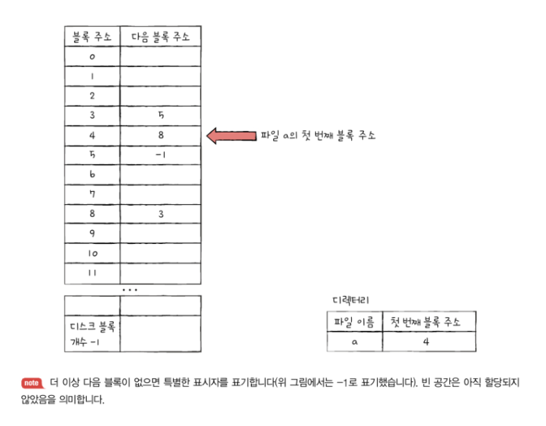
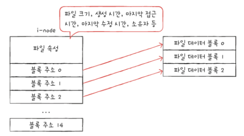

# 15. 파일 시스템
- [15. 파일 시스템](#15-파일-시스템)
  - [15-1. 파일과 디렉터리](#15-1-파일과-디렉터리)
    - [(1) 파일](#1-파일)
      - [1. 파일](#1-파일-1)
      - [2. 파일을 이루는 정보](#2-파일을-이루는-정보)
      - [3. 파일 속성과 유형](#3-파일-속성과-유형)
      - [4. 파일 연산을 위한 시스템 호출](#4-파일-연산을-위한-시스템-호출)
    - [(2) 디렉터리](#2-디렉터리)
      - [1. 절대 경로와 상대 경로](#1-절대-경로와-상대-경로)
      - [2. 디렉터리 연산을 위한 시스템 호출](#2-디렉터리-연산을-위한-시스템-호출)
      - [3. 디렉터리 엔트리](#3-디렉터리-엔트리)
  - [15-2. 파일 시스템](#15-2-파일-시스템)
    - [(1) 파티셔닝과 포매팅](#1-파티셔닝과-포매팅)
    - [(2) 파일 할당 방법](#2-파일-할당-방법)
      - [1. 연속 할당](#1-연속-할당)
      - [2. 연결 할당](#2-연결-할당)
      - [3. 색인 할당](#3-색인-할당)
    - [(3) 파일 시스템 살펴보기](#3-파일-시스템-살펴보기)
      - [1. FAT 파일 시스템](#1-fat-파일-시스템)
      - [2. 유닉스 파일 시스템](#2-유닉스-파일-시스템)
  - [Q\&A](#qa)
    - [Q1. 파일 할당 방법에 대해 설명하세요.](#q1-파일-할당-방법에-대해-설명하세요)
    - [Q2. FAT 파일 시스템과 유닉스 파일 시스템에 대해 설명하세요.](#q2-fat-파일-시스템과-유닉스-파일-시스템에-대해-설명하세요)
    - [Q3. 유닉스 파일 시스템에서 한 i-node에 저장할 수 없도록 큰 파일을 어떻게 불러오나요?](#q3-유닉스-파일-시스템에서-한-i-node에-저장할-수-없도록-큰-파일을-어떻게-불러오나요)

## 15-1. 파일과 디렉터리
- 파일과 디렉터리 모두 운영체제 내부 파일 시스템이 관리함
  - 보조기억장치에 있는 데이터 덩어리

### (1) 파일
#### 1. 파일
- 파일 : 하드 디스크나 SSD와 같은 보조기억장치에 저장된 관련 정보의 집합
  - 의미 있고 관련 있는 정보를 모은 논리적 단위를 의미

#### 2. 파일을 이루는 정보
- 이름
- 파일을 실행하기 위한 정보
- 파일 부가 정보
  - 파일 속성 : 형식, 위치, 크기 등 파일과 관련된 다양한 정보
  - 메타데이터

#### 3. 파일 속성과 유형
- 운영체제마다 유지하는 파일 속성은 조금씩 차이가 있지만 대표적인 속성의 종류는 비슷
- 파일 시스템은 파일별로 다음과 같은 속성을 유지하고 관리함

- 파일 유형 : 운영체제가 인식하는 파일 종류
  - 같은 이름의 파일이라도 유형이 다르면 실행 양상도 달라짐
  - 파일 유형을 운영체제에 알려주기 위해 **확장자**를 이용
  -  ](<파일 유형과 확장자.png>)

#### 4. 파일 연산을 위한 시스템 호출
- 파일을 다루는 모든 작업은 운영체제에 의해 이루어짐
- 시스템 호출 : 모든 응용 프로그램은 파일을 조작하지 못하고 운영체제를 통해 동작이 호출됨
  1. 파일 생성
  2. 파일 삭제
  3. 파일 열기
  4. 파일 닫기
  5. 파일 읽기
  6. 파일 쓰기

### (2) 디렉터리
- 디렉터리 : 윈도우 운영체제에서는 **폴더**라고 불림

- 1단계 디렉터리 : 모든 파일이 하나의 디렉터리 아래에 있는 구조
  - ](<1단계 디렉터리.png>)
  - 컴퓨터 용량이 커지면서 저장할 수 있는 파일이 많아지고 1단계 디렉터리로는 많은 파일을 관리하기 어려워 **트리 구조 디렉터리**가 생겨남

- 트리 구조 디렉터리 : 최상위 디렉터리가 있고, 아래 여러 서브 디렉터리(자식 디렉터리)가 있을 수 있음
  - 최상위 디렉터리 = 루트 디렉터리, /로 표현함
  - ](<트리 구조 디렉터리.png>)
  
- 경로 : 디렉터리를 이용해 파일 위치, 나아가 파일 이름을 특정 짓는 정보

#### 1. 절대 경로와 상대 경로
- 절대 경로 : 루트 디렉터리부터 파일까지 경로
  - 같은 이름의 디렉터리일지라도 경로가 다르면 중복되어 존재할 수 있음
  - 디렉터리와 디렉터리 사이의 구분자로 /(맥) 또는 ￦(윈도우)를 사용하여 구분함
  - 예 : /home

- 상대 경로 : 현재 디렉터리부터 시작하는 경로
  - 예 : 현재 디렉터리가 home인 경우 /d.jpg를 나타내는 상대 경로 - guest/d.jpg

#### 2. 디렉터리 연산을 위한 시스템 호출
- 파일 연산을 위해 시스템 호출하는 것처럼 운영체제는 디렉터리 연산을 위한 시스템 호출도 제공
  1. 디렉터리 생성
  2. 디렉터리 삭제
  3. 디렉터리 열기
  4. 디렉터리 닫기
  5. 디렉터리 읽기

#### 3. 디렉터리 엔트리
- 많은 운영체제에서는 디렉터리를 **특별한 형태의 파일**로 간주함  
  => 디렉터리도 파일임, 포함된 정보가 특별할 뿐

- 파일은 내부에 해당 파일과 관련된 정보를 담고 있음
- 디렉터리는 내부에 해당 디렉터리에 담겨 있는 대상과 관련된 정보를 담고 있음  
  => 보조기억장치에 테이블 형태의 정보로 저장됨

- 디렉터리 테이블
  - 디렉터리에 포함된 대상의 이름과 보조기억장치 내 저장된 위치를 유추할 수 있는 정보가 기본적으로 담김
  - ](<디렉터리 테이블.png>)
  - 파일 시스템에 따라 다양한 파일 속성을 명시하는 경우도 있음
  - 예시
    - 디렉터리 트리 구조
      - ](<예시 디렉터리 트리 구조.png>)
    - home 디렉터리 테이블
      - ](<home 디렉터리 테이블.png>)
    - 디렉터리 엔트리를 통해 보조기억장치에 저장된 위치를 알 수 있기 대문에 home 디렉터리에서 minchul 디렉터리가 저장된 곳을 알 수 있고 이동할 수 있음
    - ](<디렉터리 엔트리를 통한 저장 위치.png>)

## 15-2. 파일 시스템
- 대표적인 파일 시스템 : FAT 파일 시스템, 유닉스 파일 시스템

### (1) 파티셔닝과 포매팅
- 보조기억장치를 사용하려면 파티셔닝과 포매팅을 거쳐야 함

- 파티셔닝 : 저장 장치의 논리적인 영역을 구획하는 작업
  - 파티션 : 파티셔닝 작업을 통해 나누어진 영역 하나 하나

- 포매팅 : 파일 시스템을 설정하여 어떤 방식으로 파일을 저장하고 관리할 것인지 결정하고 새로운 데이터를 쓸 준비를 하는 작업
  - 어떤 종류의 파일 시스템을 사용할지는 이때 결정됨
  - 저수준 포매팅 : 저장 장치를 생성할 당시 공장에서 수행되는 물리적 포매팅
  - 논리적 포매팅 : 파일 시스템을 생성하는 포매팅, 책에서 설명하는 것

- 파일 시스템에는 여러 종류가 있고 파티션마다 다른 파일 시스템을 설정할 수도 있음
- 파티셔닝과 포매팅은 동시에 진행되는 경우도 많고 포매팅까지 완료되어 판매하는 경우도 많음

### (2) 파일 할당 방법
- 운영체제는 파일과 디렉터리를 **블록** 단위로 읽고 씀
- 하나의 파일이 보조기억장치에 저장될 때 하나 이상의 블록에 걸쳐 저장됨
- 섹터 : 하드 디스크의 가장 작은 저장 단위
- 블록 : 하나 이상의 섹터를 블록이라는 단위로 묶음
  - 운영체제는 하나 이상의 섹터를 블록이라는 단위로 묶은 뒤 블록 단위로 파일과 디렉터리를 관리

- 파일을 보조기억장치에 할당하는 방법
  1. 연속 할당
  2. 불연속 할당
    - 연결 할당
    - 색인 할당

#### 1. 연속 할당
- 연속 할당 : 가장 단순한 방식으로 보조기억장치 내 연속적인 블록에 파일을 할당하는 방식
  - 
  - 연속으로 할당된 파일에 접근하는 방법 : 첫번째 블록 주소, 블록 단위의 길이를 알아야 함
    - 디렉터리 엔트리에 파일 이름과 더불어 첫번째 블록 주소, 블록 단위의 길이를 명시
- 장점 : 연속적으로 저장하여 구현이 단순함
- 단점 : 외부 단편화를 야기함
  - 연속적으로 할당된 파일들 중 중간에 특정한 파일만 삭제된 경우 외부 단편화 발생

#### 2. 연결 할당
- 연결 할당 : 각 블록 일부에 다음 블록의 주소를 저장하여 각 블록이 다음 블록을 가르키는 형태로 할당하는 방식
  - 
  - 파일을 이루는 데이터를 연결 리스트로 관리함
  - 불연속 할당의 일종이기에 파일이 여러 블록에 흩어져 저장되어도 무방
  - 연결 할당을 사용하는 파일 시스템에서는 디렉터리 엔트리에 연속 할당과 마찬가지로 파일 이름과 함께 첫번째 블록 주소와 블록 단위의 길이를 명시함
- 장점 : 외부 단편화 문제 해결
- 단점
  1. 반드시 첫번째 블록부터 하나씩 차례대로 읽어야 함
    - 임의 접근 속도(파일 내 임의의 위치에 접근하는 속도)가 매우 느림
  2. 하드웨어 고장이나 오류 발생 시 해당 블록 이후 블록은 접근할 수 없음
    - 하나의 블록 안에 파일 데이터와 다음 블록 주소가 모두 포함되어 있기 때문에 오류로 인해 파일을 이루는 블록에 하나라도 문제가 발생하면 그 이후 블록에 접근할 수 없음

#### 3. 색인 할당
- 색인 할당 : 파일의 모든 블록 주소를 색인 블록이라는 하나의 블록에 모아 관리하는 방식
  - 디렉터리 엔트리에 파일 이름과 더불어 **색인 블록 주소**를 명시
  - 
  - 임의의 위치에 접근하기 쉬움
  - 색인 할당 기반으로 만든 파일 시스템이 **유닉스 파일 시스템**

### (3) 파일 시스템 살펴보기
- FAT 파일 시스템 : USB 메모리, SD 카드 등의 저용량 저장 장치에서 사용
- 유닉스 파일 시스템 : 유닉스 계열 운영체제에서 사용

#### 1. FAT 파일 시스템
- 연결 할당의 블록 안에 다음 블록의 주소를 저장하여 생긴 단점을 보완한 파일 시스템
  - 각 블록에 포함된 다음 블록의 주소들을 테이블 형태로 관리하면 단점을 해소할 수 있음 => 파일 할당 테이블

- 파일 할당 테이블 (FAT : File Allocation Table) : 각 블록에 포함된 다음 블록의 주소들을 적어놓은 테이블
  - 

- FAT 파일 시스템 : FAT를 이용하는 파일 시스템
  - MS-DOS에서 사용됨
  - USB메모리, SD 카드와 같은 저용량 저장 장치용 파일 시스템으로 많이 이용됨
  - FAT12, FAT16, FAT32가 있으며 숫자는 블록을 표현하는 비트 수를 의미함
  - 윈도우에서는 블록을 클러스터라고 부름, 위 숫자는 클러스터를 표현하기 위한 비트임

- FAT 파티션 : 하드 디스크의 한 파티션을 FAT 파일 시스템으로 포맷하면 해당 파티션이 다음과 같이 구성됨
  - FAT 영역에 FAT가 저장됨, 루트 디렉터리, 서브 디렉터리를 위한 영역이 있음
  - 
    - 하드 디스크 파티션의 시작 부분에 있음
    - 실행하는 도중 FAT가 메모리에 캐시될 수 있음
    - FAT가 메모리에 적재된 채 실행되면 기존 연결 할당보다 다음 블록을 찾는 속도가 매우 빨라짐
  - FAT 파일 시스템에서 디렉터리들의 블록 저장 방식
    - 
- ](<FAT 파일 시스템 읽는 법.png>)
  - 해당 파일의 시작 블록 주소를 확인하고 그 주소에서 다음 블록 주소를 확인

#### 2. 유닉스 파일 시스템
- 유닉스 파일 시스템 : 색인 할당 방식과 색인 블록을 기반으로 파일의 데이터 블록들을 찾는 방식
  - 색인 블록 = i-node(index-node)
  - i-node에는 파일 속성 정보와 열다섯 개의 블록 주소가 저장될 수 있음
  - 
  - 
    - i-node마다 번호가 부여되어있으며 파티션 내 특정 영역에 모여있음
    - 데이터 영역에 디렉터리와 파일들이 존재

- 문제 : i-node의 크기는 하나당 열다섯 개의 블록을 가르키며 유한함, 그럼 큰 파일인 경우 i-node 하나만으로 파일의 데이터 블록을 모두 가르킬 수 없음
- 방법
  1. 블록 주소 중 열두 개에는 직접 블록 주소를 지정
   - 직접 블록 : i-node가 가리킬 수 있는 열 다섯개의 블록 주소 중 처음 열 두개에는 파일 데이터가 저장된 블록 주소가 직접적으로 명시됨
  2. 직접 블록으로 부족하다면 열세번째 주소에 단일 간접 블록 주소를 저장
   - 열세번째 블록 주소를 이용하여 단일 간접 블록의 주소를 저장
   - 단일 간접 블록 : 파일 데이터가 저장된 블록이 아닌 파일 데이터를 저장한 블록 주소가 저장된 블록을 의미함
   - 
  3. 단일 간접 블록으로도 부족하다면 열네번째 주소에 이중 간접 블록 주소를 저장함
   - 이중 간접 블록 : 데이터 블록 주소를 저장하는 블록주소가 저장된 블록, 단일 간접 블록들의 주소를 저장하는 블록이 이중 간접 블록임
   - 
  4. 이중 간접 블록으로도 부족하면 열다섯 번째 주소에 삼중 간접 블록 주소를 저장
   - 삼중 간접 블록 : 이중 간접 블록 주소가 저장된 블록
   - 

- i-node가 파일의 모든 것을 담고 있고 유닉스 파일 시스템의 디렉터리 엔트리에는 파일 이름과 i-node 번호로 구성됨

## Q&A
### Q1. 파일 할당 방법에 대해 설명하세요.
A1. 운영체제는 파일과 디렉터리를 블록 단위로 읽고 쓰며 연속 할당, 불연속 할당 방법 중 연결 할당, 색인 할당 방법이 있습니다.
연속 할당은 가장 단순한 방식으로 보조기억장치 내 연속적인 블록에 파일을 할당하는 방식입니다. 구현이 단순하지만 외부 단편화가 발생할 수 있습니다.

연결할당은 블록 일부에 다음 블록의 주소를 저장하는 방식으로 외부 단편화를 방지할 수 있지만 순서대로 블록을 읽어야 하며 오류가 나서 블록에 접근을 할 수 없으면 그 이후 블록에 접근할 수 없습니다. 마지막으로 색인 할당 방법은 파일의 모든 블록 주소를 색인 블록이라는 하나의 블록에 모아 관리하는 방식으로 임의의 위치에 접근하기 쉽습니다.

### Q2. FAT 파일 시스템과 유닉스 파일 시스템에 대해 설명하세요.
A2. FAT 파일 시스템은 연결 할당의 블록 안에 다음 블록 주소를 저장하여 생긴 단점을 보완한 파일 시스템으로 다음 블록의 주소들을 테이블 형태로 관리합니다. 

유닉스 파일 시스템은 색인 할당과 색인 블록을 기반으로 파일의 데이터 블록들을 찾는 방식입니다. i-node에 블록에 대한 정보를 저장하여 각 i-node에 적힌 블록 주소의 정보를 불러옵니다.

### Q3. 유닉스 파일 시스템에서 한 i-node에 저장할 수 없도록 큰 파일을 어떻게 불러오나요?
A3. 블록 주소 중 12개에는 직접 블록 주소를 지정하고 13번째에는 파일 데이터를 저장한 블록의 주소가 저장된 단일 간접 블록을 지정합니다. 이로도 부족하면 14번째에는 이중 간접 블록을 저장합니다. 이중 간접 블록이란 단일 간접 블록의 주소를 저장하는 블록을 의미합니다. 이로도 부족하면 15번째에는 삼중 간접 블록을 지정합니다. 삼중 간접 블록은 이중 간접 블록 주소가 저장된 블록을 의미합니다. 즉 각 블록의 주소를 참조하고 참조하는 식으로 불러오게 됩니다.