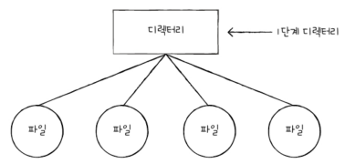

# Chapter 15. 파일 시스템
- [Chapter 15. 파일 시스템](#chapter-15-파일-시스템)
- [15-1. 파일과 디렉터리](#15-1-파일과-디렉터리)
  - [파일](#파일)
  - [디렉터리](#디렉터리)
    - [1단계 디렉터리](#1단계-디렉터리)
    - [트리 구조 디렉터리](#트리-구조-디렉터리)
    - [절대 경로와 상대 경로](#절대-경로와-상대-경로)
    - [디렉터리 엔트리](#디렉터리-엔트리)
- [15-2. 파일 시스템](#15-2-파일-시스템)
  - [파티셔닝과 포매팅](#파티셔닝과-포매팅)
  - [파일 할당 방법](#파일-할당-방법)
    - [연속 할당](#연속-할당)
    - [연결 할당](#연결-할당)
    - [색인 할당](#색인-할당)
  - [파일 시스템](#파일-시스템)
    - [FAT 파일 시스템](#fat-파일-시스템)
    - [유닉스 파일 시스템](#유닉스-파일-시스템)
    - [저널링 파일시스템](#저널링-파일시스템)
- [Q\&A](#qa)

# 15-1. 파일과 디렉터리

- 운영체제 내부 **파일 시스템이 관리**하는 존재

## 파일

- 하드 디스크나 SSD와 같은 **보조기억장치에 저장된 관련 정보의 집합**
- 의미 있고 관련 있는 정보를 모은 논리적 단위
- 파일을 이루는 정보
    - 이름과 파일을 실행하기 위한 정보
    - 파일 관련 부가 정보(속성/메타데이터)
    
    | 속성 이름 | 의미 |
    | --- | --- |
    | 유형 | 운영체제가 인지하는 파일의 종류
    - 같은 이름의 파일이더라도 유형이 다르면 실행 양상 달라짐
    - **확장자** 이용해 구분 |
    | 크기 | 파일의 현재 크기와 허용 가능한 최대 크기 |
    | 보호 | 어떤 사용자가 해당 파일을 읽고, 쓰고, 실행할 수 있는지 나타냄 |
    | 생성 날짜 | 파일이 생성된 날짜 |
    | 마지막 접근 날짜 | 파일에 마지막으로 접근한 날짜 |
    | 마지막 수정 날짜 | 파일이 마지막으로 수정된 날짜 |
    | 생성자 | 파일을 생성한 사용자 |
    | 소유자 | 파일을 소유한 사용자 |
    | 위치 | 파일의 보조기억장치상의 현재 위치 |
    
    | 파일 유형 | 대표적인 확장자 |
    | --- | --- |
    | 실행 파일 | 없는 경우, exe, com, bin |
    | 목적 파일 | obj o |
    | 소스 코드 파일 | c, cpp, cc, java, asm, py |
    | 워드 프로세서 파일 | xml, rtf, doc, docx |
    | 라이브러리 파일 | lib, a, so, dll |
    | 멀티미디어 파일 | mpeg, mov, mp3, mp4, avi |
    | 백업/보관 파일 | rar, zip, tar |
- 파일 연산을 위한 시스템 호출
    - 파일 생성, 삭제, 열기, 닫기, 읽기, 쓰기

## 디렉터리

- 파일 관리할 때 이용(윈도우 - 폴더)

### 1단계 디렉터리

- 하나의 디렉터리 아래 모든 파일
- 컴퓨터 용량이 커지면서 저장할 수 있는 파일이 많아지고 관리하기 어려워짐

### 트리 구조 디렉터리

- 최상위 디렉터리(루트 디렉터리, /(슬래시)) - 서브 디렉터리(자식 디렉터리) - 서브 디렉터리 …
- **경로** : 디렉터리를 이용해 파일 위치, 파일 이름을 특정 짓는 정보

### 절대 경로와 상대 경로

- **절대 경로** : **루트 디렉터리**부터 시작하는 경로
    - 윈도우 - C:W 또는 /
    - 유닉스, 리눅스, macOS 등의 운영체제에서 슬래시 기호는 디렉터리와 디렉터리 사이의 구분자로도 사용
        - 윈도우에서 디렉터리 구분자는 W
- **상대 경로** : **현재 디렉터리**부터 시작하는 경로
    - .. : 상위 디렉터리
    - . : 현재 디렉터리
        
        
        
- 디렉터리 연산을 위한 시스템 호출
    - 디렉터리 생성, 삭제, 열기, 닫기, 읽기

### 디렉터리 엔트리

<aside>
📎

**파일과 디렉터리는 다른 존재?!**

- 디렉터리는 포함된 정보가 다른 파일!
- 파일 → 내부에 해당 파일과 관련된 정보 담김
- 디렉터리 → 내부에 해당 디렉터리에 담겨 있는 대상과 관련된 정보 담김
    - 테이블(표) 형태로 구성
        
        
        
    - 보조기억장치에 테이블 형태의 정보로 저장
</aside>

- 공통으로 포함하는 정보 : 디렉터리에 포함된 대상의 이름, 위치를 유추할 수 있는 정보
- 파일 시스템에 따라 파일 속성을 명시하는 경우 있음

.. - 상위 디렉터리, . - 현재 디렉터리

# 15-2. 파일 시스템

- 파일과 디렉터리를 보조기억장치에 일목요연하게 저장하고 접근할 수 있게 하는 운영체제 내부 프로그램

## 파티셔닝과 포매팅

**파티셔닝**

- 저장 장치의 논리적인 영역을 구획하는 작업
- 칸막이로 영역 나누는 작업
- **파티션** : 파티셔닝 작업을 통해 나누어진 영역 하나하나

**포매팅**

- 파일 시스템을 설정하여 어떤 방식으로 파일을 저장하고 관리할 것 인지를 결정하고, 새로운 데이터를 쓸 준비를 하는 작업
    
    ⇒ 파일 시스템 결정 됨!
    
    
    
- **저수준 포매팅** : 저장 장치를 생성할 당시 공장에서 수행되는 물리적인 포매팅
- **논리적 포매팅** : 파일 시스템을 생성하는 포매팅

## 파일 할당 방법

- 블록 : 운영체제가 파일과 디렉터리를 읽고 쓰는 단위
    
    
    
    - 블록 안의 번호 : 블록 위치를 식별하는 주소
    
    <aside>
    🧊
    
    **섹터가 아닌 블록을 단위로?**
    
    - 섹터 : 하드 디스크의 가장 작은 저장 단위
    - 파일 시스템이 모든 섹터를 관리하기엔 개수 많고 크기도 작기 때문
    </aside>
    

### 연속 할당

- 파일이 저장 장치 내에서 연속적인 공간을 차지하도록 블록을 할당하는 방법
    
    
    
    파일의 첫 번째 블록 주소와 블록 단위의 길이를 알면 할당된 파일에 접근할 수 있음
    
- 장점
    - 구현 단순
- 단점
    - 외부 단편화 야기
    
    
    
    //-파일 D, F가 삭제되면 할당할 수 있는 블록은 11개가 남지만 블록 7개 이상 사용하는 파일은 할당할 수 없음
    

### 연결 할당

- 각 블록 일부에 다음 블록의 주소를 저장해 각 블록이 다음 블록을 가리키는 형태로 할당하는 방식
- 파일을 이루는 데이터를 **연결 리스트**로 관리
- 불연속 할당의 일종이기 때문에 여러 블록에 흩어져 저장되어도 됨

a 파일이 4개의 블록으로 구성되어 있고, 10-5-13-2번 블록에 저장되어 있음

- 단점
    - 반드시 첫 번째 블록부터 하나씩 차례대로 읽어야 함
        - 임의 접근(파일 내 임의의 위치에 접근) 속도 느림
    - 하드웨어 고장이나 오류 발생 시 해당  블록 이후 블록은 접근할 수 없음
        - 하드디스크 헤드는 플래터 위에 미세한 간격으로 떨어져 있어 충격 받으면 플래터와 충돌하여 데이터 손상시킬 수 있음

### 색인 할당

- 파일의 모든 블록 주소를 색인 블록에 모아 관리하는 방식
    
    
    
- 장점
    - 파일 내 임의의 위치에 접근하기 쉬움
        - 파일의 i번째 데이터 블록에 접근하고 싶으면 색인 블록의 i번째 항목이 가리키는 블록에 접근하면 됨
- 유닉스 파일 시스템

## 파일 시스템

### FAT 파일 시스템

- FAT를 이용하는 파일 시스템
    - **FAT(파일 할당 테이블)** : 각 블록에 포함된 다음 블록의 주소들을 모아 테이블 형태로 관리
        
        
        
        a의 데이터는 4, 8, 3, 5번 블록에 걸쳐 저장됨, -1은 빈 공간
        
        - 파티션의 앞 부분에 만들어지며, 실행하는 도중 메모리에 캐시 되면 다음 블록을 찾는 속도가 빨라져 임의 접근의 성능이 개선 됨
            
            
            
            FAT(FAT12) 파일 시스템을 사용하는 파티션을 간략화한 도식도
            
        - 연결 할당의 단점을 보완한 파일 시스템
- 예시 - /home/minchul/a.sh에 접근
    
     첫번째 블록 주소는 9라는 걸 알 수 있음, FAT를 보면 9, 8, 11, 13번 블록 순서로 저장되어 있다는 것을 알고 해당 블록에 접근함](image%2016.png)
    
    루트 디렉터리에서 따라가면 [a.sh](http://a.sh) 첫번째 블록 주소는 9라는 걸 알 수 있음, FAT를 보면 9, 8, 11, 13번 블록 순서로 저장되어 있다는 것을 알고 해당 블록에 접근함
    
- USB 메모리, SD 카드와 같은 저용량 저장 장치용 파일 시스템으로 이용됨
- 버전에 따라 FAT12, FAT16, FAT32 (FAT 뒤에 오는 숫자는 블록/클러스터를 표현하기 위한 비트 수)

### 유닉스 파일 시스템

- 색인 할당 기반 시스템
- **i-node** : 색인 블록, **파일 속성 정보**와 **열다섯 개의 블록 주소** 저장될 수 있음
    - 파일마다 번호 부여되어 존재
    - 크기가 유한하다는 단점
        
        
        
        - 블록 주소 중 12개는 **직접 블록** 주소 저장
            - **직접 블록** : 파일 데이터가 저장된 블록
            - 파일 데이터 블록을 모두 가리킬 수 있다면 추가 작업 불필요
        - 13번째 주소에 **단일 간접 블록** 주소 저장
            - **단일 간접 블록** : 파일 데이터를 저장한 블록 주소가 저장된 블록
        - 14번째 주소에 **이중 간접 블록** 주소 저장
            - **이중 간접 블록** : 단일 간접 블록들의 주소를 저장하는 블록
        - 15번째 주소에 **삼중 간접 블록** 주소 저장
            - **삼중 간접 블록** : 이중 간접 블록들의 주소를 저장하는 블록
- 예시 - /home/minchul/a.sh에 접근
    
     파일은 i-node 영역 보면 98, 12, 13 블록에 접근함](image%2018.png)
    
    루트 i-node에 접근해 위치 파악한 후 해당 위치 디렉토리의 i-node 번호 확인하여 접근, [a.sh](http://a.sh) 파일은 i-node 영역 보면 98, 12, 13 블록에 접근함
    

### 저널링 파일시스템

- 저널링 기법을 사용하는 파일 시스템
    - **저널링 기법** : 작업 로그를 통해 **시스템 크래시**가 발생했을 때 빠르게 복구하기 위한 방법
        - 시스템 크래시 : 작업 중 갑자기 전원이 나가거나 치명적인 오류로 인해 컴퓨터가 강제로 종료되어 버린 상황
    - 파일 시스템 변경하는 작업
        - 작업 직전 파티션의 로그 영역에 수행하는 작업(변경 사항)에 대한 로그 남기기
        - 로그 남긴 후 작업 수행
        - 작업 끝났다면 로그 삭제
- 장점
    - 작업 중 시스템 그래시가 발생했을 때 로그 영역에 남긴 로그만 검사해도 돼 시간 단축
        - 기존엔 부팅 직후 파일 시스템을 검사 및 복구하는 프로그램 실행(유닉스나 리눅스-fsck/윈도우-scandisk)
        - 파일 시스템 내의 모든 블록에 대한 파일 시스템을 검사하기 때문에 시간이 오래 걸렸음

- **참고 - 마운트**
    
    ‘저장 장치를 마운트 한다’ ⇒ 한 저장 장치의 파일 시스템에서 다른 저장 장치의 파일 시스템에 접근할 수 있도록 파일 시스템을 편입시키는 작업
    
    
    
    컴퓨터
    
    
    
    USB 메모리
    
    
    
    /mnt 경로에 마운트로 연결
    

# Q&A

1. **절대 경로와 상대 경로의 차이점은 무엇인가요?**
2. **파티셔닝과 포매팅이란 무엇인가요?**
3. **파일 할당 방식에 무엇이 있는지 설명하시오.**

- **1번 답**
    
    절대 경로는 루트 디렉터리부터 시작하는 경로이고, 상대 경로는 현재 디렉터리부터 시작하는 경로입니다.
    
- **2번 답**
    
    파티셔닝은 하드 디스크나 SSD처럼 용량이 큰 저장 장치를 하나 이상의 논리적인 여러 단위로 구획하는 작업을 의미합니다. 포매팅이란 파일 시스템을 설정하여 어떤 방식으로 파일을 저장하고 관리할 것인지를 결정하고, 새로운 데이터를 쓸 수 있게 하는 작업을 의미합니다.
    
- **3번 답**
    
    파일을 할당하는 데에는 연속 할당, 연결 할당, 색인 할당이 있습니다. 연속 할당은 보조기억장치 내 연속적인 블록에 파일을 할당하는 방식이며, 연결 할당은 각 블록 일부에 다음 블록의 주소를 저장하여 블록들을 연결 리스트 형태로 관리하는 방식입니다. 색인 할당은 파일의 모든 블록 주소를 색인 블록에 모아 관리하는 방식입니다.