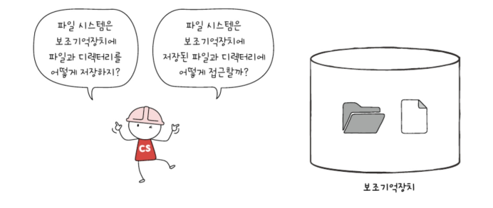
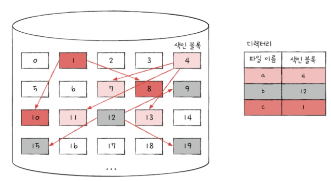

- [15-1. 파일과 디렉터리](#15-1-파일과-디렉터리)
  - [파일](#파일)
    - [파일 속성과 유형](#파일-속성과-유형)
    - [파일 연산을 위한 시스템 호출](#파일-연산을-위한-시스템-호출)
  - [디렉터리](#디렉터리)
    - [절대 경로와 상대 경로](#절대-경로와-상대-경로)
    - [디렉터리 연산을 위한 시스템 호출](#디렉터리-연산을-위한-시스템-호출)
    - [디렉터리 엔트리](#디렉터리-엔트리)
- [15-2. 파일 시스템](#15-2-파일-시스템)
  - [파티셔닝과 포매팅](#파티셔닝과-포매팅)
  - [파일 할당 방법](#파일-할당-방법)
    - [연속 할당](#연속-할당)
    - [연결 할당](#연결-할당)
    - [색인 할당](#색인-할당)
  - [파일 시스템 살펴보기](#파일-시스템-살펴보기)
    - [FAT 파일 시스템](#fat-파일-시스템)
    - [유닉스 파일 시스템](#유닉스-파일-시스템)
  - [📖](#)

# 15-1. 파일과 디렉터리
## 파일
: 하드 디스크나 SSD와 같은 보조기억장치에 저장된 관련 정보의 집합.\
의미 있고 관련 있는 정보를 모은 논리적 단위

파일을 이루는 정보: 이름, 파일을 실행하기 위한 정보, 파일 관련 부가 정보(속성 or 메타데이터)

파일 속성\

### 파일 속성과 유형
운영체제마다 유지하는 파일 속성은 조금씩 차이가 있음\

파일 유형: 운영체제가 인식하는 파일 종류. 가장 흔히 사용하는 방식 `확장자`

\
myfile.o는 o라는 확장자를 통해 운영체제에 목적 코드를 담고 있는 목적 파일임을 알려주는 셈

### 파일 연산을 위한 시스템 호출
파일을 다루는 모든 작업은 운영체제에 의해 이뤄짐. 즉 파일을 다루려면 운영체제에 부탁해야함

<파일 연산을 위한 `시스템 호출`>
1. 파일 생성
2. 파일 삭제
3. 파일 열기
4. 파일 닫기
5. 파일 읽기
6. 파일 쓰기

## 디렉터리
: 파일들을 일목요연하기 관리하기 위한 특별한 형태의 파일. 윈도우에서는 폴더라고 부름

옛날 운영체제는 하나의 디렉터리만 존재했음\
\
위와 같은 구조를 `1단계 디렉터리`라고 함\
=> 많은 파일 관리가 어려움 => `트리 구조 디텍터리`가 생겨남

\
여기서 최상위 디렉터리를 `루트 디렉터리 (/)`라 하고 아래 여러 서브 디렉터리(자식 디렉터리)가 있을 수 있음

### 절대 경로와 상대 경로
`절대 경로`: 루트 디렉터리에서 자기 자신까지 이르는 고유한 경로

\
ex) 위 그림 속 minchul 디렉터리 아래 a.sh의 절대 경로는 '루트 디렉터리 아래, home 디렉터리 아래, minchul 디렉터리 아래에 있는 a.sh' === '/home/minchul/a.sh'(유닉스, 리눅스, macOS)\

`상대 경로`: 현재 디렉터리부터 시작하는 경로

ex) 현재 디렉터리 경로가 /home이라면 d.jpg 파일의 상대 경로는 guest/d.jpg가 됨

### 디렉터리 연산을 위한 시스템 호출
1. 디렉터리 생성
2. 디렉터리 삭제
3. 디렉터리 열기
4. 디렉터리 닫기
5. 디렉터리 읽기

### 디렉터리 엔트리
디렉터리는 내부에 해당 디렉터리에 담겨있는 대상과 관련된 정보를 담고 있음.\
이 정보는 테이블(표) 형태로 구성됨. 즉 디렉터리는 보조기억장치에 테이블 형태의 정보로 저장됨

파일 시스템과 상관없이 디렉터리 엔트리가 공통적으로 포함하는 정보: 디렉터리에 포함된 대상의 이름, 그 대상이 보조기억장치 내에 저장된 위치를 유추할 수 있는 정보\

\
위와 같은 구조의 디렉터리 파일에서 각각의 디렉터리는 아래와 같이 구성됨. 이때 ..은 상위 디렉터리, .은 현재 디렉터리를 나타냄\

# 15-2. 파일 시스템
: 파일과 디렉터리를 보조기억장치에 일목요연하게 저장하고 접근할 수 있게 하는 운영체제 내부 프로그램. 다양한 종류의 파일 시스템이 있고, 하나의 컴퓨터에서 여러 파일 시스템을 사용할 수 있음

## 파티셔닝과 포매팅
이제막 공장에서 생성된 하드 디스크 또는 SSD와 같은 보조기억장치에 곧바로 파일을 생성하거나 저장할 수 없음 => 파티션을 나누는 작업(파티셔닝)과 포맷 잡업(포매팅)을 거쳐야 함

`파티셔닝`: 저장 장치의 논리적인 영역을 구획하는 작업\

\
서랍 안에 칸막이가 없을 때보다 칸막이를 설치하여 영역을 나누면 물건들을 정리하기가 조금 더 수월한 것처럼 보조기억장치에도 칸막이로 영역을 나누는 작업을 해줌(파티셔닝)

파티셔닝 작업을 통해 나눠진 영역 하나하나를 `파티션`이라 함

컴퓨터 검색창에 '하드 디스크 파티션 만들기'를 검색하여 들어가면 아래와 같은 화면을 통해 컴퓨터 내의 보조기억장치가 어떻게 파티셔닝되어 운영되는지 확인할 수 있음\

`포매팅`: 파일 시스템을 설정하여 어떤 방식으로 파일을 저장하고 관리할 것인지를 결정하고, 새로운 데이터를 쓸 준비를 하는 작업을 의미. 즉 어떤 종류의 파일 시스템을 사용할지는 이때 결정남

> 포매팅 종류: 저수준 포매팅, 논리적 포매팅\
> 저수준 포매팅: 저장 장치를 생성할 당시 공장에서 수행되는 물리적인 포매팅\
> 논리적 포매팅: 파일 시스템을 생성하는 포매팅(이 책에서 설명하는 포매팅)

파일 시스템에는 여러 종류가 있고, 파이션마다 다른 파일 시스템을 설정할 수도 있음\

포매팅까지 완료하여 파일 시스템을 설정했다면 이제 파일과 디렉터리를 생성할 수 있음

## 파일 할당 방법
운영체제는 파일과 디렉터리를 `블록`단위로 읽고 씀. 즉 하나의 파일이 보조기억장치에 저장될 때는 하나 이상의 블록에 걸쳐 저장됨.

하드 디스크의 가장 작은 저장 단위는 섹터이지만, 운영체제는 하나 이상의 섹터를 블록이라는 단위로 묶은 뒤 블록 단위로 파일과 디렉터리를 관리함

아래와 같이 하드 디스크 내에 여러 블록이 있다고 가정\

파일을 할당할 때 크기가 큰 파일일 수록 여러 블록에 걸쳐 저장됨

파일을 보조기억장치에 할당하는 방법
- 연속 할당
- 불연속 할당
  - 연결 할당
  - 색인 할당

### 연속 할당
보조기억장치 내 연속적인 블록에 파일을 할당하는 방식.\
블록을 세 개, 두 개, 다섯 개 차지하는 정도의 크기를 가진 파일 a, b, c가 있을 때 이 파일들은 아래와 같이 연속적으로 할당됨\

연속으로 할당된 파일에 접근하기 위해서는 파일의 첫 번째 블록 주소와 블록 단위의 길이를 알면 됨 => 디렉터리 엔트리에 파일 이름, 첫 번째 블록 주소와 블록 단위의 길이를 명시\

구현이 단순하다는 장점이 있지만, `외부 단편화`를 야기한다는 단점이 있음\

파일 D, F가 삭제된다 하더라도 블록 크기가 일곱개 이상을 사용하는 파일은 할당할 수 없음\

### 연결 할당
: 연속 할당의 문제를 해결할 수 있는 방식. 각 블록 일부에 다음 블록의 주소를 저장하여 각 블록이 다음 블록을 가리키는 형태로 할당하는 방식(즉, 파일을 이루는 데이터를 연결 리스트로 관리)

ex) 네 개의 블록으로 구성된 a라는 파일: 10, 5, 13, 2번 블록에 저장되어 있다고 가정\
\
연결 할당 방식에서는 10번 블록 끝에 5번 주소를, 5번 블록 끝에 13번 블록 주소를, 13번 블록 끝에 2번 블록 주소를 기록함, 마지막 블록에는 다음 블록이 없다는 특별한 표시자를 기록(위의 예시에서는 -1을 이용)

연결 할당을 사용하는 파일 시스템에서는 디렉터리 엔트리에 연속 할당과 마찬가지로 파일 이름과 함께 첫 번째 블록 주소와 블록 단위의 길이를 명시함\

장점: 연속 할당 방식에서의 외부 단편화를 해소\
단점:
1. 반드시 첫 번째 블록부터 하나씩 차례대로 읽어야 함\
   다시말해, 파일 내 임의의 위치에 접근하는 속도(`임의 접근 속도`)가 매우 느림

2. 하드웨어 고장이나 오류 발생 시 해당 블록 이후 블록은 접근할 수 없음

그렇기 때문에 오늘날에는 이를 조금 변형하여 사용함 => FAT 파일 시스템 탄생

### 색인 할당
: 파일의 모든 블록 주소를 `색인 블록`이라는 하나의 블록에 모아 관리하는 방식\

ex) 파일 a의 색인 블록: 4번, 파일 a의 데이터: 7, 13, 11번 블록\

색인 할당은 연결 할당과는 달리 파일 내 임의의 위치에 접근하기 쉬움

색인 할당을 사용하는 파일 시스템에서는 디렉터리 엔트리에 파일 이름과 더불어 `색인 블록 주소`를 명시함\

## 파일 시스템 살펴보기
FAT 파일 시스템: USB 메모리, SD 카드 등의 저용량 저장 장치에 사용되는 파일 시스템\
유닉스 파일 시스템: 유닉스 계열 운영체제에서 사용되는 파일 시스템

### FAT 파일 시스템
연결 할당 방식 단점을 보완한 파일 시스템\
연결 할당 방식 단점의 근본적 원인: 블록안에 다음 블록의 주소를 저장했기 때문

ex) 연결 할당을 단순화한 예

임의 접근의 성능이 좋지 못하고, 이 블록들 중 하나라도 문제가 발생하면 그 이후의 블록에는 접근 불가

=> 각 블록에 포함된 다음 블록의 **주소들을** 한데 모아 테이블 형태로 관리하면 앞서 언급한 단점들을 상당 부분 해소할 수 있음. 이런 테이블을 `파일 할당 테이블(FAT)`라고 부름

아래 예에서는 첫 번째 블록 주소(4번 블록)만 알면 파일의 데이터가 담긴 모든 블록에 접근 가능\

이렇게 FAT를 사용하는 파일 시스템이 `FAT 파일 시스템`\
버전에 따라 FAT12, FAT16, FAT32가 있으며 뒤에 오는 숫자는 블록을 표현하는 비트 수를 의미

하드 디스크의 한 파티션을 FAT 파일 시스템으로 포맷하면 해당 파티션이 아래와 같이 구성 됨\

FAT는 하드 디스크 파티션의 시작 부분에 있지만, 실행하는 도중 FAT가 메모리에 캐시될 수 있음. FAT가 메모리에 적재된 채 실행되면 임의 접근의 성능이 개선됨

FAT 파일 시스템의 디렉터리 엔트리\

아래와 같은 디렉터리 구조를 이루는 FAT 파일 시스템에서 /home/minchul/a.sh 파일을 읽는 과정\

위 디렉터리 구조는 파티션 내에 아래와 같이 저장된다고 가정\

a.sh에 접근하려면 루트 디렉터리부터 봐야 함\

### 유닉스 파일 시스템
색인 할당은 색인 블록을 기반으로 파일의 데이터 블록들을 찾는 방식. 유닉스 파일 시스템에서는 이 색인 블록을 `i-node`라고 부름

i-node에는 파일 속성 정보와 열다섯 개의 블록 주소가 저장될 수 있음\

유닉스 파일 시스템에는 파일마다 이러한 i-node가 있고, i-node마다 번호가 부여되어 있음. 또 아래와 같이 파티션 내 특정 영역에 모여 있음. (i-node 영역에 i-node들이 있고, 데이터 영역에 디렉터리와 파일들이 있음)

문제점: 블록을 20, 30개 그 이상을 차지하는 큰 파일들에 대하여 i-node 하나만으로는 파일의 데이터 블록을 모두 가리킬 수 없음

해결 방법
1. 블록 주소 중 열두 개에는 직접 블록 주소를 저장한다\
   이때 파일 데이터가 저장된 블록을 `직접 블록`이라 함. 즉, i-node의 열두 개 주소는 직접 블록 주소를 저장\
   

2. '첫째' 내용으로 충분하지 않다면 열세 번째 주소에 단일 간접 블록 주소를 저장한다.\
   `단일 간접 블록`: 파일 데이터가 저장된 블록이 아닌 파일 데이터를 저장한 블록 주소가 저장된 블록\
   

3. '둘째' 내용으로 충분하지 않다면 열네 번째 주소에 이중 간접 블록 주소를 저장한다.\
   `이중 간접 블록`: 데이터 블록 주소를 저장하는 블록 주소가 저장된 블록. 즉 단일 간접 블록들의 주소를 저장하는 블록\
   

4. '셋째' 내용으로 충분하지 않다면 열다섯 번째 주소에 삼중 간접 블록 주소를 저장한다.\
   `삼중 간접 블록`: 이중 간접 블록 주소가 저장된 블록\
   

i-node가 파일의 모든 것을 담고 있다고 할 수 있기 때문에 유닉스 파일 시스템의 디렉터리 엔트리도 아래와 같이 파일 이름과 i-node 번호로 구성 됨\

유닉스 파일 시스템에서 /home/minchul/a.sh파일을 읽는 과정\

위 디렉터리 구조가 파티션 내에 아래와 같이 저장된다고 가정\

따라서 파일 시스템은 /home/minchul/a.sh를 읽기 위해 98, 12, 13번 블록에 접근하면 됨

이외에도 윈도우 운영체제에서 사용되는 `NT 파일 시스템(NTFS)`, 리눅스 운영체제에서 사용되는 `ext 파일 시스템` 등 다양한 파일 시스템이 존재

---

## 📖

Q1. 절대 경로가 무엇인지 설명하시오.

A1. 절대 경로란 루트 디렉터리에서 자기 자신까지 이르는 고유한 경로를 말합니다.

Q2. 파일 할당 방법 중 연속 할당 방법이 무엇인지 말하고 장단점에 대해 설명하시오.

A2. 연속 할당 방법은 보조기억장치 내 연속적인 블록에 파일을 할당하는 방식으로 구현이 단순하다는 장점이 있지만, 외부 단편화를 야기한다는 단점이 있습니다.

Q3. 연결 할당 방식과 색인 할당 방식에 대해 설명하시오.

A3. 연결 할당 방식은 각 블록 일부에 다음 블록의 주소를 저장하여 각 블록이 다음 블록을 가리키는 형태로 할당하는 방식이고 색인 할당 방식은 파일의 모든 블록 주소를 색인 블록이라는 하나의 블록에 모아 관리하는 방식이다.