# Ch15. 파일 시스템
- [Ch15. 파일 시스템](#ch15-파일-시스템)
- [15-1. 파일과 디렉터리](#15-1-파일과-디렉터리)
  - [15-1-1. 파일(file)](#15-1-1-파일file)
    - [15-1-1-1. 파일 속성과 유형](#15-1-1-1-파일-속성과-유형)
    - [15-1-1-2. 파일 연산을 위한 시스템 호출](#15-1-1-2-파일-연산을-위한-시스템-호출)
  - [15-1-2. 디렉터리(directory)](#15-1-2-디렉터리directory)
    - [15-1-2-1. 절대 경로와 상대 경로](#15-1-2-1-절대-경로와-상대-경로)
      - [절대 경로(absolute path)](#절대-경로absolute-path)
      - [상대 경로(relative path)](#상대-경로relative-path)
    - [15-1-2-2. 디렉터리 연산을 위한 시스템 호출](#15-1-2-2-디렉터리-연산을-위한-시스템-호출)
    - [15-1-2-3. 디렉터리 엔트리](#15-1-2-3-디렉터리-엔트리)
- [15-2. 파일 시스템](#15-2-파일-시스템)
  - [15-2-1. 파티셔닝과 포매팅](#15-2-1-파티셔닝과-포매팅)
    - [파티셔닝(partitioning)](#파티셔닝partitioning)
    - [포매팅(fomatting)](#포매팅fomatting)
  - [15-2-2. 파일 할당 방법](#15-2-2-파일-할당-방법)
    - [15-2-2-1. 연속 할당(contiguous allocation)](#15-2-2-1-연속-할당contiguous-allocation)
    - [15-2-2-2. 연결 할당(linked allocation)](#15-2-2-2-연결-할당linked-allocation)
    - [15-2-2-3. 색인 할당(indexed allocation)](#15-2-2-3-색인-할당indexed-allocation)
  - [15-2-3. 파일 시스템 살펴보기](#15-2-3-파일-시스템-살펴보기)
    - [15-2-3-1. FAT 파일 시스템](#15-2-3-1-fat-파일-시스템)
      - [그림의 디렉터리 구조를 이룬 FAT 파일 시스템에서 /home.minchul.a.sh 파일 읽는 과정](#그림의-디렉터리-구조를-이룬-fat-파일-시스템에서-homeminchulash-파일-읽는-과정)
    - [15-2-3-2. 유닉스 파일 시스템](#15-2-3-2-유닉스-파일-시스템)
      - [그림의 디렉터리 구조 이루는 유닉스 파이 ㄹ시스템에서 /home/minchul/a.sh 파일 읽는 과정](#그림의-디렉터리-구조-이루는-유닉스-파이-ㄹ시스템에서-homeminchulash-파일-읽는-과정)
    - [저널링 파일 시스템](#저널링-파일-시스템)
    - [마운트](#마운트)
- [Question](#question)
  - [1. 절대 경로와 상대 경로의 차이점은 무엇인가요?](#1-절대-경로와-상대-경로의-차이점은-무엇인가요)
  - [2. 파티셔닝과 포매팅에 대해 말해주세요.](#2-파티셔닝과-포매팅에-대해-말해주세요)
  - [3. FAT 파일 시스템과 유닉스 파일 시스템의 주요 차이점은 무엇인가요?](#3-fat-파일-시스템과-유닉스-파일-시스템의-주요-차이점은-무엇인가요)

# 15-1. 파일과 디렉터리
- 파일, 디렉터리 모두 보조기억장치에 있는 데이터 덩어리
- OS가 어떻게 파일과 디렉터리로 관리?
- 이것이 `파일 시스템`

## 15-1-1. 파일(file)
- 파일의 정의
  - 보조기억장치(HDD나 SSD)에 저장된 관련 정보 집합
  - 의미 있고 관련 있는 정보를 모은 논리적 단위
- 파일을 이루는 정보 --> 파일 부가 정보
  - 속성(attribute)
  - 메타데이터(metadata)

### 15-1-1-1. 파일 속성과 유형
- 대표적인 파일 속성(OS마다 차이 有)
  | 속성 이름 | 의미 |
  |-----------|------|
  | 유형 | 운영체제가 인지(인식)하는 파일의 종류 --> 같은 이름의 파일이어도 파일 유형 다르면 실행 양상도 달라질 수 있음 |
  | 크기 | 파일의 현재 크기와 허용 기능한 최대 크기 |
  | 보호 | 어떤 사용자가 해당 파일을 읽고, 쓰고, 실행할 수 있는지를 나타냄 |
  | 생성 날짜 | 파일이 생성된 날짜 |
  | 마지막 접근 날짜 | 파일에 마지막으로 접근한 날짜 |
  | 마지막 수정 날짜 | 파일이 마지막으로 수정된 날짜 |
  | 생성자 | 파일을 생성한 사용자 |
  | 소유자 | 파일을 소유한 사용자 |
  | 위치 | 파일의 보조기억장치상의 현재 위치 |

- 확장자(extension): 파일 유형 알리기 위해 가장 흔히 사용(파일 이름 뒤에 확장자 붙이기)
  | 파일 유형 | 대표적인 확장자 |
  |-----------|------|
  | 실행 파일 | 없는 경우, exe, com, bin |
  | 목적 파일 | obj, o |
  | 소스 코드 파일 | c, cpp, cc, java, asm, py |
  | 워드 프로세서 파일 | xml, rtf, doc, docx |
  | 라이브러리 파일 | lib, a, so, dll |
  | 멀티미디어 파일 | mpeg, mov, mp3, mp4, avi |
  | 백업/보관 파일 | rar, zip, tar |

### 15-1-1-2. 파일 연산을 위한 시스템 호출
- 파일 다루는 모든 작업은 OS에 의해 이뤄짐
- OS는 다음 같은 파일 연산 위한 `시스템 호출` 제공
  - 파일 생성, 삭제, 열기, 닫기, 읽기, 쓰기 (외울 필요X)

## 15-1-2. 디렉터리(directory)
- 파일들을 일목요연하게 관리하고자 디렉터리 이용
- 윈도우 OS 상에서는 폴더(folder)라고 부름
- 1단계 디렉터리(single-level directory)
  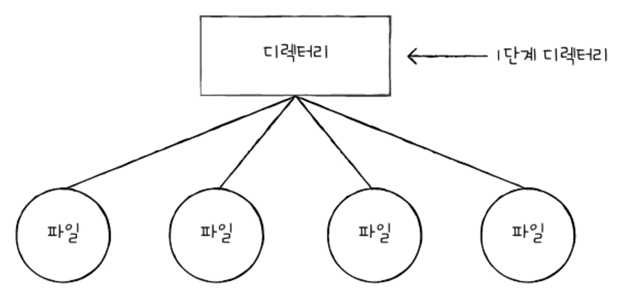
  - 예전 OS에서는 하나의 디렉터리만 존재
  - 모든 파일이 하나의 디렉터리 아래에 있었음
- 트리 구조 디렉터리(tree-structured directory)
  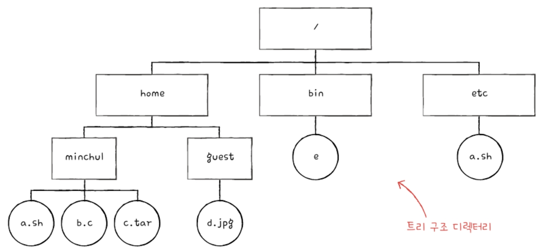
  - 1단계 디렉터리만으로는 많은 파일 관리 어려움
  - 최상위 디렉터리 -- 그 하위에 여러 서브 디렉터리(자식 디렉터리)
  - 서브 디렉터리도 또 다른 서브 디렉터리를 가질 수 있음
  - 최상위 디렉터리는 흔히 `루트 디렉터리(root directory)`라고 함
  - 윈도우에서 최상위 디렉터리) C:\
  - **경로(path)**: 디렉터리를 이요해 파일 위치, 파일 이름 특정 짓는 정보

### 15-1-2-1. 절대 경로와 상대 경로
- 같은 디렉터리 내에는 동일 이름 파일 존재X
- 서로 다른 디렉터리에는 동일한 이름의 파일 존재 가능
#### 절대 경로(absolute path)
: 모든 파일은 루트 디렉터리에서 자기 자신까지 이르는 고유한 경로 가지고 있음 (`루트 디렉터리부터 시작하는 경로`) 
ex) 윈도우 - C:\home\minchul\a.sh
#### 상대 경로(relative path)
: `현재 디렉터리부터 시작하는 경로` 
ex) 현재 디렉터리 - /home ==> 상대 경로 - guest/d.jpg

### 15-1-2-2. 디렉터리 연산을 위한 시스템 호출
- OS가 디렉터리 연산 위해서도 시스템 호출 제공
  - 파일 생성, 삭제, 열기, 닫기, 읽기

### 15-1-2-3. 디렉터리 엔트리
- 파일과 디렉터리 별개의 존재가 아님
  - 많은 OS에서 디렉터리를 그저 `특별한 형태의 파일`로 간주
  - **디렉터리도 파일** - 단지, 포함된 정보가 조금 특별
  - 파일 내부 - 해당 파일과 관련된 정보 포함
  - 디렉터리 내부 - 해당 디렉터리에 담겨 있는 대상과 관련된 정보
    - 이는 보통 테이블(표)로 구성
    - 이 테이블의 각 행(엔트리)에 담기는 정보는 파일 시스템 마다 차이는 있음
    - **디렉터리 엔트리에 공통적으로 포함되는 정보**
      - 디렉터리에 포함된 `대상의 이름`
      - 그 대상이 보조기억장치 내에 `저장된 위치 유추할 수 있는 정보`
  - ..: 상위 디렉터리
    - 루트 디렉터리의 ..은 더 이상 상위가 없기 때문에 자기 자신
  - .: 현재 디렉터리
  
# 15-2. 파일 시스템
## 15-2-1. 파티셔닝과 포매팅
### 파티셔닝(partitioning)
- HDD나 SSD처럼 용량 큰 저장 장치를 하나 이상의 논리적 여러 단위로 구획하는 작업
- 저장 장치의 논리적 영역을 구획하는 작업
- Like. 서랍의 칸막이 설치해서 영역 나누기
- `파티션(partition)`: 파티셔닝 작업을 통해 나눠진 영역 하나하나

### 포매팅(fomatting)
- 파일 시스템을 설정하여 어떤 방식으로 파일 저장하고 관리할 것인지 결정하고, 새로운 데이터 쓸 수 있게 하는 작업
- 저장 장치 완전히 삭제 ==> 아니다!
- 포매팅으로 어떤 종류의 파일 시스템을 사용할지 결정 남
- 포매팅의 종류
  - 저수준 포매팅: 저장 장치 생성할 당시 공장에서 수행되는 물리적 포매팅
  - 논리적 포매팅: 파일 시스템 생성하는 포매팅(여기서의 포매팅은 이것)
- 파일 시스템도 여러 종류, 파티션마다 다른 파일 시스템 설정 가능

## 15-2-2. 파일 할당 방법
- OS는 파일, 디렉터리를 **블록(block)단위**로 읽고 씀
- HDD의 가장 작은 저장 단위 --> `섹터(sector)
- OS는 하나 이상의 섹터를 블록이란 단위로 묶어서 블록 단위로 파일과 디렉터리 관리
  - 파일 시스템이 모든 섹터 관리하기는 너무 많고, 크기도 작아서
- 오늘날까지 사용되는 방식은 `불연속 할당`
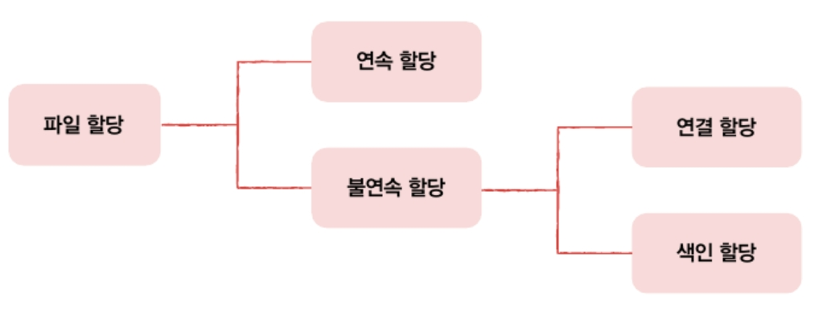

### 15-2-2-1. 연속 할당(contiguous allocation)
- 보조기억장치 내 연속적인 블록에 파일 할당
- 가장 단순
- 이런 식으로 파일 a, b, c 할당
  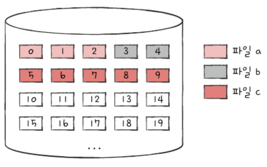
- 연속으로 할당된 파일에 접근) 파일의 첫 번째 블록 주소, 블록 단위의 길이만 알면 됨
  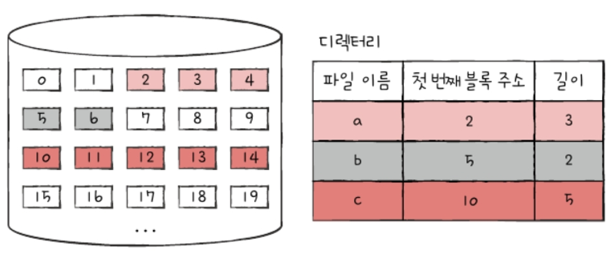
- 단점: `외부 단편화` 야기
  - 연속 할당
    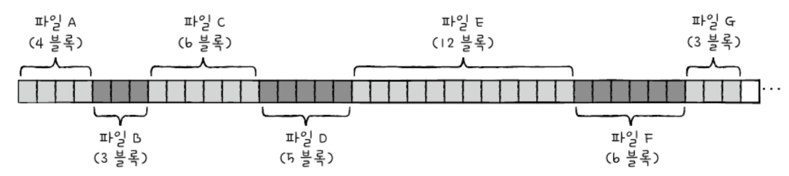
  - 파일 D, F 삭제 시 - 블록은 총 11개 남지만 블록 7개 이상 사용하는 파일은 할당 불가
    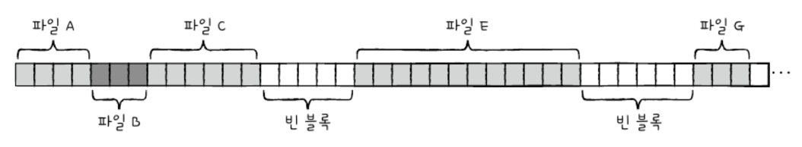

### 15-2-2-2. 연결 할당(linked allocation)
- 각 블록 일부에 다음 블록의 주소 저장하여 블록들을 연결 리스트 형태로 관리
- 연속 할당의 문제 해결 위해
- 불연속 할당의 일종 --> 파일이 여러 블록에 흩어져 저장되어도 OK
  - '어떤 블록의 주소를 저장한다' == '그 블록을 가리킨다'
- 예시
  - 이렇게 할당 (10번 -->5 번, 5번 --> 13번, 13번 --> 2번)
    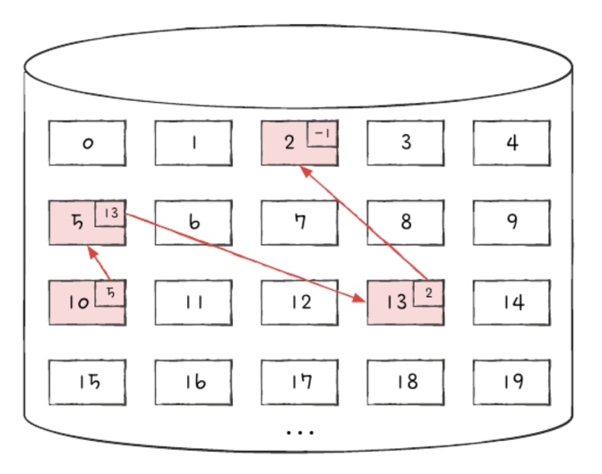
  - 연결할당도 디렉터리 엔트리에 연속 할당처럼 파일 이름, 첫번째 불록 주소, 블록 단위 길이 명시 ==> 디렉터리 엔트리만 봐도 어디 저장되었는지 알 수 있음
    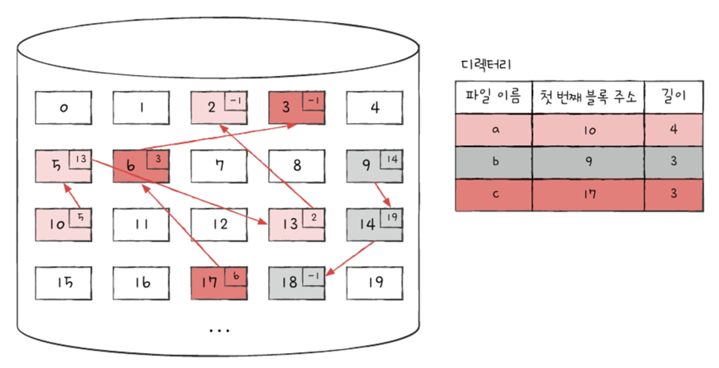
- 외부 단편화 문제 해결
- 단점
  1. 반드시 첫 번째 블록부터 하나씩 차례로 읽어야 함
    - 임의 접근 속도(파일 내 임의 위치에 접근하는 속도)가 매우 느림
    - 비효율적!
  2. HW 고장이나 오류 발생 시 해당 블록 이후 블록은 접근 불가
- 그래서 변형해서 사용 --> `FAT 파일 시스템`

### 15-2-2-3. 색인 할당(indexed allocation)
- 파일의 모든 블록 주소를 `색인 블록(index block)`에 모아 관리
- 파일 내 임의 위치 접근 쉬움
- 디렉터리 엔트리에 **색인 블록 주소 명시**
  - 색인 블록 안에 파일 구성하는 데이터 블록 주소가 있어서 색인 블록만 알면 해당 파일 데이터에 접근 가능
  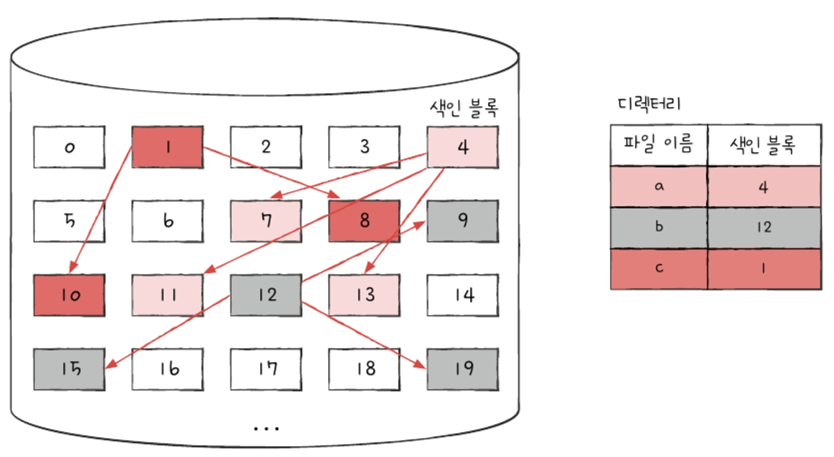
- 색인 할당 기반으로 만든 파일 시스템 --> `유닉스 파일 시스템`

## 15-2-3. 파일 시스템 살펴보기
### 15-2-3-1. FAT 파일 시스템
- FAT 이용하는 연결 할당 기반의 파일 시스템
- USB 메모리, SD 카드 등 저용량 저장 장치에서 사용
- 연결 할당 방식 단점 --> 근본적 원인: 블록 안에 다음 블록 주소 저장해서
  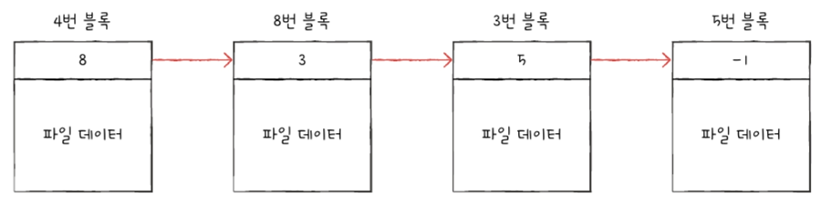
- **파일 할당 테이블(FAT**; File Allocation Table): 이를 해결하기 위해 각 블록에 포함된 다음블록의 주소 한데 모아 테이블 형태로 관리
  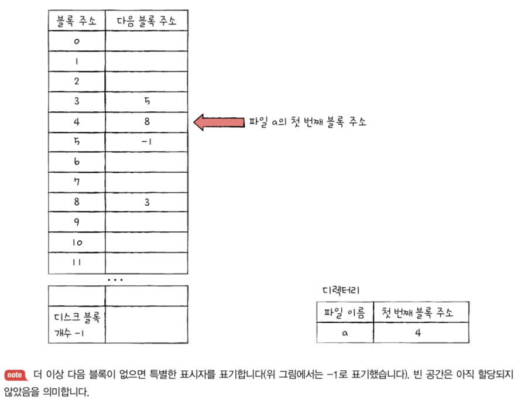
- 버전에 따라 FAT12, FAT16, FAT32 --> 숫자는 블록 표현하는 비트 수 의미
- 윈도우에서는 블록 대신 `클러스터`라고 함
- FAT12 간략 도식도
  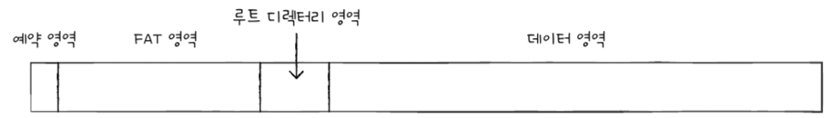
- FAT는 하드 디스크 시작 부분에 있지만 실행 도중 FAT가 메모리에 캐시될 수 있음
  - FAT가 메모리에 적재된 채 실행되면 임의 접근 성능 개선
- FAT 파일 시스템에서의 디렉터리는 이렇게 저장됨
    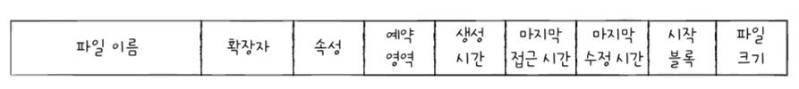

#### 그림의 디렉터리 구조를 이룬 FAT 파일 시스템에서 /home.minchul.a.sh 파일 읽는 과정
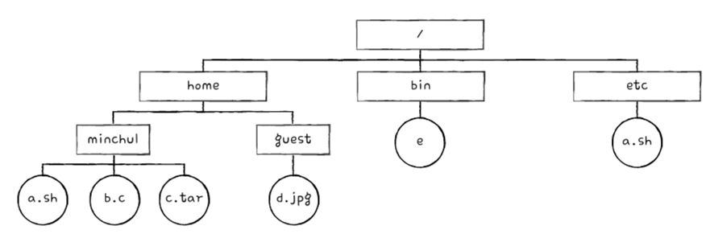
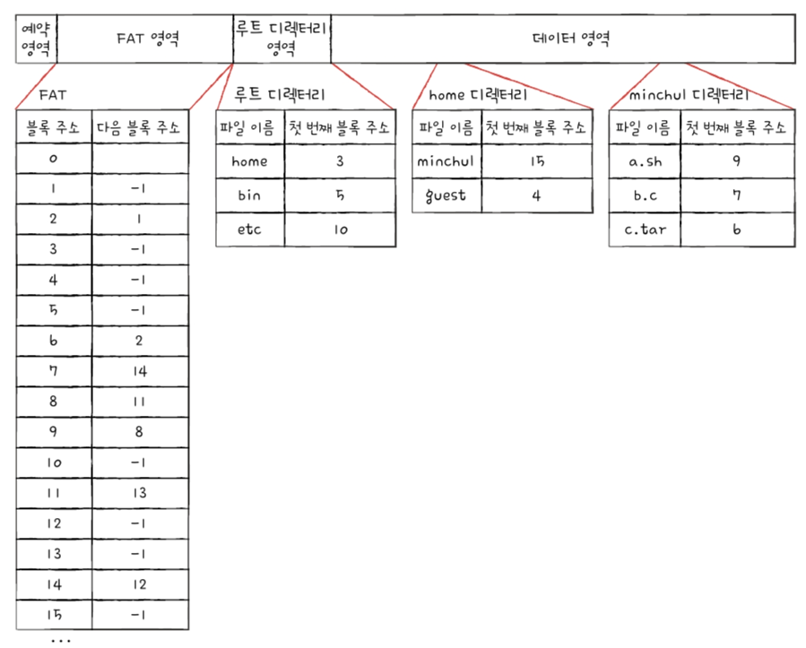
더 이상의 블록 없음; -1로 표시
1. 루트 디렉터리 보기 - home 디렉터리는 몇 번 블록에 있는지 보기 --> 3번 블록
    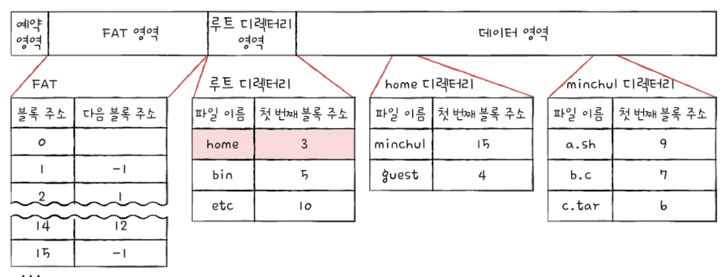
2. 3번 블록을 읽어 home 디렉터리의 내용 살피기 - minchul 디렉터리가 몇 번 블록? --> 15번 블록
    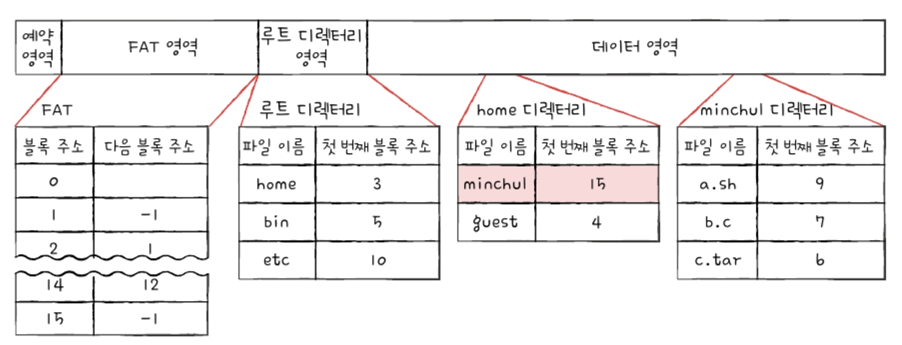
3. 15번 블록 읽어 minchul 디렉터리 내용 살피기 - 접근하려는 a.sh 파일의 첫 번째 블록 주소? 9번 블록
    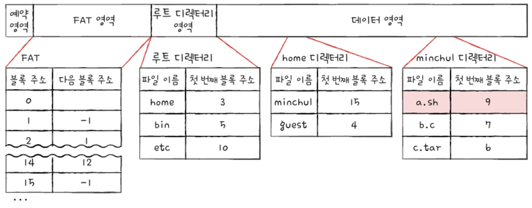
4. FAT 보면 a.sh 파일은 9번, 8번, 11번, 13번 블록 순서로 저장 --> 이 순서대로 블록 접근
    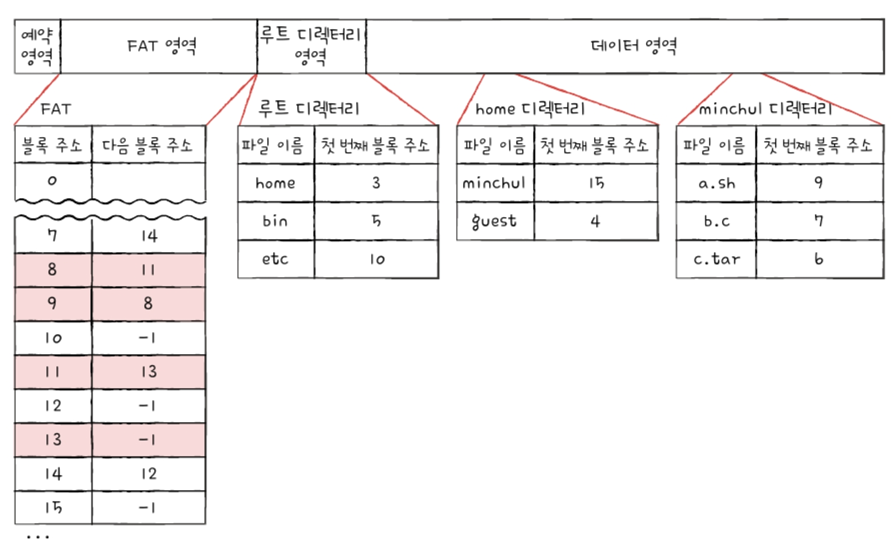

### 15-2-3-2. 유닉스 파일 시스템
- i-node 이용하는 색인 할당 기반의 파일 시스템
  - i-node: 유닉스 파일 시스템에서의 색인 블록
  - i-node에는 파일 속성 정보, 15개의 블록 주소 저장 가능
- 유닉스 계열 운영체제에서 사용
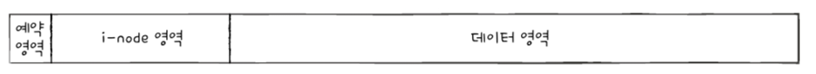
- 파일마다 i-node 있고
- i-node 영역에 i-node 번호 부여해서 파티션 내 특정 영역에 모여 있음
- 데이터 영역에는 디렉터리, 파일들 있음
- 문제? **i-node 크기 유한** --> i-node 하나로 파일의 데이터 블록 모두 가리킬 수 없음!
- 이 문제 해결
  1. 블록 주소 중 12개는 직접 블록 주소 저장
   - 직접 블록(direct block): 파일 데이터가 저장된 블록
    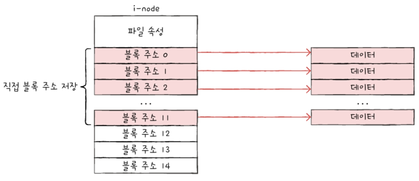
  2. 1번 내용으로 충분하지 않다면 13번째 주소에 단일 간접 블록 주소 저장
   - 단일 간접 블록(single indirect block): 파일 데이터가 저장된 블록이 아닌 파일 데이터를 저장한 블록 주소가 저장된 블록
    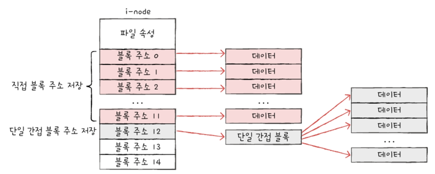
  3. 2번 내용으로 충분하지 않다면 14번째 주소에 이중 간접 블록 주소 저장
   - 이중 간접 블록(double indirect block): 데이터 블록 주소를 저장하는 블록 주소가 저장된 블록 --> 단일 간접 블록들의 주소를 저장하는 블록
    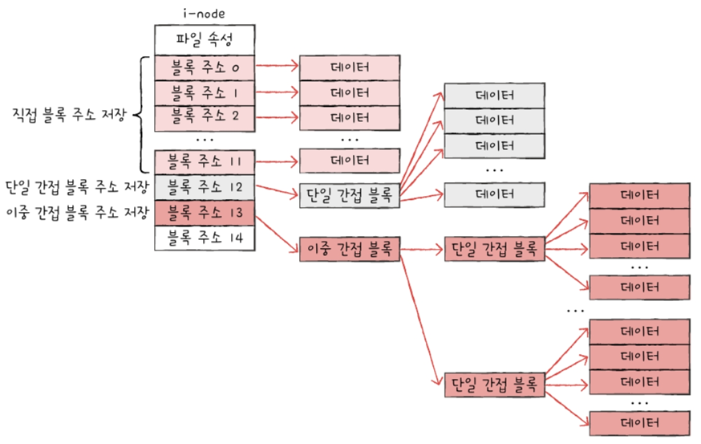
  4. 3번 내용으로 충분하지 않다면 15번째 주소에 삼중 간점 블록 주소 저장
   - 삼중 간접 블록(triple indirect block): 이중 간접 브록 주소가 저장된 블록
   - 삼중 간접 블록까지 이용하면 웬만한 크기의 파일은 모두 표현 가능
    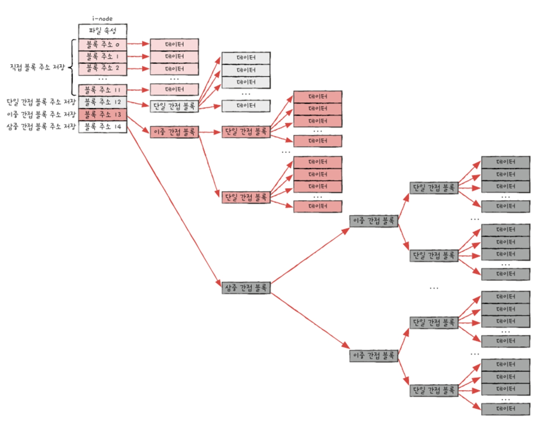
- 유닉스 파일 시스템의 디렉터리 엔트리
  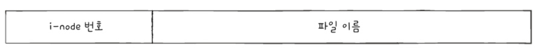

#### 그림의 디렉터리 구조 이루는 유닉스 파이 ㄹ시스템에서 /home/minchul/a.sh 파일 읽는 과정
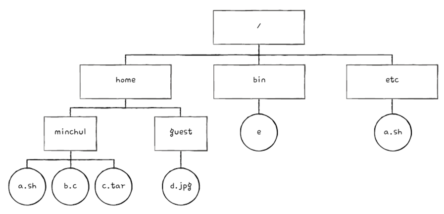
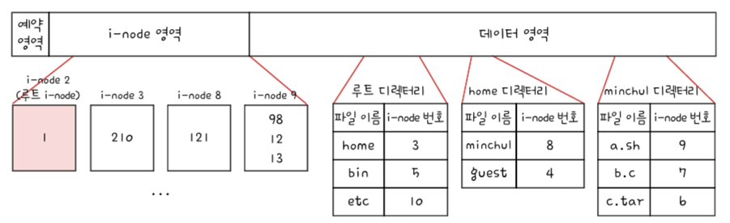
1. 2번 i-node 접근해서 루트 디렉터리 위치 파악 --> 루트 디렉터리 1번 블록에 있음
   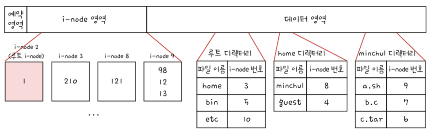
2. 1번 블록 읽으면 루트 디렉터리 내용 알 수 있음 --> home 디렉터리의 i-node는 3번
   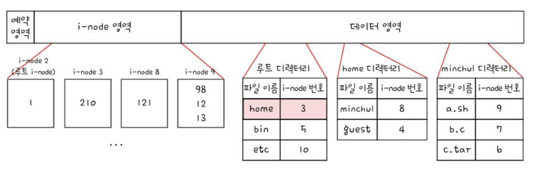
3. 3번 i-node 접근해서 home 디렉터리 위치 파악 --> home 디렉터리는 210 블록에 있음
   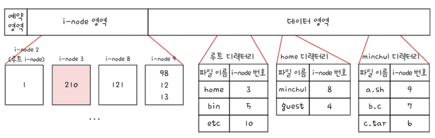
4. 210번 블록 읽으면 home 디렉터리 내용 알 수 있음 --> minchul 디렉터리의 i-node는 8번
   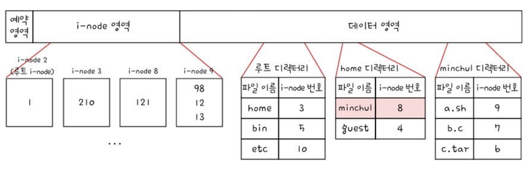
5. 8번 i-node 접근해서 minchul 디렉터리 위치 파악 --> minchul 디렉터리는 121번 블록에 있음
   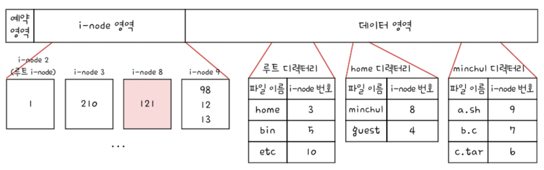
6. 121번 블록 읽으면 minchul 디렉터리 내용 알 수 있음 --> 파일 a.sh의 i-node는 9번
   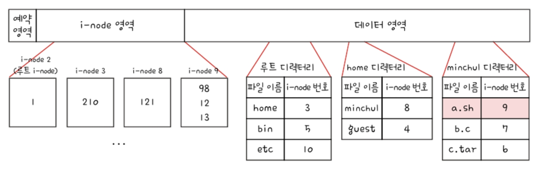
7. 9번 i-node 접근해서 파일 a.sh 위치 파악 --> a.sh 파일은 98번, 12번, 13번 블록에 있음
   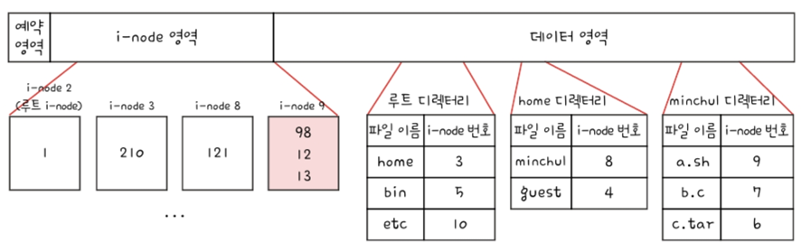

- 이 외에도 알면 흥미로운 파일 시스템
  - NT 파일 시스템(NTFS): 윈도우에서 사용
  - ext 파일 시스템: 리눅스에서 사용

---
### 저널링 파일 시스템
- 시스템 크래시: 컴퓨터 작업 도중 전원 나가거나 치명적 오류로 컴퓨터 강제 종료된 상황
- 파일 시스템 변경 도중에 시스템 크래시 발생 시 파일 시스템 훼손될수도
- 그래서 등장 - `저널링 파일 시스템`
- 저널링 기법: 작업 로그로 시스템 크래시가 발생했을 때 빠르게 복구하기 위한 방법
  1. 작업 직전 파이션의 로그 영역에 수행하는 작업(변경 사항)에 대한 로그 남기기
  2. 로그 남긴 후 작업 수행
  3. 작업 끝나면 로그 삭제
- 로그 영역에 남긴 로그만 검사해도 시스템 크래시 발생 후 어떤 작업 했는지 알아내서 그 작업 완료할 수 있음
- 현대 대부분 파일 시스템은 저널링 기능 지원

### 마운트
- `저장 장치를 마운트 한다`: 한 저장 장치의 파일 시스템에서 다른 저장 장치의 파일 시스템에 접근할 수 있도록 파일 시스템 편입시키는 작업
- 유닉스, 리눅스 같은 OS에서 다양한 저장장치를 컴퓨터 연결할 때 mount 명령어로 빈번하게 마운트 함

---
# Question
## 1. 절대 경로와 상대 경로의 차이점은 무엇인가요?
절대 경로는 루트 디렉터리로부터 시작하는 경로이고, 상대 경로는 현재 디렉터리로부터 시작하는 경로입니다.

## 2. 파티셔닝과 포매팅에 대해 말해주세요.
파티셔닝은 하드 디스크나 SSD처럼 용량이 큰 저장 장치를 하나 이상의 논리적인 여러 단위로 구획하는 작업입니다.
포매팅은 파일 시스템을 설정하여 어떤 방식으로 파일 저장하고 관리할 것인지 결정하고 새로운 데이터 쓸 수 있게 하는 작업을 의미합니다.

## 3. FAT 파일 시스템과 유닉스 파일 시스템의 주요 차이점은 무엇인가요?
FAT 파일 시스템과 유닉스 파일 시스템의 가장 큰 차이점은 파일 할당 방식입니다. FAT은 연결 할당 방식을 사용하여 파일 할당 테이블에 다음 블록의 주소를 저장하고 연결 리스트 형태로 관리합니다. 
반면 유닉스 파일 시스템은 색인 할당 방식을 사용하며, i-node라는 특별한 색인 블록에 파일의 모든 블록 주소와 속성 정보를 저장합니다. 이러한 차이로 인해 유닉스 파일 시스템이 임의 접근에서 더 효율적인 성능을 보입니다.