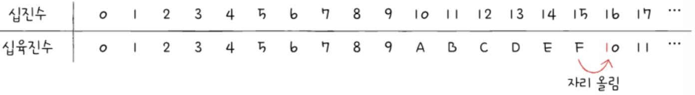

# 혼자 공부하는 컴퓨터 구조 운영체제 
- [혼자 공부하는 컴퓨터 구조 운영체제](#혼자-공부하는-컴퓨터-구조-운영체제)
- [2. 데이터](#2-데이터)
  - [0과 1로 숫자를 표현하는 방법](#0과-1로-숫자를-표현하는-방법)
    - [정보의 단위](#정보의-단위)
    - [이진법](#이진법)
    - [이진수의 음수 표현](#이진수의-음수-표현)
    - [십육진법](#십육진법)
    - [십육진수를 이진수로 변환하기](#십육진수를-이진수로-변환하기)
    - [이진수를 십육진수로 변환하기](#이진수를-십육진수로-변환하기)
  - [0과 1로 문자를 표현하는 방법](#0과-1로-문자를-표현하는-방법)
    - [문자 집합과 인코딩](#문자-집합과-인코딩)
      - [1. 문자 집합](#1-문자-집합)
      - [2. 인코딩 (컴퓨터가 이해)](#2-인코딩-컴퓨터가-이해)
      - [3. 디코딩 (사람이 이해)](#3-디코딩-사람이-이해)
    - [아스키 코드](#아스키-코드)
    - [EUC-KR](#euc-kr)
    - [유니코드와 UTF-8](#유니코드와-utf-8)
    - [문제](#문제)

# 2. 데이터
## 0과 1로 숫자를 표현하는 방법
### 정보의 단위
- 비트 : 0과 1을 표현할 수 있는 가장
  - 전구에 빗대어 생각해볼 수 있음
  - 2의 n제곱에 해당하는 상태를 표현할 수 있음
- 바이트 : 여덟 개의 비트를 묶은 단위
  - 비트*8
  - 2의 8제곱 = 256개의 정보를 표현할 수 있음
- 킬로바이트
  - 바이트*1000
- 메가바이트
  - 킬로바이트*1000
- 기가바이트
  - 메가바이트*1000
- 테라바이트
  - 기가바이트*1000

 

- 워드 : CPU가 한 번에 처리할 수 있는 데이터 크기  
- 하프 워드 : 워드의 절반 크기  
- 풀 워드 : 워드의 1배 크기  
- 더블 워드 : 워드의 2배 크기  
=> 워드의 크기는 CPU마다 다름  
=> 현대 컴퓨터의 워드 크기는 대부분 32비트 또는 64비트
    (이래서 윈도우에서 32비트, 64비트 버전이 있는구나)

### 이진법
- 0과 1을 사용하여 모든 숫자를 표현하는 방법
- 숫자가 1을 넘어가는 시점에 자리 올림

 

- 이진수 표시
  - 수학적 표기 : 1000(2)
  - 코드상 표기 : 0b1000

### 이진수의 음수 표현
- 2의 보수 : 어떤 수를 그보다 큰 2의 n제곱에서 뺀 값
  - 현재 값보다 한자리 더 큰 이진수를 뺀 값
- 사전적으로 이해할 필요 X
- 모든 0과 1을 <u>**뒤집고**</u> 거기에 <u>**1을 더한 값**</u>

 

- 1의 보수 : 모든 이진수의 0과 1을 뒤집은 수
- 2의 보수 : 모든 이진수의 0과 1을 뒤집고 1을 더한 값

 

- 컴퓨터 내부에서 특정 수가 양수인지 음수인지 구분하기 어려움
  - 구분하기 위해 플래그 사용

### 십육진법
- 십육진법 : 수가 15를 넘어가는 시점에 자리 올림을 하는 숫자 표현 방식
  - 0-9 + A-F 사용
  - 16번째에서 자리를 올려서 10이 됨 
  - 
- 이진수보다 더 적은 자릿수로 더 많은 정보를 표현할 수 있음

 

- 16진수의 15 표기
  - 수학적 표기 : 15(16)
  - 코드상 표기 : 0x15

 

- 16진수를 사용하는 이유  
  - 이진수 <-> 십육진수 변환이 쉬움

### 십육진수를 이진수로 변환하기
- 십육진수 : 한 글자당 16종류의 숫자 표현 가능
- 십육진수의 숫자 하나를 표현하기 위해 4비트 필요
  - 2^4 = 16

 

- 십육진수 -> 이진수 변환 방법
  - 십육진수 한 글자를 4비트의 이진수로 간주
  - 한 글자씩 4개의 숫자로 구성된 이진수로 변환하고 이어 붙이면 이진수가 됨

### 이진수를 십육진수로 변환하기
- 이진수 -> 십육진수 변환 방법
  - 이진수 숫자를 네 개씩 끊고, 끊어준 네 개의 숫자를 하나의 십육진수로 변환한 뒤 이어붙이기

---
[목차로 돌아가기](#)

---

 

## 0과 1로 문자를 표현하는 방법
### 문자 집합과 인코딩
#### 1. 문자 집합
- 컴퓨터가 인식하고 표현할 수 있는 문자의 모음
#### 2. 인코딩 (컴퓨터가 이해)
- 문자를 0과 1로 변환하여 컴퓨터가 이해할 수 있도록 하는 과정
#### 3. 디코딩 (사람이 이해)
- 0과 1로 이루어진 문자 코드를 사람이 이해할 수 있는 문자로 변환하는 과정

### 아스키 코드
- 아스키(ASCII) : 초창기 문자 집합 중 하나
  - 영어 알파벳과 아라비아 숫자, 일부 특수 문자 포함
  - 아스키 문자는 7비트로 표현
  - 2^7 = 128개의 문자를 표현할 수 있음
  - 실제로는 하나의 아스키 문자를 나타내기 위해 8비트(1바이트)를 사용함
    - 1비트는 패리티 비트(parity bit)
      - 오류 검출을 위해 사용되는 비트
    - 실질적으로 문자 표현을 위해 사용되는 비트는 7비트

- 아스키 코드 : 아스키 문자에 대응된 고유한 수
  - 아스키 문자는 128개의 숫자 중 하나의 고유한 수에 일대일로 대응됨 
  - 아스키 코드를 이진수로 표현하면서 0과 1로 표현 가능
    - 아스키 문자 -> 아스키 코드 (인코딩)

 

  - 확장 아스키 : 아스키 코드보다 더 다양한 문자 표현을 위해 아스키 코드에 1비트를 추가한 인코딩 방식

 

  - 아스키 코드의 한계 (확장 아스키 포함) : 문자 집합 개수 제한으로 인해 영어권 외의 언어들을 인코딩하기 어려움

- 코드 포인트
  - 문자 인코딩에서 글자에 부여된 고유한 값

 

### EUC-KR
- 한국의 고유한 문자 집합과 인코딩 방식
- 인코딩 방식  
  1. 완성형 인코딩
   - 초성, 중성, 종성의 조합으로 이루어진 완성된 하나의 글자에 고유한 코드를 부여하는 인코딩 방식
   - 예 : KS X 1001, KS X 1003
   - 초성, 중성, 종성이 모두 결합된 한글 단어에 2바이트 크기의 코드를 부여
     -  2^3 = 16비트 
     -  네 자리 십육진수로 나타낼 수 있음
     -  총 2,350개 한글 단어 표현 가능
  -  한계 : 문자 집합에 정의되지 않은 경우 깨져서 보임
     - 확장된 버전으로 마이크로소프트의 'CP949'가 나왔지만 온전히 표현하지는 못함

  1. 조합형 인코딩
   - 초성을 위한 비트열, 중성을 위한 비트열, 종성을 위한 비트열을 할당하여 그것을 조합하여 하나의 글자 코드를 완성하는 인코딩 방식
   - 초성, 중성, 종성에 해당하는 코드를 합하여 하나의 글자 코드를 만드는 인코딩 방식
  
  

### 유니코드와 UTF-8
- 유니코드란? 
  - 모든 언어를 아우르는 문자 집합과 통일된 표준 인코딩 방식
  - 한글, 대부분 나라의 문자, 특수문자, 화살표나 이모티콘까지 코드로 표현할 수 있는 통일된 문자 집합
  - 현대 문자를 표현할 때 가장 많이 사용되는 표준 문자 집합

- 유니코드의 다양한 인코딩 방식 : UTF (Unicode Transformation Format)
  1. UTF-8
    - 1~4 바이트까지 인코딩 결과를 만듦
  2. UTF-16
  3. UTF-32

 

---
[목차로 돌아가기](#)

---
 

### 문제
---
Q1. 2의 보수가 무엇인가? 

A1. 이진수로 음수를 표현하기 위한 방식으로 0과 1을 뒤집은 이후 1을 더하면 구할 수 있다. 특정 이진수를 2의 보수를 중복으로 2번 취하면 원래 수로 돌아오는 성질을 가지고 있다. 이를 통해 음수의 특징을 표현할 수 있다.

---
Q2. 십육진수와 이진수를 변경하는 방식은 어떻게 되는가?  

A2. 십육진수의 한 숫자씩 총 4자리를 차지하는 이진수로 변환하고 이를 순서대로 합치면 이진수로 변환된다. 이진수를 4자리씩 끊어서 해당하는 수를 십육진수로 변경하여 순서대로 합치면 십육진수로 변환된다.

---

Q3. 아스키코드와 한국 고유한 인코딩 방식에 대해 간단하게 한계를 설명하고 그 대안으로 나온 표준 인코딩 방식에 대해 설명하시오. 

Q3. 아스키코드와 EUC-KR의 완성형 코드의 특성 상 표현할 수 있는 문자의 개수가 제한적이고 나라마다 특정 나라의 언어만 표현할 수 있다. 이를 극복하기 위한 대안으로 유니코드를 사용한다. 유니코드는 모든 언어와 문자 집합을 어우르는 표준 인코딩 방식이며 대부분의 문자를 표현할 수 있다. 

---
[목차로 돌아가기](#)

---
