- [2.1 0과 1로 숫자를 표현하는 방법](#21-0과-1로-숫자를-표현하는-방법)
  - [정보 단위](#정보-단위)
    - [\<컴퓨터가 이해하는 정보단위\>](#컴퓨터가-이해하는-정보단위)
  - [이진법](#이진법)
    - [이진수의 음수 표현](#이진수의-음수-표현)
  - [십육진법](#십육진법)
    - [이진수와 십육진수 변환 방법](#이진수와-십육진수-변환-방법)
- [2.2 0과 1로 문자를 표현하는 방법](#22-0과-1로-문자를-표현하는-방법)
  - [문자집합1. 아스키코드](#문자집합1-아스키코드)
  - [문자집합2. EUC-KR](#문자집합2-euc-kr)
  - [유니코드와 UTF-8](#유니코드와-utf-8)
    - [UTF-8](#utf-8)
  - [📖](#)

# 2.1 0과 1로 숫자를 표현하는 방법

## 정보 단위

### <컴퓨터가 이해하는 정보단위>

**비트(bit)**: 0과 1을 나타내는 가장 작은 정보 단위.
n개의 비트로 2^n가지의 정보를 표현할 수 있음.\
**바이트(byte)**: 8개의 비트를 묶은 단위
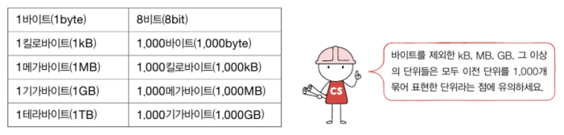

> 참고)\
> 워드(word) : CPU가 한 번에 처리할 수 있는 데이터 크기\
> CPU가 한 번에 16비트를 처리할 수 있다면 1워드는 16비트가 됨. 한 번에 32비트를 처리할 수 있다면 1워드는 32비트.

## 이진법

이진법(binary): 0과 1만으로 모든 숫자를 표현하는 방법\
십진법(decimal): 9를 넘어가는 시점에 자리올림을 하는 우리가 일상적으로 사용하는 숫자

> 이진법으로 나타낸 수를 이진수, 십진법으로 나타낸 수를 십진수라고 함

**이진수 8를 표기하는 방법**
| 수학적 표기 | 코드 상에서 표기 |
| :---: | :---: |
| 1000(2) | 0b1000 |

### 이진수의 음수 표현

대부분의 경우 **2의 보수**를 구해 0과 1만으로 음수를 표현한다.

> 2의 보수: 어떤 수를 그보다 큰 2^n에서 뺀 값

**<쉽게 2의 보수를 구하는 방법>**\
↳ 모든 0과 1을 뒤집고 거기에 1을 더한다.\
ex) 11(2)을 음수(2의 보수)로 표현하는 방법: 11 =(모든 0과 1을 뒤집는다.)=> 00 =(1을 더한다.)=> 01(2)

> 참고) 위에서 구한 11(2)의 보수인 01(2)의 보수를 구해보면 11(2)이 나온다. 즉, 보수의 보수는 자기 자신이다.

**플래그**: 부가 정보. 컴퓨터 내부에서 어떤 값을 다룰 때 부가 정보가 필요한 경우 플래그를 사용한다. 다음과 같이 플래그를 통해 컴퓨터가 숫자의 부호를 알 수 있게 된다.
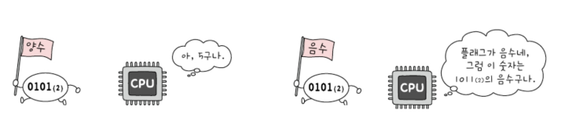

> 참고) 2의 보수 표현의 한계
> 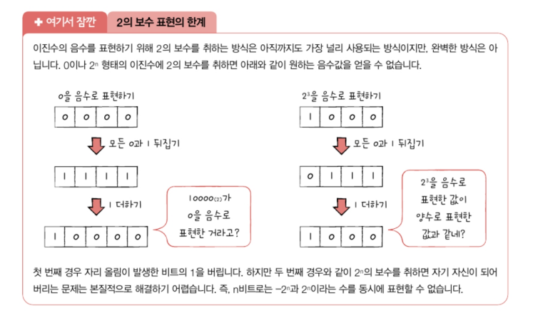

## 십육진법

십육진법(hexadecimal): 15를 넘어가는 시점에 자리 올림을 하는 숫자 표현 방식
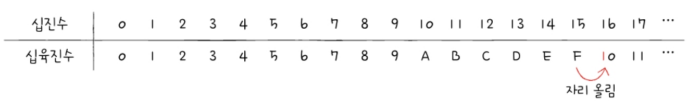

**십육진수 15를 표기하는 방법**
| 수학적 표기 | 코드 상에서 표기 |
| :---: | :---: |
| 15(16) | 0x15 |

> 참고) 십육진수 A~F를 쉽게 이해하는 방법
> 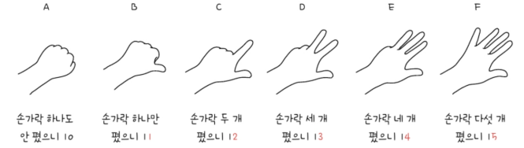

### 이진수와 십육진수 변환 방법

십육진수 -> 이진수: 십육진수 한 글자를 4비트의 이진수로 간주하여 바꾼 후 합치기
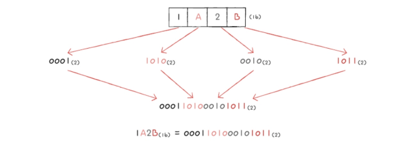
이진수 -> 십육진수: 4개씩 끊어 십육진수로 변환 후 합치기

# 2.2 0과 1로 문자를 표현하는 방법

문자집합: 컴퓨터가 인식하고 표현할 수 있는 문자의 모음\
문자 인코딩: 문자를 0과 1로 변환하는 과정. 인코딩의 결과값이 문자 코드가 됨\
문자 디코딩: 0과 1로 표현된 문자 코드를 사람이 읽을 수 있는 문자로 변환하는 과정
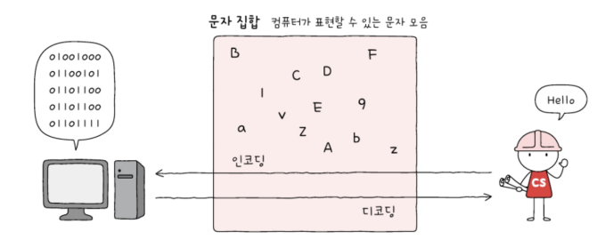

## 문자집합1. 아스키코드

아스키 문자들은 각각 7비트로 표현됨

> 실제로는 8비트를 사용하나 1개의 비트는 오류 검출을 위해 사용되는 패리티 비트(parity bit)이다. 즉, 실질적으로 문자를 표현을 위해 사용되는 비트는 7비트임.
> 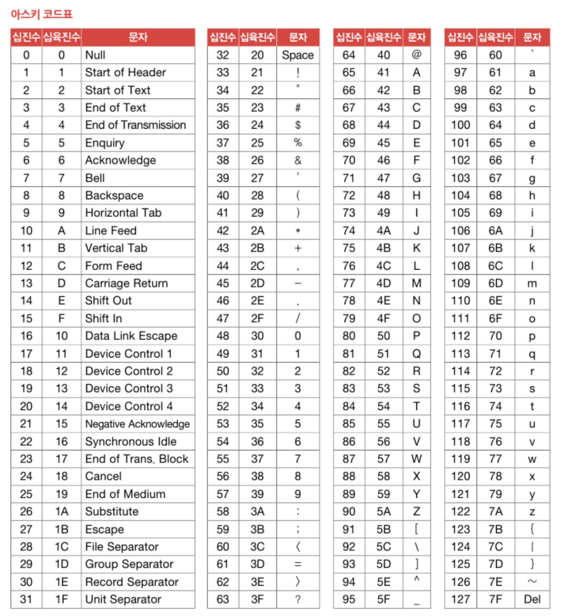
> 아스키코드 인코딩 예시) 'A' : 십진수 65(이진수 1000001(2))로 인코딩 됨

아스키 코드의 한계 : 7비트로 표현하기 때문에 128개보다 많은 문자를 표현하지 못 함. 8비트의 확장 아스키가 등장하긴 했지만 그럼에도 부족함.

## 문자집합2. EUC-KR

- 완성형 인코딩: 초성, 중성, 종성 조합으로 이루어진 완성된 하나의 글자에 고유한 코드를 부여하는 인코딩 방식
- 조합형 인코딩: 초성, 중성, 종성 각각에 비트열을 할당하여 그것들의 조합으로 하나의 글자 코드를 완성하는 인코딩 방식
  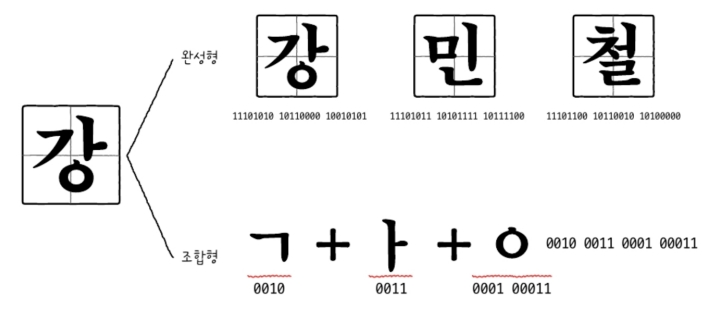

**EUC-KR**:한글의 완성형 인코딩 방식. 한글 단어에 2바이트 크기의 코드를 부여함\

> 2,350개 정도의 한글 단어를 표현할 수 있지만 모든 한글 조합을 표현할 수 있진 않음. 확장된 버전으로 CP949가 등장했지만 이마저도 넉넉한 양은 아니다.
> 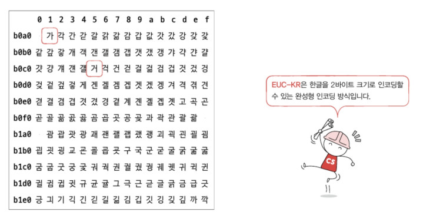

## 유니코드와 UTF-8

유니코드: EUC-KR보다 훨씬 다양한 한글을 포함하면서 대부분 나라의 문자, 특수문자, 화살표나 이모티콘까지도 코드로 표현할 수 있는 통일된 문자 집함

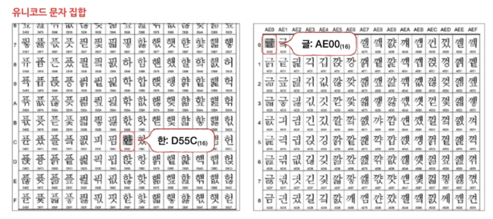
각 문자마다 고유한 값이 부여되지만, 부여된 값을 그대로 인코딩 값으로 삼는 아스키코드, EUC-KR과는 달리 유니코드에서는 이 값을 인코딩 값으로 삼지 않고 다양한 방법(UTF-8, UTF-16, UTF-32)으로 인코딩 한다.

### UTF-8

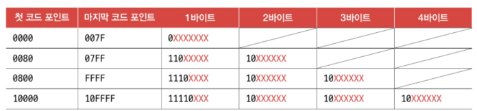

- 유니코드 문자에 부여된 값의 범위가 0부터 007F(16)까지는 1바이트로 표현
- 유니코드 문자에 부여된 값의 범위가 0080(16)부터 07FF(16)까지는 2바이트로 표현
- 유니코드 문자에 부여된 값의 범위가 0800(16)부터 FFFF(16)까지는 3바이트로 표현
- 유니코드 문자에 부여된 값의 범위가 10000(16)부터 10FFFF(16)까지는 4바이트로 표현

ex) '한'에 부여된 값은 D55C(16), '글'에 부여된 값은 AE00(16)라는 것을 이용하여 인코딩한 결과값을 알아보자.\
=> 두 글자 모두 0800(16) ~ FFFF(16)사이이므로 UTF-8로 인코딩하면 3바이트로 표현될 것임.
이때, 부여된 값을 이진수로 바꾼 후 붉은색 X표 자리에 차례대로 집어넣으면 됨.\
D55C(16) => 1101 0101 0101 1100(2) =(UTF-8 방식으로 인코딩)=>11101101 10010101 10011100(2)\
AE00(16) => 1010 1110 0000 0000(2) =(UTF-8 방식으로 인코딩)=>11101010 10111000 10000000(2)

---

## 📖

Q1. 문자 인코딩과 문자 디코딩에 대해 설명하시오.

A1. 문자 인코딩이란 문자를 컴퓨터가 이해할 수 있도록 0과 1로 변환하는 과정이고, 반대로 0과 1로 이루어진 문자 코드를 사람이 이해할 수 있는 문자로 변환하는 과정을 문자 디코딩이라고 한다.

Q2. 십육진법에 대해 간략하게 설명하고, 데이터를 표현할 때 십진법이 아닌 십육진법을 사용하는 이유에 대해 설명하시오.

A2. 십육진수는 15를 넘어가는 시점에 자리 올림을 하는 숫자 표현 방식이며, 십진수와 달리 이진수와의 변환이 쉽기 때문에 십육진법을 사용한다.

Q3. 이진수만 보고도 어떻게 컴퓨터 내부에서 양수인지 음수인지 판단하는지에 대해 설명하시오.

A3. 플래그라는 부가정보를 사용함으로써 컴퓨터로 하여금 숫자가 양수인지 음수인지 판단할 수 있게 한다.
