- [소드 코드와 명령어](#소드-코드와-명령어)
  - [고급 언어와 저급 언어](#고급-언어와-저급-언어)
    - [\<저급언어\>](#저급언어)
  - [컴파일 언어와 인터프리터 언어](#컴파일-언어와-인터프리터-언어)
    - [컴파일 언어](#컴파일-언어)
    - [인터프리터 언어](#인터프리터-언어)
      - [목적파일 VS 실행 파일](#목적파일-vs-실행-파일)
- [명령어의 구조](#명령어의-구조)
  - [연산 코드와 오퍼랜드](#연산-코드와-오퍼랜드)
    - [오퍼랜드](#오퍼랜드)
    - [연산 코드](#연산-코드)
  - [주소 지정 방식](#주소-지정-방식)
    - [즉시 주소 지정 방식](#즉시-주소-지정-방식)
    - [직접 주소 지정 방식](#직접-주소-지정-방식)
    - [간접 주소 지정 방식](#간접-주소-지정-방식)
    - [레지스터 주소 지정 방식](#레지스터-주소-지정-방식)
    - [레지스터 간접 주소 지정 방식](#레지스터-간접-주소-지정-방식)
      - [+) 스택과 큐](#-스택과-큐)
  - 
  - [📖](#-1)

# 소드 코드와 명령어

## 고급 언어와 저급 언어
**고급언어**: 사람을 위한 언어(ex: C, C++, Java, Python)\
**저급언어**: 컴퓨터가 직접 이해하고 실행할 수 있는 언어\
=> 고급언어로 작성된 소스코드가 실행되려면 반드시 저급언어(명령어)로 변환되어야 함

### <저급언어>

- **기계어**: 0과 1의 명령어 비트로 이루어진 언어
  |이진수로 표현된 기계어|십육진수로 표현된 기계어|
  |:---:|:---:|
  |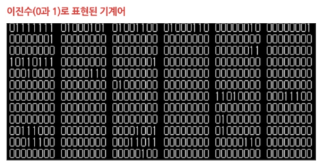|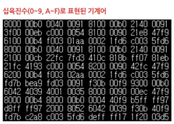|
- **어셈블리어**: 0과 1로 표현된 명령어를 읽기 편한 형태로 번역한 언어
  

> 어셈블리어는 0과 1로 이루어진 기계어를 읽기 편하게 만든 저급언어일 뿐이므로 개발자가 어셈블리어를 이용해 복잡한 프로그램을 만들기는 쉽지 않다. 다만 하드웨어와 밀접하게 맞닿아 있는 프로그램을 개발하는 임베디드 개발자, 게임 개발자, 정보보안 분야 등의 개발자는 어셈블리어를 많이 사용함

## 컴파일 언어와 인터프리터 언어
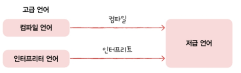
### 컴파일 언어
컴파일 언어: 컴파일러에 의해 소스 코드 전체가 저급 언어로 변환되어 실행되는 고급 언어(ex: C언어)
- 컴파일(compile): 컴파일 언어로 작성된 소스코드 전체가 저급 언어로 변환되는 과정
- 컴파일러(compiier): 컴파일을 수행해 주는 도구
- 목적 코드(object code): 컴파일러를 토해 저급 언어로 변환된 코드
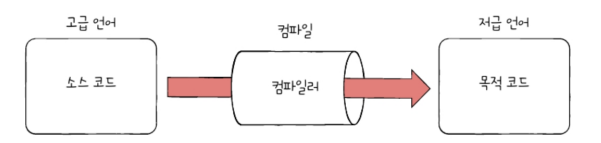

### 인터프리터 언어
인터프리터 언어: 인터프리터에 의해 소스 코드가 한 줄씩 실행되는 고급 언어(ex: Python)
- 인터프리터(interpreter): 소스 코드를 한 줄씩 저급 언어로 변환하여 실행해 주는 도구

||컴파일 언어|인터프리터 언어|
|:---:|:---:|:---:|
|실행방식|전체를 변환|한 줄씩 변환|
|특징|소스 코드 컴파일 중 오류가 발생하면 소스 코드 전체가 실행되지 않음|소스 코드 인터프리트 중 오류가 발생하면 오류 발생 전까지의 코드는 실행|

=> 속도: 컴파일이 인터프리터보다 빠르다.

> 참고) 하나의 프로그래밍 언어가 반드시 컴파일, 인터프리트 방식 중 딱 하나로만 작동하는 것은 아니다.

#### 목적파일 VS 실행 파일
- 목적 파일: 목적 코드로 이루어진 파일
- 실행 파일: 실행 코드로 이루어진 파일(ex: 윈도우의 .exe 확장자를 가진 파일)

목적 파일 != 실행파일\
목적 코드가 실행 파일이 되기 위해서는 `링킹`이라는 작업을 거쳐야 한다.
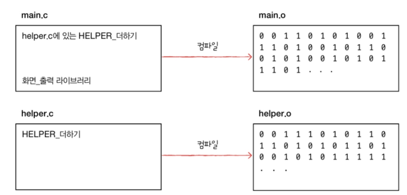
위와 같이 main.c가 컴파일되어 main.o(목적 파일)로 변환되었을 경우 main.o를 바로 실행할 수 있을까?\
=> No\
main.o는 main.c 내용이 그대로 저급 언어로 변환된 파일일 뿐이므로 main.c에 없는 'HELPER_더하기'나 '화면_출력'은 어떻게 실행하는지 알지 못 함\

main.o가 실행되려면 main.o에 없는 외부 기능들을 main.o와 연결짓는 작업이 필요. 이러한 연결 작업을 `링킹(linking)`이라고 함

# 명령어의 구조
## 연산 코드와 오퍼랜드
명령어는 '무엇을 대상(주로 오퍼랜드가 가리키는 값)으로, 어떤 작동(연산코드)을 수행해라'는 구조로 되어있음
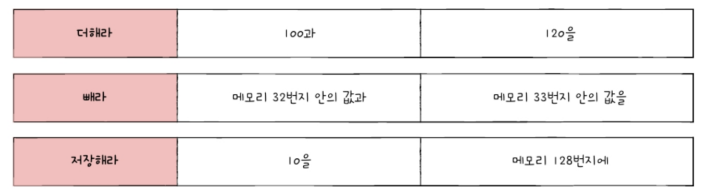
- **연산코드(operation code)**: 연산자. 명령어가 수행할 연산. (붉은색 배경 필드값)
- **오퍼랜드(operand)**: 피연산자. 연산에 사용할 데이터 or 연산에 사용할 데이터가 저장된 위치. (흰색 배경 필드 값)
- 연산 코드 필드: 연산 코드가 담기는 영역
- 오퍼랜드 필드: 오퍼랜드가 담기는 영역

### 오퍼랜드
오퍼랜드가 연산에 사용할 데이터 or 연산에 사용할 데이터가 저장된 위치를 의미한다고 했지만 대부분의 경우 사용할 데이터가 저장된 위치, 즉 메모리 주소나 레지스터 이름이 담긴다.\
∴ 오퍼랜드 필드를 주소 필드라 부르기도 함
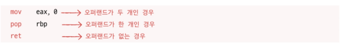
오퍼랜드는 명령어 안에 하나도 없을 수도 있고 한 개, 두 개 등 여러 개가 있을 수 있으며, 개수에 따라 0-주소 명령어, 1-주소 명령어, 2-주소 명령어, 3-주소 명령어라고 한다.
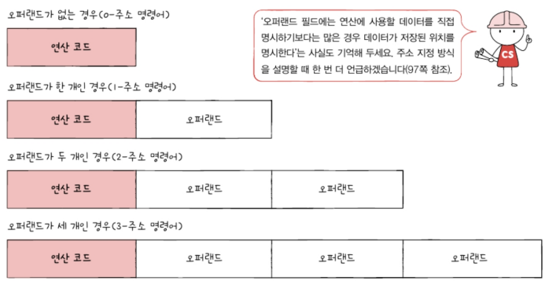

### 연산 코드
기본적인 연산 코드 유형
1. 데이터 전송
2. 산술/논리 연산
3. 제어 흐름 변경
4. 입출력 제어

> 참고) 명령어 종류와 생김새는 CPU마다 다르기 때문에 연산 코드의 종류와 생김새 또한 CPU마다 다르다.

- 대표적인 연산코드 예시

## 주소 지정 방식
**주소 지정 방식**: 오퍼랜드 필드에 데이터가 저장된 위치를 명시할 때 연산에사용할 데이터 위치를 찾는 방법\
오퍼랜드 필드에 메모리나 레지스터의 주소를 담는 이유: 명령어의 길이 때문
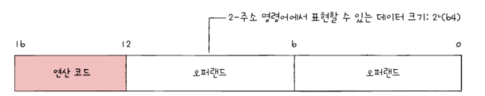
명령어의 크기가 16비트, 연산 코드 필드가 4비트인 2-주소 명령어에서 오퍼랜드 필드당 6비트 정도밖에 남지 않음. 즉, 하나의 오퍼랜드 필드로 표현할 수 있는 정보의 가짓수는 2^6개
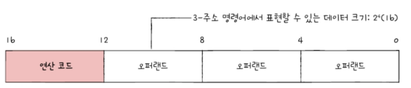
3-주소 명령어에서는 오퍼랜드 필드당 4비트 정도밖에 남지 않으며, 하나의 오퍼랜드 필드로 표현할 수 있는 정보의 가짓수는 2^4개이다.

만약 메모리나 레지스터 안에 데이터를 저장하고 오퍼랜드 필드 안에 해당 메모리 혹은 레지스터 주소를 명시한다면 정보의 가짓수가 2^16으로 커지게 됨

- **유효 주소(effective address)**: 연산 코드에 사용할 데이터가 저장된 위치, 즉 연산의 대상이 되는 데이터가 저장된 위치

||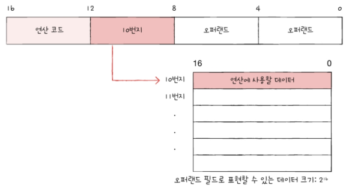|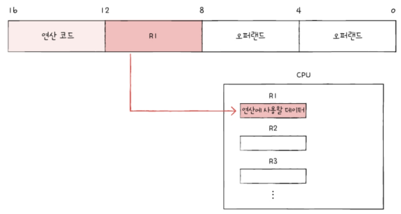|
|:---:|:---:|:---:|
|유효주소|10번지|레지스터 R1|

### 즉시 주소 지정 방식
연산에 사용할 데이터를 오퍼랜드 필드에 직접 명시하는 방식\
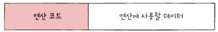

장점: 연산에 사용할 데이터를 메모리나 레지스터로부터 찾는 과정이 없기 때문에 다른 주소 지정 방식들보다 빠름\
단점: 표현할 수 있는 데이터의 크기가 작아짐

### 직접 주소 지정 방식
오퍼랜드 필드에 유효 주소를 직접적으로 명시하는 방식
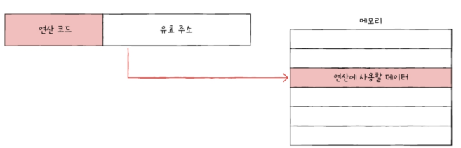

오퍼랜드 필드에 표현할 수 있는 데이터의 크기는 즉시 주소 지정 방식보다 커졌지만, 유효 주소를 표현할 수 있는 범위가 여전히 연산 코드의 비트 수만큼 줄어들었음

### 간접 주소 지정 방식
유효 주소의 주소를 오퍼랜드 필드에 명시
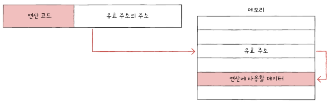
직접 주소 지정 방식보다 표현할 수 있는 유효 주소의 범위가 더 넓어졌지만 두 번의 메모리 접근이 필요하기 때문에 앞서 설명한 주소 지정방식들보다 일반적으로 느린 방식이다.

### 레지스터 주소 지정 방식
직접 주소 지정 방식과 비슷하게 연산에 사용할 데이터를 저장한 레지스터를 오퍼랜드 필드에 직접 명시하는 방법

> 일반적으로 CPU 외부에 있는 메모리에 접근하는 것보다 CPU 내부에 있는 레지스터에 접근하는 것이 더 빠름.

### 레지스터 간접 주소 지정 방식
연산에 사용할 데이터를 메모리에 저장하고, 그 주소(유효 주소)를 저장한 레지스터를 오퍼랜드 필드에 명시하는 방법
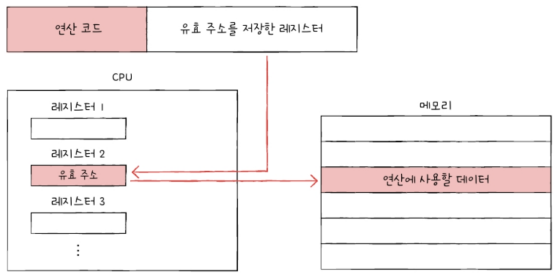
유효 주소를 찾는 과정이 간접 주소 지정 방식과 비슷하지만, 메모리에 접근하는 횟수가 한 번으로 줄어든다는 차이이자 장점이 있음.

<정리>
- 즉시 주소 지정 방식: 연산에 사용할 데이터
- 직접 주소 지정 방식: 유효 주소(메모리 주소)
- 간접 주소 지정 방식: 유효 주소의 주소
- 레지스터 주소 지정 방식: 유효 주소(레지스터 이름)
- 레지스터 간접 주소 지정 방식: 유효 주소를 저장한 레지스터

#### +) 스택과 큐
- 스택(stack): 한쪽 끝이 막혀있는 통과같은 저장공간. 후입선출방식(LIFO, Last In First Out)
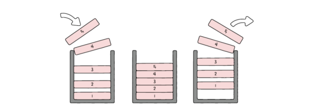

- 큐(queue): 양쪽이 뚫려 있는 통과 같은 저장 공간. 선입선출방식(FIFO, First In First Out)

---

## 📖

Q1. 컴파일 언어와 인터프리터 언어의 차이에 대해 간략하게 설명하시오.

A1. 컴파일 언어는 소스 코드 전체를 저급 언어로 변환하는 방식이라 변환하는 과정 (컴파일)중 오류가 발생하면 소스 코드 전체가 실행되지 않는 반면, 인터프리터 언어는 소스코드 한 줄씩 변환하는 방식으로 변환하는(인터프리트) 중 오류가 발생하더라도 오류 발생 전까지의 코드는 실행한다는 점에서 차이가 있다.

Q2. 명령어의 두 가지 구성요소와 각각의 구성요소에 대해 설명하시오. 

A2. 명령어는 연산코드와 오퍼랜드로 구성되어 있으며, 연산코드는 명령어가 수행할 연산이고 오퍼랜드는 연산에 사용할 데이터 혹은 연산에 사용할 데이터가 저장된 위치를 뜻합니다.

Q3. 간접 주소 지정방식과 레지스터 간접 주소 지정 방식의 속도 차이와 그 이유에 대해 설명하시오.

A3. 일반적으로 CPU 외부에 있는 메모리에 접근하는 것보다 CPU 내부에 있는 레지스터에 접근하는 것이 더 빠르기 때문에 메모리에 접근하는 간접 주소 지정방식보다는 레지스터 간접 주소 지정 방식이 더 빠르다.
 

-+-\
Q4. 유효주소에 대해 간략하게 설명하고, '저장하라. 3을 10번지에'라는 명령어에서 10번지는 유효주소에 해당하는지 말해보시오.

A4. 유효주소는 연산의 대상이 되는 데이터가 저장된 위치를 뜻하며, '저장하라. 3을 10번지에'라는 명령에서 10번지는 유효주소에 해당한다.
> 챗 GPT 답변:
> 
>Effective Address(유효 주소)는 프로그램 내에서 사용되는 주소로, 실제 메모리 위치를 가리킵니다. 보통 이 주소는 간접 주소 지정(indirect addressing), 베이스 주소 지정(base addressing), 인덱스 주소 지정(index addressing) 등의 주소 지정 모드를 통해 계산됩니다.
>
>주어진 명령어 "저장하라. 3을 10번지에"에서 10번지는 다음과 같은 경우에 effective address가 될 수 있습니다:
>
>직접 주소 지정 (Direct Addressing): 만약 10번지가 실제 메모리 주소를 의미한다면, 이 경우 10번지는 그대로 effective address입니다.
베이스 또는 인덱스 주소 지정 (Base or Index Addressing): 만약 10번지가 어떤 베이스 주소나 인덱스를 더한 결과라면, 계산된 결과가 실제 메모리 주소가 됩니다. 예를 들어, Base Address + Offset 형태라면 계산 후의 결과가 effective address입니다.
>
>결론적으로, "저장하라. 3을 10번지에"라는 명령어에서 10번지는 문맥에 따라 직접 주소일 경우 그 자체로 effective address가 되며, 간접 주소 지정 등의 경우는 해당 주소를 계산한 결과가 effective address가 됩니다. 따라서 10번지가 비어있는지는 상관없이, 10번지가 명령어의 컨텍스트에서 계산된 후 실제 메모리 주소를 가리킨다면 effective address라고 할 수 있습니다.