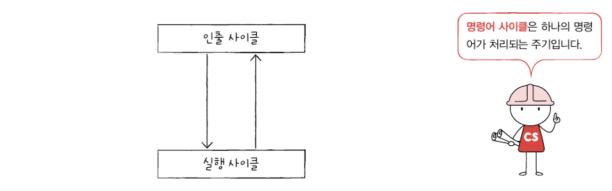
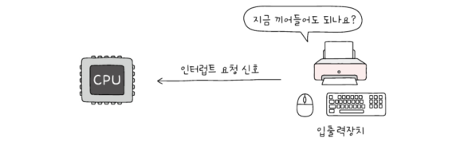
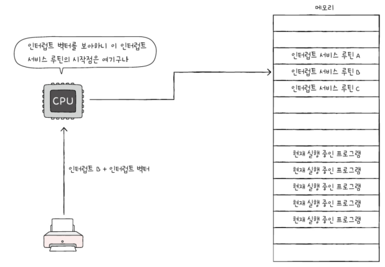

# 명령어 사이클과 인터럽트

명령어 사이클: 하나의 명령어를 처리하는 정형화된 흐름
인터럽트: 명령어의 흐름이 끊어지는 상황

## 명령어 사이클
명령어 사이클: 프로그램 속 각각의 명령어들이 반복되어 실행되는 일정한 주기
- 인출 사이클: 메모리에 있는 명령어를 CPU로 가지고 오는 단계
- 실행 사이클: 인출한 명령어를 실행하는 단계_제어장치가 명령어 레지스터에 담긴 값을 해석하고, 제어 신호를 발생시키는 단계

=> 프로그램을 이루는 수많은 명령어는 일반적으로 인출과 실행 사이클을 반복하며 실행됨

- 간접 사이클: 명령어를 인출하여 CPU로 가져왔다 하더라도 바로 실행 사이클에 도입할 수 없는 경우(ex: 간접 주소 지정방식_오퍼랜드 필드에 유효주소의 주소를 명시하므로 명령어를 실행하기 위해서는 메모리 접근을 한 번 더 해야 함)

## 인터럽트
인터럽트: CPU가 수행 중인 작업을 방해하는 신호
"이게 더 급한 거니까 지금 하던 일 멈추고 이것부터 처리해 줘." 라는 요청과 같음

- 동기 인터럽트(예외): CPU에 의해 발생하는 인터럽트. CPU가 명령어들을 수행하다가 예상치 못한 상황에 마주쳤을 때, 가령 CPU가 실행하는 프로그래밍상의 오류와 같은 예외적인 상황에 마주쳤을 때 발생하는 인터럽트

- 비동기 인터럽트(하드웨어 인터럽트): 입출력장치에 의해 발생하는 인터럽트.  세탁기 완료 알림, 전자레인지 조리 완료 알림과 같은 알림 역할을 함

### 하드웨어 인터럽트
: 알림과 같은 인터럽트. 입출력 작업 도중에도 효율적으로 명령어를 처리하기 위해 이런 알림과 같은 하드웨어 인터럽트를 사용함
(만약 사용하지 않는다면 알림 없는 전자레인지가 언제 조리를 끝낼지 모르는 채 무작정 전자레인지 앞에서 서성이는 셈)

### 하드웨어 인터럽트 처리 순서
1. 입출력장치는 CPU에 `인터럽트 요청 신호`를 보낸다.
2. CPU는 실행 사이클이 끝나고 명령어를 인출하기 전 항상 인터럽트 여부를 확인한다.
3. CPU는 인터럽트 요청을 확인하고 `인터럽트 플래그`를 통해 현재 인터럽트를 받아들일 수 있는지 여부를 확인한다.
4. 인터럽트를 받아들일 수 있다면 CPU는 지금까지의 작업을 백업한다.
5. CPU는 `인터럽트 벡터`를 참조하여 `인터럽트 서비스 루틴`을 실행한다.
6. 인터럽트 서비스 루틴 실행이 끝나면 4에서 백업해 둔 작업을 복구하여 실행을 재개한다.
   
- 인터럽트 요청 신호: 인터럽트 하기 전 "지금 끼어들어도 되나요?"하고 CPU에게 묻는 신호

- 인터럽트 플래그: 하드웨어 인터럽트를 받아들일지, 무시할지를 결정하는 플래그.
  (CPU가 중요한 작업을 처리해야 하거나 어떤 방해도 받지 않아야 할 때 인터럽트 플래그는 불가능으로 설정됨)
  
다만, 모든 하드웨어 인터럽트를 인터럽트 플래그로 막을 수 있는 것은 아님. 무시할 수 없는, 즉 가장 우선순위가 높은, 가장 먼저 처리해야하는 인터럽트가 존재
ex: 정전이나 하드웨어 고장으로 인한 인터럽트

- 인터럽트 서비스 루틴(인터럽트 핸들러): 인터럽트를 처리하기 위한 프로그램
  "키보드가 어떤 요청을 보냈을 때는 어떻게 작동한다", "마우스가 어떤 인터럽트 요청을 보냈을 때는 어떻게 작동한다"와 같이 어떤 인터럽트가 발생했을 때 해당 인터럽트를 어떻게 처리하고 작동해야 할지에 대한 정보로 이루어진 프로그램

- 인터럽트 벡터: 인터럽트 서비스 루틴을 식별하기 위한 정보. 인터럽트 벡터를 알면 인터럽트 서비스 루틴의 시작 주소를 알 수 있기 때문에 CPU는 인터럽트 벡터를 통해 특정 인터럽트 서비스 루틴을 처음부터 실행할 수 있음
  

'CPU가 인터럽트를 처리한다' === '인터럽트 서비스 루틴을 실행하고, 본래 수행하던 작업으로 다시 되돌아온다.'

인터럽트 서비스 루틴 또한 명령어와 데이터로 이루어져 있음=> 인터럽트 서비스 루틴도 프로그램 카운터를 비롯한 레지스터들을 사용하며 실행 됨

인터럽트 발생 전까지 레지스터에 저장되어 있던 값들은 어떻게 할까?

CPU는 인터럽트 서비스 루틴을 실행하기 전에 프로그램 카운터 값 등 현재 프로그램을 재개하기 위해 필요한 모든 내용을 스택에 백업한다. 그 후 인터럽트 서비스 루틴의 시작 주소가 위치한 곳으로 프로그램 카운터 값을 갱신하고 인터럽트 서비스 루틴을 실행함

인터럽트 서비스 루틴을 모두 실행하면 스택에 저장해 둔 값을 다시 불러온뒤 이전까지 수행하던 작업을 재개함

---

## 📖

Q1. 인출 사이클과 실행 사이클에 대해 간략하게 설명하시오.

A1. 인출 사이클은 메모리에 있는 명령어를 CPU로 가지고 오는 단계이며, 실행 사이클은 제어장치가 명령어 레지스터에 담긴 값을 해석하고, 제어 신호를 발생시키는 단계이다.

Q2. 인터럽트 요청신호, 인터럽트 플래그, 인터럽트 벡터, 인터럽트 서비스 루틴에 대해 간략하게 설명하시오.

A2. 인터럽트 요청 신호는 CPU의 작업을 방해하는 인터럽트에 대한 요청 신호이고, 인터럽트 플래그는 인터럽트 요청 신호를 받아들일지의 여부를 결정하는 비트이다. 또 인터럽트 서비스 루틴은 인터럽트를 처리하는 프로그램이며 인터럽트 벡터는 인터럽트 서비스 루틴의 시작 주소를 포함하는 인터럽트 서비스 루틴의 식별 정보이다.

Q3. 현재 CPU의 프로그램 카운터에는 1500이 저장되어 있고, 이 CPU에 하드웨어 인터럽트가 발새하여 10번지에 있는 인터럽트 서비스 루틴을 실행해야 한다고 가정했을 때 CPU 처리 과정에 대해 간략하게 설명하시오.

A3. 인터럽트 요청을 받기 전까지 CPU가 수행하고 있는 일을 서비스 루틴이 끝난 후 다시 수행해야 하므로 지금까지 작업 내역들을 스택에 백업한 후 서비스 루틴의 시작 주소가 위치한 곳으로 프로그램 카운터 값을 갱신한다. 그 후 인터럽트서비스 루틴을 실행하고, 인터럽트 서비스 루틴을 모두 실행하면 스택에 저장해둔 값을 다시 불러온 뒤 이전까지 수행하던 작업을 재개한다.
 