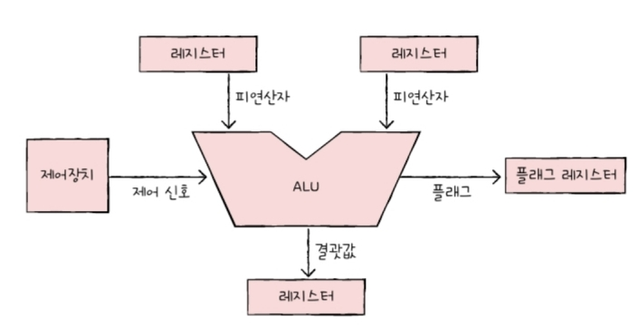

# 4회차

## Title: 컴퓨터 구조 시작하기

### Subject: CPU의 작동원리

### Date: 240805

<aside>
 **NOTES**

# ALU와 제어장치

## ALU

- ALU가 받아들이는 정보 : 레지스터를 통해 `피연산자`, 제어장치로부터 `제어 신호`

- ALU가 내보내는 정보 : `계산 결과`, `플래그`
    - ALU의 결과값은 메모리X, 레지스터에 우선 저장
    - `오버플로우` : 연산 결과가 연산 결과를 담을 레지스터 보다 큰 상황
    - 플래그 : CPU가 프로그램 실행하는 도중 반드시 기억해야 하는 일종의 참고 정보 → 이런 플래그들은 `플래그 레지스터` 에 저장
        - 부호 플래그 : 연산 결과 부호
        - 제로 플래그 : 연산 결과 == 0?
        - 캐리 플래그  : 연산 결과 올림수나 빌림수 발생?
        - 오버플로우 플래그 : 오버플로우 발생?
        - 인터럽트 플래그 : 인터럽트 가능?
        - 슈퍼바이저 플래그 : 커널 모드 or 사용자 모드 실행?

## 제어장치

제어 신호를 내보내고, 명령어 해석하는 부품

- 제어 신호 : 컴퓨터 부품 관리하고 작동시키기 위한 일종의 전기 신호

### 제어 장치가 받아들이는 정보

1. 클럭 신호
    - 클럭(clock) : 컴퓨터 모든 부품을 일사불란하게 움직일 수 있게 하는 시간 단위
2. ‘해석해야 할 명령어’ → 명령어 레지스터
    
    제어장치는 명령어 레지스터로부터 해석할 명령어 받아들이고 해석 후, 제어 신호 발생시켜 컴퓨터 부품들에 수행해야 할 내용 알려줌
    
3. 플래그 레지스터 속 플래그 값
    - 플래그 : ALU 연산에 대한 추가적인 상태 정보
4. 시스템 버스 中 제어버스로 전달된 제어 신호

### 제어장치가 내보내는 정보

1. CPU 외부에 전달하는 제어 신호
    
    제어 버스로 제어 신호 내보냄
    ex) 메모리에 전달하는 제어 신호, 입출력장치에 전달하는 제어 신호
    
2. CPU 내부에 전달하는 제어 신호

---

# 레지스터

## 반드시 알아야 할 레지스터

1. 프로그램 카운터(Program Counter)
    
    메모리에서 가져올 명령어의 주소(=메모리에서 읽어들일 명령어 주소 저장)
    
    → 명령어 포인터(IP; INstruction Pointer)라고 부르기도
    
2. 명령어 레지스터
    
    해석할 명령어(=방금 메모리에서 읽어 들인 명령어 저장)
    
    제어장치가 명령어 레지스터 속 명령어 받아들이고 해석 후, 제어 신호 내보냄
    
3. 메모리 주소 레지스터
    
    메모리 주소 저장하는 레지스터
    
    주소 값을 주소 버스로 보낼 때 메모리 주소 레지스터 거침
    
4. 메모리 버퍼 레지스터
    
    메모리와 주고받을 값(데이터와 명령어) 저장하는 레지스터
    데이터 버스로 주고 받을 값은 메모리 버퍼 레지스터 거침
    
5. 플래그 레지스터
    
    연산 결과 or CPU 상태에 대한 부가적 정보 저장
    
6. 범용 레지스터
    - 메모리 버퍼 레지스터 : 데이터 버스로 주고받을 값만 저장
    - 메모리 주소 레지스터 : 주소 버스로 내보낼 주소값만 저장
    - But, 범용 레지스터 : 데이터, 주소 모두 저장
7. 스택 포인터 → 스택 주소 지정할 때 사용
8. 베이스 레지스터

## 특정 레지스터 이용한 주소 지정 방식

### 스택 주소 지정 방식

- 스택 포인터 - 스택 꼭대기
- 스택 영역 : 메모리 안에 스택처럼 사용할 영역 정해져 있는 곳

### 변위 주소 지정 방식

오퍼랜드 필드의 주소와 어떤 레지스터 더하는지 따라

1. 상대 주소 지정 방식
    
    `오퍼랜드와 프로그램 카운터의 값을 더해` 유효 주소 얻는 방식
    
    - 프로그래밍 언어 if문과 유사
        
        모든 코드 실행X, 분기해서 특정 주소의 코드 실행
        
2. 베이스 레지스터 주소 지정 방식
    
    `오퍼랜드와 레지스터 값을 더해` 유효 주소 얻는 방식
    

</aside>

<aside>
 **QUESTIONS**
1. **LU가 받아들이는 정보와 내보내는 정보는 각각 무엇인가요?**
ALU가 받아들이는 정보는 레지스터를 통한 피연산자와 제어장치로부터의 제어 신호입니다. 
    
    ALU가 내보내는 정보는 계산 결과와 플래그입니다. 계산 결과는 우선 레지스터에 저장되며, 플래그는 연산 결과에 대한 부가적인 정보로 플래그 레지스터에 저장됩니다.
    
2.  **제어장치의 주요 기능과 그것이 받아들이는 정보 중 두 가지를 설명해주세요.**
제어장치의 주요 기능은 제어 신호를 내보내고 명령어를 해석하는 것입니다.  
    
    1) 클럭 신호 : 이는 컴퓨터의 모든 부품을 동기화하는 시간 단위
    
    2) 명령어 레지스터로부터 받는 '해석해야 할 명령어'. 제어장치는 이 명령어를 해석한 후 적절한 제어 신호를 발생시켜 컴퓨터 부품들에게 수행해야 할 작업을 지시합니다.
    
3. **변위 주소 지정 방식 중 상대 주소 지정 방식과 베이스 레지스터 주소 지정 방식의 차이점은 무엇인가요?**
상대 주소 지정 방식은 오퍼랜드와 프로그램 카운터의 값을 더해 유효 주소를 얻는 방식입니다. 이는 프로그래밍 언어의 if문과 유사하게 분기하여 특정 주소의 코드를 실행할 때 사용됩니다. 
    
    반면, 베이스 레지스터 주소 지정 방식은 오퍼랜드와 베이스 레지스터의 값을 더해 유효 주소를 얻는 방식입니다. 
    
    두 방식의 주요 차이점은 프로그램 카운터를 사용하느냐, 베이스 레지스터를 사용하느냐에 있습니다.
</aside>