- [5.1 빠른 CPU를 위한 설계 기법](#51-빠른-cpu를-위한-설계-기법)
  - [클럭](#클럭)
  - [코어와 멀티코어](#코어와-멀티코어)
  - [스레드와 멀티스레드](#스레드와-멀티스레드)
    - [하드웨어적 스레드](#하드웨어적-스레드)
    - [소프트웨어적 스레드](#소프트웨어적-스레드)
    - [멀티스레드 프로세서(하드웨어 스레드 中)](#멀티스레드-프로세서하드웨어-스레드-中)
- [5.2 명령어 병렬 처리 기법](#52-명령어-병렬-처리-기법)
  - [1. 명령어 파이프라인](#1-명령어-파이프라인)
    - [데이터 위험](#데이터-위험)
    - [제어 위험](#제어-위험)
    - [구조적 위험(자원 위험)](#구조적-위험자원-위험)
  - [2. 슈퍼스칼라](#2-슈퍼스칼라)
  - [3. 비순차적 명령어 처리(OoOE)](#3-비순차적-명령어-처리oooe)
- [5.3 CICS와 RISC](#53-cics와-risc)
  - [명령어 집합](#명령어-집합)
  - [CISC](#cisc)
  - [RISC](#risc)
  - [📖](#)

# 5.1 빠른 CPU를 위한 설계 기법
CPU의 속도와 연관있는 것들: 클럭, 멀티코어, 멀티스레드

## 클럭
>04장_클럭
> 1. 컴퓨터 부품들은 '클럭 신호'에 맞춰 일사불란하게 움직인다.
> 2. CPU는 '명령어 사이클'이라는 정해진 흐름에 맞춰 명령어들을 실행한다.

=> 클럭 신호가 빠르게 반복되면 CPU를 비롯한 컴퓨터 부품들이 빠른 박자에 맞춰 움직이게 됨. 명령어 사이클 또한 빠르게 반복될 것임

`클럭 속도`: 1초에 클럭이 몇 번 반복되는지를 나타냄. 헤르츠(Hz)단위로 측정\
ex) 1초에 한 번 반복되면 클럭속도는 1Hz, 1초에 100번 반복되면 클럭속도는 100Hz

> 참고) 클럭속도는 일정하지 않음. 기본 클럭속도와 최대 클럭속도가 나뉘어 있는 게 이 때문.

## 코어와 멀티코어
**코어(core)**: 명령어를 실행하는 부품(우리가 지금까지 CPU의 정의로 알고 있었던 것)\
**멀티 코어 CPU** or **멀티코어 프로세서**: 코어를 여러 개 포함하고 있는 CPU 
(CPU 내에 명령어를 처리하는 일꾼이 여러 명 있는 것과 같은 셈. 단일 코어보다 멀티 코어의 처리 속도가 더 빠름)
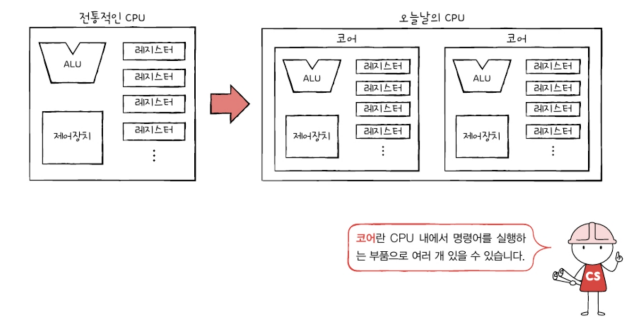

| 포함된 코어 개수에 따른 CPU 명칭: | 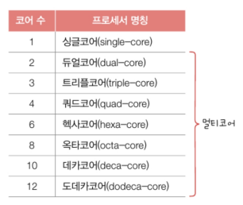 |
|:---: | :---: |

연산 속도가 꼭 코어 수에 비례하여 증가하지는 않음. 또한 처리하고자 하는 작업량보다 코어 수가 지나치게 많아도 성능에 크게 영향이 없음.\
코어마다 처리할 명령어들이 얼마나 적절하게 분배하느냐에 따라 연산속도가 달라짐

## 스레드와 멀티스레드
스레드(thread): 실행 흐름의 단위
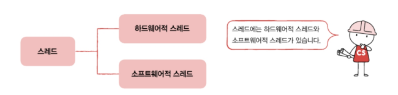

### 하드웨어적 스레드
: 하나의 코어가 동시에 처리하는 명령어 단위\
(우리가 지금까지 배운 CPU는 1코어 1스레드 CPU였음. 즉, 명령어를 실행하는 부품이 하나 있고 한 번에 하나씩 명령어를 실행하는 CPU)

아래와 같이 여러 스레드를 지원하는 CPU는 하나의 코어로도 여러 개의 명령어들을 동시에 실행할 수 있음(아래 그림은 명령어를 실행하는 부품 두 개를 포함하고 한 번에 네 개의 명령어를 처리할 수 있는 CPU)
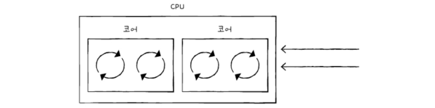
**멀티스레드 프로세서** or **멀티스레드 CPU**: 하나의 코어로 여러 명령어를 동시에 처리하는 CPU
**하이퍼스레딩**: 인텔의 멀티스레드 기술(인텔이 자신들의 멀티스레드 기술에 부여한 명칭)

### 소프트웨어적 스레드
: 하나의 프로그램에서 독립적으로 실행되는 단위

하나의 프로그램은 실행되는 과정에서 한 부분만 실행될 수도 있지만, 프로그램의 여러 부분이 동시에 실행될 수도 있음
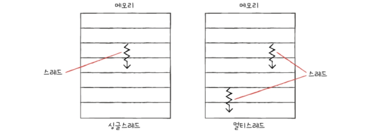

아래 표에서 왼쪽 기능들이 동시에 수행되길 원할 경우, 왼쪽 기능들을 작동시키는 코드를 각각의 스레드로 만들면 동시에 실행할 수 있음
|  | 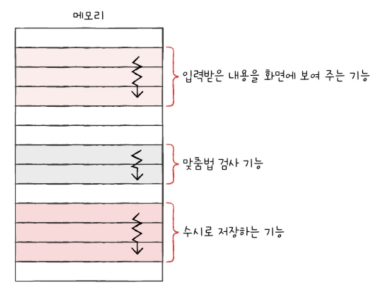 |
| :---: | :---: |

한 번에 하나씩 명령어를 처리하는 1코어 1스레드 CPU도 소프트웨어적 스레드를 수십 개 실행할 수 있음.

### 멀티스레드 프로세서(하드웨어 스레드 中)
하나의 코어로 여러 명령어를 동시에 처리하도록 만들려면 프로그램 카운터, 스택 포인터, 데이터 버퍼 레지스터, 데이터 주소 레지스터와 같이 하나의 명령어를 처리하기 위해 꼭 필요한 레지스터를 여러 개 가지고 있으면 됨
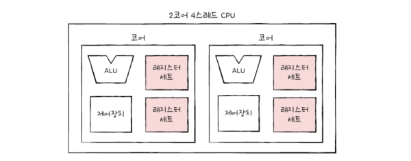

하드웨어 스레드를 이용해 하나의 코어로도 여러 명령어를 동시에 처리할 수 있다고 했지만 메모리 속 프로그램 입장에서 봤을 때 하드웨어 스레드는 '한 번에 하나의 명령어를 처리하는 CPU'나 다름 없음.
가령 2코어 4스레드 CPU는 한 번에 네 개의 명령어를 처리할 수 있지만 프로그램 입장에서 봤을 땐 한 번에 하나의 명령어를 처리하는 CPU가 네 개 있는 것처럼 보임
=> 하드웨어 스레드를 `논리 프로세서`라고 부르기도 함
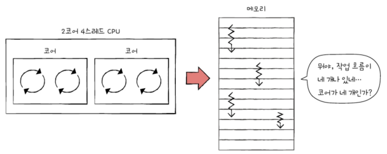

# 5.2 명령어 병렬 처리 기법
명령어 병렬처리 기법: 명령어를 동시에 처리하여 CPU를 한시도 쉬지 않고 작동시키는 기법
명령어 병렬 처리 기법 종류: 명령어 파이프라이닝, 슈퍼스칼라, 비순차적 명령어 처리

## 1. 명령어 파이프라인
하나의 명령어가 처리되는 전체 과정을 비슷한 시간 간격으로 나눠야 함.
전공서에 따라 달라지긴 하지만 일반적으로 명령어 처리 과정을 클럭 단위로 나눴을 경우 아래와 같이 나눌 수 있음
1. 명령어인출(Instruction Fetch)
2. 명령어 해석(Instruction Decode)
3. 명령어 실행(Execute Instruction)
4. 결과 저장(Write Back)

CPU는 같은 단계가 겹치지만 않는다면 각 단계를 동시에 실행할 수 있음. 
ex) CPU는 한 명령어를 '인출'하는 동안 다른 명령어를 '실행'할 수 있고, 한 명령어가 '실행'되는 동안에 연산 결과를 '저장'할 수 있음
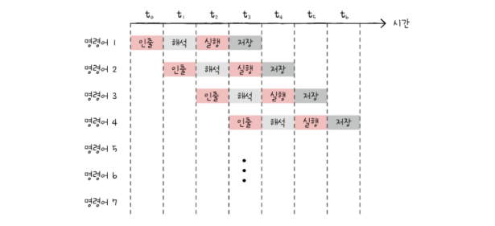

명령어 파이프라이닝: 마치 공장 생산 라인과 같이 명령어들을 명령어 파이프라인에 넣고 동시에 처리하는 기법

파이프라이닝이 높은 성능을 가져오긴 하지만 성능 향상에 실패하는 경우도 있음. 이러한 상황을 `파이프라인 위험`이라 부름

### 데이터 위험
: 데이터 의존적인 두 명령어를 무작정동시에 실행하려고 하면 파이프라인이 제대로 작동하지 않는 것\
명령어 간 '데이터 의존성'에 의해 발생\
어떤 명령어는 이전 명령어를 끝까지 실행해야만 비로소 실행할 수 있는 경우가 있음

위의 경우 명령어 1을 수행해야만 명령어 2를 수행할 수 있음. 그렇지 않을 경우 원치 않은 R1값으로 명령어 2를 수행하게 됨

### 제어 위험
: 주로 분기 등으로 인한 '프로그램 카운터의 갑작스러운 변화'에 의해 발생. 기본적으로 프로그램 카운터는 '현재 실행 중인 명령어의 다음 주소'로 갱신 되지만 프로그램 실행 흐름이 바뀌어 명령어가 실행되면서 프로그램 카운터 값에 갑작스런 변화가 생긴다면 명령어 파이프라인에 미리 가지고 와서 처리중이었던 명령어들은 쓸모가 없어짐
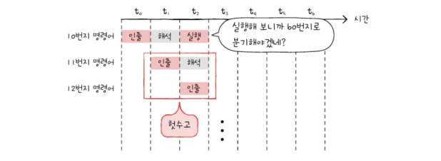
분기예측: 제어 위험을 막기 위해 사용하는 기술 중 하나. 프로그램이 어디로 분기할지 미리 예측한 후 그 주소를 인출하는 기술

### 구조적 위험(자원 위험)
: 명령어들을 겹쳐 실행하는 과정에서 서로 다른 명령어가 동시에 ALU, 레지스터 등과 같은 CPU 부품을 사용하려 할 때 발생

## 2. 슈퍼스칼라
슈퍼스칼라: CPU 내부에 여러 개의 명령어 파이프라인을 포함한 구조

명령어 파이프라인을 하나만 두는 것이 마치 공장 생산 라인을 한 개 두는 것과 같다면, 슈퍼스칼라는 공장 생산라인을 여러 개 두는 것과 같음
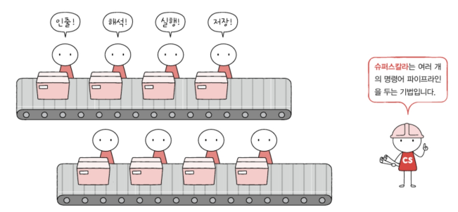

**슈퍼스칼라 프로세서** or **슈퍼스칼라 CPU** : 슈퍼스칼라구조로 명령어 처리가 가능한 CPU

슈퍼스칼라 프로세서는 매 클럭 주기마다 동시에 여러 명령어를 인출할 수도, 실행할 수도 있어야 함. 가령 멀티스레드 프로세서는 한 번에 여러 명령어를 인출하고, 해석하고, 실행할 수 있기 때문에 슈퍼스칼라 구조를 사용할 수 있음

슈퍼스칼라 프로세서는 이론적으로 파이프라인 개수에 비례하여 프로그램 처리 속도가 빨라지지만 파이프라인 위험 등의 문제 때문에 반드시 비례하여 빨라지진 않음

## 3. 비순차적 명령어 처리(OoOE)
: 명령어의 '합법적인 새치기'. 명령어들을 순차적으로 실행하지 않는 기법

명령어 파이프라이닝, 슈퍼스칼라 기법 => 순차적인 처리를 상정한 방법. 파이프라인 위험과같은 예상치 못한 문제들로 인해 명령어가 곧바로 처리되지 못하는 일이 발생하곤 함.

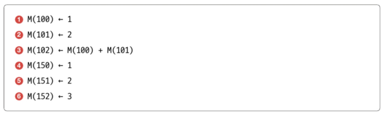
'메모리 N번지에 M을 저장하라' === M(N) ← M

순차적으로 처리할 경우...
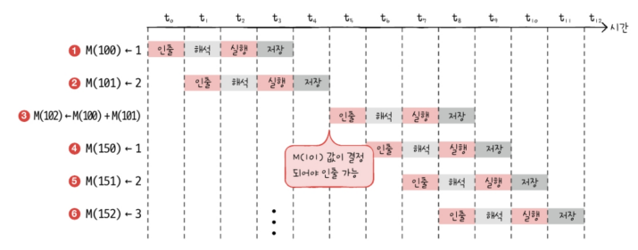

3번의 경우 뒤의 명령어와 순서를 바꾸어 실행해도 크게 문제될 것이 없음
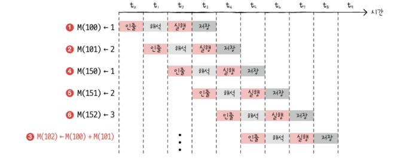
명령어를 순차적으로 실행하지 않고 순서를 바꿔 실행해도 무방한 명령어를 먼저 실행하여 파이프라인이 멈추는 것을 방지하는 기법을 `비순차적 명령어 처리 기법`이라 함

하지만 아무 명령어나 순서를 바꿔 수행할 수는 없음. 가령 위의 경우에선 3번 명령어와 1번 명령어의 순서를 바꿀 수 없음

# 5.3 CICS와 RISC
명령어 파이프라이닝과 슈퍼스칼라 기법을 실제로 CPU에 적용하려면 명령어가 파이프라이닝에 최적화되어 있어야 함.

## 명령어 집합
이 세상 모든 CPU들이 똑같이 생긴 명령어를 실행하진 않음. 
명령어의 세세한 생김새, 명령어로 할 수 있는 연산, 주소 지정 방식 등은 CPU마다 조금씩 차이가 있음

**명령어 집합** or **명령어 집합구조(ISA)**: CPU가 이해할 수 있는 명령어들의 모음
=> CPU마다 ISA가 다를 수 있음

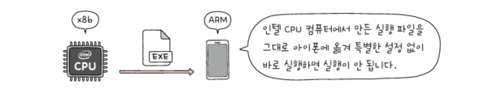
가령 인텔 CPU를 사용하는 컴퓨터와 아이폰은 다른 ISA를 이해하기 때문에 서로의 명령어를 이해할 수 없음

명령어가 달라지면 어셈블리어가 달라짐. 동일한 소스 코드를 컴파일하더라도 ISA가 다를 경우 다른 결과를 얻게 됨(왼: x86-64 ISA, 오른: ARM ISA)
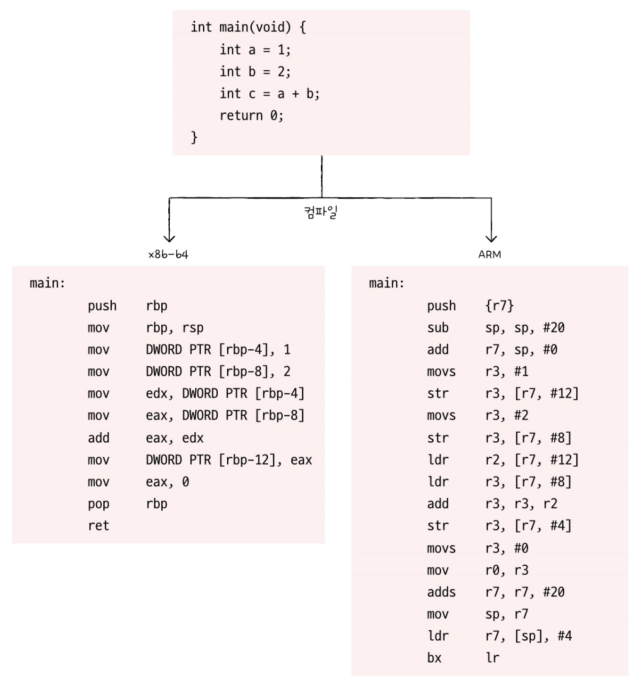
> 사용한 컴파일러에 따라서도 어셈블리어가 달라질 수 있지만, 위의 예시는 gcc 11.2라는 동일한 컴파일러를 사용함

ISA가 같은 CPU끼리는 서로의 명령어를이해할 수 있지만 ISA가 다르면 서로의 명령어를 이해하지 못 함. ISA는 일종의 CPU의 언어인 셈

CPU가 이해하는 명령어 즉 ISA가 달라지면 제어장치가 명령어를 해석하는 방식, 사용되는 레지스터 종류와개수, 메모리 관리 방법 등 많은 것이 달라짐. 이는 곧 CPU 하드웨어 설계에도 큰 영향을 미침
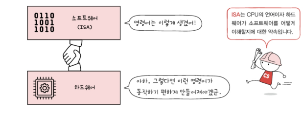

## CISC
: Complex Instruction Set Computer의 약자. 복잡한 명령어 집합을 활용하는 컴퓨터(CPU). 복잡하고 다양한 명령어들을 활용하는 CPU 설계방식
ex) x86, x86-64

명령어의 형태와 크기가 다양한 `가변 길이 명령어` 활용(다양하고 강력한 기능의 명령어 집합을 활용하기 때문)
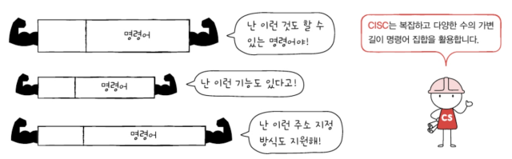

다양하고 강력한 명령어를 활용한다는 말은 상대적으로 적은 수의 명령어로도 프로그램을 실행할 수 있다는 것을 의미
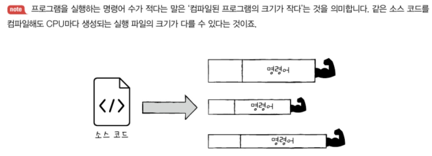

단점: 활용하는 명령어가 워낙 복잡하고 다양한 기능을 제공하다보니 명령어의크기와 실행되기까지의 시간이 일정하지 않음. 또 복잡한 명령어 때문에 명령어 하나를 실행하는 데에 여러 클럭 주기를 필요로 함 => 명령어 파이프라인을 구현하는 데에 걸림돌이 됨
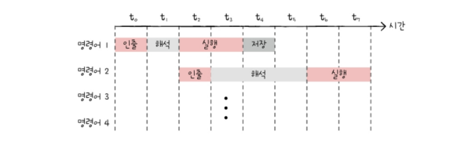

게다가 복잡하고 다양한 명령어를 활용할 수 있긴하지만, 대다수의 복잡한 명령어는  사용 빈도가 낮음
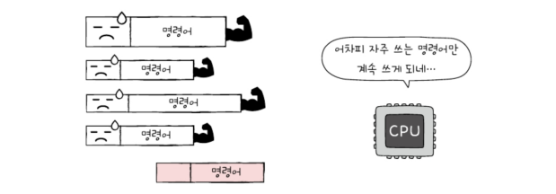

## RISC
> CISC의 한계가 주는 교훈
> 

RISC: Reduced Instruction Set Computer
- CISC에 비해 명령어 종류가 적음
- CISC와 달리 짧고 규격화된 명령어, 되도록 1클럭 내외로 실행되는 명령어를 지향
  (즉, 고정 길이 명령어를 활용함)
  
  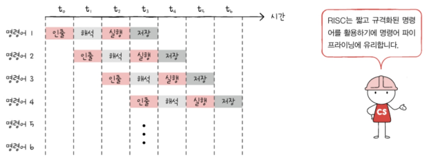
- 메모리에 직접 접근하는 명령어를 load, store 두 개로 제한할 만큼 메모리 접근을 단순화하고 최소화를 추구함

RISC는 메모리 접근을 단순화, 최소화 하는 대신 레지스터를 적극적으로 활용함
=> CISC보다 레지스터를 이용하는 연산이 많고, 일반적인 경우보다 범용 레지스터 개수도 더 많음.
다만 사용 가능한 명령어 개수가 CISC보다 적기 때문에 RISC는 CISC보다 많은 명령으로 프로그램을 작동시킴

**CISC** vs **RISC**
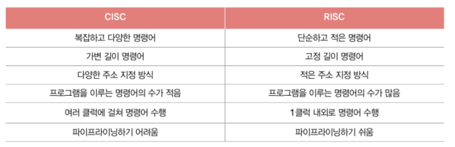

---

## 📖

Q1. 코어와 멀티코어 프로세서(멀티코어 CPU)에 대해 간단히 설명하시오.

A1. 코어는 명령어를 실행하는 부품이며 이러한 코어를 여러 개 포함하고 있는 CPU를 멀티코어 프로세서라고 한다.

Q2. 파이프라인 위험에는 어떤 것들이 있는지 말하고 각각이 어떤 상황에서 발생하는 위험인지 간략하게 설명하시오.

A2. 파이프라인 위험은 데이터 위험, 제어 위험, 구조적 위험(자원 위험)이 있다. 데이터 위험은 데이터 의존적인 두 명령어를 무작정 동시에 실행하려고 했을 때 발생하는 위험이고, 제어 위험은 주로 분기 등으로 인한 '프로그램 카운터의 갑작스러운 변화'에 의해 발생하며, 구조적 위험은 명령어들을 겹쳐 실행하는 과정에서 서로 다른 명령어가 동시에 ALU, 레지스터 등과 같은 CPU 부품을 사용하려 할 때 발생한다.

Q3. CISC가 갖는 한계에 대해 설명하시오.

A3. CISC는 활용하는 명령어가 복잡하고 다양한 기능을 제공하다보니 명령어의크기와 실행되기까지의 시간이 일정하지 않음. 또 복잡한 명령어 때문에 명령어 하나를 실행하는 데에 여러 클럭 주기를 필요로하는데 이는 명령어 파이프라인을 구현하는 데에 어려움이 생기게 된다. 또 CISC는 복잡하고 다양한 명령어를 활용할 수 있긴 하지만 대다수의 복잡한 명령어는 사용빈도가 낮다는 점에서 한계를 보인다. 