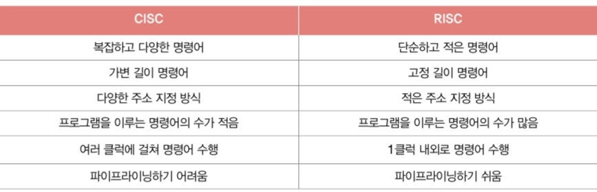

# 6회차

## Title: 컴퓨터 구조 시작하기

### Subject: CPU 성능 향상 기법

### Date: 240826

<aside>
**NOTES**

# 빠른 CPU 위한 설계 기법

## 클럭

1. 컴퓨터 부품들은 ‘클럭 신호’ 맞춰 일사불란하게 움직임
2. CPU는 ‘명령어 사이클’ 이라는 정해진 흐름에 맞춰 명령어 실행

⇒ 클럭 속도는 CPU의 속도 단위로 간주 - Hz로 측정

- CPU는 계속 일정한 클럭 속도 유지X, 고성능 요하는 순간에 순간적으로 속도 높이고, 안 그럴 때는 유연하게 낮추기도
- 오버클럭킹 : 최대 클럭 속도 강제로 더 끌어 올리기
- 클럭 속도 무작정 높이면 발열 문제만 심화

## 코어와 멀티 코어

- CPU 성능 높이는 방법
    - 클럭 속도 높이기
    - CPU의 코어 수 늘리기
    - 스레드 수 늘리기

### 멀티 코어 CPU, 멀티코어 프로세서

코어를 여러 개 포함

- CPU의 연산 속도가 꼭 코어 수 비례X
- 코어마다 처리할 명령어들을 얼마나 적절히 분해바느냐 →  그에 따라 연산 속도 달라짐

## 스레드와 멀티스레드

### 스레드(thread)

실행 흐름의 단위

### 하드웨어적 스레드

하나의 코어가 동시에 처리하는 명령어 단위

→ CPU 입장에서 정의된 HW적 스레드

- `멀티스레드 프로세서, 멀티스레드 CPU` : 하나의 코어로 여러 명령어 동시 처리하는 CPU
- 하이퍼스레딩 : 인텔의 멀티 스레드 기술

### 소프트웨어적 스레드 → 스레드

하나의 프로그램에서 독립적으로 실행되는 단위

- 하나의 프로그램은 실행 과정에서 한 부분만 실행될 수도 있지만, 프로그램의 여러 부분 동시에 실행될 수도 있음
- 하나의 명령어 처리 위해 꼭 필요한 레지스터를 여러 개 가지고 있으면 멀티스레드 프로세서 설계,,

### 논리 프로세서

메모리 속 프로그램 이밪ㅇ에서, 하드웨어 스레드는 마치 ‘한 번에 하나의 명령어 처리하는 CPU’ → 하드웨어 스레드를 논리 프로세서라고 부르기도

<결론>

- `코어` : 명령어 실행할 수 있는 ‘하드웨어 부품’
- `멀티코어 프로세서` : 명령어 실행할 수 있는 하드웨어 부품이 CPPU 안에 2개 이상 있는 CPU
- `멀티스레드 프로세서` : 하나의 코어로 여러 개의 명령어 동시에 실행할 수 있는 CPU

---

# 명령어 병렬 처리 기법

명령어를 동시에 처리해 CPU를 한시도 쉬지 않고 작동시키는 방법

## 명령어 파이프라인

- 명령어 처리 과정 → 같은 단계가 겹치지만 않으면  CPU는 ‘각 단계 동시 실행’ 가능
    - 명령어 인출
    - 명령어 해석
    - 명령어 실행
    - 결과 저장

⇒ `명령어 파이프라이닝` : 명령어 파이프라인에 넣고 동시에 처리하는 기법

### 파이프라인 위험

1. 데이터 위험 : 명령어 간 ‘데이터 의존성’에 의해 발생
2. 제어 위험 : ‘프로그램 카운터의 갑작스러운 변화’에 의해 발생
    1. 분기 예측 : 프로그램이 어디로 분기할지 미리 예측한 후 그 주소를 인출
3. 구조적 위험=자원 위험 : 명령어들을 겹쳐 실행하는 과정에서 서로 다른 명령어가 동시에 ALU, 레지스터 등과 같은 CPU 부품 사용하려고 할 때 발생

### 슈퍼스칼라

CPU 내부에 여러 개의 명령어 파이프라인 포함한 구조

- 슈퍼스칼라 프로세서, 슈퍼스칼라 CPU
    - 슈퍼스칼라 구조로 명령어 처리 가능한 CPU
    - 매 클럭 주기마다 동시에 여러 명령어 인출할 수도, 실행할 수도 있어야
- 이론적으로 파이프라인 개수에 비례해서 프로그램 처리 속도 faster
    
    But, 파이프라인 위험 등 예상 못한 문제로 실제로는 반드시 파이프라인 개수에 비례X
    
    → 고도로 설계 되어야 함!
    

### 비순차적 명령어 처리(OoOE)

명령어의 ‘합법적 새치기’ - 명령어들을 순차적으로 실행X 기법

- 명령어 파이프라이닝, 슈퍼스칼라 기법은 여러 명령어의 순차적 처리 상정 방법
- 하지만, 파이프라인 위험처럼 예상치 못한 문제들로 명령어 곧바로 처리 못하기도 → 순차적으로 처리한다면 이런 상황에서 명령어 파이프라인은 멈춰버림

⇒ 그래서 명령어를 순차적으로만 실행X, 순서 바꿔도 무방한 명령어를 먼저 실행해서 명령어 파이프라인 멈추는 것 방지하는 기법

(아무 명령어나 순서 바꿔서 수행X)

---

# CIRS와 RISC

### ISA(명령어 집합, 명령어 집합 구조)

CPU가 이해할 수 있는 명령어들의 모음

⇒ CPU 마다 ISA 다를 수 있음

- 어셈블리어 : 명령어 읽기 편하게 표현한 언어
- ISA가 다르다 == CPU가 이해할 수 있는 명령어가 다르다 == 명령어가 다르면, 어셈블리어도 다르다
- ISA가 달라지면 그에 따른 많은 것이 달라짐
    - 제어장치가 명령어 해석하는 방식
    - 사용되는 레지스터 종류와 개수
    - 메모리 관리 방법 등
    - CPU 하드웨어 설계에도 큰 영향

## CISC(Complex Instruction Set Computer)

다양하고 강력한 기능의 명령어 집합 활용해서 명령어의 형태와 크기가 다양한 `가변 길이 명령어` 활용

- 프로그램 실행하는 명령어 수가 적다
    - 컴파일된 프로그램 크기가 작다
    - 같은 소스 코드를 컴파일 해도, CPU마다 생성되는 실행 파일의 크기가 다를 수 있음
- 장점
    - 적은 수의 명령어만으로도 프로그램 동작 → 메모리 공간 절약
- 단점
    - 명령어 크기, 실행되기까지의 시간 일정하지X
    - 복잡한 명령어 때문에 명령어 하나 실행하는 데에 여러 클럭 주기 필요
- CISC 명령어 집합이 다양하고 복잡한 기능 지원하지만, 실제로는 자주 사용되는 명령어만 쓰임

## RISC(Reduced Instruction Set Computer)

### CISC의 한계로 인한 교훈

1. 빠른 처리를 위해 명령어 파이프라인 활용
    
    원활한 파이프라이닝 위해 `명령어 길이와 수행 시간이 짧고 규격화`되어 있어야
    
2. 어차피 자주 쓰이는 명령어만 줄곧 사용
    
    복잡한 기능 지원하는 명령어 추가X, `자주 쓰이는 기본적인 명령어를 작고 빠르게 만드는 것` 중요
    

⇒  RISC는 `고정 길이 명령어` 활용

### RISC 특징

- 레지스터 적극 활용
메모리 접근을 단순화, 최소화 대신
- 레지스터 이용 연산 CISC보다 많고, 일반적으로 범용 레지스터 개수도 더 많음
- 사용가능한 명령어 개수가 CISC보다 적어서 RISC는 CISC 보다 많은 명령으로 프로그램 작동시킴

### CISC vs RISC

</aside>

<aside>
**QUESTIONS**

1. 클럭, 코어, 스레드에 대해 설명해보세요.
클럭 속도가 높으면 일반적으로 CPU 속도도 높다고 간주됩니다. 하지만 클럭 속도를 무작정 높이면 발열 문제만 생깁니다.
코어는 CPU 내에서 명령어를 실행하는 부품입니다. 따라서 여러 개의 코어를 포함하는 CPU를 멀티코어 프로세서라고 말합니다.
스레드는 실행 흐름의 단위로 하드웨어적 스레드와 소프트웨어적 스레드가 있습니다. 또한 멀티 스레드 프로세서란 하나의 코어로 여러 개의 명령어를 동시에 실행할 수 있는 CPU를 말합니다.
1. ISA에 대해 설명해보세요.
CPU의 언어이자 HW가 SW를 어떻게 이해할지에 대한 약속입니다.
1. CISC와 RISC를 간단히 비교하세요.
CISC는 복잡하고 다양한 종류의 가변 길이 명령어 집합을 활용하는 반면, RISC는 단순하고 적은 종류의 고정 길이 명령어 집합을 활용합니다.
</aside>