- [6.1 RAM의 특징과 종류](#61-ram의-특징과-종류)
  - [RAM의 특징](#ram의-특징)
  - [RAM의 용량과 성능](#ram의-용량과-성능)
  - [RAM의 종류](#ram의-종류)
    - [DRAM(Dynamic RAM)](#dramdynamic-ram)
    - [SRAM(Static RAM)](#sramstatic-ram)
    - [SDRAM](#sdram)
    - [DDRSDRAM](#ddrsdram)
- [6.2 메모리의 주소 공간](#62-메모리의-주소-공간)
  - [물리 주소와 논리 주소](#물리-주소와-논리-주소)
  - [메모리 보호 기법](#메모리-보호-기법)
- [6.3 캐시 메모리](#63-캐시-메모리)
  - [저장 장치 계층 구조](#저장-장치-계층-구조)
- [캐시 메모리](#캐시-메모리)
    - [참조 지역성 원리](#참조-지역성-원리)
      - [최근에 접근했던 메모리 공간에 다시 접근하려는 경향](#최근에-접근했던-메모리-공간에-다시-접근하려는-경향)
      - [접근한 메모리 공간 근처를 접근하려는 경향](#접근한-메모리-공간-근처를-접근하려는-경향)
  - [이렇게 '접근한 메모리 공간 근처를 접근하려는 경향'을 공간 지역성이라고 함](#이렇게-접근한-메모리-공간-근처를-접근하려는-경향을-공간-지역성이라고-함)
  - [📖](#)

# 6.1 RAM의 특징과 종류
## RAM의 특징
RAM에는 실행할 프로그램의 명령어와 데이터가 저장되지만 전원을 끄면 전부 날아가는 **휘발성 저장 장치**\
↔ **비휘발성 저장 장치**: 하드 디스크, SSD, CD-ROM, USB 메모리와 같은 보조기억장치

CPU는 보조기억장치에 직접 접근하지 못 함
=> 비휘발성 저장 장치(보조기억장치)에는 '보관할 대상'을 저장, 휘발성 저장 장치(RAM)에는 '실행할 대상'을 저장되는데 CPU가 실행하고 싶은 프로그램이 보조기억장치에 있다면 그것을 RAM으로 복사하여 저장한 뒤 실행함

## RAM의 용량과 성능
CPU가 실행하고 싶은 프로그램이 보조기억장치에 있다면 RAM으로 가져와야 하는데 이때 RAM의 용량이 적다면 보조기억장치에서 실행할 프로그램을 가져오는 일이 잦아 실행시간이 길어짐
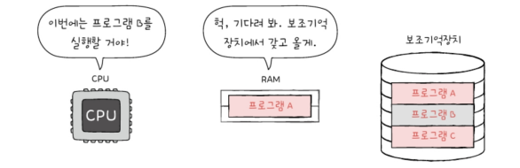
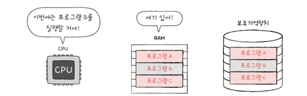
RAM 용량이 충분히 크다면 많은 데이터를 가져와 미리 RAM에 저장할 수 있으므로 프로그램을 보조기억장치에서 여러 번 가져오는 수고를 덜 수 있다. 또 많은 프로그램을 동시에 실행하는 데 유리해짐

보조기억장치를 책장, RAM을 책상으로 비유해서 생각할 수 있음

RAM의 용량이 클수록 프로그램 실행속도는 비례하여 빨라지는가?\
=> 어느정도 증가하는 것은 맞지만 용량이 필요 이상으로 커졌을 경우에는 속도가 그에 비례하여 증가하진 않음

## RAM의 종류
- DRAM
- SRAM
- SDRAM
- DDRSDRAM

### DRAM(Dynamic RAM)
: 데이터가 동적으로 변하는(사라지는) RAM, 즉 시간이 지나면 저장된 데이터가 점차 사라지는 RAM\
=> 데이터 소멸을 막기 위해 일정 주지골 데이터를 재활성화(다시 저장)해야 함

소비전력이 비교적 낮고, 저렴하고, 직접도가 높기 때문에 대용량으로 설계하기가 용이하다는 장점이 있어 일반적으로 메모리로써 사용하는 RAM은 DRAM이다.

### SRAM(Static RAM)
: 저장된 데이터가 변하지 않는 RAM\
DRAM과 달리 시간이 지나도 저장된 데이터가 사라지지 않고 속도도 더 빠름
> 시간이 지나도 저장된 데이터가 사라지지 않지만 비휘발성 메모리는 아님. SRAM도 전원이 공금되지 않으면 저장된 내용이 날아감

SRAM은 메모리가 아닌 '대용량으로 만들어질 필요는 없지만 속도가 빨라야 하는 저장 장치', 가령 캐시 메모리에서 사용됨

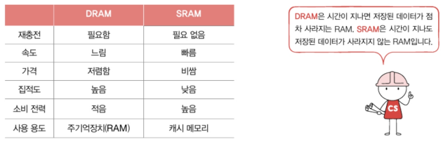

### SDRAM
: 클럭 신호와 동기화된(===클럭 타이밍에 맞춰 CPU와 정보를 주고 받을 수 있는), 발전된 형태의 DRAM

### DDRSDRAM
: 대역폭(데이터를 주고받는 길의 너비)을 넓혀 속도를 빠르게 만든 SDRAM. 최근 가장 흔히 사용되는 RAM임

DDR SDRAM은 한 클럭에 두 번씩 CPU와 데이터를 주고받을 수 있음
SDRAM(SDR SDRAM)과 비교했을 때, SDRAM은 한 클럭에 하나씩 정보를 주고받을 수 있다면 DDR SDRAM은 CPU와 데이터를 주고받을 수 있는 대역폭의 너비가 두 배이다

DDR2 SDRAM은 SDR SDRAM보다 대역폭이 4배 넓음
DDR3 SDRAM은 SDR SDRAM보다 대역폭이 8배 넓음
DDR4 SDRAM은 SDR SDRAM보다 대역폭이 16배 넓음

# 6.2 메모리의 주소 공간
물리 주소: 메모리 하드웨어가 사용하는 주소
논리 주소: CPU와 실행 중인 프로그램이 사용하는 주소
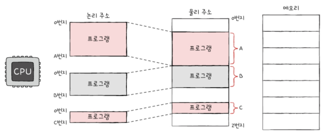

## 물리 주소와 논리 주소
CPU와 실행 중인 프로그램은 현재 메모리 몇 번지에 무엇이 저장되어있는지 다 알지 못한다. ← 메모리에 저장된 정보는 시시각각 변하기 때문
새롭게 실행되는 프로그램이 시시때때로 적재되고, 실행이 끝난 프로그램은 삭제되며 1500번지에 적재되었던 프로그램을 다시 실행하면 3000번지로 적재되는 등 매 실행마다 적재되는 주소가 달라짐 => CPU와 실행 중인 프로그램이 현재 메모리 몇 번지에 무엇이 저장되어 있는지 모두 알고있기 어려움

물리 주소: 정보가 실제로 저장된 하드웨어상의 주소
논리 주소: 실행 중인 프로그램 각각에게 부여된 0번지부터 시작되는 주소

메모리가 사용하는 주소: 하드웨어상의 실제 주소인 물리 주소
CPU가 실행 중인 프로그램이 사용하는 주소: 각각의 프로그램에 부여된 논리 주소

논리 주소와 물리 주소 간에 어떠한 변환도 이루어지지 않는다면 CPU와 메모리는 서로 이해할 수 없는 주소 체계를 가지고 각자 다른 이야기만 할 뿐 상호작용할 수는 없다.
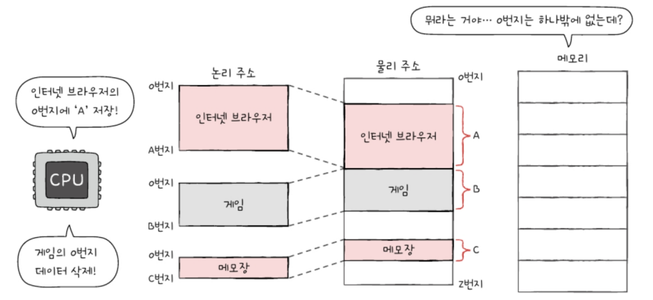

**메모리 관리 장치(MMU)** : 논리 주소와 물리 주소 간의 변환을 수행함.
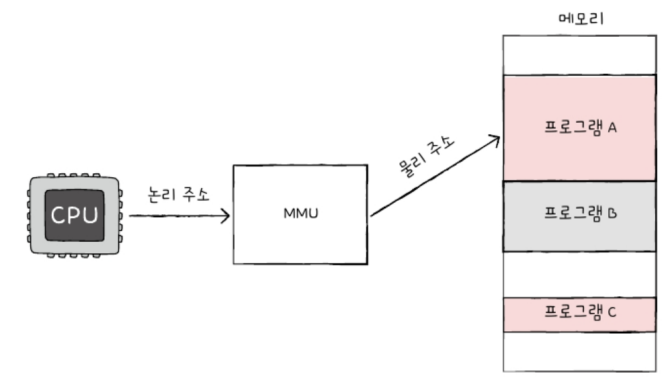
MMU는 CPU가 발생시킨 놴리 주소에 베이스 레지스터 값을 더하여 논리 주소를 물리 주소로 변환함
ex) 현재 베이스 레지스터: 15000. CPU가 발생시킨 논리 주소: 100번지 => 이 논리 주소는 15100(15000+100)로 변환됨
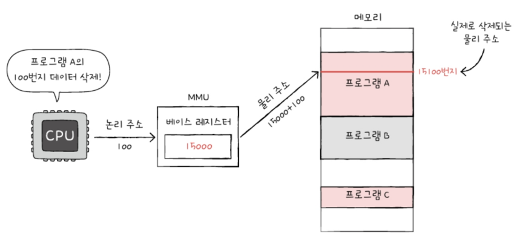

여기서 **베이스 레지스터**는 프로그램의 가장 작은 물리 주소 즉, 첫 물리 주소를 저장하는 셈이고 **논리 주소**는 프로그램의 시작점으로부터 떨어진 거리인 셈

## 메모리 보호 기법
ex) 베이스 레지스터가 2000이고 인터넷 브라우저 프로그램 명령어 중 '(논리 주소) 1100번지의 데이터를 삭제하라'와 같은 명령어가 있다면, 인터넷 브라우저 프로그램 명령어는 자신과는 전혀 관련 없는 게임 프로그램 정보를 삭제하게 됨
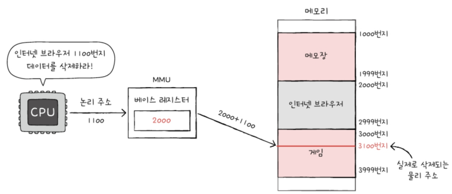

위와 같이 다른 프로그램의 영역을 침범할 수 있는 명령어는 위험하기 때문에 논리 주소 범위를 벗어나는 명령어 실행을 방지하고 실행중인 프로그램이 다른 프로그램에 영향을 받지 않도록 보호할 방법 필요 => **한계 레지스터**가 담당

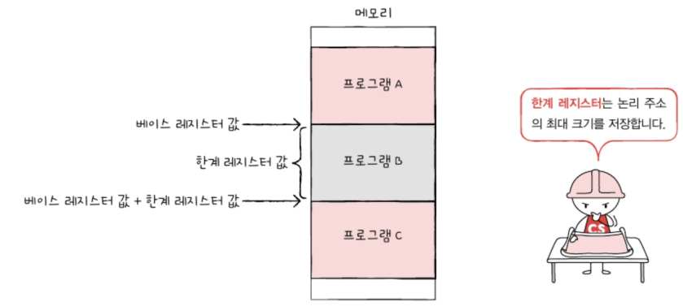

CPU가 한계 레지스터보다 높은 논리 주소에 접근하려고 하면 인터럽트(트랩)을 발생시켜 실행을 중단한다.
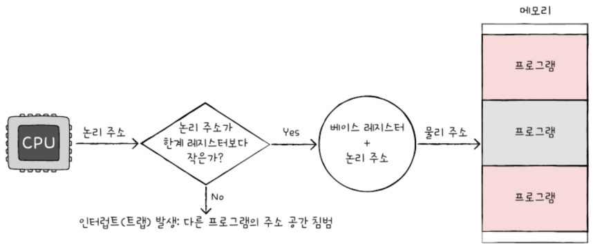

# 6.3 캐시 메모리
CPU가 메모리에 접근하는 시간이 CPU의 연산 속도보다 느림. 이를 극복하기 위한 저장 장치: 캐시 메모리

## 저장 장치 계층 구조
아래 이유 때문에 '빠른 저장 장치'와 '용량이 큰 저장 장치'는 양립하기 어려움
> 1. CPU와 가까운 저장 장치는 빠르고, 멀리 있는 저장 장치는 느리다.
> 2. 속도가 빠른 저장 장치는 저장 용량이 작고, 가격이 비싸다.

낮은 가격대의 대용량 저장 장치를 원한다면 느린 속도는 감수해야 하고, 빠른 메모리를 원한다면 작은 용량과 비싼 가격은 감수해야 함
=> 일반적으로 컴퓨터는 다양한 저장 장치를 모두 사용하게 됨

저장 장치 계층 구조: 저장장치들이 'CPU에 얼마나 가까운가'를 기준으로 계층적으로 나타냄
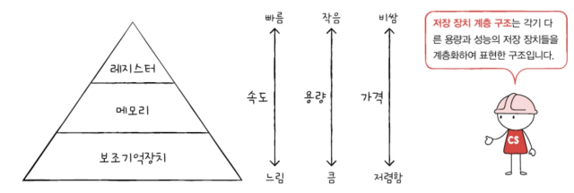

# 캐시 메모리
CPU가 메모리에 접근하는 속도는 레지스터에 접근하는 속도보다 느림. 그래도 CPU는 프로그램을 실행하는 과정에서 메모리에 빈번히 접근해야만 함
=> 이를 보완해줄 저장장치: 캐시 메모리

캐시메모리: CPU와 메모리 사이에 위치하고, 레지스터보다 용량이 크고 메모리보다 빠른 SRAM 기반의 저장 장치. CPU의 연산 속도와 메모리 접근 속도의 차이를 조금이나마 줄이기 위해 탄생함
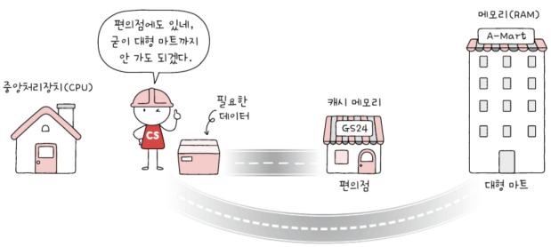
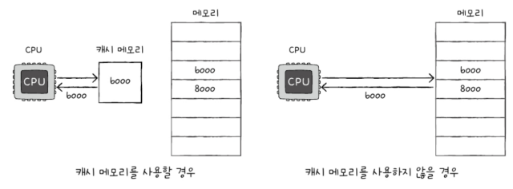

▼ 캐시 메모리까지 반영한 저장 장치 계층 구조
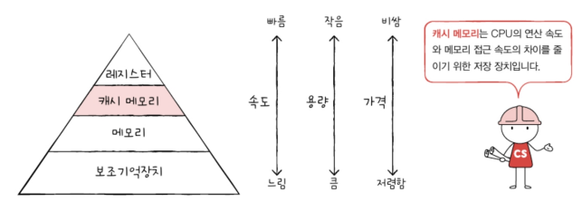

컴퓨터 내부에는 여러 개의 캐시 메모리가 있으며 CPU(코어)와 가까운 순서대로 계층을 구성함
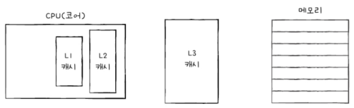
> 일반적으로 L1, L2 캐시는 코어 내부에 L3 캐시는 코어 외부에 위치해 있음

캐시 메모리 용량: 
L1 < L2 < L3

속도: 
L1 > L2 > L3

가격: 
L1 > L2 > L3

멀티코어 프로세서에서 L1-L2-L3 캐시는 일반적으로 다음과 같이 구현 됨
L1, L2 캐시는 코어마다 고유한 캐시 메모리로 할당되고 L3 캐시는 여러 코어가 공유하는 형태로 사용됨
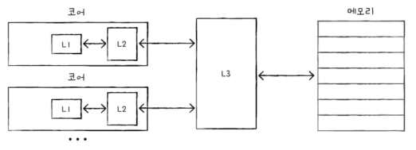

저장 장치 계층 구조
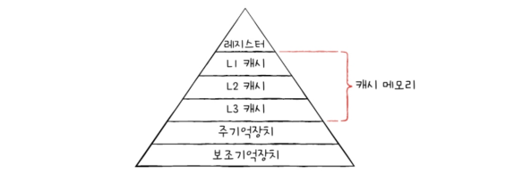

### 참조 지역성 원리
캐시 메모리는 메모리보다 용량이 작음. 캐시 메모리는 메모리에 있는 모든 내용을 가져다 저장할 수 없음.
메모리가 보조기억 장치의 일부를 복사하여 저장하는 것처럼 캐시 메모리는 메모리의 일부를 저장하여 저장함

캐시메모리는 무엇을 저장해야할까?
=> CPU가 사용할 법한 대상을 예측하여 저장함. 이때 자주 사용될 것으로 예측한 데이터가 실제로 들어맞아 캐시 메모리 내 데이터가 CPU에서 활용할 경우를 `캐시 히트`라고 함
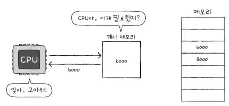

예측하여 캐시 메모리에 저장했지만 예측이 틀려 메모리에서 필요한 데이터를 직접 가져와야 하는 경우를 `캐시 미스`라고 함
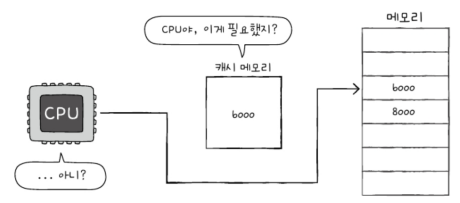

캐시 적중률: 캐시가 히트되는 비율
`캐시 히트 횟수 / (캐시 히트 횟수 + 캐시 미스 횟수)`

캐시 적중률을 높이려면 CPU가 사용할 법한 데이터를 알아내야함.
캐시 메모리는 `참조 지역성의 원리`를 따라 메모리로부터 가져올 데이터를 결정함

참조 지역성의 원리
1. CPU는 최근에 접근했던 메모리 공간에 다시 접근하려는 경향이 있다.
2. CPU는 접근한 메모리 공간 근처를 접근하려는 경향이 있다.

#### 최근에 접근했던 메모리 공간에 다시 접근하려는 경향
변수에 값을 저장하고 나면 언제든 변수에 다시 접근하여 변수에 저장된 값을 사용할 수 있음. 즉 'CPU는 변수가저장된 메모리 공간을 언제든 다시 참조할 수 있다'는 것을 의미

구구단 2단을 출력하는 과정에서 num과 i 변수들이 여러 번 사용되고 있음. 이렇게 '최근에 접근했던 메모리 공간에 다시 접근하려는 경향'을 시간 지역성이라고 함

#### 접근한 메모리 공간 근처를 접근하려는 경향
CPU가 실행하려는 프로그램은 보통 관련 데이터들끼리 한데 모여있음.
그리고 하나의 프로그램 내에서도 관련 있는 데이터들은 모여서 저장됨
=> 워드 프로세서 프로그램에 자동 저장 기능, 입력 기능, 출력 기능이 있다고 했을 때 각각의 기능과 관련한 데이터는 모여 저장됨
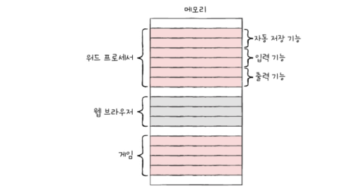

CPU가 워드 프로세서 프로그램을 실행할 적에는 워드 프로세서 프로그램이 모여있는 고간 근처를 집중적으로 접근할 것이고, 사용자가 입력을 할 적에는 입력 기능이 모여 있는 공간 근처를 집중적으로 접근함.
이렇게 '접근한 메모리 공간 근처를 접근하려는 경향'을 공간 지역성이라고 함
---

## 📖

Q1. RAM의 종류 네 가지와 각각의 특징에 대해 간단하게 설명하시오.

A1. DRAM, SRAM, SDRAM, DDRSDRAM이 있으며 DRAM은 시간이 지나면 저장된 데이터가 점차 사라지는 RAM이고 SRAM은 DRAM과 달리 시간이 지나도 저장된 데이터가 사라지지 않고 속도도 더 빠르다는 특징이 있으며 SDRAM 클럭 타이밍에 맞춰 CPU와 정보를 주고 받을 수 있는 DRAM이고, DDRSDRAM은 대역폭(데이터를 주고받는 길의 너비)을 넓혀 속도를 빠르게 만든 SDRAM이며 최근 가장 흔히 사용되는 RAM이다.

Q2. 한계 레지스터에 대해 간단히 설명하시오.

A2. 다른 프로그램의 영역을 침범할 수 있는 명령어는 위험하기 때문에 논리 주소 범위를 벗어나는 명령어 실행을 방지하고 실행중인 프로그램이 다른 프로그램에 영향을 받지 않도록 보호할 방법 필요한데 이를 해결하는 방법이 한계 레지스터라고 한다.

Q3. 캐시 히트에대해서 설명하시오.

A3. 캐시 메모리는 CPU가 사용할 법한 대상을 예측하여 저장하는데, 이때 자주 사용될 것으로 예측한 데이터가 실제로 들어맞아 캐시 메모리 내 데이터가 CPU에서 활용할 경우를 캐시 히트라고 한다.