# 7.1 다양한 보조기억장치
## 하드 디스크
: 자기적인 방식으로 데이터를 저장하는 보조기억장치=> 자기 디스크(magnetic disk)의 일종으로 지칭하기도 함

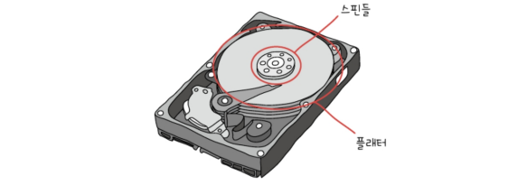\
**플래터**: 실질적으로 데이터가 저장되는 곳. 동그란 원판 부분\
**스핀들**: 플래터를 회전시키는 요소\
**RPM**: 스핀들이 플래터를 돌리는 분당 속도(RPM이 15,000이면 하드디스크는 1분에 15,000바퀴를 회전하는 하드디스크임)\
**헤드**: 플래터 대상으로 데이터를 읽고 쓰는 구성 요소\
**디스크 암**: 헤드를 원하는 위치로 이동시키는 요소

하드디스크는 많은 양의 데이터를 저장해야 하기 때문에 여러 겹의 플래터로 이루어져 있고 플래터 양면을 모두 사용할 수 있음. 양면 플래터를 사용할 경우 위아래로 플래터당 두 개의 헤드가 사용됨

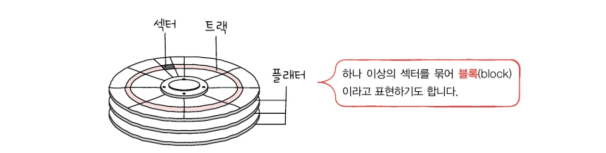
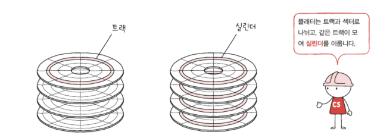
트랙: 플래터를 여러 동심원으로 나누었을 때 그중 하나의 원\
섹터: 트랙을 피자처럼 여러 조각으로 나누었을 때 한 조각. 하드 디스크의 가장 작은 전송단위\
실린더: 여러겹의 플래터 상에서 같은 트랙이 위치한 곳을 모아 연결한 논리적 단위. 

연속된 정보는 보통 한 실린더에 기록됨. (디스크 암을 움직이지 않고 바로 데이터에 접근이 가능하기 때문에)

하드 디스크가 데이터에 접근하는 시간
- 탐색 시간: 접근하려는 데이터가 저장된 트랙까지 헤드를 이동시키는 시간
- 회전 지연: 헤드가 있는 곳으로 플래터를 회전시키는 시간
- 전송 시간: 하드 디스크와 컴퓨터 간에 데이터를 전송하는 시간

> 다중 헤드 디스크와 고정 헤드 디스크\
> 단일 헤드 디스크(이동 헤드 디스크): 플래터의 한 면당 헤드가 하나씩 달려 있는 하드 디스크\
> 다중 헤드 디스크(고정 헤드 디스크): 헤드가 트랙별로 여러 개 달려있는 하드 디스크\
> 다중 헤드 디스크는 트랙마다 헤드가 있기 때문에 탐색 시간이 들지 않는다.

## 플래시 메모리
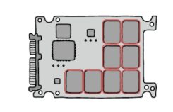\
: 전기적으로 데이터를 읽고 쓸 수 있는 반도체 기반의 저장 장치
(USB, SD카드, SSD: 플래시 메모리 기반의 보조기억장치)

셀: 플래시 메모리에서 데이터를 저장하는 가장 작은 단위

하나의 셀이 몇 비트를 저장할 수 있느냐에 따라 플래시 메모리 종류가 나뉨\
SLC타입: 한 셀에 1비트를 저장할 수 있는 플래시 메모리\
MLC타입: 한 셀에 2비트를 저장할 수 있는 플래시 메모리\
TLC타입: 한 셀에 3비트를 저장할 수 있는 플래시 메모리

### SLC 타입
\
한 셀로 두 개의 정보 표현 가능. MLC, TLC 타입에 비해 비트의 빠른 입출력 가능.
수명 또한 다른 타입들보다 길어서 수만에서 수십만 번 가까이 데이터를 쓰고 지우고를 반복할 수 있음

단점: 용량 대비 가격이 높음

### MLC 타입
\
한 셀로 네 개의 정보 표현 가능. 한 셀에 두 비트씩 저장할 수 있다는 점에서 SLC 타입보다 대용화하기 유리하며 용량 대비 가격도 저렴함.

### TLC 타입
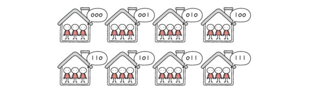\
한 셀당 3비트씩 저장 가능. 즉, 한 셀로 여덟 개의 정보 표현 가능.

썼다 지우기를 자주 반복해야 하는 경우 or 높은 성능을 원하는 경우에는 고가의 SLC타입을, 저가의 대용량 저장장치를 원한다면 TLC 타입을, 중간을 원한다면 MLC 타입 저장 장치를 선택하는 것이 좋음\
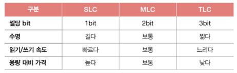

셀 => 페이지 => 블록 => 플레인 => 다이\
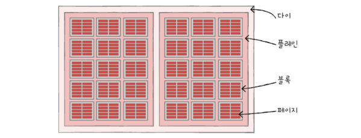
플래시 메모리에서 읽기와 쓰기는 페이지 단위로, 삭제는 블록 단위로 이루어짐

페이지의 상태
- Free 상태: 어떠한 데이터도 저장하고 있지 않아 새로운 데이터를 저장할 수 있는 상태를 의미
- Valid 상태: 이미 유효한 데이터를 저장하고 있는 상태
- Invalid 상태: 쓰레기값이라 부르는 유효하지 않은 데이터를 저장하고 있는 상태

플래시 메모리는 하드 디스크와 달리 덮어쓰기가 불가능=> Valid 상태인 페이지에는 새 데이터를 저장할 수 없음

플래시 메모리의 동작 예시\
네 개의 페이지로 이루어진 블록 x가 존재\

A, B는 저장되어있는 데이터이고 새로운 데이터 C를 저장하고 싶음 => 읽기/쓰기 단위는 페이지 단위로 이루어지기 때문에 비어있는 페이지에 C가 저장됨\
만약 C와 B는 그대로 유지한 채로 A만 A'로 수정하고 싶을 경우\
플래시 메모리에서는 덮어쓰기가 불가능하고 삭제 또한 블록 단위로 이루어지므로 기존의 A는 Invalid상태가 되어 더 이상 유효하지 않은 쓰레기 값이 되고, 비어있는 페이지에 새로운 A' 데이터가 저장됨\

쓰레기 값을 정리하기 위해 등장한 방법: 가비지 컬렉션\
유효한 페이지들만을 새로운 블록으로 복사한 뒤, 기존의 블록을 삭제하는 기능
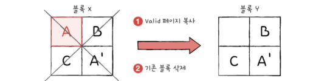

# 7.2 RAID의 정의와 종류
## RAID의 정의
수많은 데이터가 서버로 쏟아지고 개인 정보, 결제 정보와 같이 절대로 잃어버려서는 안 될 민감한 정보도 포함되어 있는 상황에서 이런 정보들을 어떻게 관리할 것인가?에 대한 대책: RAID

주로 하드 디스크와 SSD를 사용하는 기술로, 데이터의 안정성 혹은 높은 성능을 위해 여러개의 물리적 보조기억장치를 마치 하나의 논리적 보조기억장치처럼 사용하는 기술을 의미
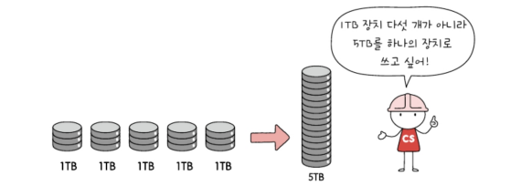

## RAID의 종류
### RAID 0
여러 개의 보조기억장치에 데이터를 단순히 나누어 저장하는 구성 방식\
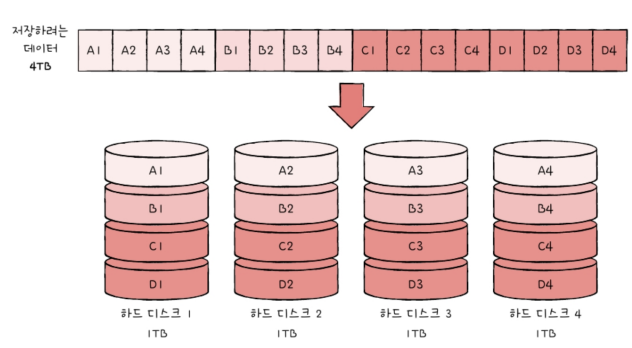\
가령 1TB 하드 디스크 네 개로 RAID 0를 구성했다고 가정할 경우, 어떠한 데이터를 저장할 때 각 하드 디스크는 아래와 같이 번갈아 가며 데이터를 저장함

스트라입: 마치 줄무늬처럼 분산어 저장된 데이터\
스트라이핑: 분산하여 저장하는 것

데이터가 스트라이핑 되면(분산되어 저장되면) 저장된 데이터를 읽고 쓰는 속도가 빨라짐. 
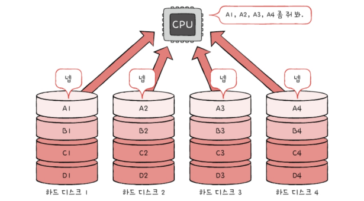
하나의 대용량 저장 장치를 이용했더라면 여러 번에 걸쳐 읽고 썼을 데이터를 동시에 읽고 쓸 수 있기 때문.
∴ 4TB 저장 장치 한 개를 읽고 쓰는 속도보다 RAID 0로 구성된 1TB 저장 장치 네 개의 속도가 이론상 네 배가량 빠름

RAID 0의 단점: 저장된 정보가 안전하지 않다.(구성된 하드 디스크 중 하나에 문제가 생길 경우 다른 모든 하드 디스크의 정보를 읽는데 문제가 생길 수 있음)
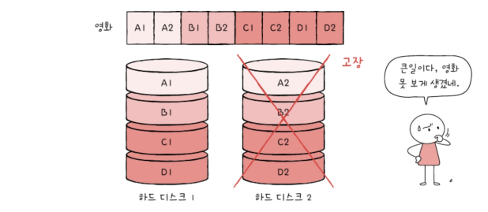

### RAID 1
복사본을 만드는 방식. 마치 거울처럼 완전한 복사본을 만드는 구성이기에 `미러링`이라고도 부름.

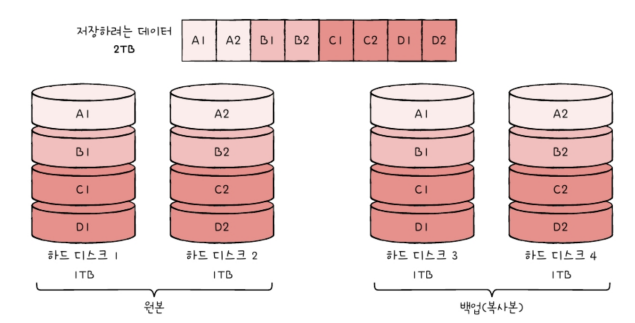
네 개의 하드 디스크를 RAID 1으로 구성한 모습. RAID 0처럼 데이터 스트라이핑이 사용되긴 했지만, 오른쪽 두 하드 디스크는 왼쪽 두 하드 디스크와 동일한 내용을 저장. 그렇기 때문에 쓰기 속도는 RAID 0보다 느림

장점: 복구가 매우 간단하다.
단점: 하드 디스크 개수가 한정되었을 때 사용 가능한 용량이 적어진다. => 많은 양의 하드 디스크가 필요 => 비용 증가

### RAID 4
RAID 1처럼 완전한 보가본을 만드는 대신 `오류를 검출하고 복구하기 위한 정보(패리티 비트)`를 저장한 장치를 두는 구성방식.\
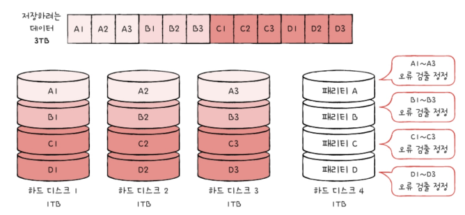\
RAID 4에서는 패리티를 저장한 장치를 이용해 다른 장치들의 오류를 검출하고 오류가 있다면 복구함.

### RAID 5
RAID 4에서는 어떤 새로운 데이터가 저장될 때마다 패리티를 저장하는 디스크에도 데이터를 쓰게 되므로 패리티를 저장하는 장치에 병목 현상이 발생한다는 문제가 있음
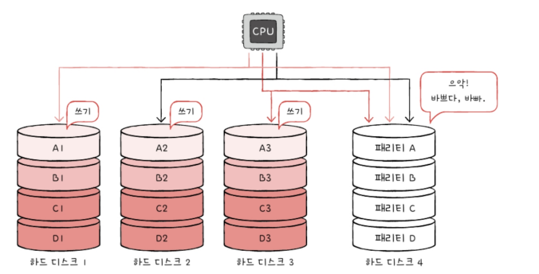

RAID 5는 패리티 정보를 분산하여 저장하는 방식으로 RAID 4의 문제인 병목 현상을 해소함
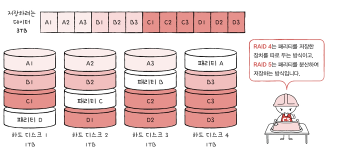

### RAID 6
구성은 기본적으로 RAID 5와 같으나, 서로 다른 두 개의 패리티를 두는 방식. 오류를 검출하고 복구할 수 있는 수단이 두 개가 생긴 셈\
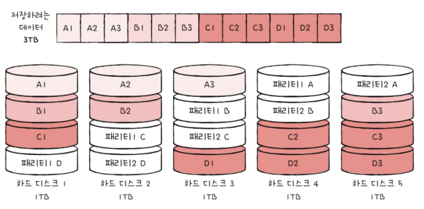\
장점: RAID 4나 5보다 안전한 구성
단점: 쓰기 속도는 RAID 5보다 느림

저장 속도를 조금 희생하더라도 데이터를 더욱 안전하게 보관하고 싶을 때 사용하는 방식

---

## 📖
Q1. 하드 디스크가 저장된 데이터에 접근하는 시간의 종류와 각각에 대해 간단히 설명하시오.

A1.  하드 디스크가 저장된 데이터에 접근하는 시간은 크게 탐색 시간, 회전 지연, 전송 시간으로 나뉘며 탐색 시간은 데이터가 저장된 트랙까지 헤드를 이동시키는 시간을, 회전 지연은 헤드가 있는 곳으로 플래터를 회전시키는 시간을, 전송 시간은 하드 디스크와 컴퓨터 간에 데이터를 전송하는 시간을 의미한다.

Q2. 단일 헤드 디스크와 다중 헤드 디스크에 대해 설명하고, 두 디스크를 비교했을 때 다중 헤드 디스크가 갖는 이점에 대해 설명하시오.

A2. 단일 헤드 디스크는 플래터의 한 명당 헤드가 하나씩 달려있는 하드 디스크이고, 다중 헤드 디스크는 헤드가 트랙별로 여러 개 달려있는 하드디스크이다. 다중 헤드 디스크가 트랙마다 헤드가 있기 때문에 데이터에 접근할 시 탐색 시간이 들지 않는다는 점에서 이점이 있다.

Q3. RAID 1의 저장 방식을 RAID 0의 저장 방식과 비교하여 설명하고, RAID 1이 갖는 장단점에 대해 간단히 설명하시오.

A3. RAID 1은 소위 말해 복사본을 만드는 방식이다. 가령 1TB 하드 디스크 네 개로 RAID 0를 구성했다고 가정할 경우 RAID 0은 하드 디스크 네 개 모두 데이터를 분산해서 저장하는 데에 쓰이지만 RAID 1은 데이터를 분산하는 디스크 2개와 그 2개의 디스크와 동일한 데이터를 저장하는, 즉 복사본 디스크 두 개로 구성된다. 이러한 저장 방식은 디스크에 문제가 생겼을 경우 복구가 매우 간단하다는 장점이 있지만, 하드 디스크 개수가 한정되었을 때 사용 가능한 용량이 적어진다는 단점이 있다.