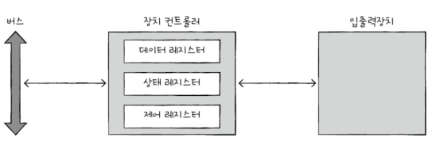

# Chapter 08. 입출력장치
- [Chapter 08. 입출력장치](#chapter-08-입출력장치)
- [08-1. 장치 컨트롤러와 장치 드라이버](#08-1-장치-컨트롤러와-장치-드라이버)
  - [장치 컨트롤러](#장치-컨트롤러)
    - [배경](#배경)
    - [기능](#기능)
    - [내부 구조](#내부-구조)
  - [장치 드라이버](#장치-드라이버)
- [08-2. 다양한 입출력 방법](#08-2-다양한-입출력-방법)
  - [프로그램 입출력](#프로그램-입출력)
  - [인터럽트 기반 입출력](#인터럽트-기반-입출력)
  - [DMA 입출력](#dma-입출력)
- [Q\&A](#qa)

---

# 08-1. 장치 컨트롤러와 장치 드라이버

## 장치 컨트롤러

: 입출력 제어기, 입출력 모듈

### 배경

- 입출력 장치는 종류가 많아 정보를 주고 받는 방식을 규격화 하기 어려움
- 일반적으로 CPU, 메모리의 데이터 전송률은 높으나 데이터 전송률 낮음
    - 전송률 : 데이터를 얼마나 빨리 교환할 수 있는지 나타내는 지표
    - 전송률 차이는 통신 어렵게 함
- 따라서 입출력 장치는 컴퓨터에 직접 연결되지 않고 장치 컨트롤러 통해 연결됨

### 기능

1. CPU와 입출력장치 간의 통신 중개
    - 일종의 번역을 하며 정보 규격화
2. 오류 검출
    - 자신과 연결된 입출력장치에 문제 없는지 확인
3. 데이터 버퍼링
    - 버퍼링 : 전송률 높은 장치와 낮은 장치 사이에 주고 받는 데이터를 버퍼(임시 공간)에 저장해 전송률 비슷하게 맞춤

### 내부 구조

- 데이터 레지스터
    - CPU와 입출력장치 사이에 주고 받을 데이터가 담기는 레지스터
    - 버퍼 역할
- 상태 레지스터
    - 입출력 장치의 상태 정보 저장
- 제어 레지스터
    - 입출력장치가 수행할 내용에 대한 제어 정보와 명령 저장

## 장치 드라이버

- 장치 컨트롤러의 동작 감지, 제어 → 컴퓨터 내부와 정보 주고 받을 수 있는 프로그램
- 장치 드라이버가 설치되어 있지 않다면 해당 입출력장치 사용 불가
    - 장치 드라이버 인식 및 실행하는 주체 : 운영체제(Window, macOS)
    - 운영체제가 기본으로 제공하는 것도 있음

# 08-2. 다양한 입출력 방법

## 프로그램 입출력

: 프로그램 속 명령어로 입출력 작업 하는 방식

- CPU가 장치 컨트롤러의 레지스터 값 읽고 쓰면서 이루어짐
    - `메모리 맵 입출력`
        
        
        
        - 메모리에 접근하기 위한 주소 공간과 입출력장치에 접근하기 위한 주소 공간을 **하나의 주소 공간**으로 간주하는 입출력 방식
    - `고립형 입출력`
        
        
        
        - 메모리에 접근하기 위한 주소 공간과 입출력장치에 접근하기 위한 주소 공간을 **별도로 분리**하는 입출력 방식
    
    
    

## 인터럽트 기반 입출력

: 인터럽트로써 입출력을 수행하는 방법

- 우선순위가 높은 인터럽트부터 처리하는 경우
    - 플래그 레지스터 속 인터럽트 비트가 활성화 되어 있는 경우
    - NMI(인터럽트 비트를 비활성화해도 무시할 수 없는 인터럽트)가 발생한 경우
    - `PIC(프로그래머블 인터럽트 컨트롤러)`
        - 여러 장치 컨트롤러에 연결되어 장치 컨트롤러에서 보낸 하드웨어 인터럽트 요청들의 우선순위 판별한 뒤 지금 처리해야 할 하드웨어 인터럽트가 무엇인지 알려주는 장치
- 참고 - 폴링(Polling)
    - 입출력장치의 상태는 어떤지, 처리할 데이터가 있는지 주기적으로 확인하는 방식
    - CPU 부담 더 큼
        - 인터럽트는 인터럽트 요청 받을 때까지 다른 일을 할 수 있기 때문

## DMA 입출력

: CPU를 거치지 않고 메모리와 입출력장치 간의 데이터를 주고받는 입출력 방식

- 입출력 과정
    - CPU가 DMA 컨트롤러에 입출력 작업 명령 → DMA 컨트롤러는 장치 컨트롤러와 상호작용하며 입출력 작업 수행(필요한 경우 직접 메모리에 접근) → 입출력 작업 끝나면 CPU에 인터럽트 걸어 작업이 끝남을 알림
    - 사이클 스틸링 : DMA의 시스템 버스 이용
        - 시스템 버스는 동시 사용이 불가능하기 때문에 DMA 컨트롤러가 메모리에 직접 접근하기 위해 시스템 버스를 사용하면 CPU는 사용 불가
- `입출력 버스`
    - 입출력장치와 컴퓨터 내부를 연결 짓는 통로
    - 입출력 작업 과정에서 시스템 버스 사용 횟수 줄임
- `입출력 프로세서/입출력 채널`
    - 입출력 전용 CPU, 메모리에 직접 접근하며 입출력 명령어 인출, 해석, 실행
    - CPU는 입출력 채널에게 메모리에 저장된 특정 입출력 명령어를 수행하라고 지시 → 입출력 채널은 해당 입출력 명령어를 인출, 해석, 실행한 뒤 인터럽트 통해 결과를 CPU에게 알림

# Q&A

1. **프로그램 기반 입출력과 인터럽트 기반 입출력의 공통점이 무엇인가요?**
2. **메모리 맵 입출력과 고립형 입출력의 차이점은 무엇인가요?**
3. **장치 컨트롤러의 기능은 무엇인가요?**

- **1번 답**
    
    입출력장치와 메모리 간의 데이터 이동은 CPU가 주도하고, 이동하는 데이터도 반드시 CPU를 거친다는 점입니다.
    
- **2번 답**
    
    메모리 맵 입출력은 메모리에 접근하기 위한 주소 간과 입출력장치에 접근하기 위한 주소 공간을 하나의 주소 공간이라고 간주하는 반면, 고립형 입출력은 두 주소 공간을 별도의 주소 공간으로 분리합니다.
    
- **3번 답**
    
    장치 컨트롤러는 CPU 또는 입출력장치 간의 통신을 중개하고, 입출력 장치의 오류를 검출합니다. 또 데이터 버퍼링을 통해 전송률 차이를 완화해줍니다.