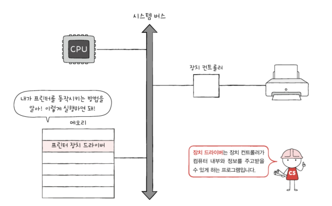

# 8-1 장치 컨트롤러와 장치 드라이버

## 장치 컨트롤러
아래의 이유로 입출력장치는 CPU, 메모리보다 다루기가 더 까다로움
1. 입출력장치에는 종류가 너무나도 많다. 
   키보드, 모니터, USB 메모리, CD-ROM, SSD, 마우스, 프린터, 스피커, 마이크 등 다양한 장치가 있는데 장치마다 속도, 데이터 전송 형식이 다양함 -> 다양한 입출력장치와 정보를 주고받는 방식을 규격화하기가 어렵다. 
   

2. 일반적으로 CPU와 메모리의 데이터 전송률은 높지만 입출려장치의 데이터 전송률은 낮다. 
   전송률: 데이터를 얼마나 빨리 교환할 수 있는지를 나타내는 지표 
   전송률의 차이는 CPU와 메모리, 입출력장치 간의 통신을 어렵게 함
   

이러한 이유로 입출력장치는 컴퓨터에 직접 연결되지 않고 `장치 컨트롤러`라는 하드웨어를 통해 연결 됨. 장치 컨트롤러는 `입출력 제어기`, `입출력 모듈` 등으로 다양하게 불리기도 함

모든 입출력장치는 각자의 장치 컨트롤러를 통해 컴퓨터 내부와 정보를 주고받고, 장치 컨트롤러는 하나 이상의 입출력장치와 연결되어 있다.

장치 컨트롤러의 역할
- CPU와 입출력장치 간의 통신 중개
- 오류 검출
- 데이터 버퍼링

입출력장치 종류가 많아 정보 규격화가 어려웠던 문제를 장치 컨트롤러가 일종의 번역가 역할을 함으로써 해결할 수 있게 됨. 이 과정에서 자신과 연결된 입출력장치에 문제가 없는지 오류를 검출하기도 함

`버퍼링`: 전송률이 높은 장치와 낮은 장치 사이에 주고받는 데이터를 `버퍼`라는 입시 저장 공간에저장하여 전송률을 비슷하게 맞추는 방법

**장치 컨트롤러의 간략화된 내부 구조**

- 데이터 레지스터 
  CPU와 입출력장치 사이에 주고받을 데이터가 담기는 레지스터. 버퍼 역할을 함

- 상태 레지스터 
  입출력장치가 입출력 잡업을 할 준비가 되었는지, 입출력 작업이 완료 되엇는지, 입출력 장치에 오류는 없는지 등의 상태 정보 저장
  
- 제어 레지스터 
  입출력장치가 수행할 내용에 대한 정보와 명령을 저장

## 장치 드라이버
장치 드라이버: 장치 컨트롤러의 동작을 감지하고 제어함으로써 장치 컨트롤러가 컴퓨터 내부와 정보를 주고받을 수 있게 하는 프로그램

장치 컨트롤러가 입출력장치를 연결하기 위한 하드웨어적인 통로라면, 장치 드라이버는 입출력장치를 연결하기 위한 소프트웨어적인 통로 

컴퓨터가 연결된 장치의 드라이버를 인식하고 실행할 수 있다면 그 장치는 컴퓨터 내부와 정보를 주고받을 수 있음

# 8-2 다양한 입출력 방법
장치 컨트롤러와 CPU가 정보를 주고받는 방법
- 프로그램 입출력
- 인터럽트 기반 입출력
- DMA 입출력

## 프로그램 입출력
프로그램 속 명령어로 입출력장치를 제어하는 방법. CPU가 프로그램 속 명령어를 실행하는 과정에서 입출력 명령어를 만나면 CPU는 입출력 장치에 연결된 장치 컨트롤러와 상호작용하며 입출력 작업을 수행함

ex) 메모리에 저장된 정보를 하드 디스크에 백업하는 상황
1. CPU는 하드 디스크 컨트롤러의 제어 레지스터에 쓰기 명령을 보냄.  
   '메모리에 저장된 정보를 하드 디스크에 백업한다.' === '하드 디스크에 새로운 정보를 쓴다'
   

2. 하드 디스크 컨트롤러는 하드 디스크 상태를 확인함. 하드 디스크가 준비된 상태라면 하드 디스크 컨트롤러는 상태 레지스터에 준비되었다고 표시함
   

3. CPU는 상태 레지스터를 주기적으로 읽어보며 하드 디스크의 준비 여부를 확인하고 하드 디스크가 준비됐음을 CPU가 알게되면 백업할 메모리의 정보를 데이터 레지스터에 쓴다.
   

CPU는 장치 컨트롤러의 레지스터들을 어떻게 알까?
### 메모리 맵 입출력
: 메모리에 접근하기 위한 주소 공간과 입출력 장치에 접근하기 위한 주소 공간을 하나의 주소 공간으로 간주하는 방법.

가령 1,024개의 주소를 표현할 수 있는 컴퓨터가 있을 때 512개는 메모리 주소를, 나머지 512개는 장치 컨트롤러의 레지스터를 표현하기 위해 사용함

주소 공간 일부를 아래와 같이 약속했을 때 

CPU는 '517번지를 읽어 들여라'라는 명령어로 프린터 상태를 읽을 수 있고, '518번지에 a를 써라'라는 명령어로 하드 디스크 컨트롤러의 데이터 레지스터로 데이터를 보낼 수 있음

### 고립형 입출력
: 메모리를 위한 주소 공간과 입출력장치를 위한 주소 공간을 분리하는 방법.

가령 1,024개의 주소 공간을 가진 컴퓨터가 있다고 가정.

제어 버스에 '메모리 읽기/쓰기' 선 이외에 '입출력장치 읽기/쓰기'선이 따로 있다면 메모리에도 1,024개의 주소 공간을 활용하고, 입출력장치도 1,023개의 주소 공간을 활용할 수 있음.

고립형 입출력 방식에서 CPU는 입출력장치에 접근하기 위해 메모리에 접근하는 명령어와는 다른(입출력 읽기/쓰기 선을 활성화시키는) 입출력 명령어를 사용함.

## 인터럽트 기반 입출력

Q1. 버퍼링에 대해서 설명하시오.

A1. 전송률이 높은 장치와 낮은 장치 사이에 주고받는 데이터를 버퍼라는 입시 저장 공간에저장하여 전송률을 비슷하게 맞추는 방법을 버퍼링이라 합니다.

Q2. 메모리 맵 입출력 방식과 고립형 입출력 방식의 차이점에 대해 설명하시오.

A2. 메모리 맵 입출력 방식은 메모리와 같은 입출력 장치는 같은 주소 공간을 사용하지만 고립형 입출력 방식은 분리된 주소 공간을 사용하고, 메모리 맵 입출력 방식은 메모리 주소 공간이 축소되지만 고립형 입출력은 메모리 주소 공간이 축소되지 않는다는 점, 또 메모리 맵 입출력 방식은 메모리와 입출력 장치에 같은 명령어 사용이 가능하지만 고립형 입출력 방식은 입출력 전용 명령어를 사용한다는 점에서 차이가 있다.