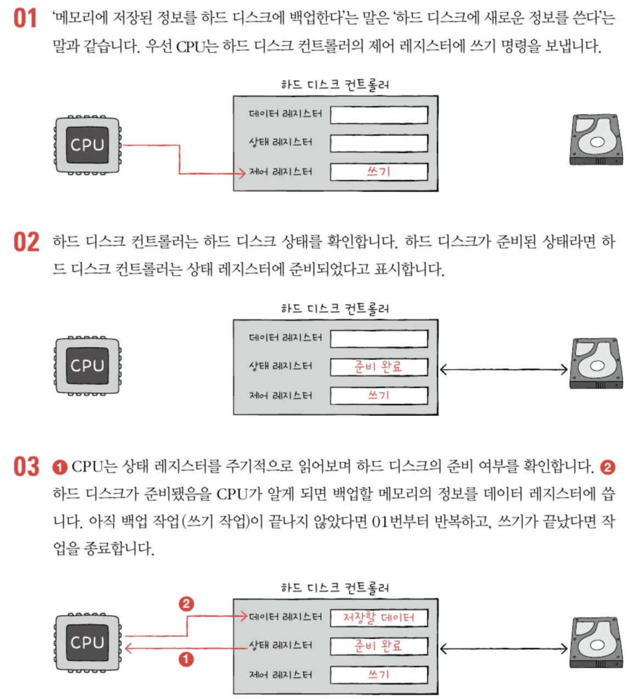
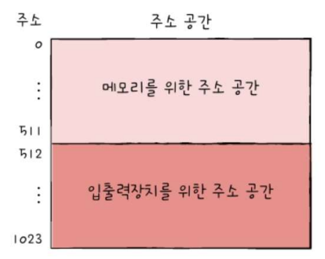
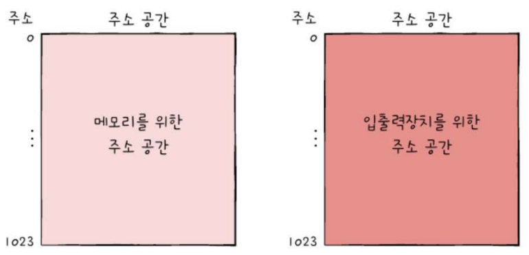
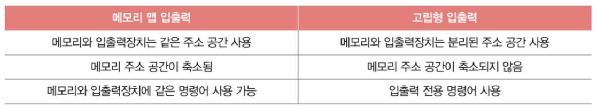
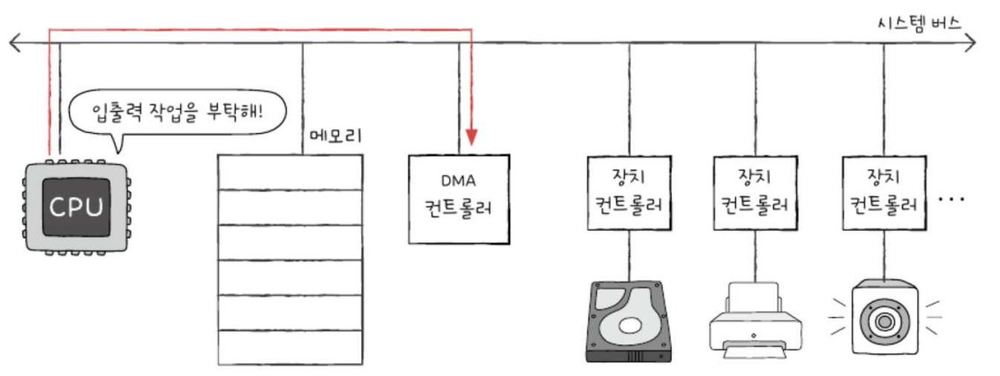
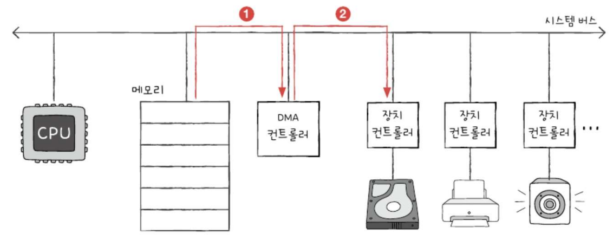
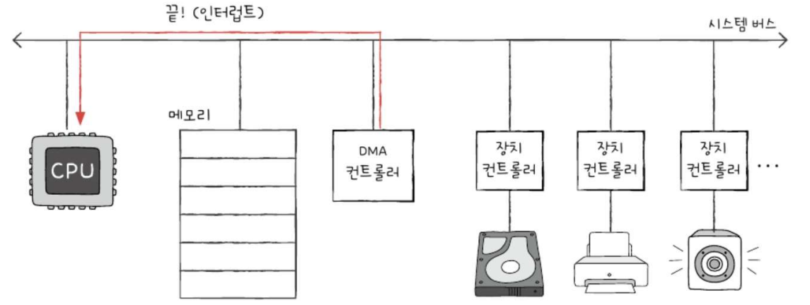

# 8장. 입출력장치 (Input/Output Devices)

## 8-1. 장치 컨트롤러와 장치 드라이버 (Device Controller and Device Driver)

### 1. 장치 컨트롤러 (Device Controller)
- **배경과 필요성**
  - 입출력장치의 다양성 문제
  - CPU/메모리와 입출력장치 간의 전송률 차이 존재
  - 전송률(Transfer Rate): 데이터를 얼마나 빨리 교환할 수 있는지 나타내는 지표
  - 직접 연결의 기술적 한계
  - 표준화된 통신 방식 필요성

- **주요 기능**
  1. CPU와 입출력장치 간 통신 중개
     - 정보 규격화 및 번역 작업
     - 통신 프로토콜 관리
     - 데이터 형식 변환
  
  2. 오류 검출 기능
     - 연결된 입출력장치 상태 모니터링
     - 하드웨어 오류 감지
     - 데이터 전송 오류 확인
  
  3. 데이터 버퍼링
     - 버퍼(Buffer): 데이터 임시 저장 공간
     - 전송률 차이 보완 메커니즘 -> 일반적으로 전송률 높은 `CPU`와 일반적으로 전송률 낮은 `IO장치`의 `전송률 차이`를 `버퍼링으로 완화`
     - 데이터 흐름 제어

- **내부 구조와 레지스터**
  1. 데이터 레지스터 (Data Register)
     - CPU-입출력장치 간 데이터 임시 저장
     - 버퍼 메모리 역할 수행
     - 대용량 데이터 처리 시 RAM 사용
     - 데이터 정렬 및 패킹 기능

  2. 상태 레지스터 (Status Register)
     - 입출력 작업 준비 상태 표시
     - 작업 진행/완료 상태 관리
     - 오류 상태 기록
     - 장치 가용성 정보
     - 인터럽트 상태 표시

  3. 제어 레지스터 (Control Register)
     - 제어 명령어 저장
     - 작업 모드 설정
     - 동작 파라미터 저장
     - 인터럽트 제어 정보

### 2. 장치 드라이버 (Device Driver)
- **기본 개념**
  - 장치 컨트롤러 제어 프로그램
  - 하드웨어-소프트웨어 인터페이스
  - 운영체제와의 통신 담당
  - 표준화된 장치 접근 방법 제공

- **주요 특징**
  - 운영체제 커널의 일부로 동작
  - 실행 시 메모리 상주
  - 플러그 앤 플레이(Plug and Play) 지원
  - 장치 특화 기능 구현
  - 드라이버 미설치 시 장치 인식 불가

## 8-2. 다양한 입출력 방법

### 1. 프로그램 입출력 (Programmed I/O)
- **기본 메커니즘**
  - CPU 제어 기반 입출력 방식
  - 프로그램 명령어로 직접 제어
  - 장치 컨트롤러 레지스터 직접 액세스
  - 폴링(Polling) 방식 사용 가능
  
  EX) 메모리에 저장된 정보를 HDD에 백업하는 상황
  

- **구현 방식**
  1. 메모리 맵 입출력 (Memory-Mapped I/O)
   
     - 통합된 주소 공간 사용
     - 메모리 주소와 I/O 주소 통합 관리(하나로!)
     - 일반 메모리 명령어로 I/O 접근
     - 주소 공간 효율적 활용

  2. 고립형 입출력 (Isolated I/O)
   
     - 분리된 주소 공간 사용
     - 전용 입출력 명령어 세트
     - 메모리와 I/O 주소 독립 관리(분리!)
     - 특수 입출력 포트 사용
  
  

### 2. 인터럽트 기반 입출력 (Interrupt-Driven I/O)
- **작동 원리**
  - 비동기적 입출력 처리 방식
  - 장치의 인터럽트 요청 기반
  - CPU 작업 임시 중단 처리
  - 인터럽트 서비스 루틴(ISR) 실행

- **우선순위 처리 시스템**
  1. PIC(Programmable Interrupt Controller)
     - 다중 인터럽트 요청 관리
     - 우선순위 기반 인터럽트 스케줄링
     - 인터럽트 벡터 테이블 관리
     - CPU 인터럽트 신호 제어

  2. 인터럽트 처리 과정
     - 인터럽트 요청 신호 수신
     - 우선순위 판별
     - CPU 현재 상태 저장
     - ISR 주소 확인 및 실행
     - 원래 작업 복귀

### 3. DMA(Direct Memory Access) 입출력
- **기본 구조와 특징**
  - CPU 개입 최소화 방식
  - 메모리 직접 접근 방식
  - 고속 데이터 전송 지원
  - 시스템 버스 효율적 사용

- **작동 프로세스 - ex) 메모리 내 정보를 HDD에 백업하는 작업**
  1. 초기 설정 단계
   
     - CPU의 DMA 명령 전달
     - 전송 파라미터 설정
     - 메모리 주소 지정
     - 전송 방향 설정

  2. 데이터 전송 단계
   
     - DMA 컨트롤러 주도 전송
     - 버스 사이클 스틸링
     - 블록 단위 전송
     - 메모리-장치 직접 통신

  3. 완료 처리 단계
   
     - 전송 완료 확인
     - CPU 인터럽트 발생
     - 상태 정보 업데이트
     - 다음 작업 준비

- **시스템 버스 관리**
  1. 사이클 스틸링(Cycle Stealing)
     - CPU 버스 사용 시간 분할
     - 우선순위 기반 버스 할당
     - 효율적 버스 대역폭 활용
     - 시스템 성능 최적화

  2. 버스트 모드(Burst Mode)
     - 연속적 데이터 블록 전송
     - 높은 대역폭 활용
     - 전송 효율성 극대화

### 4. 입출력 버스 (I/O Bus)
- **역할과 특징**
  - 전용 데이터 전송 경로
  - 시스템 버스 부하 감소
  - 병렬 데이터 전송 지원
  - 확장성 제공

- **주요 종류**
  1. PCI(Peripheral Component Interconnect) 버스
     - 표준 로컬 버스
     - 고속 데이터 전송
     - 플러그 앤 플레이 지원

  2. PCIe(PCI Express) 버스
     - 직렬 데이터 전송 방식
     - 높은 대역폭
     - 양방향 통신 지원
     - 확장성 우수

- **시스템 성능 영향**
  - 버스 아키텍처 최적화
  - 데이터 처리량 증가
  - 시스템 응답성 향상
  - 장치 확장성 개선

---
# Question
### 1. 장치 컨트롤러가 필요한 이유와 주요 기능 3가지?
장치 컨트롤러가 필요한 이유는 입출력장치가 다양하고 CPU/메모리와의 데이터 전송률 차이가 크기 때문
주요 기능 3가지:
1) CPU와 입출력장치 간의 통신 중개 및 번역
2) 입출력장치의 오류 검출 및 모니터링
3) 데이터 버퍼링을 통한 전송률 차이 완화

### 2.  프로그램 입출력의 두 가지 구현 방식인 메모리 맵 입출력과 고립형 입출력의 차이점?
메모리 맵 입출력은 메모리와 입출력장치의 주소 공간을 하나로 통합하여 관리하는 방식입니다. 따라서 일반 메모리 명령어로 입출력 제어가 가능합니다.
반면 고립형 입출력은 메모리 주소 공간과 입출력장치의 주소 공간을 별도로 분리하여 관리하며, 입출력을 위한 전용 명령어를 사용합니다.

### 3. DMA 입출력의 장점?
1) CPU를 거치지 않고 메모리와 입출력장치가 직접 데이터를 주고받을 수 있음
2) CPU는 입출력 작업 명령만 내리고 다른 작업 수행 가능
3) 대용량 데이터 전송 시 시스템 성능 향상
4) 전체적인 입출력 처리 속도 향상