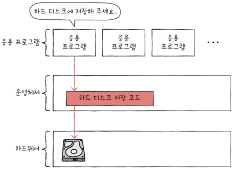

# Chapter09. 운영체제 시작하기

- [Chapter09. 운영체제 시작하기](#chapter09-운영체제-시작하기)
- [09-1. 운영체제를 알아야 하는 이유](#09-1-운영체제를-알아야-하는-이유)
  - [개념](#개념)
  - [운영체제를 알아야 하는 이유](#운영체제를-알아야-하는-이유)
- [09-2. 운영체제의 큰 그림](#09-2-운영체제의-큰-그림)
  - [커널](#커널)
  - [이중 모드와 시스템 호출](#이중-모드와-시스템-호출)
  - [운영체제의 핵심 서비스](#운영체제의-핵심-서비스)
- [Q\&A](#qa)

---

# 09-1. 운영체제를 알아야 하는 이유

## 개념

- 응용 프로그램(이하 프로그램)과 하드웨어 사이에서 실행 할 프로그램에 필요한 **자원**(시스템 자원) **할당** 및 프로그램이 **올바르게 실행**되도록 돕는 프로그램
    - `응용 프로그램`
        - 사용자가 특정 목적을 위해 사용하는 일반적인 프로그램 (워드 프로세서, 메모장 등)
        - **사용자 영역**에 적재되어 실행
    - 실행 할 프로그램 → 메모리에 적재
    - 실행되지 않는 프로그램 → 삭제
    - 최대한 공정하게 여러 프로그램에 CPU 자원 할당
- 메모리 내 **커널 영역**에 적재되어 실행

## 운영체제를 알아야 하는 이유

: 운영체제와의 대화를 통해 하드웨어와 프로그램을 더 깊이 이해하고 **문제 해결의 원인**을 찾을 수 있기 때문

- 운영체제는 **하드웨어를 조작하고 관리하는 기능들 제공**
- 개발자는 하드웨어 조작하는 코드 직접 작성할 필요 없음
- 운영체제 → 하드웨어 조작 → 하드웨어가 프로그램 실행

# 09-2. 운영체제의 큰 그림

## 커널

- 운영체제의 핵심 기능 담당
    - 커널에 포함되지 않는 서비스 : UI (사용자-컴퓨터 상호작용할 수 있는 통로)
        - `GUI(그래픽 유저 인터페이스)` : 그래픽 기반 상호작용
        - `CLI(커맨드 라인 인터페이스)` : 명령어 기반 상호작용

## 이중 모드와 시스템 호출

- 하드웨어 자원에 대해 응용프로그램의 직접 접근 방지 → 자원 보호
- `이중 모드`
    - CPU가 명령어를 실행하는 모드를 **사용자 모드**와 **커널 모드**로 구분하는 방식
    - `사용자 모드`
        - 운영체제 서비스를 제공 받을 수 없는 실행 모드
        - 일반적인 응용 프로그램의 기본 실행
        - CPU → 하드웨어 자원에 접근 명령어 실행 불가 → 자원에 접근 불가
        - **시스템 호출** 통해 **커널 모드로 전환** → 운영체제 서비스 제공 받기 가능!
        
        <aside>
        🧐   
        시스템 호출(시스템 콜)
        
        - 운영체제 서비스를 제공받기 위해 커널 모드로 전환하는 방법
        - 소프트웨어 인터럽트 : 인터럽트 발생시키는 특정 명령어에 의해 발생
        </aside>
        
    - `커널 모드`
        - 운영체제 서비스를 제공 받을 수 있는 실행 모드
        - CPU → 모든 명령어 실행 → 자원에 접근 가능

## 운영체제의 핵심 서비스

1. 프로세스 관리

- 프로세스 : 실행 중인 프로그램
- 하나의 CPU는 한 번에 하나의 프로세스만 실행 가능 → 번갈아 가며 실행
- 다양한 프로세스를 동기화, 교착 상태 해결 등을 통해 일정하게 관리 및 실행

2. 자원 접근 및 할당

- CPU : CPU 스케줄링(어떤 프로세스부터 이용하게 할 지, 얼마나 오래 이용하게 할 지 결정)
- 메모리 : 새로운 프로세스가 적재될 때마다 적재 될 주소 결정
- 입출력 장치 : 인터럽트 서비스 루틴(커널 영역) 제공함으로써 입출력 작업 수행

3. 파일 시스템 관리

- 참고 - [가상 머신과 이중 모드의 발전]
    - 가상 머신 : 소프트웨어적으로 만들어낸 가상 컴퓨터
    - 가상화를 지원하는 CPU → 커널 모드, 사용자 모드, 하이퍼 바이저 모드(가상 머신 위한 모드)
    - 가상 머신 상에서 작동하는 응용 프로그램 → 하이퍼 바이저 모드를 통해 운영체제 서비스 받음
- 참고 - [시스템 호출의 종류]
    
    
    

# Q&A

1. **운영체제란 무엇이며, 왜 알아야 하는지 설명하시오.**
2. **한 응용프로그램이 하드 디스크에 데이터를 저장하려고 할 때, 그 과정을 설명하시오.**
3. **운영체제의 서비스 3가지를 말해보시오.**

- **1번 답**
    
    운영체제는 응용 프로그램(이하 프로그램)과 하드웨어 사이에서 실행 할 프로그램에 필요한 **자원**(시스템 자원) **할당** 및 프로그램이 **올바르게 실행**되도록 돕는 프로그램입니다.
    
    따라서 운영체제를 통해 하드웨어와 프로그램을 더 깊이 이해하고 **문제 해결의 원인**을 찾을 수 있기 때문에 운영체제를 알아야 합니다.
    
- **2번 답**
    
    응용 프로그램은 **사용자 모드에서 실행**되기 때문에 하드 디스크에 바로 접근할 수 없는데요, 따라서 **커널 모드로 전환**해야 합니다.
    
    먼저 하드 디스크에 데이터를 저장하는 **시스템 호출을 발생**시켜 **커널 모드로 전환**하고, 운영체제 내에서 하드 디스크에 데이터를 저장하는 **코드를 실행**시켜 하드 디스크에 **접근**합니다. 그리고 접근이 끝났다면 다시 **사용자 모드로 복귀**하여 실행을 이어갑니다.
    
- **3번 답**
    
    프로세스 관리, 자원 접근 및 할당, 파일 시스템 관리가 있습니다.