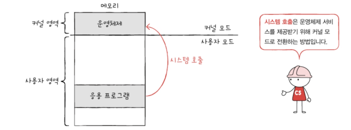

# 9-1 운영체제를 알아야 하는 이유

데스크톱 운영체제: 윈도우, macOS, 리눅스 
스마트폰 운영체제: 안드로이드, ios 

운영체제는 1장푸터 8장까지 배운 컴퓨터 부품들을 관리하고, 프로그램이 올바르게 실행되도록 도움

## 운영체제란
모든 프로그램은 하드웨어를 필요로 함\
ex) 1+2를 계산하는 프로그램 -> CPU가 필요\
이미지를 하드 디스크에 저장하는 프로그램 -> 하드 디스크가 필요

시스템 자원(자원): 프로그램 실행에 마땅히 필요한 요소들\
ex) CPU, 메모리, 보조기억장치, 입출력장치 등과 같은 컴퓨터 부품들

운영체제: 실행할 프로그램에 필요한 자원을 할당하고, 프로그램이 올바르게 실행되도록 돕는 특별한 프로그램

운영체제는 인터넷 브라우저, 게임과 같은 프로그램임. 그래서 운영체제 또한 여느 프로그램과 마찬가지로 메모리에 적재되어야 한다.

단, 운영체제는 특별한 프로그램이기 때문에 항상 컴퓨터가 부팅될 때 메모리 내 `커널 영역`이라는 공간에 따로 적재되어 실행됨.\
이때 커널 영역을 제외한 영역(사용자가 이용하는 응용 프로그램이 적재되는 영역)을 `사용자 영역`이라고함
> 응용프로그램: 사용자가 특정 목적을 위해 사용하는 일반적인 프로그램.\
> ex) 메모장, 인터넷 브라우저, 게임 등

운영체제는 커널 영역에 적재되어 사용자 영역에 적재된 프로그램들에 자원을 할당하고, 올바르게 실행되도록 도움

ex) 워드 프로세서, 인터넷 브라우저, 메모장을 실행중일 경우\

이때 운영체제가 응용프로그램들의 메모리 주소가 겹치지 않도록 적당한 공간에 프로그램들을 적재해 줌. 또 더 이상 실행되지 않는 프로그램을 메모리에서 삭제하며 지속적으로 자원을 관리함\

<자원 할당>
게다가 위의 세 응용프로그램이 실행되려면 반드시 CPU가 필요한데, 어떤 프로그램부터 CPU를 사용하게 할지, 또 얼마나 오랫동안 CPU를 사용하게할지를 CPU가 결정해줌\

<프로그램 실행 관리>
ex2) 워드 프로세서와 메모장이 동시에 동일한 프린터를 사용해야하는 상황.\
하나의 프로그램이 프린터를 이용하는 동안 다른 프로그램은 기다리게 만들어 프린터자원을 관리함\

운영체제는 응용 프로그램에 자원을 효율적으로 배분하고, 실행할 프로그램들이 지켜야 할 규칙을 만들어 컴퓨터 시스템 전체를 관리함. 그리고 운영체제는 관리할 자원별로 기능이 나누어져 있음.(ex: 운영체제의 어느 한 부분은 CPU를, 어느 한 부분은 메모리를 관리)\

## 운영체제를 알아야 하는 이유
만약 운영체제가 없다면 아무리 간단한 프로그램이라도 개발자가 직접 하드웨어를 조작하는 코드를 작성해야함

운영체제는 우리의 프로그램이 하드웨어 상에서 어떻게 작동하는지를 우리보다 더 먼저, 더 자세히 알고 있는데다 현재 하드웨어 상태가 어떠한지, 우리의 코드가 어떻게 실행되었는지, 하드웨어 상에 어떤 문제가 있었는지 등을 상세하게 알려줄 수 있기 때문에 이를 통해 문제 해결의 실마리를 찾을 수 있다.\
∴ 운영체제를 깊이 이해하면 운영체제가 하는 말을 제대로 이해할 수 있고 운영체제에 제대로 명령할 수 있게 됨.

# 9-2 운영체제의 큰 그림
## 운영체제의 심장, 커널
스마트폰이 사용자에게 제공하는 서비스 종류가 다양하지만 전화, 문자, 인터넷 기능과 같은 핵심적인 서비스가 있는 것 처럼, 운영체제가 응용 프로그램에 제공하는 서비스 종류는 다양하지만, 그중에서도 가장 핵심적인 서비스들이 있음(ex: 자원에 접근하고 조작하는 기능, 프로그램이 올바르고 안전하게 실행되게 하는 기능)

커널: 운영체제의 핵심 서비스를 담당하는 부분

운영체제가 설치된 모든 기기에는 커널이 있음. 어떤 커널을 사용하는지에 따라 우리가 실행하고 개발하는 프로그램이 하드웨어를 이용하는 양상이 달라지고, 결과적으로 컴퓨터 전체의 성능도 달라질 수 있음.

운영체제가 제공하는 서비스 중 커널에 포함되지 않는 서비스: 사용자 인터 페이스(윈도우의 바탕화면 같이 사용자가 컴퓨터와 상호작용할 수 있는 통로)

사용자 인터페이스 종류
- 그래픽 유저 인터페이스(GUI)\
  그래픽을 기반으로 컴퓨터와 상호작용할 수 있는 인터페이스(바탕화면, 스마트폰 화면 등)
- 커맨드 라인 인터페이스(CLI)
  명령어를 기반으로 컴퓨터와 상호작용할 수 있는 인터페이스

같은 커널을 사용하더라도 사용자 인터페이스는 다를 수 있음

## 이중 모드와 시스템 호출
운영체제는 사용자가 실행하는 응용 프로그램이 하드웨어 자원에 직접 접근하는 것을 막음. 오직 자신을 통해서만 접근하도록 하여 자원을 보호함\
\
응용 프로그램이 자원에 접근하기 위해서는 운영체제에 도움을 요청해야 함. 이때 '운영체제에 도움을 요청한다'==='운영체제 코드를 실행하려고 한다'\

ex) 응용 프로그램이 실행 과정에서 하드 디스크에 접근하여 데이터를 저장하려면 운영체제에 도움을 요청해야 하고, 운영체제는 커널 영역 내의 하드 디스크에 데이터를 저장하는 코드를 실행하여 응용 프로그램의 작업을 대신 수행해줌\

이중 모드: CPU가 명령어를 실행하는 모드를 크게 사용자 모드와 커널 모드로 구분하는 방식. CPU는 명령어를 사용자 모드로써 실행할 수 있고, 커널모드로써 실행할 수 있음

사용자 모드: 운영체제 서비스를 제공받을 수 없는 실행 모드. 즉 커널 영역의 코드를 실행할 수 없는 모드.\
일반적인 응용프로그램은 기본적으로 사용자 모드로 실행 됨

커널 모드: 운영체제 서비스를 제공받을 수 있는 실행 모드. 즉, 커널 영역의 코드를 실행할 수 있는 모드

사용자 모드로 실행되는 프로그램이 자원에 접근하는 운영체제 서비스를 제공받으려면 운영체제에 요청을 보내 커널 모드로 전환되어야 함.\
이때 운영체제 서비스를 제공받기 위한 요청을 `시스템 호출`이라고 함

시스템 호출은 일종의 소프트웨어적인 인터럽트이다. 이와같이 특정 명령어를 통해 발생되는 인터럽트를 `소프트웨어 인터럽트` 라고 함

ex) 시스템 호출 작동 예시_한 응용프로그램이 하드 디스크에 데이터를 저장하는 상황\
사용자 모드로 실행되는 동안에 자원(하드 디스크)에 접근할 수 없기 때문에 커널 모드로 전환해야 함. 응용 프로그램은 하드 디스크에 데이터를 저장하는 시스템 호출을 발생시켜 커널 모드로 전환하고 운영체제 내의 '하드 디스크에 데이터를 저장하는 코드'를 실행함으로써 하드디스크에 접근할 수 있음. \
하드 디스크에 접근이 끝났다면 다시 사용자 모드로 복귀하여 실행을 계속해 나감\

일반적으로 응용 프로그램은 실행 과정에서 운영체제 서비스들을 빈번하게 이용함=> 시스템 호출을 빈번하게 발생시키고 사용자 모드와 커널 모드를 오가며 실행 됨\

## 운영체제의 핵심 서비스
- 프로세스 관리
- 자원 접근 및 할당
- 파일 시스템 관리
  
### 프로세스 관리
프로세스: 실행중인 프로그램\
우리가 컴퓨터를 사용하는 동안 메모리 안에서는 새로운 프로세스들이 마구 생성되고, 사용되지 않는 프로세스는 메모리에서 삭제 됨

일반적으로 하나의 CPU는 한 번에 하나의 프로세스만 실행할 수 있기 때문에 프로세스들을 조금씩 번갈아 가며 실행 함.\

이때 각 프로세스는 상태도, 사용하고자 하는 자원도 다양함\

그래서 운영체제는 다양한 프로세스를 일목요연하게 관리하고 실행할 수 있어야 함. 또 프로세스가 동시에 실행되는 환경에서는 '프로세스 동기화'가 필수적이고, 프로세스가 더 이상 실행되지 못 하는 상황인 '교착 상태'를 해결해야 함

### 자원 접근 및 할당
- CPU\
  운영체제는 프로세스들에 공정하게 CPU를 할당하기 위해 어떤 프로세스부터 CPU를 이용하게 할 것인지, 얼마나 오래 CPU를 이용하게 할지를 결정할 수 있어야 함. 이를 `CPU 스케줄링`이라 함

- 메모리\
  운영체제는 새로운 프로세스가 적재될 때마다 어느 주소에 적재해야 할지를 결정해야 함.

- 입출력장치\
  입출력장치가 CPU에 하드웨어 인터럽트 요청 신호를 보내면 CPU는 하던 일을 잠시 백업한 뒤 커널 영역에 있는 인터럽트 서비스 루틴을 실행함. 이처럼 운영체제는 인터럽트를 처리하는 프로그램, 즉 인터럽트 서비스 루틴을 제공함으로써 입출력 작업을 수행함

### 파일 시스템 관리
컴퓨터를 사용할 때는 여러 파일을 열고, 생성하고, 삭제하곤 함. 그리고 이 파일들을 한데 묶어 디렉터리 (폴더)로 관리함. 이런 `파일 시스템`도 운영체제가 지원하는 핵심 서비스임

---

## 📖

Q1. 시스템 자원과 운영체제에 대해 설명하시오.

A1. 시스템 자원은 프로그램 실행에 필요한 요소들이고 운영체제는 이러한 자원을 필요로 하는 프로그램에 할당하고 프로그램이 올바르게 실행되도록 돕는 특별한 프로그램이다.

Q2. 사용자 인터페이스 종류와 각각에 대해 간단히 설명하시오.

A2. 사용자 인터페이스로는 그래픽 유저 인터페이스(GUI)와 커맨드 라인 인터페이스(CUI)가 있는데, 그래픽 유저 인터페이스는 바탕화면, 스마트폰 화면과 같이 그래픽을 기반으로 컴퓨터와 상호작용할 수 있는 인터페이스이고, 커맨드 라인 인터페이스는 명령어를 기반으로 컴퓨터와 상호작용할 수 있는 인터페이스이다.

Q3. 사용자 모드와 커널모드에 대해 설명하시오.

A3. 사용자 모드는 운영체제 서비스를 제공받을 수 없는 실행 모드로 일반적인 응용프로그램은 기본적으로 사용자 모드로 실행 되고, 커널 모드는 운영체제 서비스를 제공받을 수 있는 실행 모드이다. 다시말해 사용자 모드는 커널 영역의 코드를 실행할 수 없는 모드이고 커널모드는 커널 영역의 코드를 실행할 수 있는 모드이다.