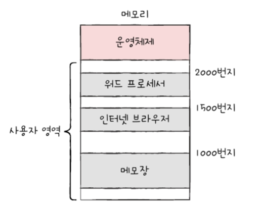
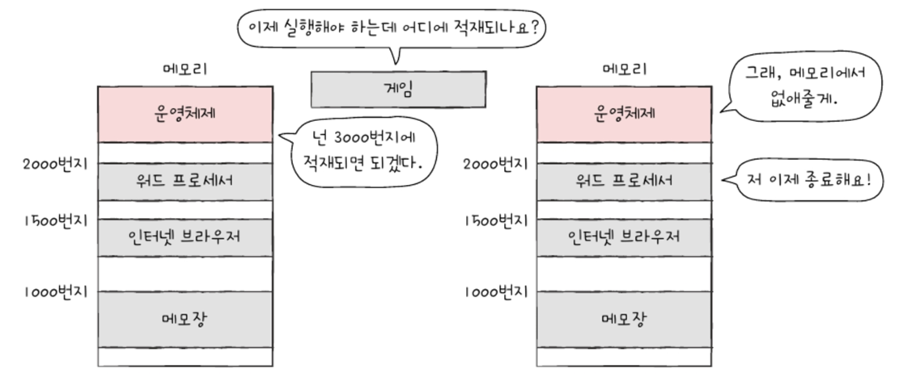
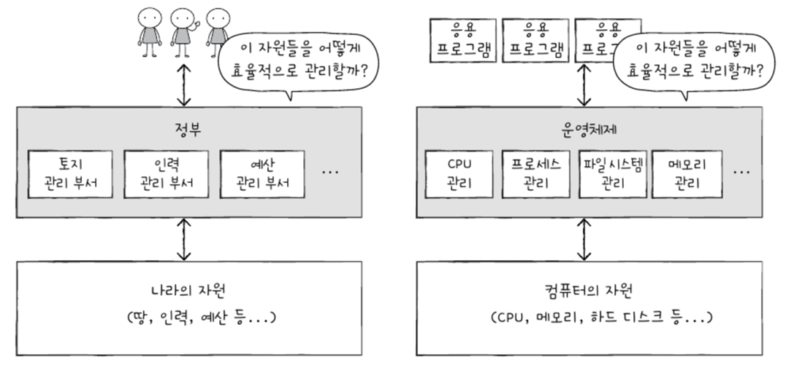
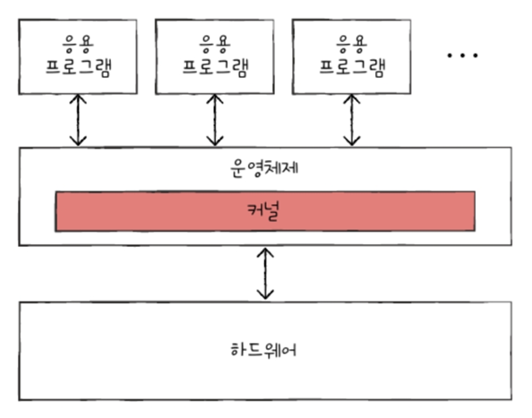
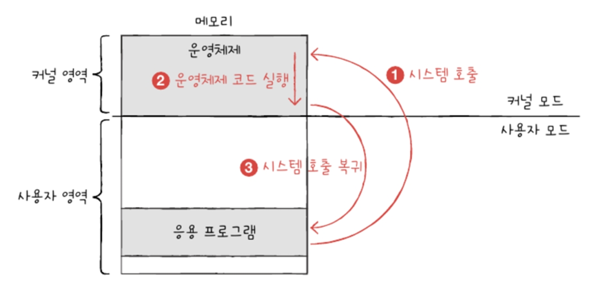
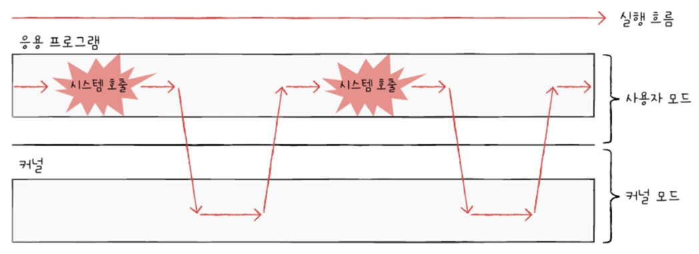
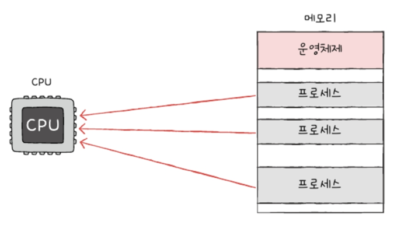
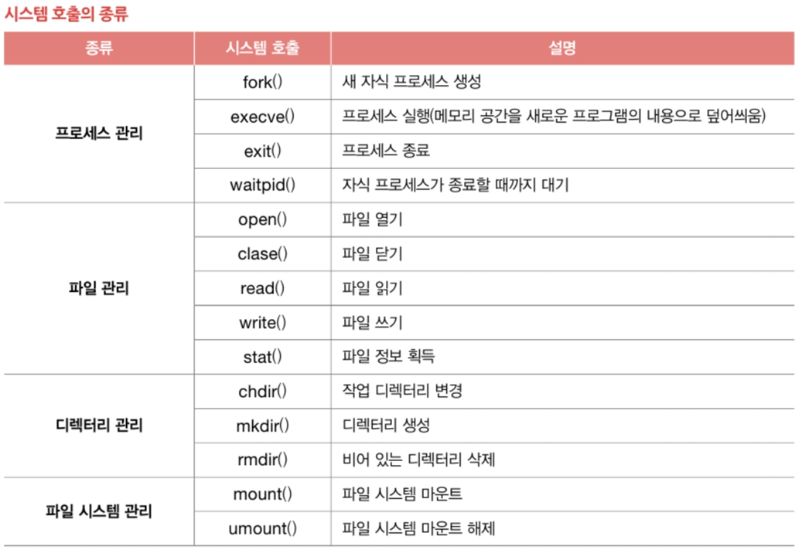

# 9장. 운영체제 시작하기

## 9-1. 운영체제를 알아야 하는 이유

### 1. 운영체제(OS ; Operating System)

    : 실행할 프로그램에 필요한 자원 할당하고 프로그램 올바르게 실행되도록 돕는 특별한 프로그램

- 모든 프로그램은 HW 필요
- 운영체제도 프로그램이기 때문에 메모리에 적재되어야 함
   - 컴퓨터가 부팅될 때 메모리 내 **커널 영역** 이란 공간에 따로 적재 - 커널 영역 제외한 나머지 영역 -> 사용자가 이용하는 응용 프로그램이 적재되는 영역 : **사용자 영역**

- `시스템 자원`(=`자원`) : 프로그램 실행에 마땅히 필요한 요소들
- `응용 프로그램`(application software) : 사용자가 특정 목적 위해 사용하는 일반적인 프로그램

=> OS가 메모리 주소가 겹치지 않도록 적당한 공간에 프로그램 적재해 줌

- 운영체제는 실행할 프로그램 메모리에 적재, 더 이상 실행 안 되는 프로그램을 메모리에서 삭제하며 지속적으로 메모리 자원 관리
  
- 어느 한 프로그램이 CPU 독점하면 다른 프로그램들은 올바르게 실행될 수 없으니까 OS는 최대한 공정하게 여러 프로그램에 CPU 자원 할당 - 그래서 운영체제는 정부에 비유되기도 함
  

### 2. 운영체제를 알아야 하는 이유

- 운영체제 없다면?
  개발자가 간단한 프로그램도 HW 조작 코드 모두 다 작성해야 함
- 운영체제가 개발자에게 건네는 말 제대로 이해할 수 있고, 운영체제에 제대로 명령 가능!
  => `문제 해결의 실마리` 찾을 수 있다
  ex) 메모리 누수 현상, 잘못된 주소 참조 등

---

## 9-2. 운영체제의 큰 그림

### 1. 운영체제의 심장, 커널

- 자원에 접근하고 조작하는 기능, 프로그램이 올바르고 안전하게 실행되는 기능이 `운영체제의 핵심 서비스`
- **커널** : 운영체제의 핵심 서비스 담당하는 부분
  

- 커널에 포함 안 되는 서비스도 있음 -> `사용자 인터페이스(UI; User Interface)`
  - Graphic User Intrerface(`GUI`)
  - Command Line Interface(`CLI`) - 명령어 기반
  - UI는 운영체제가 제공하는 서비스지만, 컴퓨터와 상호작용하기 위한 통로일 뿐, 커널에 속하지X
    - 같은 커널 사용해도 UI 다를 수 있음

### 2. 이중 모드와 시스템 호출

- OS는 사용자가 실행하는 응용 프로그램이 HW 자원에 직접 접근 방지 -> 자원 보호!!
- OS는 응용 프로그램들이 자원에 접근하려고 할 때 오직 자신을 통해서만 접근하도록 해서 자원 보호(문지기 역할)
  => 문지기 역할 - **이중 모드(dual mode)**
  : CPU가 명령어 실행하는 모드를 `사용자 모드`, `커널 모드`로 구분하는 방식

      1) 사용자 모드(user mode) : OS 서비스를 제공받을 수 없는 실행 모드 -> 커널 영역의 코드 실행할 수 없는 모드
        - 일반적인 응용 프로그램 -> 기본적으로 사용자 모드로 실행
        - 사용자 모드로 실행되는 일반적 응용 프로그램은 `자원 접근X`

      2) 커널 모드(kernel mode) : OS 서비스 제공받을 수 있는 실행 모드 -> 커널 영역의 코드 실행할 수 있는 모드
        - CPU가 커널 모드로 명령어 실행하는 자원에 접근하는 명령어 비롯한 모든 명령어 실행 가능
        - OS는 커널 모드로 실행되기 때문에 자원에 접근 가능

- **시스템 호출**(system call) : 사용자 모드로 실행되는 프로그램은 시스템 호출을 통해 커널 모드로 전환하여 운영체제 서비스 제공받을 수 있음
  -> 일종의 인터럽트(`소프트웨어 인터럽트`)

- CPU가 시스템 호출 처리하는 순서
  1. 시스템 호출 발생시키는 명령어 실행되면 CPU는 지금까지 작업 백업
  2. 커널 영역 내에 시스템 호출 수행하는 코드(ISR) 실행
  3. 다시 기존에 실행하던 응용 프로그램 복귀하여 실행 계속함
     
     -> 빈번하게 시스템 호출 발생시키고 사용자 모드와 커널 모드 오가며 실행
     

### 3. 운영체제의 핵심 서비스

    1. 프로세스 관리
        - 프로세스(process) : 실행 중인 프로그램
        - 컴퓨터 사용하는 동안 메모리 안에서는 새로운 프로세스들이 마구 생성, 사용되지 않는 프로세스는 메모리에서 삭제
            
        - OS는 다양한 프로세스를 일목요연하게 관리, 실행할 수 있어야
        - `프로세스 동기화` 필수적, `교착 상태` 해결 필요
            
    2. 자원 접근 및 할당
        - 모든 프로세스는 실행을 위해 자원 필요
        1) CPU
            - 일반적으로 메모리에는 여러 프로세스 적재
            - 하나의 CPU는 한 번에 프로세스만 실행 가능
            - **CPU 스케줄링** : OS는 프로세스들에 공정하게 CPU 할당하기 위해 어떤 프로세스부터 CPU 이용하게 할 것인지, 얼마다 오래 CPU 이용하게 할지를 결정할 수 있어야 함.
        2) 메모리
            - 메모리에 적재된 프로세스들은 크기, 주소 가지각색
            - OS는 새로운 프로세스가 적재될 때마다 어느 주소에 적재해야 할지를 결정해야
        3) 입출력장치
            - ISR은 OS가 제공하는 기능 -> 커널 영역에 위치
            - 입출력장치도 마찬가지로 ISR로 입출력 작업 수행
    3. 파일 시스템 관리
        - 파일 열고, 생성, 삭제 -> 묶어서 디렉터리(폴더)로 관리
        - 파일 시스템(file system)도 OS의 핵심 서비스

---

## 가상 머신과 이중 모드의 발전

### 가상 머신(virtual machine)

    : SW적으로 만들어낸 가상 컴퓨터
    - 가상 머신 설치하면 새로운 OS, 응용 프로그램 설치하고 실행 가능
    - 가상 머신 또한 응용 프로그램
        -> 그래서 가상화 지원 CPU는 커널 모드, 사용자 모드 이외에 가상 머신 위한 `하이퍼 바이저 모드` 따로 둠.

## 시스템 호출의 종류

이런 것도 있구나~~

---

# Question

### 1. 커널 영역에 대해 설명해 보세요.

운영체제가 메모리에 적재될 때 저장되는 특별한 영역

### 2. [O/X]사용자 모드(user mode)로 실행되는 일반적인 응용 프로그램은 시스템 자원에 직접 접근할 수 있다.

X

### 3. 프로세스란?

실행 중인 프로그램을 의미하는 용어로, 운영체제가 관리하는 작업의 단위
