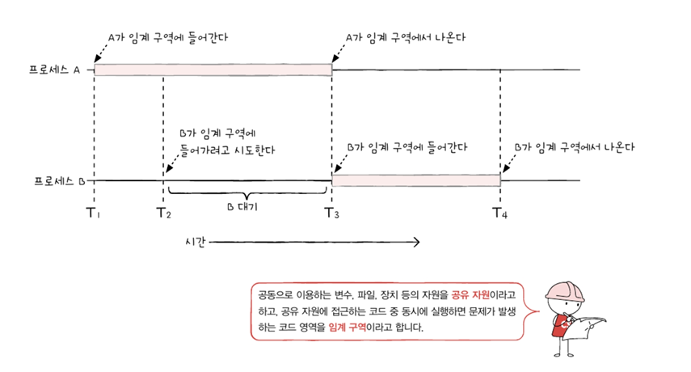
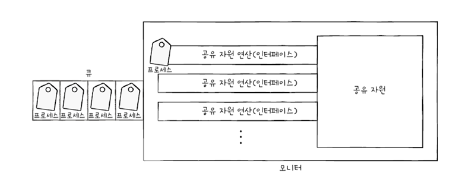

# 12. 프로세스 동기화
- [12. 프로세스 동기화](#12-프로세스-동기화)
  - [12-1. 동기화란](#12-1-동기화란)
    - [1. 동기화의 의미](#1-동기화의-의미)
      - [(1) 프로세스 동기화란](#1-프로세스-동기화란)
      - [(2-1) 실행 순서 제어를 위한 동기화](#2-1-실행-순서-제어를-위한-동기화)
      - [(2-2) 상호 배제를 위한 동기화](#2-2-상호-배제를-위한-동기화)
    - [2. 생산자와 소비자 문제](#2-생산자와-소비자-문제)
    - [3. 공유 자원과 임계 구역](#3-공유-자원과-임계-구역)
  - [12-2. 동기화 기법](#12-2-동기화-기법)
    - [1. 뮤텍스 락](#1-뮤텍스-락)
      - [(1) 뮤텍스 락이란](#1-뮤텍스-락이란)
      - [(2) 구현 방법](#2-구현-방법)
      - [(3) 뮤텍스 락 구조](#3-뮤텍스-락-구조)
    - [2. 세마포](#2-세마포)
      - [(1) 세마포란](#1-세마포란)
      - [(2) 세마포 구현 방법](#2-세마포-구현-방법)
      - [(3) 세마포 대기 방법](#3-세마포-대기-방법)
    - [3. 모니터](#3-모니터)
      - [(1) 모니터란](#1-모니터란)

## 12-1. 동기화란
- 동시다발적으로 실행되는 프로세스들은 공동의 목적을 올바르게 수행하기 위해 서로 협력하여 실행 순서와 자원의 일관성을 보장해야 하기 때문에 동기화되어야 함

### 1. 동기화의 의미
- 프로세스는 동시다발적으로 실행되며 서로 데이터를 주고 받으며 협력하여 실행될 수 있음
- 예 : 워드 프로세서 - 입력, 맞춤법 검사, 입력 내용 화면 출력 등
  - 모두 독립적인 프로세스지만 공동의 목표를 위해 서로 협력하는 존재

#### (1) 프로세스 동기화란
- 정보, 통신 분야에서의 동기화란 작업들 사이의 수행 시기를 맞추는 것 = 프로세스들 사이의 수행 시기를 맞추는 것
  1. 실행 순서 제어 : 프로세스를 올바른 순서대로 실행하기
  2. 상호 배제 : 동시에 접근해서는 안 되는 자원에 하나의 프로세스만 접근하게 하기

#### (2-1) 실행 순서 제어를 위한 동기화
- writer와 reader라는 프로세스 동시 실행 중
- writer 프로세스 : Book.txt 파일에 값을 저장
- reader 프로세스 : Book.txt. 파일에 저장된 값을 읽어 들이는 프로세스  
=> Reader 프로세스는 Writer 프로세스 실행이 끝나야 비로서 실행 가능, 정해진 순서대로 실행 필요  
=> 동시에 실행되는 프로세스를 올바른 순서대로 실행하는 것이 프로세스 동기화

#### (2-2) 상호 배제를 위한 동기화
- 상호 배제 : 공유가 불가능한 자원의 동시 사용을 피하기 위해 사용하는 알고리즘
- 동기화 순서가 제대로 이뤄지지 않으면 아래와 같은 문제 발생 가능

    - 잔액이라는 데이터를 동시에 사용하는데 A가 끝나기 전에 B의 잔액을 읽어버렸기 때문에 발생함 = 동시성 이슈
- 동기화가 이뤄진 경우

    - 상호 배제를 위한 동기화 : 동시에 접근해서는 안 되는 자원에 동시에 접근하지 못하게 하는 것

### 2. 생산자와 소비자 문제
- 상호 배제를 위한 동기화에서 고전적이고 유명한 문제
- 물건을 계속해서 생산하는 프로세스인 생산자, 물건을 계속해서 소비하는 프로세스인 소비자
- 동시에 실행되는 스레드가 될 수도 있음
- 생산자와 소비자는 '총합'을 공유함
- 생산자는 버퍼에 물건을 넣은 후, 물건의 총합에 해당하는 변수를 1 증가시킴
- 소비자는 버퍼에 물건을 빼낸 후 물건의 총합에 해당하는 변수를 1 감소시킴
- 생산자와 소비자가 각 작업이 끝나기 전에 총합을 수정하면서 옳지 않은 총액이 계산됨

### 3. 공유 자원과 임계 구역
- 동시에 접근해서는 안 되는 자원이란 무엇일까?
  - 위의 문제에서 프로세스들은 전역 변수 '잔액', '총액'이라는 공동의 자원을 두고 작업함

 

- **공유 자원** : 공동의 자원으로 전역 변수, 파일, 입출력장치, 보조기억장치 등이 될 수 있음
- **임계 구역** : 공유 자원 중 두 개 이상의 프로세스를 동시에 실행하면 문제가 발생하는 자원

 

- 두 개 이상의 프로세스가 임계 구역에 진입하고자 하면 둘 중 하나는 대기해야함
- 임계 구역에 먼저 진입한 프로세스의 작업이 마무리되면 다음 프로세스가 임계 구역에 진입해야 함

 

- 레이스 컨디션 : 잘못된 실행으로 여러 프로세스가 동시 다발적으로 임계 구역의 코드를 실행하여 문제가 발생한 경우
  - 계좌 잔액 문제, 생산자와 소비자 문제처럼 데이터의 일관성이 깨지는 문제가 발생
- 레이스 컨디션의 발생 원인 : 컴퓨터는 고급 언어가 아닌 저급 언어를 실행하기 때문에 여러 줄의 저급언어로 변환된 고급 언어 한 줄을 실행하는 과정에서 문맥 교환이 일어날 수 있음

- 상호 배제를 위한 동기화는 두 개 이상의 프로세스가 임계 구역에 동시에 접근하지 못하도록 관리하는 것을 의미함

- 상호 배제를 위한 동기화는 세 가지 원칙을 지켜야 함
1. 상호 배제 : 한 프로세스가 임계 구역에 진입했다면 다른 프로세스는 임계 구역에 들어올 수 없음
2. 진행 : 임계 구역에 어떤 프로세스도 진입하지 않았다면 임계 구역에 진입하고자 하는 프로세스는 들어갈 수 있어야 함
3. 유한 대기 : 한 프로세스가 임계 구역에 진입하고 싶다면 그 프로세스는 언젠가는 임계 구역에 들어올 수 있어야 함 (임계 구역에 들어오기 위해 무한정 대기해서는 안됨)

## 12-2. 동기화 기법
### 1. 뮤텍스 락
- 손님 = 프로세스, 탈의실 = 임계 구역, 옷 = 자원
- 탈의실 안에 사람이 있다는 걸 알리기 위해 자물쇠를 사용하는 것처럼 이 자물쇠 기능을 구현한 것 = **뮤텍스 락**

 

#### (1) 뮤텍스 락이란
- 뮤텍스 락 : 동시에 접근해서는 안 되는 자원에 동시에 접근하지 않도록 만드는 도구, 상호 배제를 위한 동기화 도구
 
- 임계 구역에 진입하는 프로세스는 임계 구역에 있음을 알리기 위해 뮤텍스 락을 이용해 자물쇠를 걸어둘 수 있음
- 다른 프로세스는 임계 구역이 잠겨 있으면 기다리고 잠겨 있지 않으면 진입 가능

#### (2) 구현 방법
1. 자물쇠 역할 : 프로세스들이 공유하는 전역 변수 lock
2. 임계 구역을 잠그는 역할 : acquire 함수
3. 임계 구역의 잠금을 해제하는 역할 : release 함수

- acquire 함수
  - 프로세스가 임계 구역에 진입하기 전에 호출하는 함수
  - 임계 구역이 잠겨있다면 열릴 때까지 반복적으로 확인하고 열려있다면 잠그는 함수
    - 바쁜 대기 : 탈의실 문이 잠겨있는지 쉴 새 없이 반복하며 확인해보는 것과 같이 임계 구역이 잠겨있는지 반복적으로 확인하는 것

 

- release 함수
  - 임계 구역에서의 작업이 끝나고 호출하는 함수
  - 현재 잠긴 임계 구역을 열어주는 함수

 

- acquire과 release 함수를 아래와 같이 임계 구역 전후로 호출하면서 하나의 프로세스만 임계 구역에 진입할 수 있음

#### (3) 뮤텍스 락 구조
- 락을 획득할 수 없다면 (임계 구역에 진입할 수 없다면) 무작정 기다림
- 락을 획득할 수 있다면 (임계 구역에 진입할 수 있다면) 임계 구역을 잠근 뒤 임계 구역에서의 작업을 진행
- 임계 구역에서 빠져나올 때엔 다시 임계 구역의 잠금을 해제

### 2. 세마포
#### (1) 세마포란
- 뮤텍스 락과 비슷하지만 좀 더 일반화된 방식의 동기화 도구
- 각 공유 자원에는 하나의 프로세스만 진입 가능하더라도 공유 자원이 여러 개 있는 경우 각각 공유 자원에 여러 개의 프로세스가 접근 가능해야 함
  - 탈의실이 여러 개 있다고 생각하면 됨

 

- 세마포는 철도 신호기에서 유래한 단어로 '멈춤'과 '가도 좋다'는 신호로 임계 구역을 관리함

#### (2) 세마포 구현 방법
1. 전역 변수 S : 임계 구역에 진입할 수 있는 프로세스의 개수(사용 가능한 공유 자원의 개수)를 나타냄
2. wait 함수 : 임계 구역에 들어가도 좋은지, 기다려야 할지를 알려주는 함수
3. signal 함수 : 임계 구역 앞에서 기다리는 프로세스에 '이제 가도 좋다'고 신호를 주는 함수

#### (3) 세마포 대기 방법
- 사용할 수 있는 공유 자원이 없는 경우 프로세스는 무작정 무한히 반복하며 가능한 공유 자원의 개수를 세야함
- 이는 바쁜 대기를 무한히 반복하는 것이고 CPU 주기를 낭비하게 됨

 

- 세마포는 더 좋은 방법을 사용함
- wait 함수는 사용할 수 있는 자원이 없을 경우 프로세스 상태를 대기 상태로 만듦
- 프로세스의 PCB를 세마포를 위한 대기 큐에 집어 넣음
- 다른 프로세스가 임계 구역에서의 작업이 끝나고 signal 함수를 호출하면 대기 중인 프로세스를 대기 큐에서 제거하고 프로세스 상태를 준비 상태로 변경한 뒤, 준비 큐로 옮겨줌

### 3. 모니터
#### (1) 모니터란
- 모니터 : 공유 자원과 공유 자원에 접근하기 위한 인터페이스 (통로)를 묶어 편리함
- 프로세스는 인터페이스(통로)를 통해서만 공유 자원에 접근함

 

- 모니터는 세마포와 마찬가지로 실행 순서 제어를 위한 동기화도 제공
- 특정 조건을 바탕으로 프로세스를 실행하고 일시 중단하기 위해 **조건 변수**를 사용함
- 조건 변수 : 프로세스나 스레드의 실행 순서를 제어하기 위해 사용하는 특별한 변수
  - wait 연산 : 호출한 프로세스의 상태를 대기 상태로 전환하고 일시적으로 조건 변수에 대한 대기 큐에 삽입하는 연산
    - 상호 배제를 위한 큐와는 다름
  - signal 연산 : wait를 호출하여 큐에 삽입된 프로세스의 실행을 재개하는 연산

- 모니터 조건 변수를 이용하여 아래와 같은 프로세스 실행 순서 제어를 위해 동기화 제공
  1. 특정 프로세스가 아직 실행될 조건이 되지 않았을 때에는 wait를 통해 실행을 중단함
  2. 특정 프로세스가 실행될 조건이 충족되었을 대에는 signal을 통해 실행을 재개함

