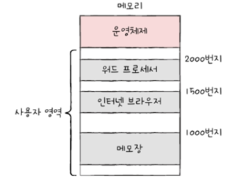
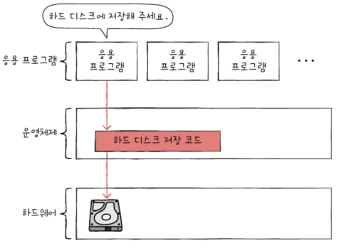

# Chapter09. 운영체제 시작하기
- [Chapter09. 운영체제 시작하기](#chapter09-운영체제-시작하기)
- [09-1. 운영체제를 알아야 하는 이유](#09-1-운영체제를-알아야-하는-이유)
  - [운영체제란?](#운영체제란)
  - [운영체제를 알아야 하는 이유](#운영체제를-알아야-하는-이유)
- [09-2. 운영체제의 큰 그림](#09-2-운영체제의-큰-그림)
  - [이중 모드와 시스템 호출](#이중-모드와-시스템-호출)
  - [운영체제의 핵심 서비스](#운영체제의-핵심-서비스)

---

# 09-1. 운영체제를 알아야 하는 이유

- 모든 프로그램은 하드웨어(자원/컴퓨터 부품들)가 필요하며, 메모리에 적재되어야 함

## 운영체제란?

- **커널 영역**에 적재되어 사용자 영역에 적재된 프로그램들에 **자원을 할당**하고, **올바르게 실행되도록 돕는 프로그램**
    - 사용자 영역 : 사용자가 특정 목적을 위해 사용하는 일반적인 프로그램(응용 프로그램) 적재
    - 응용 프로그램들의 메모리 주소가 겹치지 않게 적재, 실행되지 않는 프로그램은 메모리에서 삭제하면서 최대한 공정하게 자원 할당

- **커널** : 운영체제의 핵심 기능 담당
    - 운영체제가 제공하는 서비스 중 커널에 포함되지 않는 서비스 : 사용자 인터페이스(사용자-컴퓨터 상호작용할 수 있는 통로)
        - `GUI(그래픽 유저 인터페이스)` : 그래픽 기반 상호작용
        - `CLI(커맨드 라인 인터페이스)` : 명령어 기반 상호작용
    

## 운영체제를 알아야 하는 이유

하드웨어와 프로그램을 더 깊이 이해하고 문제 해결의 원인을 찾을 수 있기 때문

- 운영체제 → 하드웨어 조작(및 관리) → 하드웨어가 프로그램 실행
    - 운영체제가 있기 때문에 개발자는 하드웨어를 조작하는 코드 직접 작성할 필요 없음

# 09-2. 운영체제의 큰 그림

## 이중 모드와 시스템 호출

- 하드웨어 자원에 대해 응용프로그램의 직접 접근 방지 → 자원 보호
- **이중 모드**
    - CPU가 명령어를 실행하는 모드를 사용자 모드와 커널 모드로 구분하는 방식
        
        
        | **사용자 모드** | **커널 모드** |
        | --- | --- |
        | 운영체제 서비스 제공 받을 수 없음 | 운영체제 서비스 제공 받을 수 있음 |
        | CPU → 하드웨어 자원에 접근 명령어 실행 불가 → 자원에 접근 불가 | CPU → 모든 명령어 실행 → 자원에 접근 가능 |
        | 일반적인 응용 프로그램의 기본 실행 모드 |  |
    - 사용자 모드에서 운영체제 서비스를 제공 받으려면?
        - **시스템 호출(시스템 콜)** 통해 **커널 모드로 전환**
        - 일종의 소프트웨어 인터럽트 : 특정 명령어에 의해 발생되는 인터럽트
            
            
            

## 운영체제의 핵심 서비스

1. 프로세스 관리

- 프로세스 : 실행 중인 프로그램
- 하나의 CPU는 한 번에 하나의 프로세스만 실행 가능 → 번갈아 가며 실행
- 다양한 프로세스를 동기화, 교착 상태 해결 등을 통해 일정하게 관리 및 실행

2. 자원 접근 및 할당

- CPU : CPU 스케줄링(어떤 프로세스부터 이용하게 할 지, 얼마나 오래 이용하게 할 지 결정)
- 메모리 : 새로운 프로세스가 적재될 때마다 적재 될 주소 결정
- 입출력 장치 : 인터럽트 서비스 루틴(커널 영역) 제공함으로써 입출력 작업 수행

3. 파일 시스템 관리