# 15-1. 파일과 디렉터리
## 파일
: 하드 디스크나 SSD와 같은 보조기억장치에 저장된 관련 정보의 집합. 의미 있고 관련 있는 정보를 모은 논리적 단위

파일을 이루는 정보: 이름, 파일을 실행하기 위한 정보, 파일 관련 부가 정보(속성 or 메타데이터)

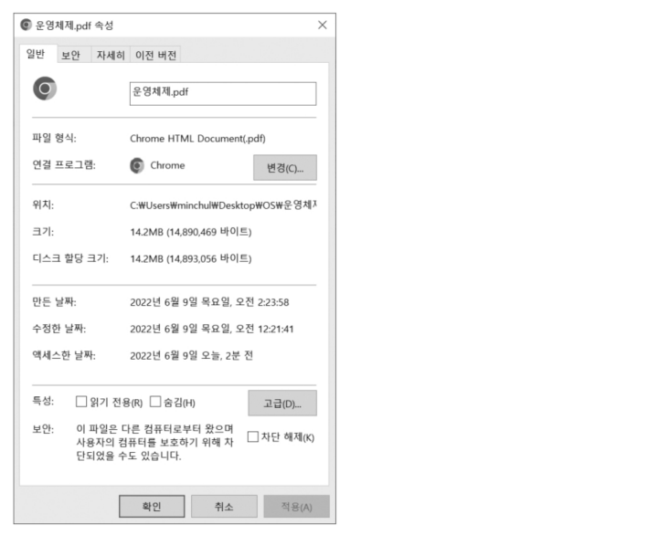

### 파일 속성과 유형
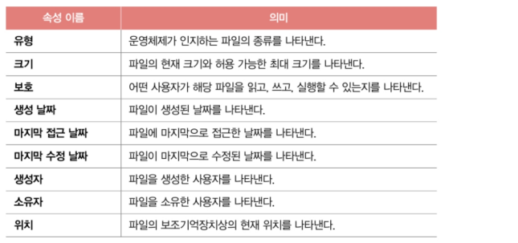

파일 유형: 운영체제가 인식하는 파일 종류. 보통 `확장자`를 이용해서 파일 유형을 알림(ex: myfile.o는 o라는 확장자를 통해 목적 코드를 담고 있는 목적 파일임을 운영체제에 알려주는 셈)

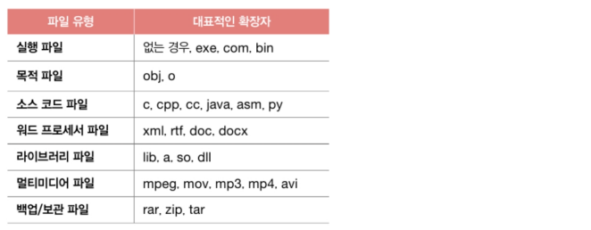

### 파일 연산을 위한 시스템 호출
파일을 다루는 모든 작업은 운영체제에 의해 이뤄짐. => 파일을 다루려면 운영체제에 부탁해야 함.

운영체제는 파일 연산을 위한 `시스템 호출`을 제공
1. 파일 생성
2. 파일 삭제
3. 파일 열기
4. 파일 닫기
5. 파일 읽기
6. 파일 쓰기

## 디렉터리
:파일을 관리하기 위한 특별한 형태의 파일. 폴더(윈도우 운영체제)

옛날 운영체제에서는 하나의 디렉터리만 존재했음(1단계 디렉터리)\
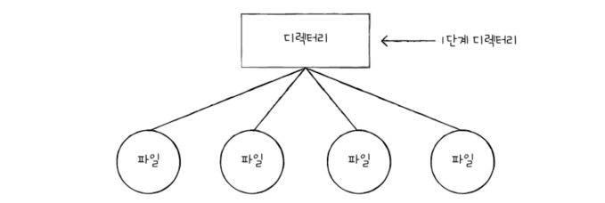

1단계 디렉터리로 많은 파일을 관리하기 어렵기 때문에 아래와 같은 여러 계층을 가진 `트리 구조 디렉터리`가 생김

`루트 디렉터리(/)`인 최상위 디렉터리 아래 여러 서브 디렉터리(자식 디렉터리)가 있을 수도 있음\
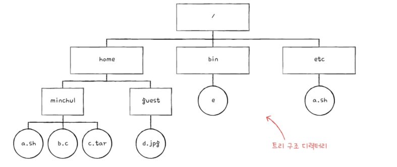

### 절대 경로와 상대 경로
`절대 경로`: 루트 디렉터리에서 자기 자신까지 이르는 고유한 경로

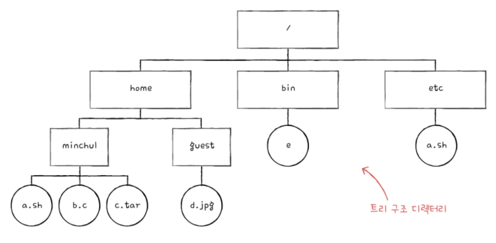\
ex) minchul아래 a.sh의 절대 경로는 /home/minchul/a.sh

`상대 경로`: 현재 디렉터리부터 시작하는 경로\
ex) 현재 디렉터리 경로가 /home이라면 d.jpg 파일의 상대 경로는 guest/d.jpg가 됨

### 디렉터리 연산을 위한 시스템 호출
1. 디렉터리 생성
2. 디렉터리 삭제
3. 디렉터리 열기
4. 디렉터리 닫기
5. 디렉터리 읽기

### 디렉터리 엔트리
파일이 내부에 해당 파일과 관련된 정보를 담고 있다면, 디렉터리는 내부에 해당 디렉터리에 담겨있는 대상과 관련된 정보를 담고 있음. 이 정보는 보통 테이블(표)형태로 구성 되어 보조기억장치에 저장됨

각각의 엔트리(행)에 담기는 정보는 파일 시스템마다 차이가 있음.\
공통으로 포함하는 정보: 파일 이름, 보조기억장치 내에 저장된 위치를 유추할 수 있는 정보\
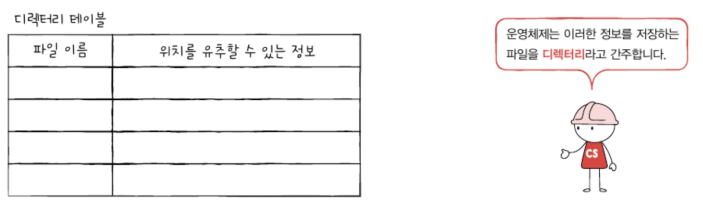

파일 시스템에 따라 디렉터리 엔트리에 아래와 같이 파일 속성을 명시하는 경우도 있음\
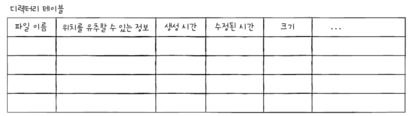

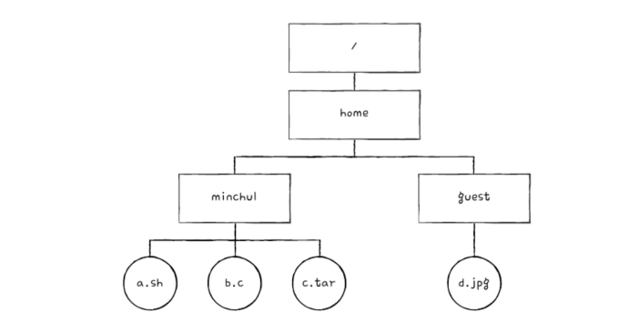\
위와 같은 구조의 디렉터리 파일이 있다고 할 때 home 디렉터리는 대략 아래와 같이 구성됨.(..은 상위 디렉터리, .은 현재 디렉터리를 가리킴)\
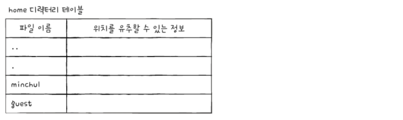

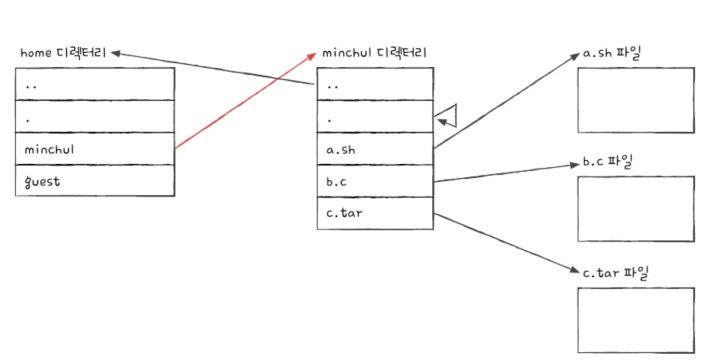

# 15-2. 파일 시스템
: 파일과 디렉터리를 보조기억장치에 일목요연하게 저장하고 접근할 수 있게 하는 운영체제 내부 프로그램

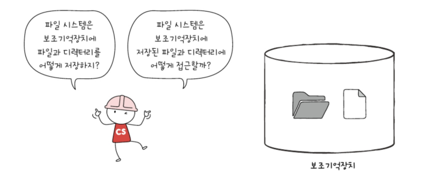

## 파티셔닝과 포매팅
이제 막 생산되어 한 번도 사용된 적 없는 새 하드 디스크 또는 SSD와 같은 보조기억장치에 곧바로 파일을 생성하거나 저장할 수 없음.\
∵ 보조기억장치를 사용하려면 `파티션`을 나누는 작업(`파티셔닝`)과 `포맷`작업(`포매팅`)을 거쳐야 하기 때문

`파티셔닝`: 저장 장치의 논리적인 영역을 구획하는 작업\

위와같이 칸막이로 영역을 나누는 작업이 `파티셔닝` => 영역을 나누면 물건들을 정리하기가 수월해짐

이 때 파티셔닝 작업을 통해 나눠진 영역 하나하나를 `파티션`이라 함

▼ 컴퓨터 내의 보조기억장치가 어떻게 파티셔닝되어 운영되는지 확인하는 법
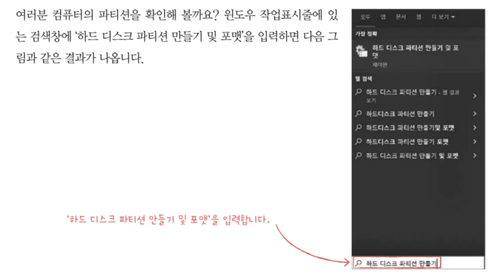
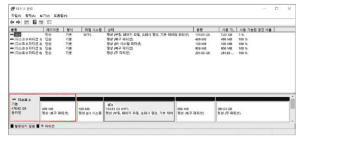

`포매팅`: 파일 시스템을 설정하여 어떤 방식으로 파일을 저장하고 관리할 것인지를 결정하고, 새로운 데이터를 쓸 준비를 하는 작업을 의미. 즉, 어떤 종류의 파일 시스템을 사용할지는 이때 결정남

> 포매팅 종류\
> 저수준 포매팅: 저장 장치를 생성할 당시 공장에서 수행되는 물리적인 포매팅\
> 논리적 포매팅: 파일 시스템을 생성하는 포매팅

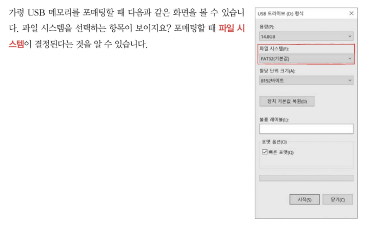

파일 시스템에는 여러 종류가 있고, 파티션마다 다른 파일 시스템을 설정할 수도 있음\

## 파일 할당 방법
운영체제는 파일과 디렉터리를 `블록`단위로 읽고 씀. 즉, 하나의 파일이 보조기억장치에 저장될 때는 하나 이상의 블록에 걸쳐 저장됨.

하드 디스크의 가장 작은 저장 단위는 섹터이지만, 운영체제는 하나 이상의 섹터를 블록이라는 단위로 묶은 뒤 블록 단위로 파일과 디렉터리를 관리함.

아래와 같은 블록에 파일을 할당해 저장할 때 크기가 큰 파일일 수록 여러 블록에 걸쳐 저장됨\
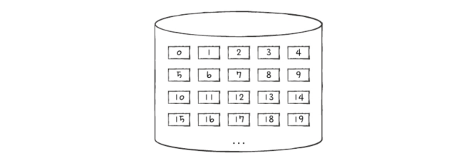

<파일을 보조기억장치에 할당하는 방법>
- 연속 할당
- 불연속 할당
  - 연결할당
  - 색인 할당
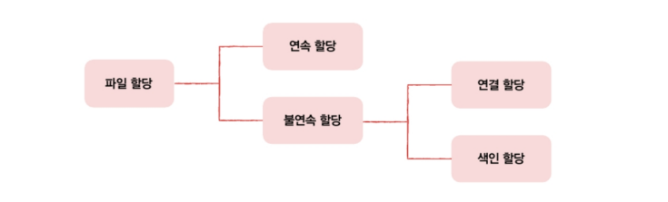

### 연속 할당
보조기억장치 내 연속적인 블록에 파일을 할당하는 방식.\
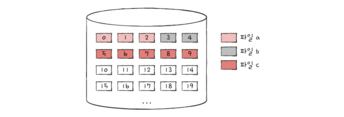

연속으로 할당된 파일에 접근하기 위해서는 파일의 첫 번째 블록 주소와 블록 단위의 길이만 알면 됨\
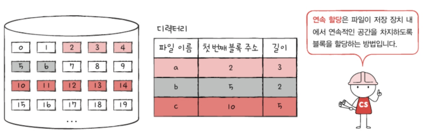

장점: 구현이 단순함\
단점: `외부 단편화`를 야기함\
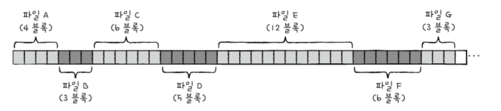\
위에서 파일 D, F가 삭제되면 할당할 수 있는 블록은 총 열한 개가 남지만, 해당 상황에서는 크기가 일곱 개 이상을 사용하는 파일은 할당할 수 없음 <= 연속 할당에서의 외부 단편화\
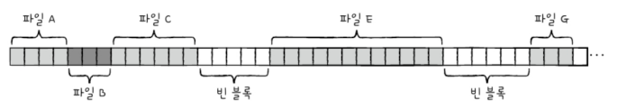

### 연결 할당
연속 할당의 문제를 해결하는 방식. 각 블록 일부에 다음 블록의 주소를 저장하여 각 블록이 다음 블록을 가리키는 형태로 할당하는 방식. 즐, 파일을 이루는 데이터를 연결 리스트로 관리

ex) 네 개의 블록으로 구성된 a라는 파일이 10, 5, 13, 2번 블록에 저장되어있다 가정\
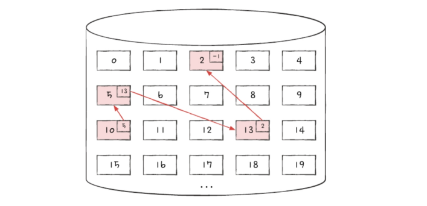

마지막 블록(2번 블록)에는 다음 블록이 없다는 특별한 표시자를 기록(위의 예에선 -1을 이용)

연결 할당도 연속 할당과 마찬가지로 디렉터리 엔트리에 파일 이름, 첫 번째 블록 주소, 블록 단위의 길이를 명시\
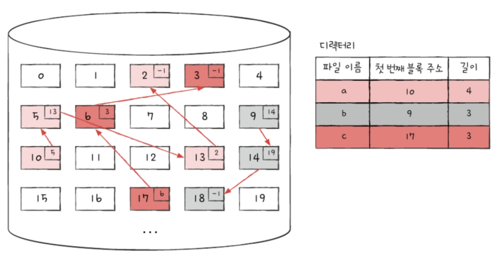

장점: 연속할당의 외부 단편화를 해결\
단점:
1. 반드시 첫 번째 블록부터 하나씩 차례대로 읽어야 함\
   파일의 중간부분부터 접근하고 싶어도 반드시 첫 번째 블록부터 접근해서 하나씩 읽어야 함 => `임의 접근`속도(파일 내 임의의 위치에 접근하는 속도)가 매우 느림

2. 하드웨어 고장이나 오류 발생 시 해당 블록 이후 블록은 접근할 수 없음

### 색인 할당
파일의 모든 블록 주소를 `색인 블록`이라는 하나의 블록에 모아 관리하는 방식\
ex) 파일 a의 색인 블록: 4번 블록, 파일 a의 데이터가 저장된 블록: 7, 13, 11번 블록 => 4번 블록 안에는 파일 a를 구성하는 블록들의 주소인 7, 13, 11이 순차적으로 적혀있음 => 파일 내 임의의 위치에 접근하기 쉬움\
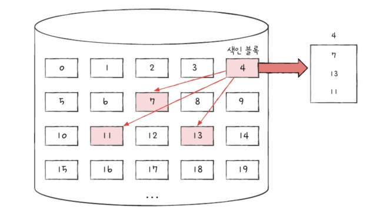

색인 블록만 알면 해당 파일 데이터에 접근할 수 있으므로 색인 할당을 사용하는 파일 시스템에서는 디렉터리 엔트리에 파일 이름과 `색인 블록 주소`를 명시함\
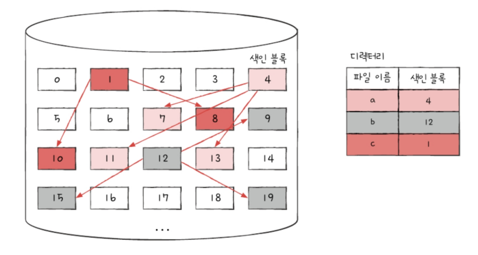

색인 할당을 기방으로 만든 파일 시스템: 유닉스 파일 시스템

## 파일 시스템 살펴보기
`FAT 파일 시스템`: USB 메모리, SD 카드 등의 저용량 저장 장치에서 사용되는 파일 시스템\
`유닉스 파일 시스템`: 유닉스 계열 운영체제에서 사용되는 파일 시스템

### FAT 파일 시스템
: 연결 할당의 단점을 보완한 파일 시스템. \
연결 할당 방식 단점의 근본적인 원인: 블록 안에 다음 블록의 주소를 저장하였기 때문

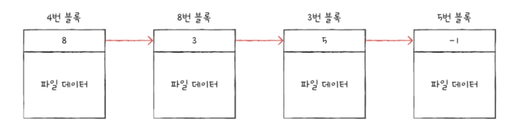\
임의 접근의 성능이 좋지 못하고, 이 블록들 중 하나라도 문제가 발생하면 그 이후의 블록에는 접근할 수 없음 => 각 블록에 포함된 다음 블록의 주소들을 한데 모아 테이블 형태(`파일 할당 테이블(FAT)`)로 관리

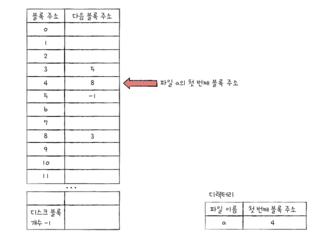\
위의 FAT에서는 파일의 첫 번째 블록 주소인 4번 블록만 알면 파일의 데이터가 담긴 모든 블록에 접근 가능 => 디렉터리 엔트리에 파일 이름, 첫 번째 블록 주소가 명시됨

이러한 FAT를 이용하는 파일 시스템: `FAT 파일 시스템`\
버전에 따라 FAT12, FAT16, FAT32가 있으며 뒤에 숫자들은 블록을 표현하는 비트 수를 의미

FAT 파일 시스템에서 FAT는 파티션의 앞부분에 만들어짐\
하드 디스크의 한 파티션을 FAT 파일 시스템으로 포맷하면 해당 파티션이 아래와 같이 구성된다고 보면 됨\
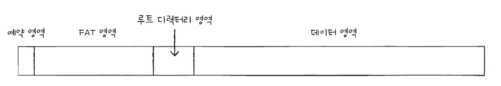

FAT는 하드 디스크 파티션의 시작 부분에 있지만, 실행하는 도중 FAT가 메모리에 캐시될 수 있음 => 메모리에 적재된 채 실행되면 기존 연결 할당보다 다음 블록을 찾는 속도가 매우 빨라지고, 연결 할당 방식보다 임의 접근에도 유리해짐

▼ FAT 파일 시스템에서의 디렉터리들이 블록에 저장되는 형식\
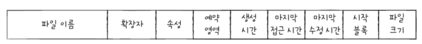

아래와 같은 디렉터리 구조를 이루는 FAT 파일 시스템에서 /home/minchul/a.sh 파일을 읽는 과정\
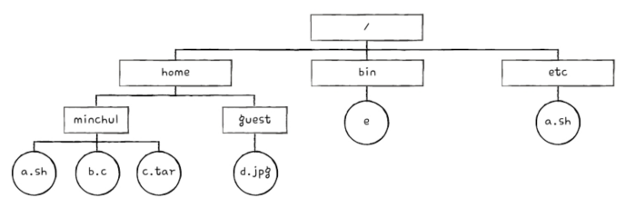

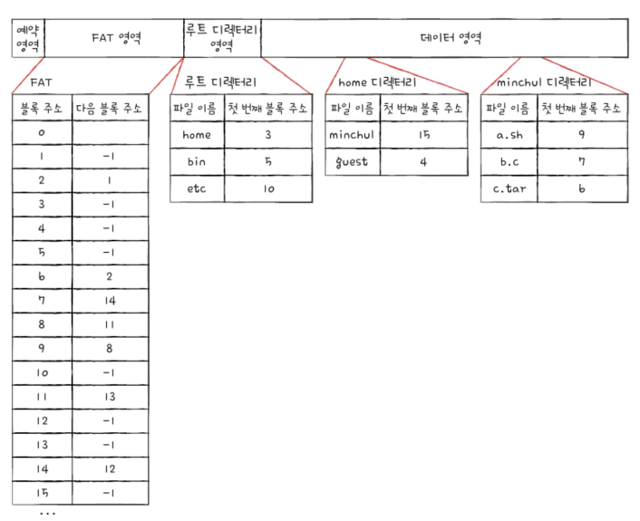\

a.sh에 접근하려면 루트 디렉터리부터 봐야 함\
루트 디렉터리 확인=> home 디렉터리가 몇 번 블록에 있는지 확인\
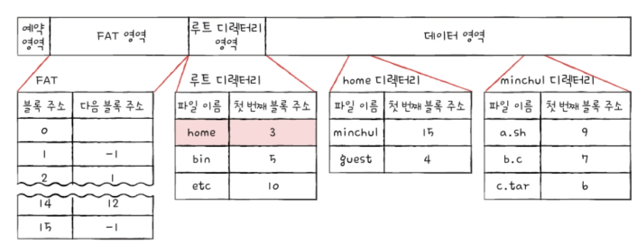

3번 블록을 읽어 home 디렉터리 내용 확인 => minchul 디렉터리가 있는 블록 확인\
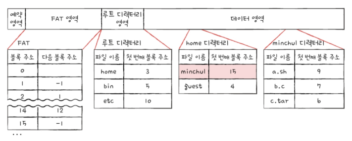

15번 블록을 읽어 minchul 디렉터리 내용 확인 => a.sh 파일의 첫 번째 블록 주소가 9번 블록이라는 것을 알 수 있음\
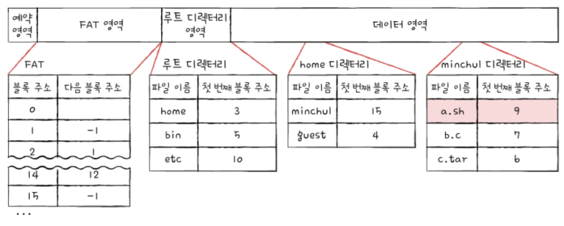

FAT을 확인해 a.sh 파일은 9, 8, 11, 13번 블록 순서대로 저장되어 있다는 것을 알 수 있음\
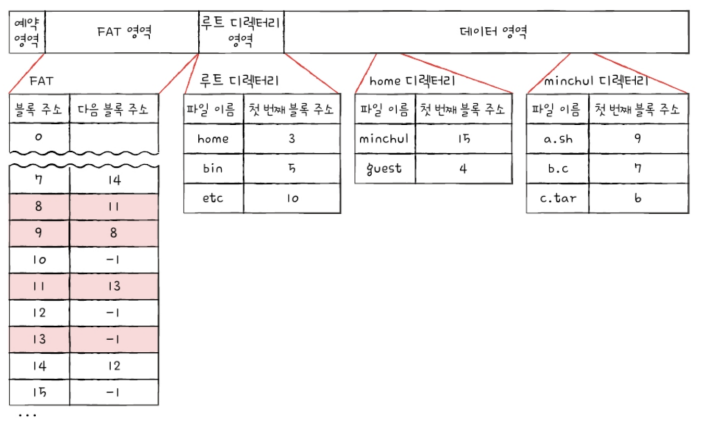

### 유닉스 파일 시스템
: 색인 할당 기반의 파일 시스템. `i-node`라는 색인 블록을 이용해 파일의 데이터 블록들을 찾는 방식

i-node에는 파일 속성 정보와 열다섯 개의 블록 주소가 저장될 수 있음\
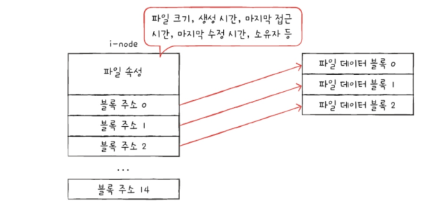

유닉스 파일 시스템에는 파일마다 이러한 i-node가 있고 i-node마다 번호가 부여되어 있음. i-node들을 파티션 내 특정 영역에 모여있음

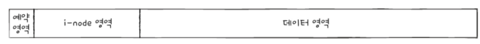

i-node의 크기는 유한하기 때문에 열다섯 개의 블록을 넘어선 개수의 블록을 차지하는 큰 파일은 i-node 하나 만으로 파일의 데이터 블록을 모두 가리킬 수 없음\
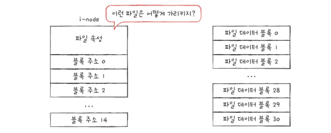

<i-node에 파일을 저장하는 방법>

1. 블록 주소 중 열두 개에는 직접 블록 주소를 저장한다.\
   `직접 블록`: 파일 데이터가 저장된 블록\
   이것만으로도 파일 데이터 블록을 모두 가리킬 수 있다면 추가적인 작업이 필요하지 않음\
   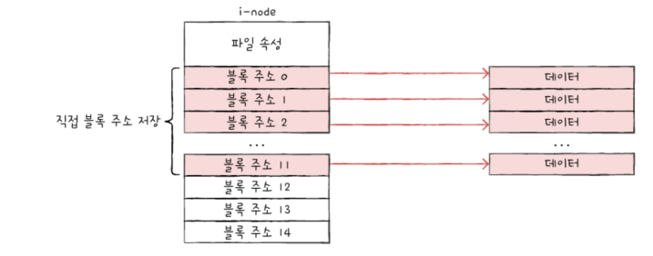

2. '첫째' 내용으로 충분하지 않다면 열세 번째 주소에 단일 간접 블록 주소를 저장한다.\
   `단일 간접 블록`: 파일 데이터가 저장된 플록이 아닌 파일 데이터를 저장한 블록 주소가 저장된 블록\
   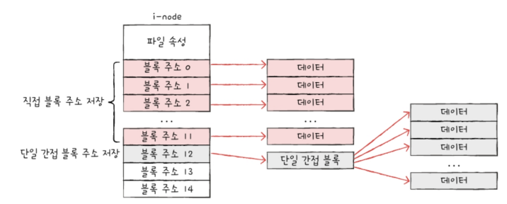

3. '둘째' 내용으로 충분하지 않다면 열네 번째 주소에 이중 간접 블록 주소를 저장한다.\
   `이중 간접 블록`: 데이터 블록 주소를 저장하는 블록주소가 저장된 블록. 즉, 단일 간접 블록들의 주소를 저장하는 블록\
   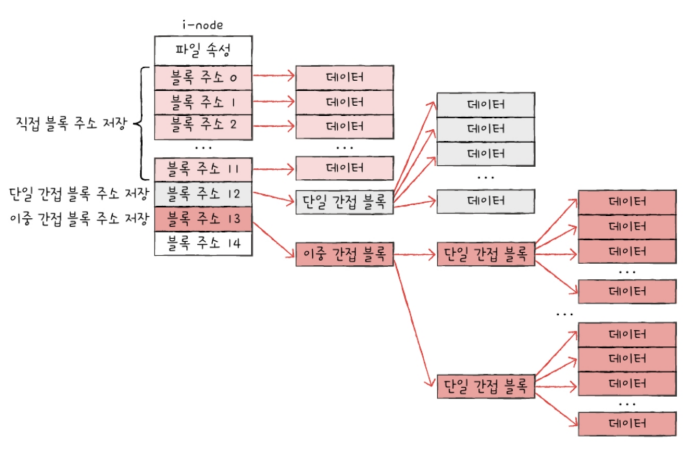

4. '셋째' 내용으로 충분하지 않다면 열다섯 번째 주소에 삼중 간접 블록 주소를 저장한다.\
   `삼중 간접 블록`: 이붕 간접 블록 주소가 저장된 블록\
   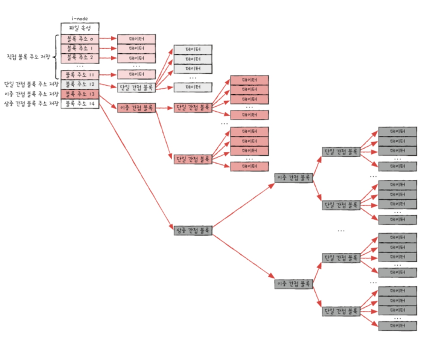

i-node만 알면 파일 속성뿐만 아니라 파일 데이터를 모두 가리킬 수 있기 때문에 i-node가 파일의 모든 것을 담고있다 해도 무방함=> 유닉스 파일 시스템의 디렉터리 엔트리도 파일 이름, i-node번호로 구성됨\
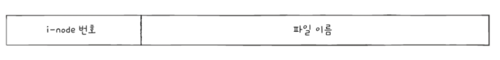

아래와 같은 디렉토리 구조를 이루는 유닉스 파일 시스템에서 /home/minchul/a.sh 파일을 읽는 과정\
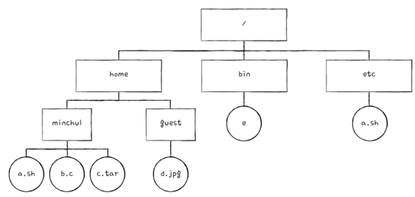

위 디렉터리 구조는 파티션 내에 아래와 같이 저장된다고 가정(간략화된 그림)\
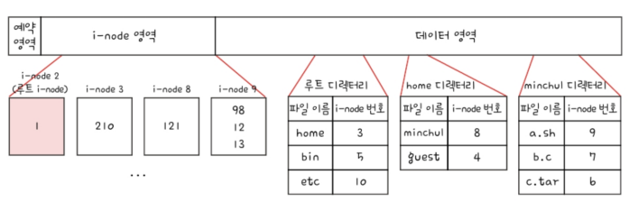

루트 디렉터리 위치는 루트 디렉터리의 i-node를 보면 알 수 있음(해당 예시에선 2번 i-node가 루트 디렉터리의 i-node라 가정)

1. 2번 i-node에 접근하여 루트 디렉터리의 위치를 파악\
   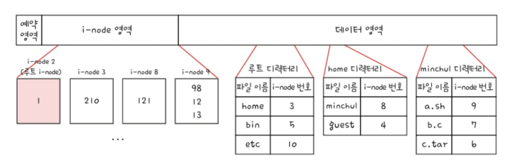

2. 1번 블록을 읽어 루트 디렉터리의 내용 확인 => home 디렉터리의 i-node는 3번 i-node임을 확인\
   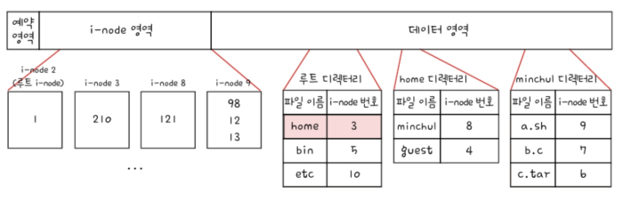

3. 3번 i-node에 접근하여 home 디렉터리 위치를 파악 => 210번 블록에 있음\
   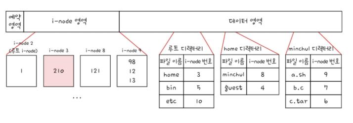

4. 210번 블록을 읽어 home 디렉터리 내용 확인 => minchul 디렉터리의 i-node는 8번\
   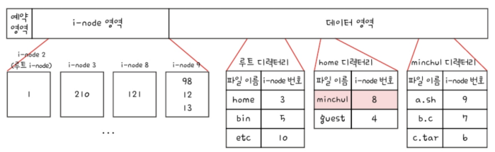

5. 8번 i-node에 접근하여 minchul 디렉터리의 위치를 파악 => 121번 블록\
   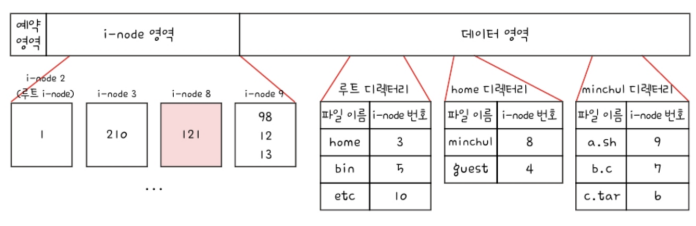

6. 121번 블록을 읽어 minchul 디렉터리 내용 확인 => a.sh의 i-node 번호는 9번\
   

7. 9번 i-node에 접근하여 a.sh의 위치 파악 => 98, 12, 13블록에 있음\
   

∴ 파일 시스템은 /home/minchul/a.sh를 읽기 위해 98, 12, 13번 블록에 접근하면 됨

이외에도 윈도우 운영체제에서 사용되는 `NT 파일 시스템(NTFS)`, 리눅스 운영체제에서 사용되는 `ext 파일 시스템`등 다양한 파일 시스템이 있음