# Ch14. 가상 메모리

# 14-1. 연속 메모리 할당
- `연속 메모리 할당` 방식 : 프로세스에 연속적인 메모리 공간 할당하는 방식
- 프로세스들은 메모리에 연속적으로 할당할 때 무엇을 고려하는지, 잠재적 문제는 무엇인지 체크!

## 14-1-1. 스와핑(swapping)
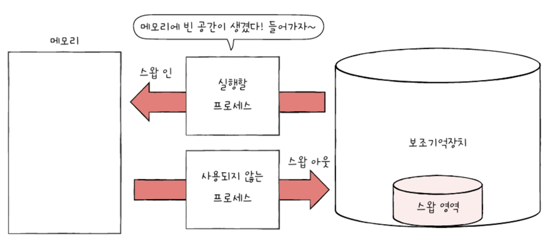
- **스와핑**: 메모리에서 사용되지 않는 일부 프로세스를 보조 기억 장치로 내보내고 실행할 프로세스를 메모리로 들여보내는 메모리 관리 기법
  - **스왑 영역**(swap space): 프로세스들이 쫓겨나는 보조기억장치의 일부 영역
  - **스왑 아웃**(swap-out): 현재 실행되지 않는 프로세스가 메모리에서 스왑 영역으로 옮겨지는 것
  - **스왑 인**(swap-in): 스왑 영역에 있던 프로세스가 다시 메모리로 옮겨오는 것
  - 스왑 아웃된 프로세스가 다시 스왑 인 될 경우, 이전 물리주소와 다른 주소에 적재 될수도
- 스와핑 이용시, 프로세스들이 요구하는 메모리 주소공간 크기가 실제 메모리 크기보다 커도 `프로세스 동시 실행` 가능

## 14-1-2. 메모리 할당
- 프로세스는 메모리 내 빈 공간에 적재되어야
- What if? 메모리 내 빈 공간이 여러 개라면?
  비어있는 메모리 공간에 프로세스를 연속적으로 할당 --> 최초 적합, 최적 적합, 최악 적합
### 최초 적합(first fit)
- OS가 메모리 내 빈 공간 순서대로 검색하다가 **적재할 수 있는 공간 발견하면 그 공간에** 프로세스 배치
- OS가 빈 공간 A -> B -> C 순으로 검색했다면 프로세스는 빈 공간 A에 적재
- 최초 적합 방식은 프로세스가 적재될 수 있는 공간 발견하는 즉시 메모리 할당하는 방식
- `검색 최소화`할 수 있고 결과적으로 `빠른 할당` 가능
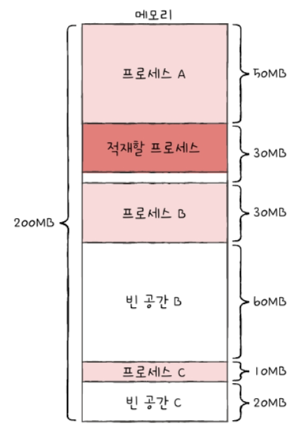
### 최적 적합(best fit)
- OS가 빈 공간 모두 검색한 후, 프로세스가 **적재될 수 있는 공간 중 가장 작은 공간**에 프로세스 배치
- 예시에서 가장 작은 빈 공간 C에 할당
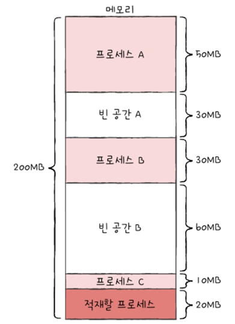
### 최악 적합(worst fit)
- OS가 빈 공간 모두 검색한 후, 프로세스가 **적재될 수 있는 공간 중 가장 큰 공간**에 프로세스 배치
- 예시에서 가장 큰 빈 공간 B에 할당
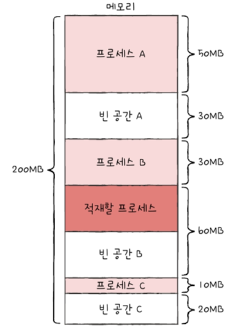

## 14-1-3. 외부 단편화(external fragmentation)
- 연속 메모리 할당 메모리 효율적으로 사용하는 방법X
- 연속 메모리 할당은 `외부 단편화 문제 내포`
- **외부 단편화**: 프로세스 할당하기 어려울 만큼 작은 메모리 공간들로 인해 메모리가 낭비되는 현상
  - 프로세스 B가 스왑 아웃되고 B보다 작은 D가 적재되었을 때 외부 단편화 발생
  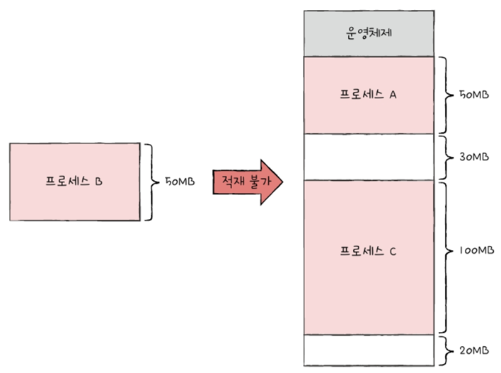
  - 외부 단편화로 인해 낭비되는 공간 더욱 큼
- 외부 단편화 해결 방안) **압축(compaction)**
  - 메모리 조각 모음
  - 여기저기 흩어져 있는 빈 공간 하나로 모으는 방식
  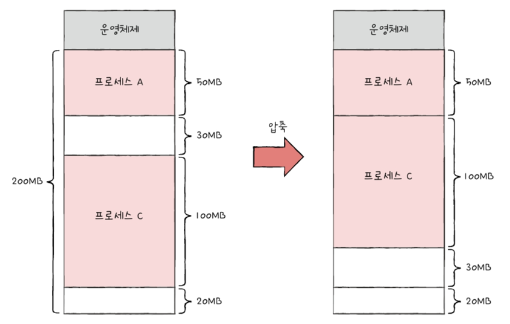
  - 단점
    - 작은 빈 공간 하나로 모으는 동안 시스템은 하던 일 중지해야
    - 메모리 내용 옮기는 작업은 오버헤드 많이 야기
    - 어떤 프로세스를 어떻게 움직여야 오버헤드 최소화하며 압축할 수 있는지 명확한 방법 결정 어려움
    - 그래서 다른 해결 방안 ==> `가상 메모리 기법 中 페이징 기법` 등장

---
# 14-2. 페이징을 통한 가상 메모리 관리
- **가상 메모리(virtual memory)**: 실행하고자 하는 프로그램을 일부만 메모리에 적재해 실제 물리 메모리 크기보다 더 큰 프로세스 실행하게 하는 기술
  - 기법: 페이징, 세그멘테이션
## 14-2-1. 페이징이란
### 페이징(Paging)
- **프로세스의 논리 주소 공간을 페이지라는 일정 단위로 자르고**, 
  **메모리 물리 주소 공간을 프레임이라는 페이지와 동일한 크기의 일정한 단위로 자른 뒤** 
  페이지를 프레임에 할당하는 가상 메모리 관리 기법
- 페이징도 스와핑 가능
  - 프로세스 단위X, 페이지 단위로 스와핑
  - `페이지 아웃`(page out): 페이징 시스템에서의 스왑 아웃
  - `페이지 인`(page in): 페이징 시스템에서의 스왑 인
  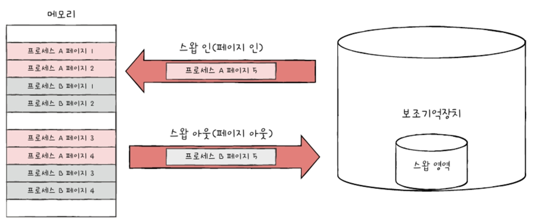
  - 한 프로세스 실행하기 위해 프로세스 전체가 메모리 적재될 필요X
  - 실행에 필요 없는 페이지들은 보조기억장치에 남겨둘 수 있음
  - **물리 메모리 보다 더 큰 프로세스 실행 가능**

## 14-2-2. 페이지 테이블(page table)
- 프로세스에 메모리가 불연속적으로 배치되어 있다면 CPU가 순차적으로 실행X
  --> 프로세스 이루는 페이지가 어느 프레임에 적재됐는지 다 알지 못하니까
- 그래서 페이징 시스템은 프로세스가 물리 주소에 불연속적 배치되어도, 논리 주소에는 연속적으로 배치되도록 페이지 테이블 사용
- **페이지 테이블의 페이지 번호 통해 페이지가 적재된 프레임 찾을 수 있음**
  - 페이지 번호, 프레임 번호, 유효 비트, 보호 비트, 접근 비트, 수정 비트 등
- 페이징은 외부 단편화 해결 But `내부 단편화` 야기할 수도
  - 모든 프로세스가 페이지 크기에 딱 맞게 잘리는 게 아니니까
  - 내부 단편화는 하나의 페이지 크기보다 작은 형태로 발생
  - 내부 단편화를 적당히 방지하면서 너무 크지 않은 페이지 테이블이 만들어지도록 페이지 크기 조정(너무 작으면 페이지 테이블 크기가 너무 커져서 공간 낭비)

### 페이지 테이블 베이스 레지스터(PTBR; Page Table Base Register)
- 프로세스마다 각자의 프로세스 테이블 가지고 있고 각 프로세스의 페이지 테이블은 메모리에 적재
- PTBR은 각 프로세스의 페이지 테이블이 적재된 주소 가리킴
  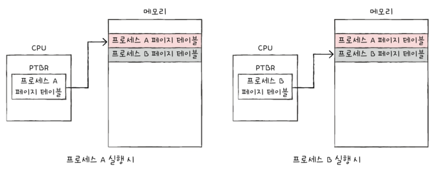
- 각 프로세스들의 페이지 테이블 정보는 각 프로세스의 PCB에 기록, 프로세스 문맥 교환 시 다른 레지스터처럼 변경
 

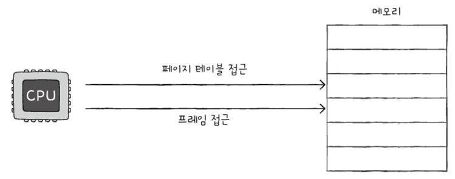
- 페이지 테이블을 메모리에 두면 문제
  - 메모리 접근 시간 2배로 늘어페이지 테이블 접근; 1번
  - 프레임에 접근; 2번
### TLB(Translation Lookaside Buffer)
- 위의 문제 해결하고자 CPU 곁에(일반적으로 MMU 내) TLB라는 페이지 테이블 `캐시 메모리` 둠(TLB도 곧 캐시 메모리)
- 즉, 페이지 테이블의 캐시 메모리 역할 수행하기 위해 페이지 테이블의 일부 저장
- `TLB 히트`(TLB hit): CPU가 발생한 논리 주소에 대한 페이지 번호가 TLB에 있을 경우 --> 이 경우는 페이지 적재된 프레임 알기 위해 메모리 접근할 필요X
- `TLB 미스`(TLB miss): 페이지 번호가 TLB에 없을 경우 어쩔 수 없이 페이지가 적재된 프레임 알기 위해 메모리 내 페이지 테이블에 접근하는 수밖에

## 14-2-3. 페이징에서의 주소 변환
- 특정 주소에 접근할 때 필요한 2가지 정보
  - 어떤 페이지 or 프레임 접근?
  - 접근하려는 주소가 그 페이지 or 프레임에서 얼마나 떨어져 있는지
- 그래서 페이징 시스템에서는 모든 논리 주소가 **페이지 번호(page number)**, **변위(offset)** 로 이뤄져 있음
  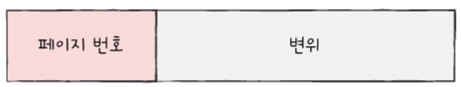
    - 논리 주소 <페이지 번호, 변위>
    - 페이지 테이블을 통해 물리 주소 <프레임 번호, 변위> 로 변환
    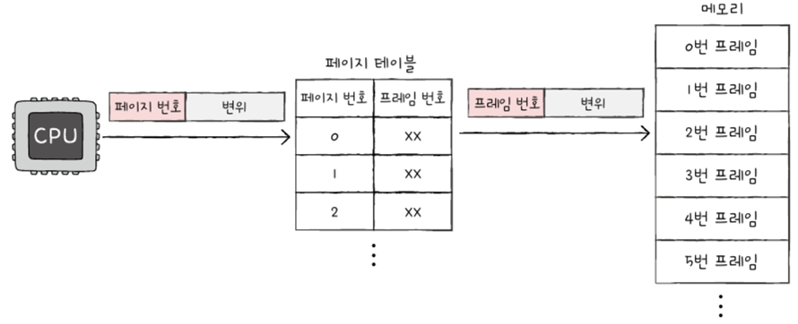

## 14-2-4. 페이지 테이블 엔트리(PTE; Page Table Entry)
페이지 테이블의 각각의 **행**들
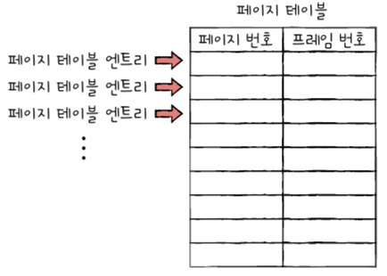

### 유효 비트(valid bit)
- 현재 해당 페이지에 접근 가능한지 여부 알려줌
- PTE에서 프레임 번호 다음으로 중요한 정보
- 현재 페이지가 메모리에 적재되었는지, 보조기억장치에 있는지 알려줌
- `유효 비트 1`; 페이지가 메모리에 적재
- `유효 비트 0`; 페이지가 메모리에 적재X
- **페이지 폴트(page fault)**: CPU가 유효 비트 0인 페이지로 접근하려 하면 발생하는 예외
- **보호 비트(protection bit)**: 페이지 보호 기능 위해 존재하는 비트
  - 보호 비트로 해당 페이지가 읽고 쓰기가 모두 가능한 페이지인지, 읽기만 가능한 페이지인지 나타낼 수 있음
  - `보호 비트 0`: 읽기만 가능
  - `보호 비트 1`: 읽기 쓰기 모두 가능
  - 프로세스 이루는 요소 中 코드 영역은 읽기 전용 영역
  - 읽기 전용 페이지에 쓰기 시도하면 OS가 이를 막아줌
  - 읽기(r), 쓰기(w), 실행(x) 조합으로 권한 나타낼 수 있음
- **참조 비트(reference bit)**: 이 페이지에 접근한 적 있는지 여부 나타냄
  - `참조 비트 1`: 적재 이후 CPU가 읽거나 쓴 페이지
  - `참조 비트 0`: 적재 이후 한번도 읽거나 쓴 적 없는 페이지
- **수정 비트(modified bit)**: 해당 페이지에 데이터 쓴 적 있는지 없는지 수정 여부 알려줌 (= 더티 비트(dirty bit))
  - `수정 비트 1`: 변경된 적 있는 페이지
  - `수정 비트 0`: 변경된 적 없는 페이지
  - 왜 수정 비트 존재? 
    **페이지가 메모리에서 사라질 때 보조기억장치에 쓰기 작업 해야 하는지, 할 필요 없는지 판단하기 위해서**

# 14-3. 페이지 교체와 프레임 할당
## 14-3-1. 요구 페이징(demand paging)
- 프로세스를 메모리에 적재할 때 처음부터 모든 페이지를 적재하지 않고 **필요한 페이지만을 메모리에 적재**하는 기법
- 순수 요구 페이징(pure demand paging)
  - 아무런 페이지도 메모리에 적재하지 않은 채 무작정 실행부터 할 수도 있음
  - 프로세스 첫 명령어 실행하는 순간부터 페이지 폴트 계쏙 발생
  - 실행에 필요한 페이지 어느 정도 적재된 이후부터는 페이지 폴트 발생 빈도 떨어짐
- 요구 페이징 시스템이 안정적으로 작동하려면 해결해야 하는 2가지
  - 페이지 교체
  - 프레임 할당

## 14-3-2. 페이지 교체 알고리즘
- 요구 페이징 기법 하다보면 언젠가는 메모리 가득 차기 때문에 메모리에 적재된 페이지 보조 기억 장치로 내보내야 함
- 쫓아낼 페이지를 결정하는 방법
- 페이지 폴트 횟수
  - 이는 페이지 참조열(page reference string)으로 알 수 있음
  - 연속된 페이지는 생략 --> 중복 페이지 참조는 페이지 폴트 발생X
  - 페이지 교체 알고리즘에서 페이지 폴트 안 일어나면 고려할 필요가 없음
### FIFO 페이지 교체 알고리즘(First-In First-Out Page Replacement Algorithm)
- 가장 먼저 올라온 페이지부터 내쫓기
- 오래 머물렀으면 나가라!
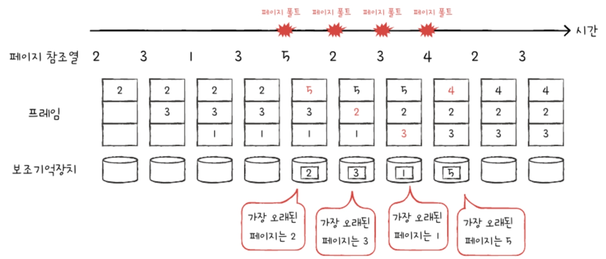
- 참고(2차 기회 페이지 교체 알고리즘)
  - FIFO 변형, 한 번 더 기회 주는 알고리즘
  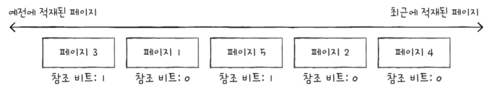
  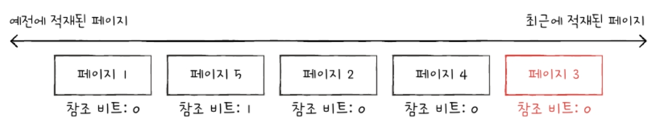
### 최적 페이지 교체 알고리즘(Optional page replacement algorithm)
- CPU에 의해 참조되는 횟수 고려
  - 자주 사용될 페이지는 메모리에 오랫동안 남아야 할 페이지
  - 오래 안 쓰는 페이지는 메모리에 오래 안 남아도 될 페이지
- 오래 메모리 있었다고 쫓으면 비합리적
- 사용 빈도 따라서!
  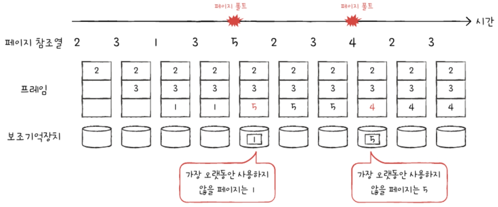
### LRU 페이지 교체 알고리즘(LRU; Least Recently Used Page Replacement Algorithm)
- 가장 오래 안 사용된 페이지 교체
- 최근에 사용되지 않은 페이지는 앞으로도 안 사용될 것
  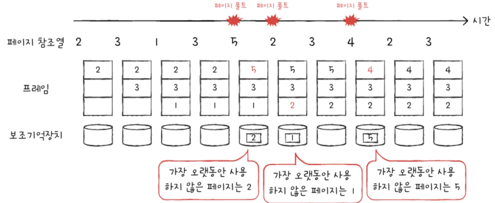

## 14-3-3. 스래싱과 프레임 할당
- 페이지 폴트 자주 발생하는 이유
  - 나쁜 페이지 교체 알고리즘
  - 프로세스가 사용가능한 프레임 수가 적을 때(이게 더 근본적 이유)
### 스래싱(thrashing)
- 지나치게 빈번한 페이지 교체로 CPU 이용률 낮아지는 문제
  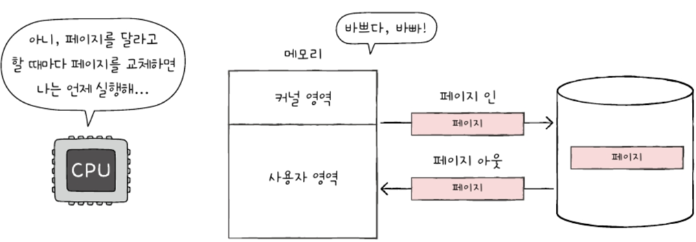
### 프레임 할당
- 정적 할당 방식 - 단순 프로세스 크기와 물리 메모리 크기만 고려
  - **균등 할당**(equal allocation): 모든 프로세스에 동일한 프레임 배분
    - 실행되는 프로세스 크기 각각 다른데 균등한 것은 비합리적
  - **비례 할당**(proportional allocation): 프로세스 크기에 따라 프레임 배분
    - 프로세스 크기 커도 실행에 많은 프레임 안 필요할 수도, 반대일 수도
    - 하나의 프로세스가 실제로 얼마나 많은 프레임 필요한지 결국 실행해 봐야 안다
- 동적 할당 방식 - 프로세스 실행 보고 할당할 프레임 수 정함
  - **작업 집합 모델 기반** 프레임 할당 방식(working set modal allocation)
    - 작업 집합(working set): 실행 중인 프로세스가 일정 시간 동안 참조한 페이지의 집합
      - 작업 집합 구하기(2가지 필요)
        1. 프로세스 참조한 페이지
        2. 일정 시간 간격
        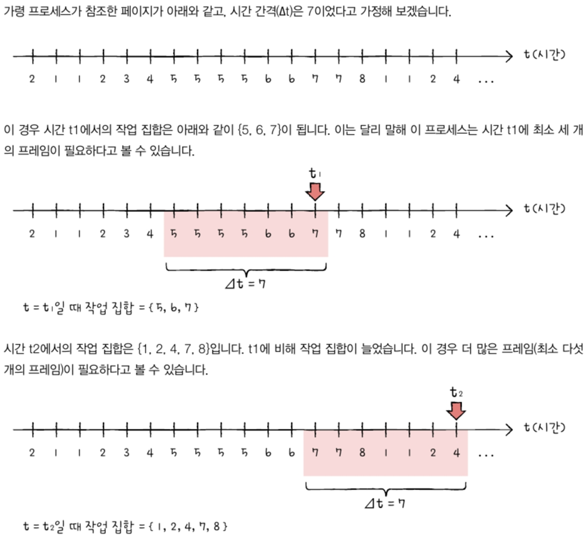
    - 이 작업 집합을 기억하여 빈번한 페이지 교체 방지
  - **페이지 폴트율 기반** 프레임 할당 방식(PFF allocation; Page-Fault Frequency allocation)
    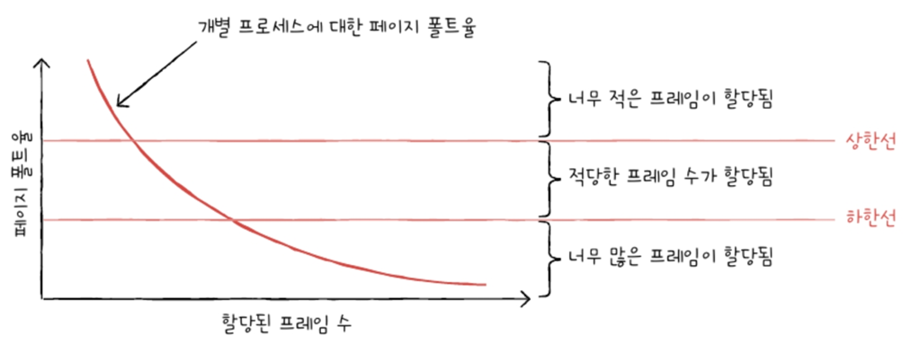
    - 페이지 폴트율 高 --> 너무 적은 프레임 갖고 있음
    - 페이지 폴트율 低 --> 너무 많은 프레임 갖고 있음
    - 이에 따라 페이지 폴트율에 상한선과 하한선 정해 그 내부 범위 안에서만 프레임 할당
    - 상한선, 하한선은 임의로 그은 것