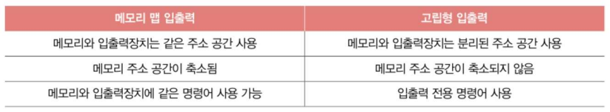

# 8장. 입출력장치
## 8-1. 장치 컨트롤러와 장치 드라이버

### 1. 장치 컨트롤러(Device Controller)
- **배경과 필요성**
  - 입출력장치의 다양성 문제
  - CPU/메모리와 입출력장치 간의 전송률 차이 존재
    - `전송률(Transfer Rate)`: 데이터를 얼마나 빨리 교환할 수 있는지 나타내는 지표
    - 일반적으로 CPU와 메모리의 데이터 전송률 高, 입출력장치의 데이터 전송률 低
  - 이런 이유들로 **장치 컨트롤러** 필요
  - 입출력 제어기, 입출력 모듈 등으로 불리기도 함

- **주요 기능**
  1. CPU와 입출력장치 간 통신 중개
     - 정보 규격화 및 번역 작업
     - 통신 프로토콜 관리
     - 데이터 형식 변환
  
  2. 오류 검출 기능
     - 연결된 입출력장치 상태 모니터링
     - 하드웨어 오류 감지
     - 데이터 전송 오류 확인
  
  3. 데이터 버퍼링
     - 버퍼링(Buffering): 전송률이 높은 장치와 낮은 장치 사이에 주고받는 데이터를 버퍼라는 임시 저장 공간에 저장하여 전송률 비슷하게 맞추는 방법
       - 버퍼(Buffer): 데이터 임시 저장 공간
     - 전송률 차이 보완 메커니즘 -> 일반적으로 전송률 높은 `CPU`와 일반적으로 전송률 낮은 `IO장치`의 `전송률 차이`를 `버퍼링으로 완화`
     - 데이터 흐름 제어

- **내부 구조와 레지스터**
  
  1. 데이터 레지스터 (Data Register)
     - CPU-입출력장치 간 데이터 임시 저장
     - 버퍼 메모리 역할 수행 - 장치 컨트롤러가 데이터 버퍼링으로 전송률 차이 완화할 때 그 버퍼 역할 수행
     - 대용량 데이터 처리 시 RAM 사용

  2. 상태 레지스터 (Status Register)
     - 입출력 작업 준비 상태 표시
     - 작업 진행/완료 상태 관리
     - 오류 상태 기록

  3. 제어 레지스터 (Control Register)
     - 제어 정보, 명령어 저장

### 2. 장치 드라이버 (Device Driver)
- **기본 개념**
  - 장치 컨트롤러의 동작 감지, 제어함으로써 장치 컨트롤러가 컴퓨터 내부와 정보 주고받을 수 있게 하는 프로그램
  - 하드웨어-소프트웨어 연결하는 SW적 통로
    - cf) 장치 컨트롤러 - 입출력 장치 연결하기 위한 HW적 통로

- **주요 특징**
  - 프로그램이라서 실행 과정에서 메모리에 저장
  - 플러그 앤 플레이(Plug and Play) 지원
  - 장치 특화 기능 구현
  - 드라이버 미설치 시 장치 인식 불가

## 8-2. 다양한 입출력 방법

### 1. 프로그램 입출력 (Programmed I/O)
- **기본 메커니즘**
  - 프로그램 명령어로 직접 입출력 작업
  - CPU 제어 기반 입출력 방식
  - 장치 컨트롤러 레지스터 직접 액세스
  - 폴링(Polling) 방식 사용 가능
  
  EX) 메모리에 저장된 정보를 HDD에 백업하는 상황
  

- **구현 방식**
  1. 메모리 맵 입출력 (Memory-Mapped I/O)
   
     - 통합된 주소 공간 사용 --> 주소 공간을 하나의 주소 공간으로 간주
       - 메모리 주소와 I/O 주소 통합 관리
     - 일반 메모리 명령어로 I/O 접근
     - 주소 공간 효율적 활용

  2. 고립형 입출력 (Isolated I/O)
   
     - 분리된 주소 공간 사용 --> 메모리 주소와 I/O 주소 공간 분리
     - 전용 입출력 명령어 세트
     - 메모리와 I/O 주소 독립 관리(분리!)
     - 특수 입출력 포트 사용
  
  

### 2. 인터럽트 기반 입출력 (Interrupt-Driven I/O)
- **작동 원리**
  - 비동기적 입출력 처리 방식
  - 장치의 인터럽트 요청 기반
  - CPU 작업 임시 중단 처리
  - 인터럽트 서비스 루틴(ISR) 실행

- `폴링(Polling)` - 인터럽트와 자주 비교되는 개념
  - 입출력 장치의 상태가 어떤지, 처리할 데이터가 있는지 주기적으로 확인하는 방식
  - 인터럽트 방식 보다 CPU 부담 더 큼
    - why? 인터럽트 활용 시, CPU가 인터럽트 요청 받을 때까지 온전히 다른 일 집중 가능

- **우선순위 처리 시스템**
  1. PIC(Programmable Interrupt Controller)
     - 다중 인터럽트 요청 관리
     - 우선순위 기반 인터럽트 스케줄링
     - 인터럽트 벡터 테이블 관리
     - CPU 인터럽트 신호 제어
     - PIC의 각 핀에 CPU에 하드웨어 인터럽트 요청 보낼 수 있는 약속된 하드웨어 연결되어 있음
     - PIC 연결된 장치 컨트롤러들이 동시에 하드웨어 인터럽트 요청 보내면 PIC가 우선순위 판단해서 CPU에 가장 먼저 처리할 인터럽트 알려줌

  2. 인터럽트 처리 과정
     - 인터럽트 요청 신호 수신
     - 우선순위 판별 --> 우선순위 높은 인터럽트부터 처리
       - NMI(Non-Maskable Interrupt): 인터럽트 비트를 비활성화해도 무시할 수 없는 인터럽트
     - CPU 현재 상태 저장
     - ISR 주소 확인 및 실행
     - 원래 작업 복귀
  
  3. PIC 다중 인터럽트 처리 과정
    - PIC가 장치 컨트롤러에서 **인터럽트 요청 신호(들)**을 받아들임
    - PIC는 인터럽트 우선순위 판단한 두, CPU에 처리할 **인터럽트 요청 신호** 보냄
    - CPU는 PIC에 **인터럽트 확인 신호** 보냄
    - PIC는 데이터 버스 통해 CPU에 **인터럽트 벡터** 보냄
    - CPU는 인터럽트 벡터 통해 인터럽트 요청의 주체 알게 되고, 해당 장치의 **인터럽트 서비스 루틴** 실행
    

### 3. DMA(Direct Memory Access) 입출력
- **기본 구조와 특징**
  - CPU 개입 최소화 방식
  - `메모리 직접 접근` 방식
  - 고속 데이터 전송 지원
  - 시스템 버스 효율적 사용

- **작동 프로세스 - ex) 메모리 내 정보를 HDD에 백업하는 작업이 DMA로 이뤄지는 과정**
  1. 초기 설정 단계
   
     - CPU의 DMA 명령 전달
     - 전송 파라미터 설정
     - 메모리 주소 지정
     - 전송 방향 설정

  2. 데이터 전송 단계
   
     - DMA 컨트롤러 주도 전송
     - 버스 사이클 스틸링
     - 블록 단위 전송
     - 메모리-장치 직접 통신

  3. 완료 처리 단계
   
     - 전송 완료 확인
     - CPU 인터럽트 발생
     - 상태 정보 업데이트
     - 다음 작업 준비

- **시스템 버스 관리**
  1. 사이클 스틸링(Cycle Stealing)
     - CPU 입장에서 마치 버스에 접근하는 주기 도둑 맞는 느낌 --> DMA의 시스템 버스 이용을 `사이클 스틸링(cycle stealing)` 이라 부르기도
     - CPU 버스 사용 시간 분할
     - 우선순위 기반 버스 할당
     - 효율적 버스 대역폭 활용
     - 시스템 성능 최적화

  2. 버스트 모드(Burst Mode)
     - 연속적 데이터 블록 전송
     - 높은 대역폭 활용
     - 전송 효율성 극대화

### 4. 입출력 버스 (I/O Bus)
- **역할과 특징**
  - 전용 데이터 전송 경로
  - 시스템 버스 부하 감소(입출력 작업 과정에서 시스템 버스 사용 횟수 줄여줌)
  - 병렬 데이터 전송 지원
  - 확장성 제공

- **주요 종류**
  1. PCI(Peripheral Component Interconnect) 버스
     - 표준 로컬 버스
     - 고속 데이터 전송
     - 플러그 앤 플레이 지원

  2. PCIe(PCI Express) 버스
     - 직렬 데이터 전송 방식
     - 높은 대역폭
     - 양방향 통신 지원
     - 확장성 우수

- **시스템 성능 영향**
  - 버스 아키텍처 최적화
  - 데이터 처리량 증가
  - 시스템 응답성 향상
  - 장치 확장성 개선