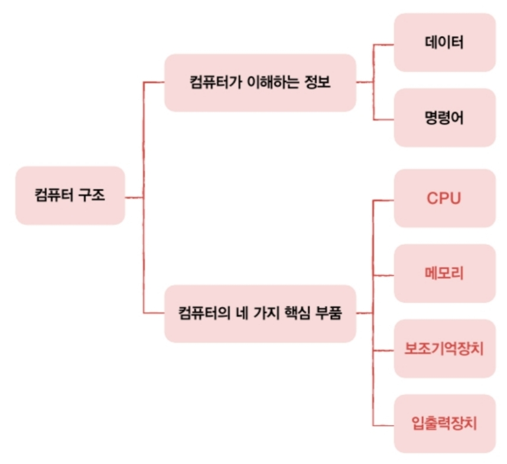
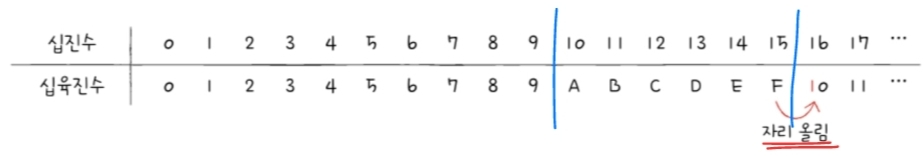
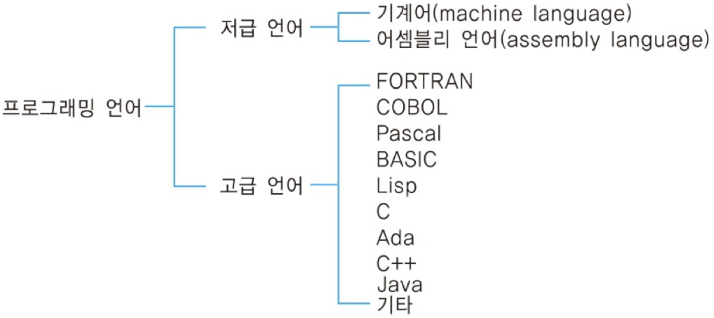
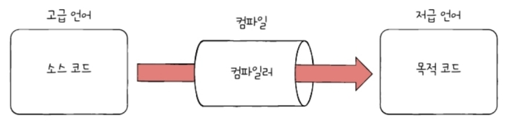

- [Ch1. 컴퓨터 구조 시작하기](#ch1-컴퓨터-구조-시작하기)
  - [컴퓨터의 4가지 핵심부품](#컴퓨터의-4가지-핵심부품)
    - [메모리](#메모리)
    - [CPU](#cpu)
    - [보조기억장치](#보조기억장치)
    - [입출력장치(IO장치)](#입출력장치io장치)
  - [메인보드와 시스템 버스](#메인보드와-시스템-버스)
- [Ch2. 데이터](#ch2-데이터)
- [0과 1로 숫자를 표현하는 방법](#0과-1로-숫자를-표현하는-방법)
    - [정보 단위](#정보-단위)
    - [이진법](#이진법)
    - [십육진법](#십육진법)
  - [0과 1로 문자를 표현하는 방법](#0과-1로-문자를-표현하는-방법)
    - [문자 집합](#문자-집합)
    - [아스키 코드(ASCII)](#아스키-코드ascii)
    - [EUC-KR](#euc-kr)
    - [유니코드\&UTF](#유니코드utf)
- [Ch3. 명령어](#ch3-명령어)
- [소스 코드와 명령어](#소스-코드와-명령어)
    - [모든 소스 코드는 컴퓨터 내부에서 명령어로 변환](#모든-소스-코드는-컴퓨터-내부에서-명령어로-변환)
  - [고급언어와 저급언어](#고급언어와-저급언어)
  - [컴파일 언어와 인터프리터 언어](#컴파일-언어와-인터프리터-언어)
    - [컴파일 언어](#컴파일-언어)
    - [인터프리터 언어](#인터프리터-언어)
- [명령어의 구조](#명령어의-구조)
  - [연산 코드와 오퍼랜드](#연산-코드와-오퍼랜드)
    - [명령어 = 연산 코드 + 오퍼랜드](#명령어--연산-코드--오퍼랜드)
    - [연산 코드(operation code) (= 연산자)](#연산-코드operation-code--연산자)
    - [오퍼랜드(operand) (= 피연산자)](#오퍼랜드operand--피연산자)
  - [주소 지정 방식](#주소-지정-방식)
    - [즉시 주소 지정 방식 (Immediate Addressing Mode)](#즉시-주소-지정-방식-immediate-addressing-mode)
    - [직접 주소 지정 방식 (Direct Addressing Mode)](#직접-주소-지정-방식-direct-addressing-mode)
    - [간접 주소 지정 방식 (Indirect Addressing Mode)](#간접-주소-지정-방식-indirect-addressing-mode)
    - [레지스터 주소 지정 방식 (Register Addressing Mode)](#레지스터-주소-지정-방식-register-addressing-mode)
    - [레지스터 간접 주소 지정 방식 (Register Indirect Addressing Mode)](#레지스터-간접-주소-지정-방식-register-indirect-addressing-mode)

# Ch1. 컴퓨터 구조 시작하기
1. **컴퓨터 구조를 알아야 하는 이유**
    - 문제 해결 능력 향상
    - 문법만으로는 알기 어려운 성능/용량/비용 고려하며 개발 가능 → 미지의 대상X, 분석의 대상O
        
        
        
2. **컴퓨터 구조의 큰 그림**

1) 데이터 : 컴퓨터가 이해하는 숫자, 문자, 이미지, 동영상과 같은 정적인 정보

2) 명령어 : 데이터를 움직이고 컴퓨터 작동시키는 정보

⇒ 명령어는 `컴퓨터 작동시키는 정보` / 데이터는 `명령어 위해 존재하는 일종의 재료`

## 컴퓨터의 4가지 핵심부품

중앙처리장치(CPU), 주기억장치(메모리), 보조기억장치, 입출력장치

### 메모리

현재 실행되는 프로그램의 명령어와 데이터 저장하는 부품 → 프로그램이 실행되려면 반드시 메모리에 저장되어 있어야 함

- `주소` : 주소를 통해 메모리 내 원하는 위치로 접근
- 메모리의 약점
    - 가격이 비싸 저장 용량 적음
    - 전원 꺼지면 저장된 내용 사라짐

### CPU

`컴퓨터의 두뇌` 

메모리에 저장된 명령어 읽어 들이고, 읽어들인 명령어를 해석, 실행하는 부품

- 산술논리연산장치(ALU) - like 계산기
- 레지스터 : 작은 임시 저장장치 - 프로그램 실행에 필요한 값들을 임의로 저장
    
    ex) ALU에서 수행한 계산의 결과값 레지스터에 저장
    
- 제어장치 : `제어신호` 라는 전기 신호를 내보내고 명령어 해석하는 장치
    - 제어신호 - 메모리 읽기 / 쓰기

### 보조기억장치

메모리보다 크기 크고, 전원 꺼져도 저장된 내용 안 사라짐

### 입출력장치(IO장치)

컴퓨터 외부에 연결되어 컴퓨터 내부와 정보 교환하는 장치 - 마이크, 스피커, 프린터, 마우스, 키보드

## 메인보드와 시스템 버스

- 메인보드(=마더 보드)
- 시스템 버스 : 4가지 핵심 부품 연결
    - 주소 버스 : 주소 주고받는 통로
    - 데이터 버스 : 명령어, 데이터 주고받는 통로
    - 제어 버스 : 제어 신호 주고받는 통로

---
# Ch2. 데이터
# 0과 1로 숫자를 표현하는 방법

### 정보 단위

- 비트(bit) : 0과 1을 나타내는 가장 작은 정보 단위
- 바이트(byte) : 1byte == 8bit
    - 1byte는 2**8(256)개의 정보 표현
- byte → kB → MB → GB → TB
- 워드(word) : CPU가 한 번에 처리할 수 있는 데이터 크기
    - CPU가 처리할 수 있는 게 16비트면 1워드 == 16비트
    - CPU가 처리할 수 있는 게 32비트면 1워드 == 32비트 이런 식!
    - 하프 워드(half word) : 워드의 절반 크기
    - 풀 워드(full word) :  1배 크기
    - 더블 워드(double word) :  2배 크기
    - 컴퓨터의 대부분 워드 크기는 32bit(x86), 64bit(x64)

### 이진법

0과 1로만 숫자 표현 → 숫자가 1을 넘어가는 시점에 자리 올림 하기

⇒ `아래 첨자 (2)`를 붙이거나, 이진수 앞에 `0b` 붙임

- 이진수의 음수 표현 ; 2의 보수
    - 사전적 의미 : 어떤 수를 그보다 큰 2**n에서 뺀 값
    - 쉽게 표현) 모든 0과 1을 뒤집고, 거기에 1을 더한 값
- 컴퓨터 내부에서는 이 수가 양수인지, 음수인지 구분하기 위해 `플래그(flag)` 사용

### 십육진법

0~9, A~F - 16가지 종류로 표현 → 수가 15를 넘어가는 시점에서 자리 올림

- 표현 : `아래첨자 (16)`을 붙이거나, 십육진수 앞에 `0x` 붙임
- 16진수 → 2진수 변환 : 4자리씩 끊어서 이진수로 변환
- 왜 십육진법 사용?
    
    이진수를 십육진수로, 십육진수를 이진수로 변환하기 쉽기 때문
    

---

## 0과 1로 문자를 표현하는 방법

### 문자 집합

컴퓨터가 인식하고 표현할 수 있는 문자 모음 → 문자 집합에 속하지 않은 문자는 이해 불가

- 문자 인코딩 : 컴퓨터가 이해할 수 있게 0과 1로 이뤄진 결과 값이 문자 코드가 됨
- 문자 디코딩 :  0과 1로 이뤄진 문자 코드를 사람이 이해할 수 있는 문자로 변환

### 아스키 코드(ASCII)

영어 알파벳, 아리비아 숫자, 일부 특수 문자 포함

7bit 표현 → 2**7개의 정보 표현 가능, 128개의 문자 표현 가능

- 패리티 비트 : 실제 아스키 코드는 8bit지만 그 중 1bit는 오류 검출을 위한 bit
- 코드 포인트 : 글자에 부여된 고유한 값
- 아스키 코드 장점
    - 매우 간단하게 인코딩
- 아스키 코드 단점
    - 한글 표현 불가
    - 아스키 문자 집합 외의 문자, 특수문자 표현 불가 → 8bit의 확장 아스키가 등장하기도 했지만 여전히 문제有

### EUC-KR

- `완성형 인코딩` : 초성-중성-종성 조합으로 이뤄진 완성된 하나의 글자에 고유한 코드 부여하는 인코딩 방식
    
    ⇒ EUC-KR은 완성형 인코딩 방식 : 초성-중성-종성 결합된 한글 단어에 2byte 크기의 코드 부여
    
- `조합형 인코딩` : 초성/중성/종성을 위한 비트열을 각각 할당하여 그것들의 조합으로 하나의 글자 코드 완성하는 인코딩 방식
- 총 2350개 정도의 한글 단어 표현 가능 ; 아스키 코드보다는 표현 많이 하지만, 모든 한글 조합 표현할 수 있을 정도로 많은 양은 아님
    - CP949 : MS에서 문제 해결 위해 만든 EUC-KR의 확장 버전 → 그런데 이것도 한글 전체 표현 하기 위해 넉넉하지는 않음

### 유니코드&UTF

모든 언어 아우르는 문자 집합과 통일된 표준 인코딩 방식 있다면 언어별로 인코딩 하는 수고로움 덜 수 있음 → 그래서 나온 게 유니코드 문자 집합!

- UTF : Unicode Transformation Format
    
    UTF-8, UTF-16, UTF-32

---

# Ch3. 명령어
# 소스 코드와 명령어

### 모든 소스 코드는 컴퓨터 내부에서 명령어로 변환

## 고급언어와 저급언어

1. 고급언어 : `사람`을 위한 언어 - 대부분의 프로그래밍 언어
2. 저급언어 : `컴퓨터`가 이해하고 실행할 수 있는 언어

⇒ **고급 언어로 작성된 소스 코드는 반드시 실행위해서 저급 언어(명령어)로 변환되어야 함**

1. 기계어 : `0과 1` 의 명령어 비트로 이뤄진 언어
    - 기계어를 이진수로 나열하면 너무 길어져서 가독성을 위해 십육진수로 표현하기도
    - 기계어는 오로지 컴퓨터만을 위해 만들어진 언어라 사람 이해X
2. 어셈블리어 : 0과 1로 표현된 명령어(기계어)를 읽기 편한 형태로 번역한 언어
    - 어셈블리어 한 줄 한 줄 == 명령어
    - 0과 1로 이뤄진 기계어를 읽기 편하게 만든 저급 언어일 뿐 → 개발자가 어셈블리어로 프로그래밍하기는 어려워
        - 그래서 `고급언어` 필요 - 고급 언어는 사람이 읽고 쓰기 편하고, 더 나은 가독성, 변수나 함수 같은 편리한 문법 제공해서 어떤 복잡한 프로그램도 구현 간으
    - 작성의 대상 & 관찰의 대상 - 어떤 과정으로 실행하는지 관찰 가능

## 컴파일 언어와 인터프리터 언어

### 컴파일 언어

컴파일러에 의해 소스 코드 `전체` 가 저급 언어로 변환되어 실행되는 고급 언어

ex) C

- Compile(컴파일) : 컴파일 언어로 작성된 소스 코드의 코드 전체가 저급 언어로 변환되는 과정
- Compiler(컴파일러) : 컴파일을 수행해 주는 도구
- 컴파일러가 소스 코드 내에서 `하나라도 오류` 발견하면 `컴파일 실패`
- 목적 코드 : 컴파일러 통해 저급 언어로 변환된 코드

- 컴파일 언어와 인터프리터 언어 간 경계 모호한 경우도 많기 때문에 반드시 둘 중 하나라는 이분법적 생각X

### 인터프리터 언어

소스 코드가 인터프리터에 의해 `한 줄씩` 실행되는 고급 언어

ex) Python

- Interpreter(인터프리터) : 소스 코드를 한 줄씩 저급 언어로 변환하여 실행해 주는 도구
- 소스 코드를 한 줄씩 실행 → `N번째 줄 오류` ⇒ `N-1번째 줄까지는 올바르게 수행`

⇒ 일반적으로 인터프리터 언어가 컴파일 언어보다 느림.

➕ 목적 파일  vs 실행 파일

- 목적 파일 : 목적 코드로 이뤄진 파일
- 실행 파일 : 실행 코드로 이뤄진 파일 ex) .exe 파일

→ 목적 코드가 실행 파일이 되기 위해서는 `링킹(linking)` 이라는 작업 거쳐야 함

---

# 명령어의 구조

## 연산 코드와 오퍼랜드

### 명령어 = 연산 코드 + 오퍼랜드

### 연산 코드(operation code) (= 연산자)

명령어가 수행할 연산

- 일반적으로 명령어의 첫 부분에 위치하며, 고정된 비트 수를 차지
- 예시: 산술 연산(덧셈, 뺄셈 등), 논리 연산(AND, OR 등), 데이터 이동, 제어 흐름(분기, 점프) 등을 포함
- 각 프로세서 아키텍처마다 고유한 연산 코드 집합을 가지고 있음
- 유형
    - 데이터 전송
    - 산술/논리 연산
    - 제어 흐름 변경
    - 입출력 제어

### 오퍼랜드(operand) (= 피연산자)

연산에 사용할 데이터 or 연산에 사용할 데이터가 저장된 위치(주소 필드)

- 둘 중에 `연산에 사용될 데이터가 저장된 위치` 가 훨씬 더 자주 사용
- `연산 코드 필드` : 연산 코드가 담기는 영역
- `오퍼랜드 필드` : 오퍼랜드가 담기는 영역
- 명령어에 따라 오퍼랜드의 수가 다를 수 있음 (0~3개 또는 그 이상)

- 오퍼랜드는 상수, 메모리 주소, 레지스터 등 다양한 형태로 표현
- 주소 지정 방식에 따라 오퍼랜드의 해석 방법이 결정

## 주소 지정 방식

오퍼랜드의 실제 값이나 위치를 어떻게 결정할지 지정하는 방법

- 유효 주소 : 연산 코드에 사용할 데이터가 저장된 위치 → 연산의 대상이 되는 데이터가 저장된 위치

### 즉시 주소 지정 방식 (Immediate Addressing Mode)

- 오퍼랜드가 실제 데이터 값 자체
- 예: ADD R1, #5 (R1에 5를 더함)
- 장점: 빠른 실행 속도
- 단점: 표현할 수 있는 값의 범위가 제한적

### 직접 주소 지정 방식 (Direct Addressing Mode)

- 오퍼랜드가 메모리 주소를 직접 나타냅니다.
- 예: LOAD R1, [1000] (메모리 주소 1000의 내용을 R1에 로드)
- 장점: 간단하고 이해하기 쉬움
- 단점: 접근할 수 있는 메모리 범위가 제한적일 수 있음

### 간접 주소 지정 방식 (Indirect Addressing Mode)

- 오퍼랜드가 실제 데이터의 주소를 담고 있는 메모리 주소를 나타냄
- 예: LOAD R1, [[1000]] (주소 1000에 저장된 값을 주소로 사용하여 그 주소의 내용을 R1에 로드)
- 장점: 유연한 메모리 접근 가능
- 단점: 메모리 접근이 두 번 필요하여 속도가 느릴 수 있음

### 레지스터 주소 지정 방식 (Register Addressing Mode)

- 오퍼랜드가 레지스터를 직접 지정
- 예: ADD R1, R2 (R2의 값을 R1에 더함)
- 장점: 매우 빠른 실행 속도
- 단점: 레지스터의 수가 제한적

### 레지스터 간접 주소 지정 방식 (Register Indirect Addressing Mode)

- 오퍼랜드가 메모리 주소를 담고 있는 레지스터를 지정
- 예: LOAD R1, [R2] (R2가 가리키는 메모리 주소의 내용을 R1에 로드)
- 장점: 유연한 메모리 접근과 빠른 주소 계산
- 단점: 직접 주소 지정보다는 약간 느림